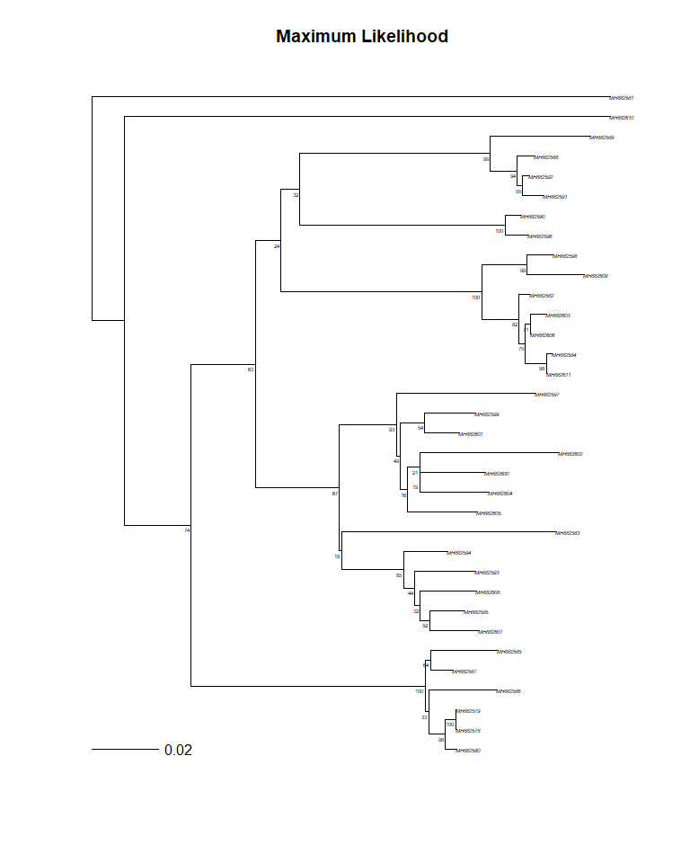
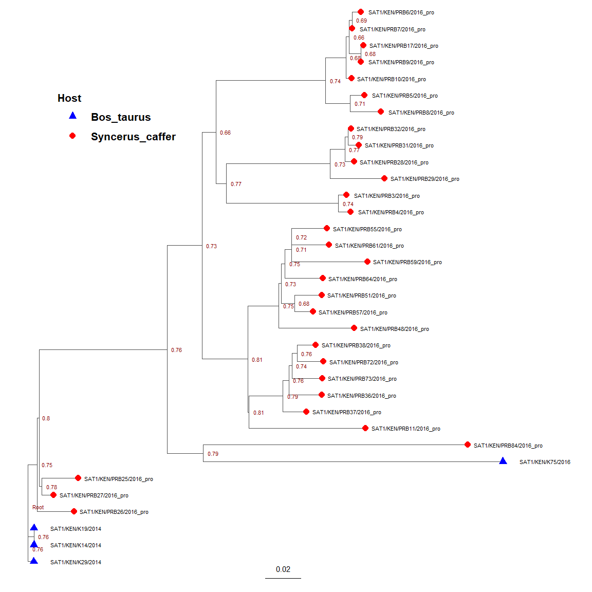

FMD Sympatric Water Buffalo and Cattle
================
8/23/24

- <a href="#references-and-external-resources"
  id="toc-references-and-external-resources">References and External
  Resources</a>
- <a href="#libraries" id="toc-libraries">Libraries</a>
- <a href="#query-genbank" id="toc-query-genbank">Query GenBank</a>
- <a href="#retrieve-sequences" id="toc-retrieve-sequences">Retrieve
  Sequences</a>
- <a href="#alignment" id="toc-alignment">Alignment</a>
- <a href="#substitution-model" id="toc-substitution-model">Substitution
  Model</a>
- <a href="#maximum-likelihood-tree"
  id="toc-maximum-likelihood-tree">Maximum Likelihood Tree</a>
- <a href="#bootstrap-values" id="toc-bootstrap-values">Bootstrap
  Values</a>
- <a href="#tree-plots" id="toc-tree-plots">Tree Plots</a>
- <a href="#beast" id="toc-beast">BEAST</a>
- <a href="#tracer-type-stats" id="toc-tracer-type-stats">Tracer Type
  Stats</a>
- <a href="#maximum-clade-credability-tree"
  id="toc-maximum-clade-credability-tree">Maximum Clade Credability
  Tree</a>

## References and External Resources

> [Osmondi et al
> 2020](https://onlinelibrary.wiley.com/doi/10.1111/tbed.13573)(2020)
> The role of African buffalo in the epidemiology of foot-and-mouth
> disease in sympatric cattle and buffalo populations in Kenya.
> https://doi.org/10.1111/tbed.13573

GenBank \[PopSet: 1685824549\]
(https://www.ncbi.nlm.nih.gov/popset?LinkName=nuccore_popset&from_uid=1685824549)

## Libraries

A few packages are needed. First, these help withdirectory management,
visualization, and data wrangling.

<details open>
<summary>Hide code</summary>

``` r
library(here) # directory management
library(tidyverse) #ggplot, lubridate, and the like 
options(dplyr.summarise.inform = FALSE) # don't render data default summaries  
library(ggmap) # maps
library(ggspatial) # spatial plots
library(pals) # color pallets
library(gt) # pretty tables
library(coda) # mcmc summaries/tools
```

</details>

Next, several genetics specific packages are recommended. The
*BioManager* packages may take a few minutes to compile.

<details open>
<summary>Hide code</summary>

``` r
library(ape) #Analyses of Phylogenetics and Evolution (APE)
library(phangorn) # phylogenetic trees and networks
library(rentrez) # R interface to the NCBI - GenBank

# these next 4 pieces of code check each package, then installs them if not already installed. 
if (!requireNamespace("BiocManager", quietly = TRUE)) {
    install.packages("BiocManager")
}

if (!requireNamespace("Biostrings", quietly = TRUE)) {
    BiocManager::install("Biostrings")
}

if (!requireNamespace("msa", quietly = TRUE)) {
    BiocManager::install("msa")
}

if (!requireNamespace("ggtree", quietly = TRUE)) {
    BiocManager::install("ggtree")
}

# if now installed, load the packages  
library(Biostrings) # sequence wrangling
library(msa) # Multiple Sequence Alignment (MSA) algorithms  
library(ggtree) # tree visualization and annotation
```

</details>

Custom functions created for this demo.

<details open>
<summary>Hide code</summary>

``` r
source(here("R/utilities.R"))
source_dir(here("R"))
```

</details>

## Query GenBank

The Osmondi paper provided a listing of accession numbers as a
supplemental. This was attached as a Word Doc, which I copy-and-pasted
into `osmondi_2020_supplemental.csv`.

<details open>
<summary>Hide code</summary>

``` r
osmondi_seqs <- read_csv(here("assets/osmondi_2020_supplemental.csv"))
```

</details>

    Rows: 98 Columns: 4
    ── Column specification ────────────────────────────────────────────────────────
    Delimiter: ","
    chr (4): Serotype, Accession, Strain Name, Species

    ℹ Use `spec()` to retrieve the full column specification for this data.
    ℹ Specify the column types or set `show_col_types = FALSE` to quiet this message.

<details open>
<summary>Hide code</summary>

``` r
head(osmondi_seqs)
```

</details>

    # A tibble: 6 × 4
      Serotype Accession `Strain Name` Species
      <chr>    <chr>     <chr>         <chr>  
    1 SAT1     MH882580  K29           Cattle 
    2 SAT1     MH882590  PRB3          Buffalo
    3 SAT1     MH882596  PRB4          Buffalo
    4 SAT1     MH882603  PRB6          Buffalo
    5 SAT1     MH882582  PRB10         Buffalo
    6 SAT1     MH882598  PRB5          Buffalo

<details open>
<summary>Hide code</summary>

``` r
search_term <- paste(osmondi_seqs$Accession, collapse = " OR ")

genbank_return <- entrez_search(
  db = "nucleotide",
  term = search_term,
  retmax = 100 # the default is 20 records, our list is 95
)
```

</details>

Alternatively, search the database for the *popset* of interest and
return all metadata. This is simpler, but not always available and
GenBank may stop using PopSet numbers altogether next year.

<details open>
<summary>Hide code</summary>

``` r
popset_id <- "1685824549" # "population set" from GenBank page

genbank_return <- 
  entrez_search(db = "nucleotide", 
                term = paste0("POPSET:", popset_id), # search by popset number
                retmax = 100) 
```

</details>

### Check Contents

No actual sequences yet, only metadata. Even if you can easily access
the sequences, the expanded retrieval process in this script is often
needed to pull additional info, like collection dates, isolate
names/labels, or geographic coordinates.

<details open>
<summary>Hide code</summary>

``` r
genbank_return # check results
```

</details>

    Entrez search result with 97 hits (object contains 97 IDs and no web_history object)
     Search term (as translated):  POPSET[All Fields] AND 1685824549[All Fields] 

<details open>
<summary>Hide code</summary>

``` r
class(genbank_return)
```

</details>

    [1] "esearch" "list"   

<details open>
<summary>Hide code</summary>

``` r
str(genbank_return)
```

</details>

    List of 5
     $ ids             : chr [1:97] "1685824741" "1685824739" "1685824737" "1685824735" ...
     $ count           : int 97
     $ retmax          : int 97
     $ QueryTranslation: chr "POPSET[All Fields] AND 1685824549[All Fields]"
     $ file            :Classes 'XMLInternalDocument', 'XMLAbstractDocument' <externalptr> 
     - attr(*, "class")= chr [1:2] "esearch" "list"

### Samples Table

Using the metadata for each record, the desired data is pulled one at a
time, then organized as a data frame. Lot’s of character string
wrangling, yuk!

First, create an empty data frame to hold results

<details open>
<summary>Hide code</summary>

``` r
seq_meta <- data.frame(Accession=character(),
                       Collection=character(),
                       Host=character(),
                       Isolate=character(),
                       stringsAsFactors=FALSE)
```

</details>

Then, loop through each record and pull desired data. In this case,
searching the metadata for accession numbers, collection dates, host
type, and the more detailed isolate names.

<details open>
<summary>Hide code</summary>

``` r
for (id in genbank_return$ids) {

  try({
    record <- entrez_fetch(db="nucleotide", id=id, rettype="gb", retmode="text")
    
    accession <- sub("^.*?ACCESSION\\s+([^\n]+).*", "\\1", record)
    
    Collection <- ifelse(grepl("/collection_date=", record), 
                         sub("^.*?/collection_date=\"([^\"]+)\".*", "\\1", record), NA)
    
    host <- ifelse(grepl("/host=", record), 
                   sub("^.*?/host=\"([^\"]+)\".*", "\\1", record), NA)
    
    isolate <- ifelse(grepl("/isolate=", record), 
                      sub("^.*?/isolate=\"([^\"]+)\".*", "\\1", record), NA)
    
    # add to data frame
    seq_meta <- rbind(seq_meta, data.frame(Accession=accession,
                                           Collection=Collection,
                                           Host=host,
                                           Isolate=isolate,
                                           stringsAsFactors=FALSE)) %>%
                as.data.frame()
    
    # delay to prevent overwhelming the API server
    Sys.sleep(0.5)  # this gives a 0.5 second gap

  }, silent = TRUE)  # continue if an error
}
```

</details>

### Data Table

Examine what was retrived.

<details open>
<summary>Hide code</summary>

``` r
dim(seq_meta)
```

</details>

    [1] 97  4

<details open>
<summary>Hide code</summary>

``` r
head(seq_meta)
```

</details>

      Accession Collection            Host                 Isolate
    1  MH882663    2016-01 Syncerus_caffer SAT2/KEN/PRB88/2016_pro
    2  MH882662    2016-01 Syncerus_caffer SAT2/KEN/PRB87/2016_pro
    3  MH882661    2016-01 Syncerus_caffer SAT2/KEN/PRB86/2016_pro
    4  MH882660    2016-01 Syncerus_caffer SAT2/KEN/PRB85/2016_pro
    5  MH882659    2016-01 Syncerus_caffer SAT2/KEN/PRB83/2016_pro
    6  MH882658    2016-01 Syncerus_caffer SAT2/KEN/PRB81/2016_pro

<details open>
<summary>Hide code</summary>

``` r
# using trimws due to an extra space in the numbers
seq_meta$Accession <- trimws(seq_meta$Accession)

# add a couple more columns
seq_meta$Serotype <- sub("/.*", "", seq_meta$Isolate)
seq_meta$Animal <- sub("^.*/([^/]+)/[^/]+$", "\\1", seq_meta$Isolate)

seq_meta  %>%
  gt() %>%
  tab_header(
    title = md("Kenya Sequences Metadata")) %>%
  cols_width(starts_with("Accession") ~ px(90),
             starts_with("Collection") ~ px(80),
             starts_with("Host") ~ px(100),
             starts_with("Isolate") ~ px(180),
             starts_with("Serotype") ~ px(80),
             starts_with("Animal") ~ px(80),
             everything() ~ px(95)) %>%
  tab_options(table.font.size = "small",
              row_group.font.size = "small",
              stub.font.size = "small",
              column_labels.font.size = "medium",
              heading.title.font.size = "large",
              data_row.padding = px(2),
              heading.title.font.weight = "bold",
              column_labels.font.weight = "bold") %>%
  opt_stylize(style = 6, color = 'gray')
```

</details>
<div style='all:initial';>
<div id="qzqixdbtzt" style="padding-left:0px;padding-right:0px;padding-top:10px;padding-bottom:10px;overflow-x:auto;overflow-y:auto;width:auto;height:auto;">
  
  <table class="gt_table" style="-webkit-font-smoothing: antialiased; -moz-osx-font-smoothing: grayscale; font-family: system-ui, 'Segoe UI', Roboto, Helvetica, Arial, sans-serif, 'Apple Color Emoji', 'Segoe UI Emoji', 'Segoe UI Symbol', 'Noto Color Emoji'; display: table; border-collapse: collapse; line-height: normal; margin-left: auto; margin-right: auto; color: #333333; font-size: small; font-weight: normal; font-style: normal; background-color: #FFFFFF; border-top-style: solid; border-top-width: 2px; border-top-color: #5F5F5F; border-right-style: none; border-right-width: 2px; border-right-color: #D3D3D3; border-bottom-style: solid; border-bottom-width: 2px; border-bottom-color: #5F5F5F; border-left-style: none; border-left-width: 2px; border-left-color: #D3D3D3; table-layout: fixed; width: 0px;" data-quarto-disable-processing="false" data-quarto-bootstrap="false" width="0" bgcolor="#FFFFFF">
  <colgroup>
    <col style="width:90px;">
    <col style="width:80px;">
    <col style="width:100px;">
    <col style="width:180px;">
    <col style="width:80px;">
    <col style="width:80px;">
  </colgroup>
  <thead style="border-style: none;">
    <tr class="gt_heading" style="border-style: none; background-color: #FFFFFF; text-align: center; border-bottom-color: #FFFFFF; border-left-style: none; border-left-width: 1px; border-left-color: #D3D3D3; border-right-style: none; border-right-width: 1px; border-right-color: #D3D3D3;" bgcolor="#FFFFFF" align="center">
      <td colspan="6" class="gt_heading gt_title gt_font_normal gt_bottom_border" style="border-style: none; color: #333333; font-size: large; padding-top: 4px; padding-bottom: 4px; padding-left: 5px; padding-right: 5px; background-color: #FFFFFF; text-align: center; border-left-style: none; border-left-width: 1px; border-left-color: #D3D3D3; border-right-style: none; border-right-width: 1px; border-right-color: #D3D3D3; border-bottom-style: solid; border-bottom-width: 2px; border-bottom-color: #5F5F5F; font-weight: normal;" bgcolor="#FFFFFF" align="center"><div data-qmd-base64="S2VueWEgU2VxdWVuY2VzIE1ldGFkYXRh"><div class="gt_from_md"><p style="margin: 0; padding: 0; margin-top: 0; margin-bottom: 0;">Kenya Sequences Metadata</p>
</div></div></td>
    </tr>
    
    <tr class="gt_col_headings" style="border-style: none; border-top-style: solid; border-top-width: 2px; border-top-color: #5F5F5F; border-bottom-style: solid; border-bottom-width: 2px; border-bottom-color: #5F5F5F; border-left-style: none; border-left-width: 1px; border-left-color: #D3D3D3; border-right-style: none; border-right-width: 1px; border-right-color: #D3D3D3;">
      <th class="gt_col_heading gt_columns_bottom_border gt_left" rowspan="1" colspan="1" scope="col" id="Accession" style="border-style: none; color: #FFFFFF; background-color: #5F5F5F; font-size: medium; font-weight: bold; text-transform: inherit; border-left-style: none; border-left-width: 1px; border-left-color: #D3D3D3; border-right-style: none; border-right-width: 1px; border-right-color: #D3D3D3; vertical-align: bottom; padding-top: 5px; padding-bottom: 6px; padding-left: 5px; padding-right: 5px; overflow-x: hidden; text-align: left;" bgcolor="#5F5F5F" valign="bottom" align="left">Accession</th>
      <th class="gt_col_heading gt_columns_bottom_border gt_right" rowspan="1" colspan="1" scope="col" id="Collection" style="border-style: none; color: #FFFFFF; background-color: #5F5F5F; font-size: medium; font-weight: bold; text-transform: inherit; border-left-style: none; border-left-width: 1px; border-left-color: #D3D3D3; border-right-style: none; border-right-width: 1px; border-right-color: #D3D3D3; vertical-align: bottom; padding-top: 5px; padding-bottom: 6px; padding-left: 5px; padding-right: 5px; overflow-x: hidden; text-align: right; font-variant-numeric: tabular-nums;" bgcolor="#5F5F5F" valign="bottom" align="right">Collection</th>
      <th class="gt_col_heading gt_columns_bottom_border gt_left" rowspan="1" colspan="1" scope="col" id="Host" style="border-style: none; color: #FFFFFF; background-color: #5F5F5F; font-size: medium; font-weight: bold; text-transform: inherit; border-left-style: none; border-left-width: 1px; border-left-color: #D3D3D3; border-right-style: none; border-right-width: 1px; border-right-color: #D3D3D3; vertical-align: bottom; padding-top: 5px; padding-bottom: 6px; padding-left: 5px; padding-right: 5px; overflow-x: hidden; text-align: left;" bgcolor="#5F5F5F" valign="bottom" align="left">Host</th>
      <th class="gt_col_heading gt_columns_bottom_border gt_left" rowspan="1" colspan="1" scope="col" id="Isolate" style="border-style: none; color: #FFFFFF; background-color: #5F5F5F; font-size: medium; font-weight: bold; text-transform: inherit; border-left-style: none; border-left-width: 1px; border-left-color: #D3D3D3; border-right-style: none; border-right-width: 1px; border-right-color: #D3D3D3; vertical-align: bottom; padding-top: 5px; padding-bottom: 6px; padding-left: 5px; padding-right: 5px; overflow-x: hidden; text-align: left;" bgcolor="#5F5F5F" valign="bottom" align="left">Isolate</th>
      <th class="gt_col_heading gt_columns_bottom_border gt_left" rowspan="1" colspan="1" scope="col" id="Serotype" style="border-style: none; color: #FFFFFF; background-color: #5F5F5F; font-size: medium; font-weight: bold; text-transform: inherit; border-left-style: none; border-left-width: 1px; border-left-color: #D3D3D3; border-right-style: none; border-right-width: 1px; border-right-color: #D3D3D3; vertical-align: bottom; padding-top: 5px; padding-bottom: 6px; padding-left: 5px; padding-right: 5px; overflow-x: hidden; text-align: left;" bgcolor="#5F5F5F" valign="bottom" align="left">Serotype</th>
      <th class="gt_col_heading gt_columns_bottom_border gt_left" rowspan="1" colspan="1" scope="col" id="Animal" style="border-style: none; color: #FFFFFF; background-color: #5F5F5F; font-size: medium; font-weight: bold; text-transform: inherit; border-left-style: none; border-left-width: 1px; border-left-color: #D3D3D3; border-right-style: none; border-right-width: 1px; border-right-color: #D3D3D3; vertical-align: bottom; padding-top: 5px; padding-bottom: 6px; padding-left: 5px; padding-right: 5px; overflow-x: hidden; text-align: left;" bgcolor="#5F5F5F" valign="bottom" align="left">Animal</th>
    </tr>
  </thead>
  <tbody class="gt_table_body" style="border-style: none; border-top-style: solid; border-top-width: 2px; border-top-color: #5F5F5F; border-bottom-style: solid; border-bottom-width: 2px; border-bottom-color: #5F5F5F;">
    <tr style="border-style: none;"><td headers="Accession" class="gt_row gt_left" style="border-style: none; padding-top: 2px; padding-bottom: 2px; padding-left: 5px; padding-right: 5px; margin: 10px; border-top-style: none; border-top-width: 1px; border-top-color: #D5D5D5; border-left-style: none; border-left-width: 1px; border-left-color: #D5D5D5; border-right-style: none; border-right-width: 1px; border-right-color: #D5D5D5; vertical-align: middle; overflow-x: hidden; text-align: left;" valign="middle" align="left">MH882663</td>
<td headers="Collection" class="gt_row gt_right" style="border-style: none; padding-top: 2px; padding-bottom: 2px; padding-left: 5px; padding-right: 5px; margin: 10px; border-top-style: none; border-top-width: 1px; border-top-color: #D5D5D5; border-left-style: none; border-left-width: 1px; border-left-color: #D5D5D5; border-right-style: none; border-right-width: 1px; border-right-color: #D5D5D5; vertical-align: middle; overflow-x: hidden; text-align: right; font-variant-numeric: tabular-nums;" valign="middle" align="right">2016-01</td>
<td headers="Host" class="gt_row gt_left" style="border-style: none; padding-top: 2px; padding-bottom: 2px; padding-left: 5px; padding-right: 5px; margin: 10px; border-top-style: none; border-top-width: 1px; border-top-color: #D5D5D5; border-left-style: none; border-left-width: 1px; border-left-color: #D5D5D5; border-right-style: none; border-right-width: 1px; border-right-color: #D5D5D5; vertical-align: middle; overflow-x: hidden; text-align: left;" valign="middle" align="left">Syncerus_caffer</td>
<td headers="Isolate" class="gt_row gt_left" style="border-style: none; padding-top: 2px; padding-bottom: 2px; padding-left: 5px; padding-right: 5px; margin: 10px; border-top-style: none; border-top-width: 1px; border-top-color: #D5D5D5; border-left-style: none; border-left-width: 1px; border-left-color: #D5D5D5; border-right-style: none; border-right-width: 1px; border-right-color: #D5D5D5; vertical-align: middle; overflow-x: hidden; text-align: left;" valign="middle" align="left">SAT2/KEN/PRB88/2016_pro</td>
<td headers="Serotype" class="gt_row gt_left" style="border-style: none; padding-top: 2px; padding-bottom: 2px; padding-left: 5px; padding-right: 5px; margin: 10px; border-top-style: none; border-top-width: 1px; border-top-color: #D5D5D5; border-left-style: none; border-left-width: 1px; border-left-color: #D5D5D5; border-right-style: none; border-right-width: 1px; border-right-color: #D5D5D5; vertical-align: middle; overflow-x: hidden; text-align: left;" valign="middle" align="left">SAT2</td>
<td headers="Animal" class="gt_row gt_left" style="border-style: none; padding-top: 2px; padding-bottom: 2px; padding-left: 5px; padding-right: 5px; margin: 10px; border-top-style: none; border-top-width: 1px; border-top-color: #D5D5D5; border-left-style: none; border-left-width: 1px; border-left-color: #D5D5D5; border-right-style: none; border-right-width: 1px; border-right-color: #D5D5D5; vertical-align: middle; overflow-x: hidden; text-align: left;" valign="middle" align="left">PRB88</td></tr>
    <tr style="border-style: none;"><td headers="Accession" class="gt_row gt_left gt_striped" style="border-style: none; padding-top: 2px; padding-bottom: 2px; padding-left: 5px; padding-right: 5px; margin: 10px; border-top-style: none; border-top-width: 1px; border-top-color: #D5D5D5; border-left-style: none; border-left-width: 1px; border-left-color: #D5D5D5; border-right-style: none; border-right-width: 1px; border-right-color: #D5D5D5; vertical-align: middle; overflow-x: hidden; background-color: #F4F4F4; text-align: left;" valign="middle" bgcolor="#F4F4F4" align="left">MH882662</td>
<td headers="Collection" class="gt_row gt_right gt_striped" style="border-style: none; padding-top: 2px; padding-bottom: 2px; padding-left: 5px; padding-right: 5px; margin: 10px; border-top-style: none; border-top-width: 1px; border-top-color: #D5D5D5; border-left-style: none; border-left-width: 1px; border-left-color: #D5D5D5; border-right-style: none; border-right-width: 1px; border-right-color: #D5D5D5; vertical-align: middle; overflow-x: hidden; background-color: #F4F4F4; text-align: right; font-variant-numeric: tabular-nums;" valign="middle" bgcolor="#F4F4F4" align="right">2016-01</td>
<td headers="Host" class="gt_row gt_left gt_striped" style="border-style: none; padding-top: 2px; padding-bottom: 2px; padding-left: 5px; padding-right: 5px; margin: 10px; border-top-style: none; border-top-width: 1px; border-top-color: #D5D5D5; border-left-style: none; border-left-width: 1px; border-left-color: #D5D5D5; border-right-style: none; border-right-width: 1px; border-right-color: #D5D5D5; vertical-align: middle; overflow-x: hidden; background-color: #F4F4F4; text-align: left;" valign="middle" bgcolor="#F4F4F4" align="left">Syncerus_caffer</td>
<td headers="Isolate" class="gt_row gt_left gt_striped" style="border-style: none; padding-top: 2px; padding-bottom: 2px; padding-left: 5px; padding-right: 5px; margin: 10px; border-top-style: none; border-top-width: 1px; border-top-color: #D5D5D5; border-left-style: none; border-left-width: 1px; border-left-color: #D5D5D5; border-right-style: none; border-right-width: 1px; border-right-color: #D5D5D5; vertical-align: middle; overflow-x: hidden; background-color: #F4F4F4; text-align: left;" valign="middle" bgcolor="#F4F4F4" align="left">SAT2/KEN/PRB87/2016_pro</td>
<td headers="Serotype" class="gt_row gt_left gt_striped" style="border-style: none; padding-top: 2px; padding-bottom: 2px; padding-left: 5px; padding-right: 5px; margin: 10px; border-top-style: none; border-top-width: 1px; border-top-color: #D5D5D5; border-left-style: none; border-left-width: 1px; border-left-color: #D5D5D5; border-right-style: none; border-right-width: 1px; border-right-color: #D5D5D5; vertical-align: middle; overflow-x: hidden; background-color: #F4F4F4; text-align: left;" valign="middle" bgcolor="#F4F4F4" align="left">SAT2</td>
<td headers="Animal" class="gt_row gt_left gt_striped" style="border-style: none; padding-top: 2px; padding-bottom: 2px; padding-left: 5px; padding-right: 5px; margin: 10px; border-top-style: none; border-top-width: 1px; border-top-color: #D5D5D5; border-left-style: none; border-left-width: 1px; border-left-color: #D5D5D5; border-right-style: none; border-right-width: 1px; border-right-color: #D5D5D5; vertical-align: middle; overflow-x: hidden; background-color: #F4F4F4; text-align: left;" valign="middle" bgcolor="#F4F4F4" align="left">PRB87</td></tr>
    <tr style="border-style: none;"><td headers="Accession" class="gt_row gt_left" style="border-style: none; padding-top: 2px; padding-bottom: 2px; padding-left: 5px; padding-right: 5px; margin: 10px; border-top-style: none; border-top-width: 1px; border-top-color: #D5D5D5; border-left-style: none; border-left-width: 1px; border-left-color: #D5D5D5; border-right-style: none; border-right-width: 1px; border-right-color: #D5D5D5; vertical-align: middle; overflow-x: hidden; text-align: left;" valign="middle" align="left">MH882661</td>
<td headers="Collection" class="gt_row gt_right" style="border-style: none; padding-top: 2px; padding-bottom: 2px; padding-left: 5px; padding-right: 5px; margin: 10px; border-top-style: none; border-top-width: 1px; border-top-color: #D5D5D5; border-left-style: none; border-left-width: 1px; border-left-color: #D5D5D5; border-right-style: none; border-right-width: 1px; border-right-color: #D5D5D5; vertical-align: middle; overflow-x: hidden; text-align: right; font-variant-numeric: tabular-nums;" valign="middle" align="right">2016-01</td>
<td headers="Host" class="gt_row gt_left" style="border-style: none; padding-top: 2px; padding-bottom: 2px; padding-left: 5px; padding-right: 5px; margin: 10px; border-top-style: none; border-top-width: 1px; border-top-color: #D5D5D5; border-left-style: none; border-left-width: 1px; border-left-color: #D5D5D5; border-right-style: none; border-right-width: 1px; border-right-color: #D5D5D5; vertical-align: middle; overflow-x: hidden; text-align: left;" valign="middle" align="left">Syncerus_caffer</td>
<td headers="Isolate" class="gt_row gt_left" style="border-style: none; padding-top: 2px; padding-bottom: 2px; padding-left: 5px; padding-right: 5px; margin: 10px; border-top-style: none; border-top-width: 1px; border-top-color: #D5D5D5; border-left-style: none; border-left-width: 1px; border-left-color: #D5D5D5; border-right-style: none; border-right-width: 1px; border-right-color: #D5D5D5; vertical-align: middle; overflow-x: hidden; text-align: left;" valign="middle" align="left">SAT2/KEN/PRB86/2016_pro</td>
<td headers="Serotype" class="gt_row gt_left" style="border-style: none; padding-top: 2px; padding-bottom: 2px; padding-left: 5px; padding-right: 5px; margin: 10px; border-top-style: none; border-top-width: 1px; border-top-color: #D5D5D5; border-left-style: none; border-left-width: 1px; border-left-color: #D5D5D5; border-right-style: none; border-right-width: 1px; border-right-color: #D5D5D5; vertical-align: middle; overflow-x: hidden; text-align: left;" valign="middle" align="left">SAT2</td>
<td headers="Animal" class="gt_row gt_left" style="border-style: none; padding-top: 2px; padding-bottom: 2px; padding-left: 5px; padding-right: 5px; margin: 10px; border-top-style: none; border-top-width: 1px; border-top-color: #D5D5D5; border-left-style: none; border-left-width: 1px; border-left-color: #D5D5D5; border-right-style: none; border-right-width: 1px; border-right-color: #D5D5D5; vertical-align: middle; overflow-x: hidden; text-align: left;" valign="middle" align="left">PRB86</td></tr>
    <tr style="border-style: none;"><td headers="Accession" class="gt_row gt_left gt_striped" style="border-style: none; padding-top: 2px; padding-bottom: 2px; padding-left: 5px; padding-right: 5px; margin: 10px; border-top-style: none; border-top-width: 1px; border-top-color: #D5D5D5; border-left-style: none; border-left-width: 1px; border-left-color: #D5D5D5; border-right-style: none; border-right-width: 1px; border-right-color: #D5D5D5; vertical-align: middle; overflow-x: hidden; background-color: #F4F4F4; text-align: left;" valign="middle" bgcolor="#F4F4F4" align="left">MH882660</td>
<td headers="Collection" class="gt_row gt_right gt_striped" style="border-style: none; padding-top: 2px; padding-bottom: 2px; padding-left: 5px; padding-right: 5px; margin: 10px; border-top-style: none; border-top-width: 1px; border-top-color: #D5D5D5; border-left-style: none; border-left-width: 1px; border-left-color: #D5D5D5; border-right-style: none; border-right-width: 1px; border-right-color: #D5D5D5; vertical-align: middle; overflow-x: hidden; background-color: #F4F4F4; text-align: right; font-variant-numeric: tabular-nums;" valign="middle" bgcolor="#F4F4F4" align="right">2016-01</td>
<td headers="Host" class="gt_row gt_left gt_striped" style="border-style: none; padding-top: 2px; padding-bottom: 2px; padding-left: 5px; padding-right: 5px; margin: 10px; border-top-style: none; border-top-width: 1px; border-top-color: #D5D5D5; border-left-style: none; border-left-width: 1px; border-left-color: #D5D5D5; border-right-style: none; border-right-width: 1px; border-right-color: #D5D5D5; vertical-align: middle; overflow-x: hidden; background-color: #F4F4F4; text-align: left;" valign="middle" bgcolor="#F4F4F4" align="left">Syncerus_caffer</td>
<td headers="Isolate" class="gt_row gt_left gt_striped" style="border-style: none; padding-top: 2px; padding-bottom: 2px; padding-left: 5px; padding-right: 5px; margin: 10px; border-top-style: none; border-top-width: 1px; border-top-color: #D5D5D5; border-left-style: none; border-left-width: 1px; border-left-color: #D5D5D5; border-right-style: none; border-right-width: 1px; border-right-color: #D5D5D5; vertical-align: middle; overflow-x: hidden; background-color: #F4F4F4; text-align: left;" valign="middle" bgcolor="#F4F4F4" align="left">SAT2/KEN/PRB85/2016_pro</td>
<td headers="Serotype" class="gt_row gt_left gt_striped" style="border-style: none; padding-top: 2px; padding-bottom: 2px; padding-left: 5px; padding-right: 5px; margin: 10px; border-top-style: none; border-top-width: 1px; border-top-color: #D5D5D5; border-left-style: none; border-left-width: 1px; border-left-color: #D5D5D5; border-right-style: none; border-right-width: 1px; border-right-color: #D5D5D5; vertical-align: middle; overflow-x: hidden; background-color: #F4F4F4; text-align: left;" valign="middle" bgcolor="#F4F4F4" align="left">SAT2</td>
<td headers="Animal" class="gt_row gt_left gt_striped" style="border-style: none; padding-top: 2px; padding-bottom: 2px; padding-left: 5px; padding-right: 5px; margin: 10px; border-top-style: none; border-top-width: 1px; border-top-color: #D5D5D5; border-left-style: none; border-left-width: 1px; border-left-color: #D5D5D5; border-right-style: none; border-right-width: 1px; border-right-color: #D5D5D5; vertical-align: middle; overflow-x: hidden; background-color: #F4F4F4; text-align: left;" valign="middle" bgcolor="#F4F4F4" align="left">PRB85</td></tr>
    <tr style="border-style: none;"><td headers="Accession" class="gt_row gt_left" style="border-style: none; padding-top: 2px; padding-bottom: 2px; padding-left: 5px; padding-right: 5px; margin: 10px; border-top-style: none; border-top-width: 1px; border-top-color: #D5D5D5; border-left-style: none; border-left-width: 1px; border-left-color: #D5D5D5; border-right-style: none; border-right-width: 1px; border-right-color: #D5D5D5; vertical-align: middle; overflow-x: hidden; text-align: left;" valign="middle" align="left">MH882659</td>
<td headers="Collection" class="gt_row gt_right" style="border-style: none; padding-top: 2px; padding-bottom: 2px; padding-left: 5px; padding-right: 5px; margin: 10px; border-top-style: none; border-top-width: 1px; border-top-color: #D5D5D5; border-left-style: none; border-left-width: 1px; border-left-color: #D5D5D5; border-right-style: none; border-right-width: 1px; border-right-color: #D5D5D5; vertical-align: middle; overflow-x: hidden; text-align: right; font-variant-numeric: tabular-nums;" valign="middle" align="right">2016-01</td>
<td headers="Host" class="gt_row gt_left" style="border-style: none; padding-top: 2px; padding-bottom: 2px; padding-left: 5px; padding-right: 5px; margin: 10px; border-top-style: none; border-top-width: 1px; border-top-color: #D5D5D5; border-left-style: none; border-left-width: 1px; border-left-color: #D5D5D5; border-right-style: none; border-right-width: 1px; border-right-color: #D5D5D5; vertical-align: middle; overflow-x: hidden; text-align: left;" valign="middle" align="left">Syncerus_caffer</td>
<td headers="Isolate" class="gt_row gt_left" style="border-style: none; padding-top: 2px; padding-bottom: 2px; padding-left: 5px; padding-right: 5px; margin: 10px; border-top-style: none; border-top-width: 1px; border-top-color: #D5D5D5; border-left-style: none; border-left-width: 1px; border-left-color: #D5D5D5; border-right-style: none; border-right-width: 1px; border-right-color: #D5D5D5; vertical-align: middle; overflow-x: hidden; text-align: left;" valign="middle" align="left">SAT2/KEN/PRB83/2016_pro</td>
<td headers="Serotype" class="gt_row gt_left" style="border-style: none; padding-top: 2px; padding-bottom: 2px; padding-left: 5px; padding-right: 5px; margin: 10px; border-top-style: none; border-top-width: 1px; border-top-color: #D5D5D5; border-left-style: none; border-left-width: 1px; border-left-color: #D5D5D5; border-right-style: none; border-right-width: 1px; border-right-color: #D5D5D5; vertical-align: middle; overflow-x: hidden; text-align: left;" valign="middle" align="left">SAT2</td>
<td headers="Animal" class="gt_row gt_left" style="border-style: none; padding-top: 2px; padding-bottom: 2px; padding-left: 5px; padding-right: 5px; margin: 10px; border-top-style: none; border-top-width: 1px; border-top-color: #D5D5D5; border-left-style: none; border-left-width: 1px; border-left-color: #D5D5D5; border-right-style: none; border-right-width: 1px; border-right-color: #D5D5D5; vertical-align: middle; overflow-x: hidden; text-align: left;" valign="middle" align="left">PRB83</td></tr>
    <tr style="border-style: none;"><td headers="Accession" class="gt_row gt_left gt_striped" style="border-style: none; padding-top: 2px; padding-bottom: 2px; padding-left: 5px; padding-right: 5px; margin: 10px; border-top-style: none; border-top-width: 1px; border-top-color: #D5D5D5; border-left-style: none; border-left-width: 1px; border-left-color: #D5D5D5; border-right-style: none; border-right-width: 1px; border-right-color: #D5D5D5; vertical-align: middle; overflow-x: hidden; background-color: #F4F4F4; text-align: left;" valign="middle" bgcolor="#F4F4F4" align="left">MH882658</td>
<td headers="Collection" class="gt_row gt_right gt_striped" style="border-style: none; padding-top: 2px; padding-bottom: 2px; padding-left: 5px; padding-right: 5px; margin: 10px; border-top-style: none; border-top-width: 1px; border-top-color: #D5D5D5; border-left-style: none; border-left-width: 1px; border-left-color: #D5D5D5; border-right-style: none; border-right-width: 1px; border-right-color: #D5D5D5; vertical-align: middle; overflow-x: hidden; background-color: #F4F4F4; text-align: right; font-variant-numeric: tabular-nums;" valign="middle" bgcolor="#F4F4F4" align="right">2016-01</td>
<td headers="Host" class="gt_row gt_left gt_striped" style="border-style: none; padding-top: 2px; padding-bottom: 2px; padding-left: 5px; padding-right: 5px; margin: 10px; border-top-style: none; border-top-width: 1px; border-top-color: #D5D5D5; border-left-style: none; border-left-width: 1px; border-left-color: #D5D5D5; border-right-style: none; border-right-width: 1px; border-right-color: #D5D5D5; vertical-align: middle; overflow-x: hidden; background-color: #F4F4F4; text-align: left;" valign="middle" bgcolor="#F4F4F4" align="left">Syncerus_caffer</td>
<td headers="Isolate" class="gt_row gt_left gt_striped" style="border-style: none; padding-top: 2px; padding-bottom: 2px; padding-left: 5px; padding-right: 5px; margin: 10px; border-top-style: none; border-top-width: 1px; border-top-color: #D5D5D5; border-left-style: none; border-left-width: 1px; border-left-color: #D5D5D5; border-right-style: none; border-right-width: 1px; border-right-color: #D5D5D5; vertical-align: middle; overflow-x: hidden; background-color: #F4F4F4; text-align: left;" valign="middle" bgcolor="#F4F4F4" align="left">SAT2/KEN/PRB81/2016_pro</td>
<td headers="Serotype" class="gt_row gt_left gt_striped" style="border-style: none; padding-top: 2px; padding-bottom: 2px; padding-left: 5px; padding-right: 5px; margin: 10px; border-top-style: none; border-top-width: 1px; border-top-color: #D5D5D5; border-left-style: none; border-left-width: 1px; border-left-color: #D5D5D5; border-right-style: none; border-right-width: 1px; border-right-color: #D5D5D5; vertical-align: middle; overflow-x: hidden; background-color: #F4F4F4; text-align: left;" valign="middle" bgcolor="#F4F4F4" align="left">SAT2</td>
<td headers="Animal" class="gt_row gt_left gt_striped" style="border-style: none; padding-top: 2px; padding-bottom: 2px; padding-left: 5px; padding-right: 5px; margin: 10px; border-top-style: none; border-top-width: 1px; border-top-color: #D5D5D5; border-left-style: none; border-left-width: 1px; border-left-color: #D5D5D5; border-right-style: none; border-right-width: 1px; border-right-color: #D5D5D5; vertical-align: middle; overflow-x: hidden; background-color: #F4F4F4; text-align: left;" valign="middle" bgcolor="#F4F4F4" align="left">PRB81</td></tr>
    <tr style="border-style: none;"><td headers="Accession" class="gt_row gt_left" style="border-style: none; padding-top: 2px; padding-bottom: 2px; padding-left: 5px; padding-right: 5px; margin: 10px; border-top-style: none; border-top-width: 1px; border-top-color: #D5D5D5; border-left-style: none; border-left-width: 1px; border-left-color: #D5D5D5; border-right-style: none; border-right-width: 1px; border-right-color: #D5D5D5; vertical-align: middle; overflow-x: hidden; text-align: left;" valign="middle" align="left">MH882657</td>
<td headers="Collection" class="gt_row gt_right" style="border-style: none; padding-top: 2px; padding-bottom: 2px; padding-left: 5px; padding-right: 5px; margin: 10px; border-top-style: none; border-top-width: 1px; border-top-color: #D5D5D5; border-left-style: none; border-left-width: 1px; border-left-color: #D5D5D5; border-right-style: none; border-right-width: 1px; border-right-color: #D5D5D5; vertical-align: middle; overflow-x: hidden; text-align: right; font-variant-numeric: tabular-nums;" valign="middle" align="right">2016-01</td>
<td headers="Host" class="gt_row gt_left" style="border-style: none; padding-top: 2px; padding-bottom: 2px; padding-left: 5px; padding-right: 5px; margin: 10px; border-top-style: none; border-top-width: 1px; border-top-color: #D5D5D5; border-left-style: none; border-left-width: 1px; border-left-color: #D5D5D5; border-right-style: none; border-right-width: 1px; border-right-color: #D5D5D5; vertical-align: middle; overflow-x: hidden; text-align: left;" valign="middle" align="left">Syncerus_caffer</td>
<td headers="Isolate" class="gt_row gt_left" style="border-style: none; padding-top: 2px; padding-bottom: 2px; padding-left: 5px; padding-right: 5px; margin: 10px; border-top-style: none; border-top-width: 1px; border-top-color: #D5D5D5; border-left-style: none; border-left-width: 1px; border-left-color: #D5D5D5; border-right-style: none; border-right-width: 1px; border-right-color: #D5D5D5; vertical-align: middle; overflow-x: hidden; text-align: left;" valign="middle" align="left">SAT2/KEN/PRB80/2016_pro</td>
<td headers="Serotype" class="gt_row gt_left" style="border-style: none; padding-top: 2px; padding-bottom: 2px; padding-left: 5px; padding-right: 5px; margin: 10px; border-top-style: none; border-top-width: 1px; border-top-color: #D5D5D5; border-left-style: none; border-left-width: 1px; border-left-color: #D5D5D5; border-right-style: none; border-right-width: 1px; border-right-color: #D5D5D5; vertical-align: middle; overflow-x: hidden; text-align: left;" valign="middle" align="left">SAT2</td>
<td headers="Animal" class="gt_row gt_left" style="border-style: none; padding-top: 2px; padding-bottom: 2px; padding-left: 5px; padding-right: 5px; margin: 10px; border-top-style: none; border-top-width: 1px; border-top-color: #D5D5D5; border-left-style: none; border-left-width: 1px; border-left-color: #D5D5D5; border-right-style: none; border-right-width: 1px; border-right-color: #D5D5D5; vertical-align: middle; overflow-x: hidden; text-align: left;" valign="middle" align="left">PRB80</td></tr>
    <tr style="border-style: none;"><td headers="Accession" class="gt_row gt_left gt_striped" style="border-style: none; padding-top: 2px; padding-bottom: 2px; padding-left: 5px; padding-right: 5px; margin: 10px; border-top-style: none; border-top-width: 1px; border-top-color: #D5D5D5; border-left-style: none; border-left-width: 1px; border-left-color: #D5D5D5; border-right-style: none; border-right-width: 1px; border-right-color: #D5D5D5; vertical-align: middle; overflow-x: hidden; background-color: #F4F4F4; text-align: left;" valign="middle" bgcolor="#F4F4F4" align="left">MH882656</td>
<td headers="Collection" class="gt_row gt_right gt_striped" style="border-style: none; padding-top: 2px; padding-bottom: 2px; padding-left: 5px; padding-right: 5px; margin: 10px; border-top-style: none; border-top-width: 1px; border-top-color: #D5D5D5; border-left-style: none; border-left-width: 1px; border-left-color: #D5D5D5; border-right-style: none; border-right-width: 1px; border-right-color: #D5D5D5; vertical-align: middle; overflow-x: hidden; background-color: #F4F4F4; text-align: right; font-variant-numeric: tabular-nums;" valign="middle" bgcolor="#F4F4F4" align="right">2016-01</td>
<td headers="Host" class="gt_row gt_left gt_striped" style="border-style: none; padding-top: 2px; padding-bottom: 2px; padding-left: 5px; padding-right: 5px; margin: 10px; border-top-style: none; border-top-width: 1px; border-top-color: #D5D5D5; border-left-style: none; border-left-width: 1px; border-left-color: #D5D5D5; border-right-style: none; border-right-width: 1px; border-right-color: #D5D5D5; vertical-align: middle; overflow-x: hidden; background-color: #F4F4F4; text-align: left;" valign="middle" bgcolor="#F4F4F4" align="left">Syncerus_caffer</td>
<td headers="Isolate" class="gt_row gt_left gt_striped" style="border-style: none; padding-top: 2px; padding-bottom: 2px; padding-left: 5px; padding-right: 5px; margin: 10px; border-top-style: none; border-top-width: 1px; border-top-color: #D5D5D5; border-left-style: none; border-left-width: 1px; border-left-color: #D5D5D5; border-right-style: none; border-right-width: 1px; border-right-color: #D5D5D5; vertical-align: middle; overflow-x: hidden; background-color: #F4F4F4; text-align: left;" valign="middle" bgcolor="#F4F4F4" align="left">SAT2/KEN/PRB76/2016_pro</td>
<td headers="Serotype" class="gt_row gt_left gt_striped" style="border-style: none; padding-top: 2px; padding-bottom: 2px; padding-left: 5px; padding-right: 5px; margin: 10px; border-top-style: none; border-top-width: 1px; border-top-color: #D5D5D5; border-left-style: none; border-left-width: 1px; border-left-color: #D5D5D5; border-right-style: none; border-right-width: 1px; border-right-color: #D5D5D5; vertical-align: middle; overflow-x: hidden; background-color: #F4F4F4; text-align: left;" valign="middle" bgcolor="#F4F4F4" align="left">SAT2</td>
<td headers="Animal" class="gt_row gt_left gt_striped" style="border-style: none; padding-top: 2px; padding-bottom: 2px; padding-left: 5px; padding-right: 5px; margin: 10px; border-top-style: none; border-top-width: 1px; border-top-color: #D5D5D5; border-left-style: none; border-left-width: 1px; border-left-color: #D5D5D5; border-right-style: none; border-right-width: 1px; border-right-color: #D5D5D5; vertical-align: middle; overflow-x: hidden; background-color: #F4F4F4; text-align: left;" valign="middle" bgcolor="#F4F4F4" align="left">PRB76</td></tr>
    <tr style="border-style: none;"><td headers="Accession" class="gt_row gt_left" style="border-style: none; padding-top: 2px; padding-bottom: 2px; padding-left: 5px; padding-right: 5px; margin: 10px; border-top-style: none; border-top-width: 1px; border-top-color: #D5D5D5; border-left-style: none; border-left-width: 1px; border-left-color: #D5D5D5; border-right-style: none; border-right-width: 1px; border-right-color: #D5D5D5; vertical-align: middle; overflow-x: hidden; text-align: left;" valign="middle" align="left">MH882655</td>
<td headers="Collection" class="gt_row gt_right" style="border-style: none; padding-top: 2px; padding-bottom: 2px; padding-left: 5px; padding-right: 5px; margin: 10px; border-top-style: none; border-top-width: 1px; border-top-color: #D5D5D5; border-left-style: none; border-left-width: 1px; border-left-color: #D5D5D5; border-right-style: none; border-right-width: 1px; border-right-color: #D5D5D5; vertical-align: middle; overflow-x: hidden; text-align: right; font-variant-numeric: tabular-nums;" valign="middle" align="right">2016-01</td>
<td headers="Host" class="gt_row gt_left" style="border-style: none; padding-top: 2px; padding-bottom: 2px; padding-left: 5px; padding-right: 5px; margin: 10px; border-top-style: none; border-top-width: 1px; border-top-color: #D5D5D5; border-left-style: none; border-left-width: 1px; border-left-color: #D5D5D5; border-right-style: none; border-right-width: 1px; border-right-color: #D5D5D5; vertical-align: middle; overflow-x: hidden; text-align: left;" valign="middle" align="left">Syncerus_caffer</td>
<td headers="Isolate" class="gt_row gt_left" style="border-style: none; padding-top: 2px; padding-bottom: 2px; padding-left: 5px; padding-right: 5px; margin: 10px; border-top-style: none; border-top-width: 1px; border-top-color: #D5D5D5; border-left-style: none; border-left-width: 1px; border-left-color: #D5D5D5; border-right-style: none; border-right-width: 1px; border-right-color: #D5D5D5; vertical-align: middle; overflow-x: hidden; text-align: left;" valign="middle" align="left">SAT2/KEN/PRB75/2016_pro</td>
<td headers="Serotype" class="gt_row gt_left" style="border-style: none; padding-top: 2px; padding-bottom: 2px; padding-left: 5px; padding-right: 5px; margin: 10px; border-top-style: none; border-top-width: 1px; border-top-color: #D5D5D5; border-left-style: none; border-left-width: 1px; border-left-color: #D5D5D5; border-right-style: none; border-right-width: 1px; border-right-color: #D5D5D5; vertical-align: middle; overflow-x: hidden; text-align: left;" valign="middle" align="left">SAT2</td>
<td headers="Animal" class="gt_row gt_left" style="border-style: none; padding-top: 2px; padding-bottom: 2px; padding-left: 5px; padding-right: 5px; margin: 10px; border-top-style: none; border-top-width: 1px; border-top-color: #D5D5D5; border-left-style: none; border-left-width: 1px; border-left-color: #D5D5D5; border-right-style: none; border-right-width: 1px; border-right-color: #D5D5D5; vertical-align: middle; overflow-x: hidden; text-align: left;" valign="middle" align="left">PRB75</td></tr>
    <tr style="border-style: none;"><td headers="Accession" class="gt_row gt_left gt_striped" style="border-style: none; padding-top: 2px; padding-bottom: 2px; padding-left: 5px; padding-right: 5px; margin: 10px; border-top-style: none; border-top-width: 1px; border-top-color: #D5D5D5; border-left-style: none; border-left-width: 1px; border-left-color: #D5D5D5; border-right-style: none; border-right-width: 1px; border-right-color: #D5D5D5; vertical-align: middle; overflow-x: hidden; background-color: #F4F4F4; text-align: left;" valign="middle" bgcolor="#F4F4F4" align="left">MH882654</td>
<td headers="Collection" class="gt_row gt_right gt_striped" style="border-style: none; padding-top: 2px; padding-bottom: 2px; padding-left: 5px; padding-right: 5px; margin: 10px; border-top-style: none; border-top-width: 1px; border-top-color: #D5D5D5; border-left-style: none; border-left-width: 1px; border-left-color: #D5D5D5; border-right-style: none; border-right-width: 1px; border-right-color: #D5D5D5; vertical-align: middle; overflow-x: hidden; background-color: #F4F4F4; text-align: right; font-variant-numeric: tabular-nums;" valign="middle" bgcolor="#F4F4F4" align="right">2016-01</td>
<td headers="Host" class="gt_row gt_left gt_striped" style="border-style: none; padding-top: 2px; padding-bottom: 2px; padding-left: 5px; padding-right: 5px; margin: 10px; border-top-style: none; border-top-width: 1px; border-top-color: #D5D5D5; border-left-style: none; border-left-width: 1px; border-left-color: #D5D5D5; border-right-style: none; border-right-width: 1px; border-right-color: #D5D5D5; vertical-align: middle; overflow-x: hidden; background-color: #F4F4F4; text-align: left;" valign="middle" bgcolor="#F4F4F4" align="left">Syncerus_caffer</td>
<td headers="Isolate" class="gt_row gt_left gt_striped" style="border-style: none; padding-top: 2px; padding-bottom: 2px; padding-left: 5px; padding-right: 5px; margin: 10px; border-top-style: none; border-top-width: 1px; border-top-color: #D5D5D5; border-left-style: none; border-left-width: 1px; border-left-color: #D5D5D5; border-right-style: none; border-right-width: 1px; border-right-color: #D5D5D5; vertical-align: middle; overflow-x: hidden; background-color: #F4F4F4; text-align: left;" valign="middle" bgcolor="#F4F4F4" align="left">SAT2/KEN/PRB74/2016_pro</td>
<td headers="Serotype" class="gt_row gt_left gt_striped" style="border-style: none; padding-top: 2px; padding-bottom: 2px; padding-left: 5px; padding-right: 5px; margin: 10px; border-top-style: none; border-top-width: 1px; border-top-color: #D5D5D5; border-left-style: none; border-left-width: 1px; border-left-color: #D5D5D5; border-right-style: none; border-right-width: 1px; border-right-color: #D5D5D5; vertical-align: middle; overflow-x: hidden; background-color: #F4F4F4; text-align: left;" valign="middle" bgcolor="#F4F4F4" align="left">SAT2</td>
<td headers="Animal" class="gt_row gt_left gt_striped" style="border-style: none; padding-top: 2px; padding-bottom: 2px; padding-left: 5px; padding-right: 5px; margin: 10px; border-top-style: none; border-top-width: 1px; border-top-color: #D5D5D5; border-left-style: none; border-left-width: 1px; border-left-color: #D5D5D5; border-right-style: none; border-right-width: 1px; border-right-color: #D5D5D5; vertical-align: middle; overflow-x: hidden; background-color: #F4F4F4; text-align: left;" valign="middle" bgcolor="#F4F4F4" align="left">PRB74</td></tr>
    <tr style="border-style: none;"><td headers="Accession" class="gt_row gt_left" style="border-style: none; padding-top: 2px; padding-bottom: 2px; padding-left: 5px; padding-right: 5px; margin: 10px; border-top-style: none; border-top-width: 1px; border-top-color: #D5D5D5; border-left-style: none; border-left-width: 1px; border-left-color: #D5D5D5; border-right-style: none; border-right-width: 1px; border-right-color: #D5D5D5; vertical-align: middle; overflow-x: hidden; text-align: left;" valign="middle" align="left">MH882653</td>
<td headers="Collection" class="gt_row gt_right" style="border-style: none; padding-top: 2px; padding-bottom: 2px; padding-left: 5px; padding-right: 5px; margin: 10px; border-top-style: none; border-top-width: 1px; border-top-color: #D5D5D5; border-left-style: none; border-left-width: 1px; border-left-color: #D5D5D5; border-right-style: none; border-right-width: 1px; border-right-color: #D5D5D5; vertical-align: middle; overflow-x: hidden; text-align: right; font-variant-numeric: tabular-nums;" valign="middle" align="right">2016-01</td>
<td headers="Host" class="gt_row gt_left" style="border-style: none; padding-top: 2px; padding-bottom: 2px; padding-left: 5px; padding-right: 5px; margin: 10px; border-top-style: none; border-top-width: 1px; border-top-color: #D5D5D5; border-left-style: none; border-left-width: 1px; border-left-color: #D5D5D5; border-right-style: none; border-right-width: 1px; border-right-color: #D5D5D5; vertical-align: middle; overflow-x: hidden; text-align: left;" valign="middle" align="left">Syncerus_caffer</td>
<td headers="Isolate" class="gt_row gt_left" style="border-style: none; padding-top: 2px; padding-bottom: 2px; padding-left: 5px; padding-right: 5px; margin: 10px; border-top-style: none; border-top-width: 1px; border-top-color: #D5D5D5; border-left-style: none; border-left-width: 1px; border-left-color: #D5D5D5; border-right-style: none; border-right-width: 1px; border-right-color: #D5D5D5; vertical-align: middle; overflow-x: hidden; text-align: left;" valign="middle" align="left">SAT2/KEN/PRB71/2016_pro</td>
<td headers="Serotype" class="gt_row gt_left" style="border-style: none; padding-top: 2px; padding-bottom: 2px; padding-left: 5px; padding-right: 5px; margin: 10px; border-top-style: none; border-top-width: 1px; border-top-color: #D5D5D5; border-left-style: none; border-left-width: 1px; border-left-color: #D5D5D5; border-right-style: none; border-right-width: 1px; border-right-color: #D5D5D5; vertical-align: middle; overflow-x: hidden; text-align: left;" valign="middle" align="left">SAT2</td>
<td headers="Animal" class="gt_row gt_left" style="border-style: none; padding-top: 2px; padding-bottom: 2px; padding-left: 5px; padding-right: 5px; margin: 10px; border-top-style: none; border-top-width: 1px; border-top-color: #D5D5D5; border-left-style: none; border-left-width: 1px; border-left-color: #D5D5D5; border-right-style: none; border-right-width: 1px; border-right-color: #D5D5D5; vertical-align: middle; overflow-x: hidden; text-align: left;" valign="middle" align="left">PRB71</td></tr>
    <tr style="border-style: none;"><td headers="Accession" class="gt_row gt_left gt_striped" style="border-style: none; padding-top: 2px; padding-bottom: 2px; padding-left: 5px; padding-right: 5px; margin: 10px; border-top-style: none; border-top-width: 1px; border-top-color: #D5D5D5; border-left-style: none; border-left-width: 1px; border-left-color: #D5D5D5; border-right-style: none; border-right-width: 1px; border-right-color: #D5D5D5; vertical-align: middle; overflow-x: hidden; background-color: #F4F4F4; text-align: left;" valign="middle" bgcolor="#F4F4F4" align="left">MH882652</td>
<td headers="Collection" class="gt_row gt_right gt_striped" style="border-style: none; padding-top: 2px; padding-bottom: 2px; padding-left: 5px; padding-right: 5px; margin: 10px; border-top-style: none; border-top-width: 1px; border-top-color: #D5D5D5; border-left-style: none; border-left-width: 1px; border-left-color: #D5D5D5; border-right-style: none; border-right-width: 1px; border-right-color: #D5D5D5; vertical-align: middle; overflow-x: hidden; background-color: #F4F4F4; text-align: right; font-variant-numeric: tabular-nums;" valign="middle" bgcolor="#F4F4F4" align="right">2016-01</td>
<td headers="Host" class="gt_row gt_left gt_striped" style="border-style: none; padding-top: 2px; padding-bottom: 2px; padding-left: 5px; padding-right: 5px; margin: 10px; border-top-style: none; border-top-width: 1px; border-top-color: #D5D5D5; border-left-style: none; border-left-width: 1px; border-left-color: #D5D5D5; border-right-style: none; border-right-width: 1px; border-right-color: #D5D5D5; vertical-align: middle; overflow-x: hidden; background-color: #F4F4F4; text-align: left;" valign="middle" bgcolor="#F4F4F4" align="left">Syncerus_caffer</td>
<td headers="Isolate" class="gt_row gt_left gt_striped" style="border-style: none; padding-top: 2px; padding-bottom: 2px; padding-left: 5px; padding-right: 5px; margin: 10px; border-top-style: none; border-top-width: 1px; border-top-color: #D5D5D5; border-left-style: none; border-left-width: 1px; border-left-color: #D5D5D5; border-right-style: none; border-right-width: 1px; border-right-color: #D5D5D5; vertical-align: middle; overflow-x: hidden; background-color: #F4F4F4; text-align: left;" valign="middle" bgcolor="#F4F4F4" align="left">SAT2/KEN/PRB70/2016_pro</td>
<td headers="Serotype" class="gt_row gt_left gt_striped" style="border-style: none; padding-top: 2px; padding-bottom: 2px; padding-left: 5px; padding-right: 5px; margin: 10px; border-top-style: none; border-top-width: 1px; border-top-color: #D5D5D5; border-left-style: none; border-left-width: 1px; border-left-color: #D5D5D5; border-right-style: none; border-right-width: 1px; border-right-color: #D5D5D5; vertical-align: middle; overflow-x: hidden; background-color: #F4F4F4; text-align: left;" valign="middle" bgcolor="#F4F4F4" align="left">SAT2</td>
<td headers="Animal" class="gt_row gt_left gt_striped" style="border-style: none; padding-top: 2px; padding-bottom: 2px; padding-left: 5px; padding-right: 5px; margin: 10px; border-top-style: none; border-top-width: 1px; border-top-color: #D5D5D5; border-left-style: none; border-left-width: 1px; border-left-color: #D5D5D5; border-right-style: none; border-right-width: 1px; border-right-color: #D5D5D5; vertical-align: middle; overflow-x: hidden; background-color: #F4F4F4; text-align: left;" valign="middle" bgcolor="#F4F4F4" align="left">PRB70</td></tr>
    <tr style="border-style: none;"><td headers="Accession" class="gt_row gt_left" style="border-style: none; padding-top: 2px; padding-bottom: 2px; padding-left: 5px; padding-right: 5px; margin: 10px; border-top-style: none; border-top-width: 1px; border-top-color: #D5D5D5; border-left-style: none; border-left-width: 1px; border-left-color: #D5D5D5; border-right-style: none; border-right-width: 1px; border-right-color: #D5D5D5; vertical-align: middle; overflow-x: hidden; text-align: left;" valign="middle" align="left">MH882651</td>
<td headers="Collection" class="gt_row gt_right" style="border-style: none; padding-top: 2px; padding-bottom: 2px; padding-left: 5px; padding-right: 5px; margin: 10px; border-top-style: none; border-top-width: 1px; border-top-color: #D5D5D5; border-left-style: none; border-left-width: 1px; border-left-color: #D5D5D5; border-right-style: none; border-right-width: 1px; border-right-color: #D5D5D5; vertical-align: middle; overflow-x: hidden; text-align: right; font-variant-numeric: tabular-nums;" valign="middle" align="right">2016-01</td>
<td headers="Host" class="gt_row gt_left" style="border-style: none; padding-top: 2px; padding-bottom: 2px; padding-left: 5px; padding-right: 5px; margin: 10px; border-top-style: none; border-top-width: 1px; border-top-color: #D5D5D5; border-left-style: none; border-left-width: 1px; border-left-color: #D5D5D5; border-right-style: none; border-right-width: 1px; border-right-color: #D5D5D5; vertical-align: middle; overflow-x: hidden; text-align: left;" valign="middle" align="left">Syncerus_caffer</td>
<td headers="Isolate" class="gt_row gt_left" style="border-style: none; padding-top: 2px; padding-bottom: 2px; padding-left: 5px; padding-right: 5px; margin: 10px; border-top-style: none; border-top-width: 1px; border-top-color: #D5D5D5; border-left-style: none; border-left-width: 1px; border-left-color: #D5D5D5; border-right-style: none; border-right-width: 1px; border-right-color: #D5D5D5; vertical-align: middle; overflow-x: hidden; text-align: left;" valign="middle" align="left">SAT2/KEN/PRB69/2016_pro</td>
<td headers="Serotype" class="gt_row gt_left" style="border-style: none; padding-top: 2px; padding-bottom: 2px; padding-left: 5px; padding-right: 5px; margin: 10px; border-top-style: none; border-top-width: 1px; border-top-color: #D5D5D5; border-left-style: none; border-left-width: 1px; border-left-color: #D5D5D5; border-right-style: none; border-right-width: 1px; border-right-color: #D5D5D5; vertical-align: middle; overflow-x: hidden; text-align: left;" valign="middle" align="left">SAT2</td>
<td headers="Animal" class="gt_row gt_left" style="border-style: none; padding-top: 2px; padding-bottom: 2px; padding-left: 5px; padding-right: 5px; margin: 10px; border-top-style: none; border-top-width: 1px; border-top-color: #D5D5D5; border-left-style: none; border-left-width: 1px; border-left-color: #D5D5D5; border-right-style: none; border-right-width: 1px; border-right-color: #D5D5D5; vertical-align: middle; overflow-x: hidden; text-align: left;" valign="middle" align="left">PRB69</td></tr>
    <tr style="border-style: none;"><td headers="Accession" class="gt_row gt_left gt_striped" style="border-style: none; padding-top: 2px; padding-bottom: 2px; padding-left: 5px; padding-right: 5px; margin: 10px; border-top-style: none; border-top-width: 1px; border-top-color: #D5D5D5; border-left-style: none; border-left-width: 1px; border-left-color: #D5D5D5; border-right-style: none; border-right-width: 1px; border-right-color: #D5D5D5; vertical-align: middle; overflow-x: hidden; background-color: #F4F4F4; text-align: left;" valign="middle" bgcolor="#F4F4F4" align="left">MH882650</td>
<td headers="Collection" class="gt_row gt_right gt_striped" style="border-style: none; padding-top: 2px; padding-bottom: 2px; padding-left: 5px; padding-right: 5px; margin: 10px; border-top-style: none; border-top-width: 1px; border-top-color: #D5D5D5; border-left-style: none; border-left-width: 1px; border-left-color: #D5D5D5; border-right-style: none; border-right-width: 1px; border-right-color: #D5D5D5; vertical-align: middle; overflow-x: hidden; background-color: #F4F4F4; text-align: right; font-variant-numeric: tabular-nums;" valign="middle" bgcolor="#F4F4F4" align="right">2016-01</td>
<td headers="Host" class="gt_row gt_left gt_striped" style="border-style: none; padding-top: 2px; padding-bottom: 2px; padding-left: 5px; padding-right: 5px; margin: 10px; border-top-style: none; border-top-width: 1px; border-top-color: #D5D5D5; border-left-style: none; border-left-width: 1px; border-left-color: #D5D5D5; border-right-style: none; border-right-width: 1px; border-right-color: #D5D5D5; vertical-align: middle; overflow-x: hidden; background-color: #F4F4F4; text-align: left;" valign="middle" bgcolor="#F4F4F4" align="left">Syncerus_caffer</td>
<td headers="Isolate" class="gt_row gt_left gt_striped" style="border-style: none; padding-top: 2px; padding-bottom: 2px; padding-left: 5px; padding-right: 5px; margin: 10px; border-top-style: none; border-top-width: 1px; border-top-color: #D5D5D5; border-left-style: none; border-left-width: 1px; border-left-color: #D5D5D5; border-right-style: none; border-right-width: 1px; border-right-color: #D5D5D5; vertical-align: middle; overflow-x: hidden; background-color: #F4F4F4; text-align: left;" valign="middle" bgcolor="#F4F4F4" align="left">SAT2/KEN/PRB68/2016_pro</td>
<td headers="Serotype" class="gt_row gt_left gt_striped" style="border-style: none; padding-top: 2px; padding-bottom: 2px; padding-left: 5px; padding-right: 5px; margin: 10px; border-top-style: none; border-top-width: 1px; border-top-color: #D5D5D5; border-left-style: none; border-left-width: 1px; border-left-color: #D5D5D5; border-right-style: none; border-right-width: 1px; border-right-color: #D5D5D5; vertical-align: middle; overflow-x: hidden; background-color: #F4F4F4; text-align: left;" valign="middle" bgcolor="#F4F4F4" align="left">SAT2</td>
<td headers="Animal" class="gt_row gt_left gt_striped" style="border-style: none; padding-top: 2px; padding-bottom: 2px; padding-left: 5px; padding-right: 5px; margin: 10px; border-top-style: none; border-top-width: 1px; border-top-color: #D5D5D5; border-left-style: none; border-left-width: 1px; border-left-color: #D5D5D5; border-right-style: none; border-right-width: 1px; border-right-color: #D5D5D5; vertical-align: middle; overflow-x: hidden; background-color: #F4F4F4; text-align: left;" valign="middle" bgcolor="#F4F4F4" align="left">PRB68</td></tr>
    <tr style="border-style: none;"><td headers="Accession" class="gt_row gt_left" style="border-style: none; padding-top: 2px; padding-bottom: 2px; padding-left: 5px; padding-right: 5px; margin: 10px; border-top-style: none; border-top-width: 1px; border-top-color: #D5D5D5; border-left-style: none; border-left-width: 1px; border-left-color: #D5D5D5; border-right-style: none; border-right-width: 1px; border-right-color: #D5D5D5; vertical-align: middle; overflow-x: hidden; text-align: left;" valign="middle" align="left">MH882649</td>
<td headers="Collection" class="gt_row gt_right" style="border-style: none; padding-top: 2px; padding-bottom: 2px; padding-left: 5px; padding-right: 5px; margin: 10px; border-top-style: none; border-top-width: 1px; border-top-color: #D5D5D5; border-left-style: none; border-left-width: 1px; border-left-color: #D5D5D5; border-right-style: none; border-right-width: 1px; border-right-color: #D5D5D5; vertical-align: middle; overflow-x: hidden; text-align: right; font-variant-numeric: tabular-nums;" valign="middle" align="right">2016-01</td>
<td headers="Host" class="gt_row gt_left" style="border-style: none; padding-top: 2px; padding-bottom: 2px; padding-left: 5px; padding-right: 5px; margin: 10px; border-top-style: none; border-top-width: 1px; border-top-color: #D5D5D5; border-left-style: none; border-left-width: 1px; border-left-color: #D5D5D5; border-right-style: none; border-right-width: 1px; border-right-color: #D5D5D5; vertical-align: middle; overflow-x: hidden; text-align: left;" valign="middle" align="left">Syncerus_caffer</td>
<td headers="Isolate" class="gt_row gt_left" style="border-style: none; padding-top: 2px; padding-bottom: 2px; padding-left: 5px; padding-right: 5px; margin: 10px; border-top-style: none; border-top-width: 1px; border-top-color: #D5D5D5; border-left-style: none; border-left-width: 1px; border-left-color: #D5D5D5; border-right-style: none; border-right-width: 1px; border-right-color: #D5D5D5; vertical-align: middle; overflow-x: hidden; text-align: left;" valign="middle" align="left">SAT2/KEN/PRB67/2016_pro</td>
<td headers="Serotype" class="gt_row gt_left" style="border-style: none; padding-top: 2px; padding-bottom: 2px; padding-left: 5px; padding-right: 5px; margin: 10px; border-top-style: none; border-top-width: 1px; border-top-color: #D5D5D5; border-left-style: none; border-left-width: 1px; border-left-color: #D5D5D5; border-right-style: none; border-right-width: 1px; border-right-color: #D5D5D5; vertical-align: middle; overflow-x: hidden; text-align: left;" valign="middle" align="left">SAT2</td>
<td headers="Animal" class="gt_row gt_left" style="border-style: none; padding-top: 2px; padding-bottom: 2px; padding-left: 5px; padding-right: 5px; margin: 10px; border-top-style: none; border-top-width: 1px; border-top-color: #D5D5D5; border-left-style: none; border-left-width: 1px; border-left-color: #D5D5D5; border-right-style: none; border-right-width: 1px; border-right-color: #D5D5D5; vertical-align: middle; overflow-x: hidden; text-align: left;" valign="middle" align="left">PRB67</td></tr>
    <tr style="border-style: none;"><td headers="Accession" class="gt_row gt_left gt_striped" style="border-style: none; padding-top: 2px; padding-bottom: 2px; padding-left: 5px; padding-right: 5px; margin: 10px; border-top-style: none; border-top-width: 1px; border-top-color: #D5D5D5; border-left-style: none; border-left-width: 1px; border-left-color: #D5D5D5; border-right-style: none; border-right-width: 1px; border-right-color: #D5D5D5; vertical-align: middle; overflow-x: hidden; background-color: #F4F4F4; text-align: left;" valign="middle" bgcolor="#F4F4F4" align="left">MH882648</td>
<td headers="Collection" class="gt_row gt_right gt_striped" style="border-style: none; padding-top: 2px; padding-bottom: 2px; padding-left: 5px; padding-right: 5px; margin: 10px; border-top-style: none; border-top-width: 1px; border-top-color: #D5D5D5; border-left-style: none; border-left-width: 1px; border-left-color: #D5D5D5; border-right-style: none; border-right-width: 1px; border-right-color: #D5D5D5; vertical-align: middle; overflow-x: hidden; background-color: #F4F4F4; text-align: right; font-variant-numeric: tabular-nums;" valign="middle" bgcolor="#F4F4F4" align="right">2016-01</td>
<td headers="Host" class="gt_row gt_left gt_striped" style="border-style: none; padding-top: 2px; padding-bottom: 2px; padding-left: 5px; padding-right: 5px; margin: 10px; border-top-style: none; border-top-width: 1px; border-top-color: #D5D5D5; border-left-style: none; border-left-width: 1px; border-left-color: #D5D5D5; border-right-style: none; border-right-width: 1px; border-right-color: #D5D5D5; vertical-align: middle; overflow-x: hidden; background-color: #F4F4F4; text-align: left;" valign="middle" bgcolor="#F4F4F4" align="left">Syncerus_caffer</td>
<td headers="Isolate" class="gt_row gt_left gt_striped" style="border-style: none; padding-top: 2px; padding-bottom: 2px; padding-left: 5px; padding-right: 5px; margin: 10px; border-top-style: none; border-top-width: 1px; border-top-color: #D5D5D5; border-left-style: none; border-left-width: 1px; border-left-color: #D5D5D5; border-right-style: none; border-right-width: 1px; border-right-color: #D5D5D5; vertical-align: middle; overflow-x: hidden; background-color: #F4F4F4; text-align: left;" valign="middle" bgcolor="#F4F4F4" align="left">SAT2/KEN/PRB66/2016_pro</td>
<td headers="Serotype" class="gt_row gt_left gt_striped" style="border-style: none; padding-top: 2px; padding-bottom: 2px; padding-left: 5px; padding-right: 5px; margin: 10px; border-top-style: none; border-top-width: 1px; border-top-color: #D5D5D5; border-left-style: none; border-left-width: 1px; border-left-color: #D5D5D5; border-right-style: none; border-right-width: 1px; border-right-color: #D5D5D5; vertical-align: middle; overflow-x: hidden; background-color: #F4F4F4; text-align: left;" valign="middle" bgcolor="#F4F4F4" align="left">SAT2</td>
<td headers="Animal" class="gt_row gt_left gt_striped" style="border-style: none; padding-top: 2px; padding-bottom: 2px; padding-left: 5px; padding-right: 5px; margin: 10px; border-top-style: none; border-top-width: 1px; border-top-color: #D5D5D5; border-left-style: none; border-left-width: 1px; border-left-color: #D5D5D5; border-right-style: none; border-right-width: 1px; border-right-color: #D5D5D5; vertical-align: middle; overflow-x: hidden; background-color: #F4F4F4; text-align: left;" valign="middle" bgcolor="#F4F4F4" align="left">PRB66</td></tr>
    <tr style="border-style: none;"><td headers="Accession" class="gt_row gt_left" style="border-style: none; padding-top: 2px; padding-bottom: 2px; padding-left: 5px; padding-right: 5px; margin: 10px; border-top-style: none; border-top-width: 1px; border-top-color: #D5D5D5; border-left-style: none; border-left-width: 1px; border-left-color: #D5D5D5; border-right-style: none; border-right-width: 1px; border-right-color: #D5D5D5; vertical-align: middle; overflow-x: hidden; text-align: left;" valign="middle" align="left">MH882647</td>
<td headers="Collection" class="gt_row gt_right" style="border-style: none; padding-top: 2px; padding-bottom: 2px; padding-left: 5px; padding-right: 5px; margin: 10px; border-top-style: none; border-top-width: 1px; border-top-color: #D5D5D5; border-left-style: none; border-left-width: 1px; border-left-color: #D5D5D5; border-right-style: none; border-right-width: 1px; border-right-color: #D5D5D5; vertical-align: middle; overflow-x: hidden; text-align: right; font-variant-numeric: tabular-nums;" valign="middle" align="right">2016-01</td>
<td headers="Host" class="gt_row gt_left" style="border-style: none; padding-top: 2px; padding-bottom: 2px; padding-left: 5px; padding-right: 5px; margin: 10px; border-top-style: none; border-top-width: 1px; border-top-color: #D5D5D5; border-left-style: none; border-left-width: 1px; border-left-color: #D5D5D5; border-right-style: none; border-right-width: 1px; border-right-color: #D5D5D5; vertical-align: middle; overflow-x: hidden; text-align: left;" valign="middle" align="left">Syncerus_caffer</td>
<td headers="Isolate" class="gt_row gt_left" style="border-style: none; padding-top: 2px; padding-bottom: 2px; padding-left: 5px; padding-right: 5px; margin: 10px; border-top-style: none; border-top-width: 1px; border-top-color: #D5D5D5; border-left-style: none; border-left-width: 1px; border-left-color: #D5D5D5; border-right-style: none; border-right-width: 1px; border-right-color: #D5D5D5; vertical-align: middle; overflow-x: hidden; text-align: left;" valign="middle" align="left">SAT2/KEN/PRB65/2016_pro</td>
<td headers="Serotype" class="gt_row gt_left" style="border-style: none; padding-top: 2px; padding-bottom: 2px; padding-left: 5px; padding-right: 5px; margin: 10px; border-top-style: none; border-top-width: 1px; border-top-color: #D5D5D5; border-left-style: none; border-left-width: 1px; border-left-color: #D5D5D5; border-right-style: none; border-right-width: 1px; border-right-color: #D5D5D5; vertical-align: middle; overflow-x: hidden; text-align: left;" valign="middle" align="left">SAT2</td>
<td headers="Animal" class="gt_row gt_left" style="border-style: none; padding-top: 2px; padding-bottom: 2px; padding-left: 5px; padding-right: 5px; margin: 10px; border-top-style: none; border-top-width: 1px; border-top-color: #D5D5D5; border-left-style: none; border-left-width: 1px; border-left-color: #D5D5D5; border-right-style: none; border-right-width: 1px; border-right-color: #D5D5D5; vertical-align: middle; overflow-x: hidden; text-align: left;" valign="middle" align="left">PRB65</td></tr>
    <tr style="border-style: none;"><td headers="Accession" class="gt_row gt_left gt_striped" style="border-style: none; padding-top: 2px; padding-bottom: 2px; padding-left: 5px; padding-right: 5px; margin: 10px; border-top-style: none; border-top-width: 1px; border-top-color: #D5D5D5; border-left-style: none; border-left-width: 1px; border-left-color: #D5D5D5; border-right-style: none; border-right-width: 1px; border-right-color: #D5D5D5; vertical-align: middle; overflow-x: hidden; background-color: #F4F4F4; text-align: left;" valign="middle" bgcolor="#F4F4F4" align="left">MH882646</td>
<td headers="Collection" class="gt_row gt_right gt_striped" style="border-style: none; padding-top: 2px; padding-bottom: 2px; padding-left: 5px; padding-right: 5px; margin: 10px; border-top-style: none; border-top-width: 1px; border-top-color: #D5D5D5; border-left-style: none; border-left-width: 1px; border-left-color: #D5D5D5; border-right-style: none; border-right-width: 1px; border-right-color: #D5D5D5; vertical-align: middle; overflow-x: hidden; background-color: #F4F4F4; text-align: right; font-variant-numeric: tabular-nums;" valign="middle" bgcolor="#F4F4F4" align="right">2016-01</td>
<td headers="Host" class="gt_row gt_left gt_striped" style="border-style: none; padding-top: 2px; padding-bottom: 2px; padding-left: 5px; padding-right: 5px; margin: 10px; border-top-style: none; border-top-width: 1px; border-top-color: #D5D5D5; border-left-style: none; border-left-width: 1px; border-left-color: #D5D5D5; border-right-style: none; border-right-width: 1px; border-right-color: #D5D5D5; vertical-align: middle; overflow-x: hidden; background-color: #F4F4F4; text-align: left;" valign="middle" bgcolor="#F4F4F4" align="left">Syncerus_caffer</td>
<td headers="Isolate" class="gt_row gt_left gt_striped" style="border-style: none; padding-top: 2px; padding-bottom: 2px; padding-left: 5px; padding-right: 5px; margin: 10px; border-top-style: none; border-top-width: 1px; border-top-color: #D5D5D5; border-left-style: none; border-left-width: 1px; border-left-color: #D5D5D5; border-right-style: none; border-right-width: 1px; border-right-color: #D5D5D5; vertical-align: middle; overflow-x: hidden; background-color: #F4F4F4; text-align: left;" valign="middle" bgcolor="#F4F4F4" align="left">SAT2/KEN/PRB63/2016_pro</td>
<td headers="Serotype" class="gt_row gt_left gt_striped" style="border-style: none; padding-top: 2px; padding-bottom: 2px; padding-left: 5px; padding-right: 5px; margin: 10px; border-top-style: none; border-top-width: 1px; border-top-color: #D5D5D5; border-left-style: none; border-left-width: 1px; border-left-color: #D5D5D5; border-right-style: none; border-right-width: 1px; border-right-color: #D5D5D5; vertical-align: middle; overflow-x: hidden; background-color: #F4F4F4; text-align: left;" valign="middle" bgcolor="#F4F4F4" align="left">SAT2</td>
<td headers="Animal" class="gt_row gt_left gt_striped" style="border-style: none; padding-top: 2px; padding-bottom: 2px; padding-left: 5px; padding-right: 5px; margin: 10px; border-top-style: none; border-top-width: 1px; border-top-color: #D5D5D5; border-left-style: none; border-left-width: 1px; border-left-color: #D5D5D5; border-right-style: none; border-right-width: 1px; border-right-color: #D5D5D5; vertical-align: middle; overflow-x: hidden; background-color: #F4F4F4; text-align: left;" valign="middle" bgcolor="#F4F4F4" align="left">PRB63</td></tr>
    <tr style="border-style: none;"><td headers="Accession" class="gt_row gt_left" style="border-style: none; padding-top: 2px; padding-bottom: 2px; padding-left: 5px; padding-right: 5px; margin: 10px; border-top-style: none; border-top-width: 1px; border-top-color: #D5D5D5; border-left-style: none; border-left-width: 1px; border-left-color: #D5D5D5; border-right-style: none; border-right-width: 1px; border-right-color: #D5D5D5; vertical-align: middle; overflow-x: hidden; text-align: left;" valign="middle" align="left">MH882645</td>
<td headers="Collection" class="gt_row gt_right" style="border-style: none; padding-top: 2px; padding-bottom: 2px; padding-left: 5px; padding-right: 5px; margin: 10px; border-top-style: none; border-top-width: 1px; border-top-color: #D5D5D5; border-left-style: none; border-left-width: 1px; border-left-color: #D5D5D5; border-right-style: none; border-right-width: 1px; border-right-color: #D5D5D5; vertical-align: middle; overflow-x: hidden; text-align: right; font-variant-numeric: tabular-nums;" valign="middle" align="right">2016-01</td>
<td headers="Host" class="gt_row gt_left" style="border-style: none; padding-top: 2px; padding-bottom: 2px; padding-left: 5px; padding-right: 5px; margin: 10px; border-top-style: none; border-top-width: 1px; border-top-color: #D5D5D5; border-left-style: none; border-left-width: 1px; border-left-color: #D5D5D5; border-right-style: none; border-right-width: 1px; border-right-color: #D5D5D5; vertical-align: middle; overflow-x: hidden; text-align: left;" valign="middle" align="left">Syncerus_caffer</td>
<td headers="Isolate" class="gt_row gt_left" style="border-style: none; padding-top: 2px; padding-bottom: 2px; padding-left: 5px; padding-right: 5px; margin: 10px; border-top-style: none; border-top-width: 1px; border-top-color: #D5D5D5; border-left-style: none; border-left-width: 1px; border-left-color: #D5D5D5; border-right-style: none; border-right-width: 1px; border-right-color: #D5D5D5; vertical-align: middle; overflow-x: hidden; text-align: left;" valign="middle" align="left">SAT2/KEN/PRB62/2016_pro</td>
<td headers="Serotype" class="gt_row gt_left" style="border-style: none; padding-top: 2px; padding-bottom: 2px; padding-left: 5px; padding-right: 5px; margin: 10px; border-top-style: none; border-top-width: 1px; border-top-color: #D5D5D5; border-left-style: none; border-left-width: 1px; border-left-color: #D5D5D5; border-right-style: none; border-right-width: 1px; border-right-color: #D5D5D5; vertical-align: middle; overflow-x: hidden; text-align: left;" valign="middle" align="left">SAT2</td>
<td headers="Animal" class="gt_row gt_left" style="border-style: none; padding-top: 2px; padding-bottom: 2px; padding-left: 5px; padding-right: 5px; margin: 10px; border-top-style: none; border-top-width: 1px; border-top-color: #D5D5D5; border-left-style: none; border-left-width: 1px; border-left-color: #D5D5D5; border-right-style: none; border-right-width: 1px; border-right-color: #D5D5D5; vertical-align: middle; overflow-x: hidden; text-align: left;" valign="middle" align="left">PRB62</td></tr>
    <tr style="border-style: none;"><td headers="Accession" class="gt_row gt_left gt_striped" style="border-style: none; padding-top: 2px; padding-bottom: 2px; padding-left: 5px; padding-right: 5px; margin: 10px; border-top-style: none; border-top-width: 1px; border-top-color: #D5D5D5; border-left-style: none; border-left-width: 1px; border-left-color: #D5D5D5; border-right-style: none; border-right-width: 1px; border-right-color: #D5D5D5; vertical-align: middle; overflow-x: hidden; background-color: #F4F4F4; text-align: left;" valign="middle" bgcolor="#F4F4F4" align="left">MH882644</td>
<td headers="Collection" class="gt_row gt_right gt_striped" style="border-style: none; padding-top: 2px; padding-bottom: 2px; padding-left: 5px; padding-right: 5px; margin: 10px; border-top-style: none; border-top-width: 1px; border-top-color: #D5D5D5; border-left-style: none; border-left-width: 1px; border-left-color: #D5D5D5; border-right-style: none; border-right-width: 1px; border-right-color: #D5D5D5; vertical-align: middle; overflow-x: hidden; background-color: #F4F4F4; text-align: right; font-variant-numeric: tabular-nums;" valign="middle" bgcolor="#F4F4F4" align="right">2016-01</td>
<td headers="Host" class="gt_row gt_left gt_striped" style="border-style: none; padding-top: 2px; padding-bottom: 2px; padding-left: 5px; padding-right: 5px; margin: 10px; border-top-style: none; border-top-width: 1px; border-top-color: #D5D5D5; border-left-style: none; border-left-width: 1px; border-left-color: #D5D5D5; border-right-style: none; border-right-width: 1px; border-right-color: #D5D5D5; vertical-align: middle; overflow-x: hidden; background-color: #F4F4F4; text-align: left;" valign="middle" bgcolor="#F4F4F4" align="left">Syncerus_caffer</td>
<td headers="Isolate" class="gt_row gt_left gt_striped" style="border-style: none; padding-top: 2px; padding-bottom: 2px; padding-left: 5px; padding-right: 5px; margin: 10px; border-top-style: none; border-top-width: 1px; border-top-color: #D5D5D5; border-left-style: none; border-left-width: 1px; border-left-color: #D5D5D5; border-right-style: none; border-right-width: 1px; border-right-color: #D5D5D5; vertical-align: middle; overflow-x: hidden; background-color: #F4F4F4; text-align: left;" valign="middle" bgcolor="#F4F4F4" align="left">SAT2/KEN/PRB61/2016_pro</td>
<td headers="Serotype" class="gt_row gt_left gt_striped" style="border-style: none; padding-top: 2px; padding-bottom: 2px; padding-left: 5px; padding-right: 5px; margin: 10px; border-top-style: none; border-top-width: 1px; border-top-color: #D5D5D5; border-left-style: none; border-left-width: 1px; border-left-color: #D5D5D5; border-right-style: none; border-right-width: 1px; border-right-color: #D5D5D5; vertical-align: middle; overflow-x: hidden; background-color: #F4F4F4; text-align: left;" valign="middle" bgcolor="#F4F4F4" align="left">SAT2</td>
<td headers="Animal" class="gt_row gt_left gt_striped" style="border-style: none; padding-top: 2px; padding-bottom: 2px; padding-left: 5px; padding-right: 5px; margin: 10px; border-top-style: none; border-top-width: 1px; border-top-color: #D5D5D5; border-left-style: none; border-left-width: 1px; border-left-color: #D5D5D5; border-right-style: none; border-right-width: 1px; border-right-color: #D5D5D5; vertical-align: middle; overflow-x: hidden; background-color: #F4F4F4; text-align: left;" valign="middle" bgcolor="#F4F4F4" align="left">PRB61</td></tr>
    <tr style="border-style: none;"><td headers="Accession" class="gt_row gt_left" style="border-style: none; padding-top: 2px; padding-bottom: 2px; padding-left: 5px; padding-right: 5px; margin: 10px; border-top-style: none; border-top-width: 1px; border-top-color: #D5D5D5; border-left-style: none; border-left-width: 1px; border-left-color: #D5D5D5; border-right-style: none; border-right-width: 1px; border-right-color: #D5D5D5; vertical-align: middle; overflow-x: hidden; text-align: left;" valign="middle" align="left">MH882643</td>
<td headers="Collection" class="gt_row gt_right" style="border-style: none; padding-top: 2px; padding-bottom: 2px; padding-left: 5px; padding-right: 5px; margin: 10px; border-top-style: none; border-top-width: 1px; border-top-color: #D5D5D5; border-left-style: none; border-left-width: 1px; border-left-color: #D5D5D5; border-right-style: none; border-right-width: 1px; border-right-color: #D5D5D5; vertical-align: middle; overflow-x: hidden; text-align: right; font-variant-numeric: tabular-nums;" valign="middle" align="right">2016-01</td>
<td headers="Host" class="gt_row gt_left" style="border-style: none; padding-top: 2px; padding-bottom: 2px; padding-left: 5px; padding-right: 5px; margin: 10px; border-top-style: none; border-top-width: 1px; border-top-color: #D5D5D5; border-left-style: none; border-left-width: 1px; border-left-color: #D5D5D5; border-right-style: none; border-right-width: 1px; border-right-color: #D5D5D5; vertical-align: middle; overflow-x: hidden; text-align: left;" valign="middle" align="left">Syncerus_caffer</td>
<td headers="Isolate" class="gt_row gt_left" style="border-style: none; padding-top: 2px; padding-bottom: 2px; padding-left: 5px; padding-right: 5px; margin: 10px; border-top-style: none; border-top-width: 1px; border-top-color: #D5D5D5; border-left-style: none; border-left-width: 1px; border-left-color: #D5D5D5; border-right-style: none; border-right-width: 1px; border-right-color: #D5D5D5; vertical-align: middle; overflow-x: hidden; text-align: left;" valign="middle" align="left">SAT2/KEN/PRB60/2016_pro</td>
<td headers="Serotype" class="gt_row gt_left" style="border-style: none; padding-top: 2px; padding-bottom: 2px; padding-left: 5px; padding-right: 5px; margin: 10px; border-top-style: none; border-top-width: 1px; border-top-color: #D5D5D5; border-left-style: none; border-left-width: 1px; border-left-color: #D5D5D5; border-right-style: none; border-right-width: 1px; border-right-color: #D5D5D5; vertical-align: middle; overflow-x: hidden; text-align: left;" valign="middle" align="left">SAT2</td>
<td headers="Animal" class="gt_row gt_left" style="border-style: none; padding-top: 2px; padding-bottom: 2px; padding-left: 5px; padding-right: 5px; margin: 10px; border-top-style: none; border-top-width: 1px; border-top-color: #D5D5D5; border-left-style: none; border-left-width: 1px; border-left-color: #D5D5D5; border-right-style: none; border-right-width: 1px; border-right-color: #D5D5D5; vertical-align: middle; overflow-x: hidden; text-align: left;" valign="middle" align="left">PRB60</td></tr>
    <tr style="border-style: none;"><td headers="Accession" class="gt_row gt_left gt_striped" style="border-style: none; padding-top: 2px; padding-bottom: 2px; padding-left: 5px; padding-right: 5px; margin: 10px; border-top-style: none; border-top-width: 1px; border-top-color: #D5D5D5; border-left-style: none; border-left-width: 1px; border-left-color: #D5D5D5; border-right-style: none; border-right-width: 1px; border-right-color: #D5D5D5; vertical-align: middle; overflow-x: hidden; background-color: #F4F4F4; text-align: left;" valign="middle" bgcolor="#F4F4F4" align="left">MH882642</td>
<td headers="Collection" class="gt_row gt_right gt_striped" style="border-style: none; padding-top: 2px; padding-bottom: 2px; padding-left: 5px; padding-right: 5px; margin: 10px; border-top-style: none; border-top-width: 1px; border-top-color: #D5D5D5; border-left-style: none; border-left-width: 1px; border-left-color: #D5D5D5; border-right-style: none; border-right-width: 1px; border-right-color: #D5D5D5; vertical-align: middle; overflow-x: hidden; background-color: #F4F4F4; text-align: right; font-variant-numeric: tabular-nums;" valign="middle" bgcolor="#F4F4F4" align="right">2016-01</td>
<td headers="Host" class="gt_row gt_left gt_striped" style="border-style: none; padding-top: 2px; padding-bottom: 2px; padding-left: 5px; padding-right: 5px; margin: 10px; border-top-style: none; border-top-width: 1px; border-top-color: #D5D5D5; border-left-style: none; border-left-width: 1px; border-left-color: #D5D5D5; border-right-style: none; border-right-width: 1px; border-right-color: #D5D5D5; vertical-align: middle; overflow-x: hidden; background-color: #F4F4F4; text-align: left;" valign="middle" bgcolor="#F4F4F4" align="left">Syncerus_caffer</td>
<td headers="Isolate" class="gt_row gt_left gt_striped" style="border-style: none; padding-top: 2px; padding-bottom: 2px; padding-left: 5px; padding-right: 5px; margin: 10px; border-top-style: none; border-top-width: 1px; border-top-color: #D5D5D5; border-left-style: none; border-left-width: 1px; border-left-color: #D5D5D5; border-right-style: none; border-right-width: 1px; border-right-color: #D5D5D5; vertical-align: middle; overflow-x: hidden; background-color: #F4F4F4; text-align: left;" valign="middle" bgcolor="#F4F4F4" align="left">SAT2/KEN/PRB59/2016_pro</td>
<td headers="Serotype" class="gt_row gt_left gt_striped" style="border-style: none; padding-top: 2px; padding-bottom: 2px; padding-left: 5px; padding-right: 5px; margin: 10px; border-top-style: none; border-top-width: 1px; border-top-color: #D5D5D5; border-left-style: none; border-left-width: 1px; border-left-color: #D5D5D5; border-right-style: none; border-right-width: 1px; border-right-color: #D5D5D5; vertical-align: middle; overflow-x: hidden; background-color: #F4F4F4; text-align: left;" valign="middle" bgcolor="#F4F4F4" align="left">SAT2</td>
<td headers="Animal" class="gt_row gt_left gt_striped" style="border-style: none; padding-top: 2px; padding-bottom: 2px; padding-left: 5px; padding-right: 5px; margin: 10px; border-top-style: none; border-top-width: 1px; border-top-color: #D5D5D5; border-left-style: none; border-left-width: 1px; border-left-color: #D5D5D5; border-right-style: none; border-right-width: 1px; border-right-color: #D5D5D5; vertical-align: middle; overflow-x: hidden; background-color: #F4F4F4; text-align: left;" valign="middle" bgcolor="#F4F4F4" align="left">PRB59</td></tr>
    <tr style="border-style: none;"><td headers="Accession" class="gt_row gt_left" style="border-style: none; padding-top: 2px; padding-bottom: 2px; padding-left: 5px; padding-right: 5px; margin: 10px; border-top-style: none; border-top-width: 1px; border-top-color: #D5D5D5; border-left-style: none; border-left-width: 1px; border-left-color: #D5D5D5; border-right-style: none; border-right-width: 1px; border-right-color: #D5D5D5; vertical-align: middle; overflow-x: hidden; text-align: left;" valign="middle" align="left">MH882641</td>
<td headers="Collection" class="gt_row gt_right" style="border-style: none; padding-top: 2px; padding-bottom: 2px; padding-left: 5px; padding-right: 5px; margin: 10px; border-top-style: none; border-top-width: 1px; border-top-color: #D5D5D5; border-left-style: none; border-left-width: 1px; border-left-color: #D5D5D5; border-right-style: none; border-right-width: 1px; border-right-color: #D5D5D5; vertical-align: middle; overflow-x: hidden; text-align: right; font-variant-numeric: tabular-nums;" valign="middle" align="right">2016-01</td>
<td headers="Host" class="gt_row gt_left" style="border-style: none; padding-top: 2px; padding-bottom: 2px; padding-left: 5px; padding-right: 5px; margin: 10px; border-top-style: none; border-top-width: 1px; border-top-color: #D5D5D5; border-left-style: none; border-left-width: 1px; border-left-color: #D5D5D5; border-right-style: none; border-right-width: 1px; border-right-color: #D5D5D5; vertical-align: middle; overflow-x: hidden; text-align: left;" valign="middle" align="left">Syncerus_caffer</td>
<td headers="Isolate" class="gt_row gt_left" style="border-style: none; padding-top: 2px; padding-bottom: 2px; padding-left: 5px; padding-right: 5px; margin: 10px; border-top-style: none; border-top-width: 1px; border-top-color: #D5D5D5; border-left-style: none; border-left-width: 1px; border-left-color: #D5D5D5; border-right-style: none; border-right-width: 1px; border-right-color: #D5D5D5; vertical-align: middle; overflow-x: hidden; text-align: left;" valign="middle" align="left">SAT2/KEN/PRB58/2016_pro</td>
<td headers="Serotype" class="gt_row gt_left" style="border-style: none; padding-top: 2px; padding-bottom: 2px; padding-left: 5px; padding-right: 5px; margin: 10px; border-top-style: none; border-top-width: 1px; border-top-color: #D5D5D5; border-left-style: none; border-left-width: 1px; border-left-color: #D5D5D5; border-right-style: none; border-right-width: 1px; border-right-color: #D5D5D5; vertical-align: middle; overflow-x: hidden; text-align: left;" valign="middle" align="left">SAT2</td>
<td headers="Animal" class="gt_row gt_left" style="border-style: none; padding-top: 2px; padding-bottom: 2px; padding-left: 5px; padding-right: 5px; margin: 10px; border-top-style: none; border-top-width: 1px; border-top-color: #D5D5D5; border-left-style: none; border-left-width: 1px; border-left-color: #D5D5D5; border-right-style: none; border-right-width: 1px; border-right-color: #D5D5D5; vertical-align: middle; overflow-x: hidden; text-align: left;" valign="middle" align="left">PRB58</td></tr>
    <tr style="border-style: none;"><td headers="Accession" class="gt_row gt_left gt_striped" style="border-style: none; padding-top: 2px; padding-bottom: 2px; padding-left: 5px; padding-right: 5px; margin: 10px; border-top-style: none; border-top-width: 1px; border-top-color: #D5D5D5; border-left-style: none; border-left-width: 1px; border-left-color: #D5D5D5; border-right-style: none; border-right-width: 1px; border-right-color: #D5D5D5; vertical-align: middle; overflow-x: hidden; background-color: #F4F4F4; text-align: left;" valign="middle" bgcolor="#F4F4F4" align="left">MH882640</td>
<td headers="Collection" class="gt_row gt_right gt_striped" style="border-style: none; padding-top: 2px; padding-bottom: 2px; padding-left: 5px; padding-right: 5px; margin: 10px; border-top-style: none; border-top-width: 1px; border-top-color: #D5D5D5; border-left-style: none; border-left-width: 1px; border-left-color: #D5D5D5; border-right-style: none; border-right-width: 1px; border-right-color: #D5D5D5; vertical-align: middle; overflow-x: hidden; background-color: #F4F4F4; text-align: right; font-variant-numeric: tabular-nums;" valign="middle" bgcolor="#F4F4F4" align="right">2016-01</td>
<td headers="Host" class="gt_row gt_left gt_striped" style="border-style: none; padding-top: 2px; padding-bottom: 2px; padding-left: 5px; padding-right: 5px; margin: 10px; border-top-style: none; border-top-width: 1px; border-top-color: #D5D5D5; border-left-style: none; border-left-width: 1px; border-left-color: #D5D5D5; border-right-style: none; border-right-width: 1px; border-right-color: #D5D5D5; vertical-align: middle; overflow-x: hidden; background-color: #F4F4F4; text-align: left;" valign="middle" bgcolor="#F4F4F4" align="left">Syncerus_caffer</td>
<td headers="Isolate" class="gt_row gt_left gt_striped" style="border-style: none; padding-top: 2px; padding-bottom: 2px; padding-left: 5px; padding-right: 5px; margin: 10px; border-top-style: none; border-top-width: 1px; border-top-color: #D5D5D5; border-left-style: none; border-left-width: 1px; border-left-color: #D5D5D5; border-right-style: none; border-right-width: 1px; border-right-color: #D5D5D5; vertical-align: middle; overflow-x: hidden; background-color: #F4F4F4; text-align: left;" valign="middle" bgcolor="#F4F4F4" align="left">SAT2/KEN/PRB56/2016_pro</td>
<td headers="Serotype" class="gt_row gt_left gt_striped" style="border-style: none; padding-top: 2px; padding-bottom: 2px; padding-left: 5px; padding-right: 5px; margin: 10px; border-top-style: none; border-top-width: 1px; border-top-color: #D5D5D5; border-left-style: none; border-left-width: 1px; border-left-color: #D5D5D5; border-right-style: none; border-right-width: 1px; border-right-color: #D5D5D5; vertical-align: middle; overflow-x: hidden; background-color: #F4F4F4; text-align: left;" valign="middle" bgcolor="#F4F4F4" align="left">SAT2</td>
<td headers="Animal" class="gt_row gt_left gt_striped" style="border-style: none; padding-top: 2px; padding-bottom: 2px; padding-left: 5px; padding-right: 5px; margin: 10px; border-top-style: none; border-top-width: 1px; border-top-color: #D5D5D5; border-left-style: none; border-left-width: 1px; border-left-color: #D5D5D5; border-right-style: none; border-right-width: 1px; border-right-color: #D5D5D5; vertical-align: middle; overflow-x: hidden; background-color: #F4F4F4; text-align: left;" valign="middle" bgcolor="#F4F4F4" align="left">PRB56</td></tr>
    <tr style="border-style: none;"><td headers="Accession" class="gt_row gt_left" style="border-style: none; padding-top: 2px; padding-bottom: 2px; padding-left: 5px; padding-right: 5px; margin: 10px; border-top-style: none; border-top-width: 1px; border-top-color: #D5D5D5; border-left-style: none; border-left-width: 1px; border-left-color: #D5D5D5; border-right-style: none; border-right-width: 1px; border-right-color: #D5D5D5; vertical-align: middle; overflow-x: hidden; text-align: left;" valign="middle" align="left">MH882639</td>
<td headers="Collection" class="gt_row gt_right" style="border-style: none; padding-top: 2px; padding-bottom: 2px; padding-left: 5px; padding-right: 5px; margin: 10px; border-top-style: none; border-top-width: 1px; border-top-color: #D5D5D5; border-left-style: none; border-left-width: 1px; border-left-color: #D5D5D5; border-right-style: none; border-right-width: 1px; border-right-color: #D5D5D5; vertical-align: middle; overflow-x: hidden; text-align: right; font-variant-numeric: tabular-nums;" valign="middle" align="right">2016-01</td>
<td headers="Host" class="gt_row gt_left" style="border-style: none; padding-top: 2px; padding-bottom: 2px; padding-left: 5px; padding-right: 5px; margin: 10px; border-top-style: none; border-top-width: 1px; border-top-color: #D5D5D5; border-left-style: none; border-left-width: 1px; border-left-color: #D5D5D5; border-right-style: none; border-right-width: 1px; border-right-color: #D5D5D5; vertical-align: middle; overflow-x: hidden; text-align: left;" valign="middle" align="left">Syncerus_caffer</td>
<td headers="Isolate" class="gt_row gt_left" style="border-style: none; padding-top: 2px; padding-bottom: 2px; padding-left: 5px; padding-right: 5px; margin: 10px; border-top-style: none; border-top-width: 1px; border-top-color: #D5D5D5; border-left-style: none; border-left-width: 1px; border-left-color: #D5D5D5; border-right-style: none; border-right-width: 1px; border-right-color: #D5D5D5; vertical-align: middle; overflow-x: hidden; text-align: left;" valign="middle" align="left">SAT2/KEN/PRB54/2016_pro</td>
<td headers="Serotype" class="gt_row gt_left" style="border-style: none; padding-top: 2px; padding-bottom: 2px; padding-left: 5px; padding-right: 5px; margin: 10px; border-top-style: none; border-top-width: 1px; border-top-color: #D5D5D5; border-left-style: none; border-left-width: 1px; border-left-color: #D5D5D5; border-right-style: none; border-right-width: 1px; border-right-color: #D5D5D5; vertical-align: middle; overflow-x: hidden; text-align: left;" valign="middle" align="left">SAT2</td>
<td headers="Animal" class="gt_row gt_left" style="border-style: none; padding-top: 2px; padding-bottom: 2px; padding-left: 5px; padding-right: 5px; margin: 10px; border-top-style: none; border-top-width: 1px; border-top-color: #D5D5D5; border-left-style: none; border-left-width: 1px; border-left-color: #D5D5D5; border-right-style: none; border-right-width: 1px; border-right-color: #D5D5D5; vertical-align: middle; overflow-x: hidden; text-align: left;" valign="middle" align="left">PRB54</td></tr>
    <tr style="border-style: none;"><td headers="Accession" class="gt_row gt_left gt_striped" style="border-style: none; padding-top: 2px; padding-bottom: 2px; padding-left: 5px; padding-right: 5px; margin: 10px; border-top-style: none; border-top-width: 1px; border-top-color: #D5D5D5; border-left-style: none; border-left-width: 1px; border-left-color: #D5D5D5; border-right-style: none; border-right-width: 1px; border-right-color: #D5D5D5; vertical-align: middle; overflow-x: hidden; background-color: #F4F4F4; text-align: left;" valign="middle" bgcolor="#F4F4F4" align="left">MH882638</td>
<td headers="Collection" class="gt_row gt_right gt_striped" style="border-style: none; padding-top: 2px; padding-bottom: 2px; padding-left: 5px; padding-right: 5px; margin: 10px; border-top-style: none; border-top-width: 1px; border-top-color: #D5D5D5; border-left-style: none; border-left-width: 1px; border-left-color: #D5D5D5; border-right-style: none; border-right-width: 1px; border-right-color: #D5D5D5; vertical-align: middle; overflow-x: hidden; background-color: #F4F4F4; text-align: right; font-variant-numeric: tabular-nums;" valign="middle" bgcolor="#F4F4F4" align="right">2016-01</td>
<td headers="Host" class="gt_row gt_left gt_striped" style="border-style: none; padding-top: 2px; padding-bottom: 2px; padding-left: 5px; padding-right: 5px; margin: 10px; border-top-style: none; border-top-width: 1px; border-top-color: #D5D5D5; border-left-style: none; border-left-width: 1px; border-left-color: #D5D5D5; border-right-style: none; border-right-width: 1px; border-right-color: #D5D5D5; vertical-align: middle; overflow-x: hidden; background-color: #F4F4F4; text-align: left;" valign="middle" bgcolor="#F4F4F4" align="left">Syncerus_caffer</td>
<td headers="Isolate" class="gt_row gt_left gt_striped" style="border-style: none; padding-top: 2px; padding-bottom: 2px; padding-left: 5px; padding-right: 5px; margin: 10px; border-top-style: none; border-top-width: 1px; border-top-color: #D5D5D5; border-left-style: none; border-left-width: 1px; border-left-color: #D5D5D5; border-right-style: none; border-right-width: 1px; border-right-color: #D5D5D5; vertical-align: middle; overflow-x: hidden; background-color: #F4F4F4; text-align: left;" valign="middle" bgcolor="#F4F4F4" align="left">SAT2/KEN/PRB52/2016_pro</td>
<td headers="Serotype" class="gt_row gt_left gt_striped" style="border-style: none; padding-top: 2px; padding-bottom: 2px; padding-left: 5px; padding-right: 5px; margin: 10px; border-top-style: none; border-top-width: 1px; border-top-color: #D5D5D5; border-left-style: none; border-left-width: 1px; border-left-color: #D5D5D5; border-right-style: none; border-right-width: 1px; border-right-color: #D5D5D5; vertical-align: middle; overflow-x: hidden; background-color: #F4F4F4; text-align: left;" valign="middle" bgcolor="#F4F4F4" align="left">SAT2</td>
<td headers="Animal" class="gt_row gt_left gt_striped" style="border-style: none; padding-top: 2px; padding-bottom: 2px; padding-left: 5px; padding-right: 5px; margin: 10px; border-top-style: none; border-top-width: 1px; border-top-color: #D5D5D5; border-left-style: none; border-left-width: 1px; border-left-color: #D5D5D5; border-right-style: none; border-right-width: 1px; border-right-color: #D5D5D5; vertical-align: middle; overflow-x: hidden; background-color: #F4F4F4; text-align: left;" valign="middle" bgcolor="#F4F4F4" align="left">PRB52</td></tr>
    <tr style="border-style: none;"><td headers="Accession" class="gt_row gt_left" style="border-style: none; padding-top: 2px; padding-bottom: 2px; padding-left: 5px; padding-right: 5px; margin: 10px; border-top-style: none; border-top-width: 1px; border-top-color: #D5D5D5; border-left-style: none; border-left-width: 1px; border-left-color: #D5D5D5; border-right-style: none; border-right-width: 1px; border-right-color: #D5D5D5; vertical-align: middle; overflow-x: hidden; text-align: left;" valign="middle" align="left">MH882637</td>
<td headers="Collection" class="gt_row gt_right" style="border-style: none; padding-top: 2px; padding-bottom: 2px; padding-left: 5px; padding-right: 5px; margin: 10px; border-top-style: none; border-top-width: 1px; border-top-color: #D5D5D5; border-left-style: none; border-left-width: 1px; border-left-color: #D5D5D5; border-right-style: none; border-right-width: 1px; border-right-color: #D5D5D5; vertical-align: middle; overflow-x: hidden; text-align: right; font-variant-numeric: tabular-nums;" valign="middle" align="right">2016-01</td>
<td headers="Host" class="gt_row gt_left" style="border-style: none; padding-top: 2px; padding-bottom: 2px; padding-left: 5px; padding-right: 5px; margin: 10px; border-top-style: none; border-top-width: 1px; border-top-color: #D5D5D5; border-left-style: none; border-left-width: 1px; border-left-color: #D5D5D5; border-right-style: none; border-right-width: 1px; border-right-color: #D5D5D5; vertical-align: middle; overflow-x: hidden; text-align: left;" valign="middle" align="left">Syncerus_caffer</td>
<td headers="Isolate" class="gt_row gt_left" style="border-style: none; padding-top: 2px; padding-bottom: 2px; padding-left: 5px; padding-right: 5px; margin: 10px; border-top-style: none; border-top-width: 1px; border-top-color: #D5D5D5; border-left-style: none; border-left-width: 1px; border-left-color: #D5D5D5; border-right-style: none; border-right-width: 1px; border-right-color: #D5D5D5; vertical-align: middle; overflow-x: hidden; text-align: left;" valign="middle" align="left">SAT2/KEN/PRB51/2016_pro</td>
<td headers="Serotype" class="gt_row gt_left" style="border-style: none; padding-top: 2px; padding-bottom: 2px; padding-left: 5px; padding-right: 5px; margin: 10px; border-top-style: none; border-top-width: 1px; border-top-color: #D5D5D5; border-left-style: none; border-left-width: 1px; border-left-color: #D5D5D5; border-right-style: none; border-right-width: 1px; border-right-color: #D5D5D5; vertical-align: middle; overflow-x: hidden; text-align: left;" valign="middle" align="left">SAT2</td>
<td headers="Animal" class="gt_row gt_left" style="border-style: none; padding-top: 2px; padding-bottom: 2px; padding-left: 5px; padding-right: 5px; margin: 10px; border-top-style: none; border-top-width: 1px; border-top-color: #D5D5D5; border-left-style: none; border-left-width: 1px; border-left-color: #D5D5D5; border-right-style: none; border-right-width: 1px; border-right-color: #D5D5D5; vertical-align: middle; overflow-x: hidden; text-align: left;" valign="middle" align="left">PRB51</td></tr>
    <tr style="border-style: none;"><td headers="Accession" class="gt_row gt_left gt_striped" style="border-style: none; padding-top: 2px; padding-bottom: 2px; padding-left: 5px; padding-right: 5px; margin: 10px; border-top-style: none; border-top-width: 1px; border-top-color: #D5D5D5; border-left-style: none; border-left-width: 1px; border-left-color: #D5D5D5; border-right-style: none; border-right-width: 1px; border-right-color: #D5D5D5; vertical-align: middle; overflow-x: hidden; background-color: #F4F4F4; text-align: left;" valign="middle" bgcolor="#F4F4F4" align="left">MH882636</td>
<td headers="Collection" class="gt_row gt_right gt_striped" style="border-style: none; padding-top: 2px; padding-bottom: 2px; padding-left: 5px; padding-right: 5px; margin: 10px; border-top-style: none; border-top-width: 1px; border-top-color: #D5D5D5; border-left-style: none; border-left-width: 1px; border-left-color: #D5D5D5; border-right-style: none; border-right-width: 1px; border-right-color: #D5D5D5; vertical-align: middle; overflow-x: hidden; background-color: #F4F4F4; text-align: right; font-variant-numeric: tabular-nums;" valign="middle" bgcolor="#F4F4F4" align="right">2016-01</td>
<td headers="Host" class="gt_row gt_left gt_striped" style="border-style: none; padding-top: 2px; padding-bottom: 2px; padding-left: 5px; padding-right: 5px; margin: 10px; border-top-style: none; border-top-width: 1px; border-top-color: #D5D5D5; border-left-style: none; border-left-width: 1px; border-left-color: #D5D5D5; border-right-style: none; border-right-width: 1px; border-right-color: #D5D5D5; vertical-align: middle; overflow-x: hidden; background-color: #F4F4F4; text-align: left;" valign="middle" bgcolor="#F4F4F4" align="left">Syncerus_caffer</td>
<td headers="Isolate" class="gt_row gt_left gt_striped" style="border-style: none; padding-top: 2px; padding-bottom: 2px; padding-left: 5px; padding-right: 5px; margin: 10px; border-top-style: none; border-top-width: 1px; border-top-color: #D5D5D5; border-left-style: none; border-left-width: 1px; border-left-color: #D5D5D5; border-right-style: none; border-right-width: 1px; border-right-color: #D5D5D5; vertical-align: middle; overflow-x: hidden; background-color: #F4F4F4; text-align: left;" valign="middle" bgcolor="#F4F4F4" align="left">SAT2/KEN/PRB50/2016_pro</td>
<td headers="Serotype" class="gt_row gt_left gt_striped" style="border-style: none; padding-top: 2px; padding-bottom: 2px; padding-left: 5px; padding-right: 5px; margin: 10px; border-top-style: none; border-top-width: 1px; border-top-color: #D5D5D5; border-left-style: none; border-left-width: 1px; border-left-color: #D5D5D5; border-right-style: none; border-right-width: 1px; border-right-color: #D5D5D5; vertical-align: middle; overflow-x: hidden; background-color: #F4F4F4; text-align: left;" valign="middle" bgcolor="#F4F4F4" align="left">SAT2</td>
<td headers="Animal" class="gt_row gt_left gt_striped" style="border-style: none; padding-top: 2px; padding-bottom: 2px; padding-left: 5px; padding-right: 5px; margin: 10px; border-top-style: none; border-top-width: 1px; border-top-color: #D5D5D5; border-left-style: none; border-left-width: 1px; border-left-color: #D5D5D5; border-right-style: none; border-right-width: 1px; border-right-color: #D5D5D5; vertical-align: middle; overflow-x: hidden; background-color: #F4F4F4; text-align: left;" valign="middle" bgcolor="#F4F4F4" align="left">PRB50</td></tr>
    <tr style="border-style: none;"><td headers="Accession" class="gt_row gt_left" style="border-style: none; padding-top: 2px; padding-bottom: 2px; padding-left: 5px; padding-right: 5px; margin: 10px; border-top-style: none; border-top-width: 1px; border-top-color: #D5D5D5; border-left-style: none; border-left-width: 1px; border-left-color: #D5D5D5; border-right-style: none; border-right-width: 1px; border-right-color: #D5D5D5; vertical-align: middle; overflow-x: hidden; text-align: left;" valign="middle" align="left">MH882635</td>
<td headers="Collection" class="gt_row gt_right" style="border-style: none; padding-top: 2px; padding-bottom: 2px; padding-left: 5px; padding-right: 5px; margin: 10px; border-top-style: none; border-top-width: 1px; border-top-color: #D5D5D5; border-left-style: none; border-left-width: 1px; border-left-color: #D5D5D5; border-right-style: none; border-right-width: 1px; border-right-color: #D5D5D5; vertical-align: middle; overflow-x: hidden; text-align: right; font-variant-numeric: tabular-nums;" valign="middle" align="right">2016-01</td>
<td headers="Host" class="gt_row gt_left" style="border-style: none; padding-top: 2px; padding-bottom: 2px; padding-left: 5px; padding-right: 5px; margin: 10px; border-top-style: none; border-top-width: 1px; border-top-color: #D5D5D5; border-left-style: none; border-left-width: 1px; border-left-color: #D5D5D5; border-right-style: none; border-right-width: 1px; border-right-color: #D5D5D5; vertical-align: middle; overflow-x: hidden; text-align: left;" valign="middle" align="left">Syncerus_caffer</td>
<td headers="Isolate" class="gt_row gt_left" style="border-style: none; padding-top: 2px; padding-bottom: 2px; padding-left: 5px; padding-right: 5px; margin: 10px; border-top-style: none; border-top-width: 1px; border-top-color: #D5D5D5; border-left-style: none; border-left-width: 1px; border-left-color: #D5D5D5; border-right-style: none; border-right-width: 1px; border-right-color: #D5D5D5; vertical-align: middle; overflow-x: hidden; text-align: left;" valign="middle" align="left">SAT2/KEN/PRB47/2016_pro</td>
<td headers="Serotype" class="gt_row gt_left" style="border-style: none; padding-top: 2px; padding-bottom: 2px; padding-left: 5px; padding-right: 5px; margin: 10px; border-top-style: none; border-top-width: 1px; border-top-color: #D5D5D5; border-left-style: none; border-left-width: 1px; border-left-color: #D5D5D5; border-right-style: none; border-right-width: 1px; border-right-color: #D5D5D5; vertical-align: middle; overflow-x: hidden; text-align: left;" valign="middle" align="left">SAT2</td>
<td headers="Animal" class="gt_row gt_left" style="border-style: none; padding-top: 2px; padding-bottom: 2px; padding-left: 5px; padding-right: 5px; margin: 10px; border-top-style: none; border-top-width: 1px; border-top-color: #D5D5D5; border-left-style: none; border-left-width: 1px; border-left-color: #D5D5D5; border-right-style: none; border-right-width: 1px; border-right-color: #D5D5D5; vertical-align: middle; overflow-x: hidden; text-align: left;" valign="middle" align="left">PRB47</td></tr>
    <tr style="border-style: none;"><td headers="Accession" class="gt_row gt_left gt_striped" style="border-style: none; padding-top: 2px; padding-bottom: 2px; padding-left: 5px; padding-right: 5px; margin: 10px; border-top-style: none; border-top-width: 1px; border-top-color: #D5D5D5; border-left-style: none; border-left-width: 1px; border-left-color: #D5D5D5; border-right-style: none; border-right-width: 1px; border-right-color: #D5D5D5; vertical-align: middle; overflow-x: hidden; background-color: #F4F4F4; text-align: left;" valign="middle" bgcolor="#F4F4F4" align="left">MH882634</td>
<td headers="Collection" class="gt_row gt_right gt_striped" style="border-style: none; padding-top: 2px; padding-bottom: 2px; padding-left: 5px; padding-right: 5px; margin: 10px; border-top-style: none; border-top-width: 1px; border-top-color: #D5D5D5; border-left-style: none; border-left-width: 1px; border-left-color: #D5D5D5; border-right-style: none; border-right-width: 1px; border-right-color: #D5D5D5; vertical-align: middle; overflow-x: hidden; background-color: #F4F4F4; text-align: right; font-variant-numeric: tabular-nums;" valign="middle" bgcolor="#F4F4F4" align="right">2016-01</td>
<td headers="Host" class="gt_row gt_left gt_striped" style="border-style: none; padding-top: 2px; padding-bottom: 2px; padding-left: 5px; padding-right: 5px; margin: 10px; border-top-style: none; border-top-width: 1px; border-top-color: #D5D5D5; border-left-style: none; border-left-width: 1px; border-left-color: #D5D5D5; border-right-style: none; border-right-width: 1px; border-right-color: #D5D5D5; vertical-align: middle; overflow-x: hidden; background-color: #F4F4F4; text-align: left;" valign="middle" bgcolor="#F4F4F4" align="left">Syncerus_caffer</td>
<td headers="Isolate" class="gt_row gt_left gt_striped" style="border-style: none; padding-top: 2px; padding-bottom: 2px; padding-left: 5px; padding-right: 5px; margin: 10px; border-top-style: none; border-top-width: 1px; border-top-color: #D5D5D5; border-left-style: none; border-left-width: 1px; border-left-color: #D5D5D5; border-right-style: none; border-right-width: 1px; border-right-color: #D5D5D5; vertical-align: middle; overflow-x: hidden; background-color: #F4F4F4; text-align: left;" valign="middle" bgcolor="#F4F4F4" align="left">SAT2/KEN/PRB46/2016_pro</td>
<td headers="Serotype" class="gt_row gt_left gt_striped" style="border-style: none; padding-top: 2px; padding-bottom: 2px; padding-left: 5px; padding-right: 5px; margin: 10px; border-top-style: none; border-top-width: 1px; border-top-color: #D5D5D5; border-left-style: none; border-left-width: 1px; border-left-color: #D5D5D5; border-right-style: none; border-right-width: 1px; border-right-color: #D5D5D5; vertical-align: middle; overflow-x: hidden; background-color: #F4F4F4; text-align: left;" valign="middle" bgcolor="#F4F4F4" align="left">SAT2</td>
<td headers="Animal" class="gt_row gt_left gt_striped" style="border-style: none; padding-top: 2px; padding-bottom: 2px; padding-left: 5px; padding-right: 5px; margin: 10px; border-top-style: none; border-top-width: 1px; border-top-color: #D5D5D5; border-left-style: none; border-left-width: 1px; border-left-color: #D5D5D5; border-right-style: none; border-right-width: 1px; border-right-color: #D5D5D5; vertical-align: middle; overflow-x: hidden; background-color: #F4F4F4; text-align: left;" valign="middle" bgcolor="#F4F4F4" align="left">PRB46</td></tr>
    <tr style="border-style: none;"><td headers="Accession" class="gt_row gt_left" style="border-style: none; padding-top: 2px; padding-bottom: 2px; padding-left: 5px; padding-right: 5px; margin: 10px; border-top-style: none; border-top-width: 1px; border-top-color: #D5D5D5; border-left-style: none; border-left-width: 1px; border-left-color: #D5D5D5; border-right-style: none; border-right-width: 1px; border-right-color: #D5D5D5; vertical-align: middle; overflow-x: hidden; text-align: left;" valign="middle" align="left">MH882633</td>
<td headers="Collection" class="gt_row gt_right" style="border-style: none; padding-top: 2px; padding-bottom: 2px; padding-left: 5px; padding-right: 5px; margin: 10px; border-top-style: none; border-top-width: 1px; border-top-color: #D5D5D5; border-left-style: none; border-left-width: 1px; border-left-color: #D5D5D5; border-right-style: none; border-right-width: 1px; border-right-color: #D5D5D5; vertical-align: middle; overflow-x: hidden; text-align: right; font-variant-numeric: tabular-nums;" valign="middle" align="right">2016-01</td>
<td headers="Host" class="gt_row gt_left" style="border-style: none; padding-top: 2px; padding-bottom: 2px; padding-left: 5px; padding-right: 5px; margin: 10px; border-top-style: none; border-top-width: 1px; border-top-color: #D5D5D5; border-left-style: none; border-left-width: 1px; border-left-color: #D5D5D5; border-right-style: none; border-right-width: 1px; border-right-color: #D5D5D5; vertical-align: middle; overflow-x: hidden; text-align: left;" valign="middle" align="left">Syncerus_caffer</td>
<td headers="Isolate" class="gt_row gt_left" style="border-style: none; padding-top: 2px; padding-bottom: 2px; padding-left: 5px; padding-right: 5px; margin: 10px; border-top-style: none; border-top-width: 1px; border-top-color: #D5D5D5; border-left-style: none; border-left-width: 1px; border-left-color: #D5D5D5; border-right-style: none; border-right-width: 1px; border-right-color: #D5D5D5; vertical-align: middle; overflow-x: hidden; text-align: left;" valign="middle" align="left">SAT2/KEN/PRB44/2016_pro</td>
<td headers="Serotype" class="gt_row gt_left" style="border-style: none; padding-top: 2px; padding-bottom: 2px; padding-left: 5px; padding-right: 5px; margin: 10px; border-top-style: none; border-top-width: 1px; border-top-color: #D5D5D5; border-left-style: none; border-left-width: 1px; border-left-color: #D5D5D5; border-right-style: none; border-right-width: 1px; border-right-color: #D5D5D5; vertical-align: middle; overflow-x: hidden; text-align: left;" valign="middle" align="left">SAT2</td>
<td headers="Animal" class="gt_row gt_left" style="border-style: none; padding-top: 2px; padding-bottom: 2px; padding-left: 5px; padding-right: 5px; margin: 10px; border-top-style: none; border-top-width: 1px; border-top-color: #D5D5D5; border-left-style: none; border-left-width: 1px; border-left-color: #D5D5D5; border-right-style: none; border-right-width: 1px; border-right-color: #D5D5D5; vertical-align: middle; overflow-x: hidden; text-align: left;" valign="middle" align="left">PRB44</td></tr>
    <tr style="border-style: none;"><td headers="Accession" class="gt_row gt_left gt_striped" style="border-style: none; padding-top: 2px; padding-bottom: 2px; padding-left: 5px; padding-right: 5px; margin: 10px; border-top-style: none; border-top-width: 1px; border-top-color: #D5D5D5; border-left-style: none; border-left-width: 1px; border-left-color: #D5D5D5; border-right-style: none; border-right-width: 1px; border-right-color: #D5D5D5; vertical-align: middle; overflow-x: hidden; background-color: #F4F4F4; text-align: left;" valign="middle" bgcolor="#F4F4F4" align="left">MH882632</td>
<td headers="Collection" class="gt_row gt_right gt_striped" style="border-style: none; padding-top: 2px; padding-bottom: 2px; padding-left: 5px; padding-right: 5px; margin: 10px; border-top-style: none; border-top-width: 1px; border-top-color: #D5D5D5; border-left-style: none; border-left-width: 1px; border-left-color: #D5D5D5; border-right-style: none; border-right-width: 1px; border-right-color: #D5D5D5; vertical-align: middle; overflow-x: hidden; background-color: #F4F4F4; text-align: right; font-variant-numeric: tabular-nums;" valign="middle" bgcolor="#F4F4F4" align="right">2016-01</td>
<td headers="Host" class="gt_row gt_left gt_striped" style="border-style: none; padding-top: 2px; padding-bottom: 2px; padding-left: 5px; padding-right: 5px; margin: 10px; border-top-style: none; border-top-width: 1px; border-top-color: #D5D5D5; border-left-style: none; border-left-width: 1px; border-left-color: #D5D5D5; border-right-style: none; border-right-width: 1px; border-right-color: #D5D5D5; vertical-align: middle; overflow-x: hidden; background-color: #F4F4F4; text-align: left;" valign="middle" bgcolor="#F4F4F4" align="left">Syncerus_caffer</td>
<td headers="Isolate" class="gt_row gt_left gt_striped" style="border-style: none; padding-top: 2px; padding-bottom: 2px; padding-left: 5px; padding-right: 5px; margin: 10px; border-top-style: none; border-top-width: 1px; border-top-color: #D5D5D5; border-left-style: none; border-left-width: 1px; border-left-color: #D5D5D5; border-right-style: none; border-right-width: 1px; border-right-color: #D5D5D5; vertical-align: middle; overflow-x: hidden; background-color: #F4F4F4; text-align: left;" valign="middle" bgcolor="#F4F4F4" align="left">SAT2/KEN/PRB43/2016_pro</td>
<td headers="Serotype" class="gt_row gt_left gt_striped" style="border-style: none; padding-top: 2px; padding-bottom: 2px; padding-left: 5px; padding-right: 5px; margin: 10px; border-top-style: none; border-top-width: 1px; border-top-color: #D5D5D5; border-left-style: none; border-left-width: 1px; border-left-color: #D5D5D5; border-right-style: none; border-right-width: 1px; border-right-color: #D5D5D5; vertical-align: middle; overflow-x: hidden; background-color: #F4F4F4; text-align: left;" valign="middle" bgcolor="#F4F4F4" align="left">SAT2</td>
<td headers="Animal" class="gt_row gt_left gt_striped" style="border-style: none; padding-top: 2px; padding-bottom: 2px; padding-left: 5px; padding-right: 5px; margin: 10px; border-top-style: none; border-top-width: 1px; border-top-color: #D5D5D5; border-left-style: none; border-left-width: 1px; border-left-color: #D5D5D5; border-right-style: none; border-right-width: 1px; border-right-color: #D5D5D5; vertical-align: middle; overflow-x: hidden; background-color: #F4F4F4; text-align: left;" valign="middle" bgcolor="#F4F4F4" align="left">PRB43</td></tr>
    <tr style="border-style: none;"><td headers="Accession" class="gt_row gt_left" style="border-style: none; padding-top: 2px; padding-bottom: 2px; padding-left: 5px; padding-right: 5px; margin: 10px; border-top-style: none; border-top-width: 1px; border-top-color: #D5D5D5; border-left-style: none; border-left-width: 1px; border-left-color: #D5D5D5; border-right-style: none; border-right-width: 1px; border-right-color: #D5D5D5; vertical-align: middle; overflow-x: hidden; text-align: left;" valign="middle" align="left">MH882631</td>
<td headers="Collection" class="gt_row gt_right" style="border-style: none; padding-top: 2px; padding-bottom: 2px; padding-left: 5px; padding-right: 5px; margin: 10px; border-top-style: none; border-top-width: 1px; border-top-color: #D5D5D5; border-left-style: none; border-left-width: 1px; border-left-color: #D5D5D5; border-right-style: none; border-right-width: 1px; border-right-color: #D5D5D5; vertical-align: middle; overflow-x: hidden; text-align: right; font-variant-numeric: tabular-nums;" valign="middle" align="right">2016-01</td>
<td headers="Host" class="gt_row gt_left" style="border-style: none; padding-top: 2px; padding-bottom: 2px; padding-left: 5px; padding-right: 5px; margin: 10px; border-top-style: none; border-top-width: 1px; border-top-color: #D5D5D5; border-left-style: none; border-left-width: 1px; border-left-color: #D5D5D5; border-right-style: none; border-right-width: 1px; border-right-color: #D5D5D5; vertical-align: middle; overflow-x: hidden; text-align: left;" valign="middle" align="left">Syncerus_caffer</td>
<td headers="Isolate" class="gt_row gt_left" style="border-style: none; padding-top: 2px; padding-bottom: 2px; padding-left: 5px; padding-right: 5px; margin: 10px; border-top-style: none; border-top-width: 1px; border-top-color: #D5D5D5; border-left-style: none; border-left-width: 1px; border-left-color: #D5D5D5; border-right-style: none; border-right-width: 1px; border-right-color: #D5D5D5; vertical-align: middle; overflow-x: hidden; text-align: left;" valign="middle" align="left">SAT2/KEN/PRB42/2016_pro</td>
<td headers="Serotype" class="gt_row gt_left" style="border-style: none; padding-top: 2px; padding-bottom: 2px; padding-left: 5px; padding-right: 5px; margin: 10px; border-top-style: none; border-top-width: 1px; border-top-color: #D5D5D5; border-left-style: none; border-left-width: 1px; border-left-color: #D5D5D5; border-right-style: none; border-right-width: 1px; border-right-color: #D5D5D5; vertical-align: middle; overflow-x: hidden; text-align: left;" valign="middle" align="left">SAT2</td>
<td headers="Animal" class="gt_row gt_left" style="border-style: none; padding-top: 2px; padding-bottom: 2px; padding-left: 5px; padding-right: 5px; margin: 10px; border-top-style: none; border-top-width: 1px; border-top-color: #D5D5D5; border-left-style: none; border-left-width: 1px; border-left-color: #D5D5D5; border-right-style: none; border-right-width: 1px; border-right-color: #D5D5D5; vertical-align: middle; overflow-x: hidden; text-align: left;" valign="middle" align="left">PRB42</td></tr>
    <tr style="border-style: none;"><td headers="Accession" class="gt_row gt_left gt_striped" style="border-style: none; padding-top: 2px; padding-bottom: 2px; padding-left: 5px; padding-right: 5px; margin: 10px; border-top-style: none; border-top-width: 1px; border-top-color: #D5D5D5; border-left-style: none; border-left-width: 1px; border-left-color: #D5D5D5; border-right-style: none; border-right-width: 1px; border-right-color: #D5D5D5; vertical-align: middle; overflow-x: hidden; background-color: #F4F4F4; text-align: left;" valign="middle" bgcolor="#F4F4F4" align="left">MH882630</td>
<td headers="Collection" class="gt_row gt_right gt_striped" style="border-style: none; padding-top: 2px; padding-bottom: 2px; padding-left: 5px; padding-right: 5px; margin: 10px; border-top-style: none; border-top-width: 1px; border-top-color: #D5D5D5; border-left-style: none; border-left-width: 1px; border-left-color: #D5D5D5; border-right-style: none; border-right-width: 1px; border-right-color: #D5D5D5; vertical-align: middle; overflow-x: hidden; background-color: #F4F4F4; text-align: right; font-variant-numeric: tabular-nums;" valign="middle" bgcolor="#F4F4F4" align="right">2016-01</td>
<td headers="Host" class="gt_row gt_left gt_striped" style="border-style: none; padding-top: 2px; padding-bottom: 2px; padding-left: 5px; padding-right: 5px; margin: 10px; border-top-style: none; border-top-width: 1px; border-top-color: #D5D5D5; border-left-style: none; border-left-width: 1px; border-left-color: #D5D5D5; border-right-style: none; border-right-width: 1px; border-right-color: #D5D5D5; vertical-align: middle; overflow-x: hidden; background-color: #F4F4F4; text-align: left;" valign="middle" bgcolor="#F4F4F4" align="left">Syncerus_caffer</td>
<td headers="Isolate" class="gt_row gt_left gt_striped" style="border-style: none; padding-top: 2px; padding-bottom: 2px; padding-left: 5px; padding-right: 5px; margin: 10px; border-top-style: none; border-top-width: 1px; border-top-color: #D5D5D5; border-left-style: none; border-left-width: 1px; border-left-color: #D5D5D5; border-right-style: none; border-right-width: 1px; border-right-color: #D5D5D5; vertical-align: middle; overflow-x: hidden; background-color: #F4F4F4; text-align: left;" valign="middle" bgcolor="#F4F4F4" align="left">SAT2/KEN/PRB41/2016_pro</td>
<td headers="Serotype" class="gt_row gt_left gt_striped" style="border-style: none; padding-top: 2px; padding-bottom: 2px; padding-left: 5px; padding-right: 5px; margin: 10px; border-top-style: none; border-top-width: 1px; border-top-color: #D5D5D5; border-left-style: none; border-left-width: 1px; border-left-color: #D5D5D5; border-right-style: none; border-right-width: 1px; border-right-color: #D5D5D5; vertical-align: middle; overflow-x: hidden; background-color: #F4F4F4; text-align: left;" valign="middle" bgcolor="#F4F4F4" align="left">SAT2</td>
<td headers="Animal" class="gt_row gt_left gt_striped" style="border-style: none; padding-top: 2px; padding-bottom: 2px; padding-left: 5px; padding-right: 5px; margin: 10px; border-top-style: none; border-top-width: 1px; border-top-color: #D5D5D5; border-left-style: none; border-left-width: 1px; border-left-color: #D5D5D5; border-right-style: none; border-right-width: 1px; border-right-color: #D5D5D5; vertical-align: middle; overflow-x: hidden; background-color: #F4F4F4; text-align: left;" valign="middle" bgcolor="#F4F4F4" align="left">PRB41</td></tr>
    <tr style="border-style: none;"><td headers="Accession" class="gt_row gt_left" style="border-style: none; padding-top: 2px; padding-bottom: 2px; padding-left: 5px; padding-right: 5px; margin: 10px; border-top-style: none; border-top-width: 1px; border-top-color: #D5D5D5; border-left-style: none; border-left-width: 1px; border-left-color: #D5D5D5; border-right-style: none; border-right-width: 1px; border-right-color: #D5D5D5; vertical-align: middle; overflow-x: hidden; text-align: left;" valign="middle" align="left">MH882629</td>
<td headers="Collection" class="gt_row gt_right" style="border-style: none; padding-top: 2px; padding-bottom: 2px; padding-left: 5px; padding-right: 5px; margin: 10px; border-top-style: none; border-top-width: 1px; border-top-color: #D5D5D5; border-left-style: none; border-left-width: 1px; border-left-color: #D5D5D5; border-right-style: none; border-right-width: 1px; border-right-color: #D5D5D5; vertical-align: middle; overflow-x: hidden; text-align: right; font-variant-numeric: tabular-nums;" valign="middle" align="right">2016-01</td>
<td headers="Host" class="gt_row gt_left" style="border-style: none; padding-top: 2px; padding-bottom: 2px; padding-left: 5px; padding-right: 5px; margin: 10px; border-top-style: none; border-top-width: 1px; border-top-color: #D5D5D5; border-left-style: none; border-left-width: 1px; border-left-color: #D5D5D5; border-right-style: none; border-right-width: 1px; border-right-color: #D5D5D5; vertical-align: middle; overflow-x: hidden; text-align: left;" valign="middle" align="left">Syncerus_caffer</td>
<td headers="Isolate" class="gt_row gt_left" style="border-style: none; padding-top: 2px; padding-bottom: 2px; padding-left: 5px; padding-right: 5px; margin: 10px; border-top-style: none; border-top-width: 1px; border-top-color: #D5D5D5; border-left-style: none; border-left-width: 1px; border-left-color: #D5D5D5; border-right-style: none; border-right-width: 1px; border-right-color: #D5D5D5; vertical-align: middle; overflow-x: hidden; text-align: left;" valign="middle" align="left">SAT2/KEN/PRB40/2016_pro</td>
<td headers="Serotype" class="gt_row gt_left" style="border-style: none; padding-top: 2px; padding-bottom: 2px; padding-left: 5px; padding-right: 5px; margin: 10px; border-top-style: none; border-top-width: 1px; border-top-color: #D5D5D5; border-left-style: none; border-left-width: 1px; border-left-color: #D5D5D5; border-right-style: none; border-right-width: 1px; border-right-color: #D5D5D5; vertical-align: middle; overflow-x: hidden; text-align: left;" valign="middle" align="left">SAT2</td>
<td headers="Animal" class="gt_row gt_left" style="border-style: none; padding-top: 2px; padding-bottom: 2px; padding-left: 5px; padding-right: 5px; margin: 10px; border-top-style: none; border-top-width: 1px; border-top-color: #D5D5D5; border-left-style: none; border-left-width: 1px; border-left-color: #D5D5D5; border-right-style: none; border-right-width: 1px; border-right-color: #D5D5D5; vertical-align: middle; overflow-x: hidden; text-align: left;" valign="middle" align="left">PRB40</td></tr>
    <tr style="border-style: none;"><td headers="Accession" class="gt_row gt_left gt_striped" style="border-style: none; padding-top: 2px; padding-bottom: 2px; padding-left: 5px; padding-right: 5px; margin: 10px; border-top-style: none; border-top-width: 1px; border-top-color: #D5D5D5; border-left-style: none; border-left-width: 1px; border-left-color: #D5D5D5; border-right-style: none; border-right-width: 1px; border-right-color: #D5D5D5; vertical-align: middle; overflow-x: hidden; background-color: #F4F4F4; text-align: left;" valign="middle" bgcolor="#F4F4F4" align="left">MH882628</td>
<td headers="Collection" class="gt_row gt_right gt_striped" style="border-style: none; padding-top: 2px; padding-bottom: 2px; padding-left: 5px; padding-right: 5px; margin: 10px; border-top-style: none; border-top-width: 1px; border-top-color: #D5D5D5; border-left-style: none; border-left-width: 1px; border-left-color: #D5D5D5; border-right-style: none; border-right-width: 1px; border-right-color: #D5D5D5; vertical-align: middle; overflow-x: hidden; background-color: #F4F4F4; text-align: right; font-variant-numeric: tabular-nums;" valign="middle" bgcolor="#F4F4F4" align="right">2016-01</td>
<td headers="Host" class="gt_row gt_left gt_striped" style="border-style: none; padding-top: 2px; padding-bottom: 2px; padding-left: 5px; padding-right: 5px; margin: 10px; border-top-style: none; border-top-width: 1px; border-top-color: #D5D5D5; border-left-style: none; border-left-width: 1px; border-left-color: #D5D5D5; border-right-style: none; border-right-width: 1px; border-right-color: #D5D5D5; vertical-align: middle; overflow-x: hidden; background-color: #F4F4F4; text-align: left;" valign="middle" bgcolor="#F4F4F4" align="left">Syncerus_caffer</td>
<td headers="Isolate" class="gt_row gt_left gt_striped" style="border-style: none; padding-top: 2px; padding-bottom: 2px; padding-left: 5px; padding-right: 5px; margin: 10px; border-top-style: none; border-top-width: 1px; border-top-color: #D5D5D5; border-left-style: none; border-left-width: 1px; border-left-color: #D5D5D5; border-right-style: none; border-right-width: 1px; border-right-color: #D5D5D5; vertical-align: middle; overflow-x: hidden; background-color: #F4F4F4; text-align: left;" valign="middle" bgcolor="#F4F4F4" align="left">SAT2/KEN/PRB39/2016_pro</td>
<td headers="Serotype" class="gt_row gt_left gt_striped" style="border-style: none; padding-top: 2px; padding-bottom: 2px; padding-left: 5px; padding-right: 5px; margin: 10px; border-top-style: none; border-top-width: 1px; border-top-color: #D5D5D5; border-left-style: none; border-left-width: 1px; border-left-color: #D5D5D5; border-right-style: none; border-right-width: 1px; border-right-color: #D5D5D5; vertical-align: middle; overflow-x: hidden; background-color: #F4F4F4; text-align: left;" valign="middle" bgcolor="#F4F4F4" align="left">SAT2</td>
<td headers="Animal" class="gt_row gt_left gt_striped" style="border-style: none; padding-top: 2px; padding-bottom: 2px; padding-left: 5px; padding-right: 5px; margin: 10px; border-top-style: none; border-top-width: 1px; border-top-color: #D5D5D5; border-left-style: none; border-left-width: 1px; border-left-color: #D5D5D5; border-right-style: none; border-right-width: 1px; border-right-color: #D5D5D5; vertical-align: middle; overflow-x: hidden; background-color: #F4F4F4; text-align: left;" valign="middle" bgcolor="#F4F4F4" align="left">PRB39</td></tr>
    <tr style="border-style: none;"><td headers="Accession" class="gt_row gt_left" style="border-style: none; padding-top: 2px; padding-bottom: 2px; padding-left: 5px; padding-right: 5px; margin: 10px; border-top-style: none; border-top-width: 1px; border-top-color: #D5D5D5; border-left-style: none; border-left-width: 1px; border-left-color: #D5D5D5; border-right-style: none; border-right-width: 1px; border-right-color: #D5D5D5; vertical-align: middle; overflow-x: hidden; text-align: left;" valign="middle" align="left">MH882627</td>
<td headers="Collection" class="gt_row gt_right" style="border-style: none; padding-top: 2px; padding-bottom: 2px; padding-left: 5px; padding-right: 5px; margin: 10px; border-top-style: none; border-top-width: 1px; border-top-color: #D5D5D5; border-left-style: none; border-left-width: 1px; border-left-color: #D5D5D5; border-right-style: none; border-right-width: 1px; border-right-color: #D5D5D5; vertical-align: middle; overflow-x: hidden; text-align: right; font-variant-numeric: tabular-nums;" valign="middle" align="right">2016-01</td>
<td headers="Host" class="gt_row gt_left" style="border-style: none; padding-top: 2px; padding-bottom: 2px; padding-left: 5px; padding-right: 5px; margin: 10px; border-top-style: none; border-top-width: 1px; border-top-color: #D5D5D5; border-left-style: none; border-left-width: 1px; border-left-color: #D5D5D5; border-right-style: none; border-right-width: 1px; border-right-color: #D5D5D5; vertical-align: middle; overflow-x: hidden; text-align: left;" valign="middle" align="left">Syncerus_caffer</td>
<td headers="Isolate" class="gt_row gt_left" style="border-style: none; padding-top: 2px; padding-bottom: 2px; padding-left: 5px; padding-right: 5px; margin: 10px; border-top-style: none; border-top-width: 1px; border-top-color: #D5D5D5; border-left-style: none; border-left-width: 1px; border-left-color: #D5D5D5; border-right-style: none; border-right-width: 1px; border-right-color: #D5D5D5; vertical-align: middle; overflow-x: hidden; text-align: left;" valign="middle" align="left">SAT2/KEN/PRB36/2016_pro</td>
<td headers="Serotype" class="gt_row gt_left" style="border-style: none; padding-top: 2px; padding-bottom: 2px; padding-left: 5px; padding-right: 5px; margin: 10px; border-top-style: none; border-top-width: 1px; border-top-color: #D5D5D5; border-left-style: none; border-left-width: 1px; border-left-color: #D5D5D5; border-right-style: none; border-right-width: 1px; border-right-color: #D5D5D5; vertical-align: middle; overflow-x: hidden; text-align: left;" valign="middle" align="left">SAT2</td>
<td headers="Animal" class="gt_row gt_left" style="border-style: none; padding-top: 2px; padding-bottom: 2px; padding-left: 5px; padding-right: 5px; margin: 10px; border-top-style: none; border-top-width: 1px; border-top-color: #D5D5D5; border-left-style: none; border-left-width: 1px; border-left-color: #D5D5D5; border-right-style: none; border-right-width: 1px; border-right-color: #D5D5D5; vertical-align: middle; overflow-x: hidden; text-align: left;" valign="middle" align="left">PRB36</td></tr>
    <tr style="border-style: none;"><td headers="Accession" class="gt_row gt_left gt_striped" style="border-style: none; padding-top: 2px; padding-bottom: 2px; padding-left: 5px; padding-right: 5px; margin: 10px; border-top-style: none; border-top-width: 1px; border-top-color: #D5D5D5; border-left-style: none; border-left-width: 1px; border-left-color: #D5D5D5; border-right-style: none; border-right-width: 1px; border-right-color: #D5D5D5; vertical-align: middle; overflow-x: hidden; background-color: #F4F4F4; text-align: left;" valign="middle" bgcolor="#F4F4F4" align="left">MH882626</td>
<td headers="Collection" class="gt_row gt_right gt_striped" style="border-style: none; padding-top: 2px; padding-bottom: 2px; padding-left: 5px; padding-right: 5px; margin: 10px; border-top-style: none; border-top-width: 1px; border-top-color: #D5D5D5; border-left-style: none; border-left-width: 1px; border-left-color: #D5D5D5; border-right-style: none; border-right-width: 1px; border-right-color: #D5D5D5; vertical-align: middle; overflow-x: hidden; background-color: #F4F4F4; text-align: right; font-variant-numeric: tabular-nums;" valign="middle" bgcolor="#F4F4F4" align="right">2016-01</td>
<td headers="Host" class="gt_row gt_left gt_striped" style="border-style: none; padding-top: 2px; padding-bottom: 2px; padding-left: 5px; padding-right: 5px; margin: 10px; border-top-style: none; border-top-width: 1px; border-top-color: #D5D5D5; border-left-style: none; border-left-width: 1px; border-left-color: #D5D5D5; border-right-style: none; border-right-width: 1px; border-right-color: #D5D5D5; vertical-align: middle; overflow-x: hidden; background-color: #F4F4F4; text-align: left;" valign="middle" bgcolor="#F4F4F4" align="left">Syncerus_caffer</td>
<td headers="Isolate" class="gt_row gt_left gt_striped" style="border-style: none; padding-top: 2px; padding-bottom: 2px; padding-left: 5px; padding-right: 5px; margin: 10px; border-top-style: none; border-top-width: 1px; border-top-color: #D5D5D5; border-left-style: none; border-left-width: 1px; border-left-color: #D5D5D5; border-right-style: none; border-right-width: 1px; border-right-color: #D5D5D5; vertical-align: middle; overflow-x: hidden; background-color: #F4F4F4; text-align: left;" valign="middle" bgcolor="#F4F4F4" align="left">SAT2/KEN/PRB35/2016_pro</td>
<td headers="Serotype" class="gt_row gt_left gt_striped" style="border-style: none; padding-top: 2px; padding-bottom: 2px; padding-left: 5px; padding-right: 5px; margin: 10px; border-top-style: none; border-top-width: 1px; border-top-color: #D5D5D5; border-left-style: none; border-left-width: 1px; border-left-color: #D5D5D5; border-right-style: none; border-right-width: 1px; border-right-color: #D5D5D5; vertical-align: middle; overflow-x: hidden; background-color: #F4F4F4; text-align: left;" valign="middle" bgcolor="#F4F4F4" align="left">SAT2</td>
<td headers="Animal" class="gt_row gt_left gt_striped" style="border-style: none; padding-top: 2px; padding-bottom: 2px; padding-left: 5px; padding-right: 5px; margin: 10px; border-top-style: none; border-top-width: 1px; border-top-color: #D5D5D5; border-left-style: none; border-left-width: 1px; border-left-color: #D5D5D5; border-right-style: none; border-right-width: 1px; border-right-color: #D5D5D5; vertical-align: middle; overflow-x: hidden; background-color: #F4F4F4; text-align: left;" valign="middle" bgcolor="#F4F4F4" align="left">PRB35</td></tr>
    <tr style="border-style: none;"><td headers="Accession" class="gt_row gt_left" style="border-style: none; padding-top: 2px; padding-bottom: 2px; padding-left: 5px; padding-right: 5px; margin: 10px; border-top-style: none; border-top-width: 1px; border-top-color: #D5D5D5; border-left-style: none; border-left-width: 1px; border-left-color: #D5D5D5; border-right-style: none; border-right-width: 1px; border-right-color: #D5D5D5; vertical-align: middle; overflow-x: hidden; text-align: left;" valign="middle" align="left">MH882625</td>
<td headers="Collection" class="gt_row gt_right" style="border-style: none; padding-top: 2px; padding-bottom: 2px; padding-left: 5px; padding-right: 5px; margin: 10px; border-top-style: none; border-top-width: 1px; border-top-color: #D5D5D5; border-left-style: none; border-left-width: 1px; border-left-color: #D5D5D5; border-right-style: none; border-right-width: 1px; border-right-color: #D5D5D5; vertical-align: middle; overflow-x: hidden; text-align: right; font-variant-numeric: tabular-nums;" valign="middle" align="right">2016-01</td>
<td headers="Host" class="gt_row gt_left" style="border-style: none; padding-top: 2px; padding-bottom: 2px; padding-left: 5px; padding-right: 5px; margin: 10px; border-top-style: none; border-top-width: 1px; border-top-color: #D5D5D5; border-left-style: none; border-left-width: 1px; border-left-color: #D5D5D5; border-right-style: none; border-right-width: 1px; border-right-color: #D5D5D5; vertical-align: middle; overflow-x: hidden; text-align: left;" valign="middle" align="left">Syncerus_caffer</td>
<td headers="Isolate" class="gt_row gt_left" style="border-style: none; padding-top: 2px; padding-bottom: 2px; padding-left: 5px; padding-right: 5px; margin: 10px; border-top-style: none; border-top-width: 1px; border-top-color: #D5D5D5; border-left-style: none; border-left-width: 1px; border-left-color: #D5D5D5; border-right-style: none; border-right-width: 1px; border-right-color: #D5D5D5; vertical-align: middle; overflow-x: hidden; text-align: left;" valign="middle" align="left">SAT2/KEN/PRB34/2016_pro</td>
<td headers="Serotype" class="gt_row gt_left" style="border-style: none; padding-top: 2px; padding-bottom: 2px; padding-left: 5px; padding-right: 5px; margin: 10px; border-top-style: none; border-top-width: 1px; border-top-color: #D5D5D5; border-left-style: none; border-left-width: 1px; border-left-color: #D5D5D5; border-right-style: none; border-right-width: 1px; border-right-color: #D5D5D5; vertical-align: middle; overflow-x: hidden; text-align: left;" valign="middle" align="left">SAT2</td>
<td headers="Animal" class="gt_row gt_left" style="border-style: none; padding-top: 2px; padding-bottom: 2px; padding-left: 5px; padding-right: 5px; margin: 10px; border-top-style: none; border-top-width: 1px; border-top-color: #D5D5D5; border-left-style: none; border-left-width: 1px; border-left-color: #D5D5D5; border-right-style: none; border-right-width: 1px; border-right-color: #D5D5D5; vertical-align: middle; overflow-x: hidden; text-align: left;" valign="middle" align="left">PRB34</td></tr>
    <tr style="border-style: none;"><td headers="Accession" class="gt_row gt_left gt_striped" style="border-style: none; padding-top: 2px; padding-bottom: 2px; padding-left: 5px; padding-right: 5px; margin: 10px; border-top-style: none; border-top-width: 1px; border-top-color: #D5D5D5; border-left-style: none; border-left-width: 1px; border-left-color: #D5D5D5; border-right-style: none; border-right-width: 1px; border-right-color: #D5D5D5; vertical-align: middle; overflow-x: hidden; background-color: #F4F4F4; text-align: left;" valign="middle" bgcolor="#F4F4F4" align="left">MH882624</td>
<td headers="Collection" class="gt_row gt_right gt_striped" style="border-style: none; padding-top: 2px; padding-bottom: 2px; padding-left: 5px; padding-right: 5px; margin: 10px; border-top-style: none; border-top-width: 1px; border-top-color: #D5D5D5; border-left-style: none; border-left-width: 1px; border-left-color: #D5D5D5; border-right-style: none; border-right-width: 1px; border-right-color: #D5D5D5; vertical-align: middle; overflow-x: hidden; background-color: #F4F4F4; text-align: right; font-variant-numeric: tabular-nums;" valign="middle" bgcolor="#F4F4F4" align="right">2016-01</td>
<td headers="Host" class="gt_row gt_left gt_striped" style="border-style: none; padding-top: 2px; padding-bottom: 2px; padding-left: 5px; padding-right: 5px; margin: 10px; border-top-style: none; border-top-width: 1px; border-top-color: #D5D5D5; border-left-style: none; border-left-width: 1px; border-left-color: #D5D5D5; border-right-style: none; border-right-width: 1px; border-right-color: #D5D5D5; vertical-align: middle; overflow-x: hidden; background-color: #F4F4F4; text-align: left;" valign="middle" bgcolor="#F4F4F4" align="left">Syncerus_caffer</td>
<td headers="Isolate" class="gt_row gt_left gt_striped" style="border-style: none; padding-top: 2px; padding-bottom: 2px; padding-left: 5px; padding-right: 5px; margin: 10px; border-top-style: none; border-top-width: 1px; border-top-color: #D5D5D5; border-left-style: none; border-left-width: 1px; border-left-color: #D5D5D5; border-right-style: none; border-right-width: 1px; border-right-color: #D5D5D5; vertical-align: middle; overflow-x: hidden; background-color: #F4F4F4; text-align: left;" valign="middle" bgcolor="#F4F4F4" align="left">SAT2/KEN/PRB23/2016_pro</td>
<td headers="Serotype" class="gt_row gt_left gt_striped" style="border-style: none; padding-top: 2px; padding-bottom: 2px; padding-left: 5px; padding-right: 5px; margin: 10px; border-top-style: none; border-top-width: 1px; border-top-color: #D5D5D5; border-left-style: none; border-left-width: 1px; border-left-color: #D5D5D5; border-right-style: none; border-right-width: 1px; border-right-color: #D5D5D5; vertical-align: middle; overflow-x: hidden; background-color: #F4F4F4; text-align: left;" valign="middle" bgcolor="#F4F4F4" align="left">SAT2</td>
<td headers="Animal" class="gt_row gt_left gt_striped" style="border-style: none; padding-top: 2px; padding-bottom: 2px; padding-left: 5px; padding-right: 5px; margin: 10px; border-top-style: none; border-top-width: 1px; border-top-color: #D5D5D5; border-left-style: none; border-left-width: 1px; border-left-color: #D5D5D5; border-right-style: none; border-right-width: 1px; border-right-color: #D5D5D5; vertical-align: middle; overflow-x: hidden; background-color: #F4F4F4; text-align: left;" valign="middle" bgcolor="#F4F4F4" align="left">PRB23</td></tr>
    <tr style="border-style: none;"><td headers="Accession" class="gt_row gt_left" style="border-style: none; padding-top: 2px; padding-bottom: 2px; padding-left: 5px; padding-right: 5px; margin: 10px; border-top-style: none; border-top-width: 1px; border-top-color: #D5D5D5; border-left-style: none; border-left-width: 1px; border-left-color: #D5D5D5; border-right-style: none; border-right-width: 1px; border-right-color: #D5D5D5; vertical-align: middle; overflow-x: hidden; text-align: left;" valign="middle" align="left">MH882623</td>
<td headers="Collection" class="gt_row gt_right" style="border-style: none; padding-top: 2px; padding-bottom: 2px; padding-left: 5px; padding-right: 5px; margin: 10px; border-top-style: none; border-top-width: 1px; border-top-color: #D5D5D5; border-left-style: none; border-left-width: 1px; border-left-color: #D5D5D5; border-right-style: none; border-right-width: 1px; border-right-color: #D5D5D5; vertical-align: middle; overflow-x: hidden; text-align: right; font-variant-numeric: tabular-nums;" valign="middle" align="right">2016-01</td>
<td headers="Host" class="gt_row gt_left" style="border-style: none; padding-top: 2px; padding-bottom: 2px; padding-left: 5px; padding-right: 5px; margin: 10px; border-top-style: none; border-top-width: 1px; border-top-color: #D5D5D5; border-left-style: none; border-left-width: 1px; border-left-color: #D5D5D5; border-right-style: none; border-right-width: 1px; border-right-color: #D5D5D5; vertical-align: middle; overflow-x: hidden; text-align: left;" valign="middle" align="left">Syncerus_caffer</td>
<td headers="Isolate" class="gt_row gt_left" style="border-style: none; padding-top: 2px; padding-bottom: 2px; padding-left: 5px; padding-right: 5px; margin: 10px; border-top-style: none; border-top-width: 1px; border-top-color: #D5D5D5; border-left-style: none; border-left-width: 1px; border-left-color: #D5D5D5; border-right-style: none; border-right-width: 1px; border-right-color: #D5D5D5; vertical-align: middle; overflow-x: hidden; text-align: left;" valign="middle" align="left">SAT2/KEN/PRB22/2016_pro</td>
<td headers="Serotype" class="gt_row gt_left" style="border-style: none; padding-top: 2px; padding-bottom: 2px; padding-left: 5px; padding-right: 5px; margin: 10px; border-top-style: none; border-top-width: 1px; border-top-color: #D5D5D5; border-left-style: none; border-left-width: 1px; border-left-color: #D5D5D5; border-right-style: none; border-right-width: 1px; border-right-color: #D5D5D5; vertical-align: middle; overflow-x: hidden; text-align: left;" valign="middle" align="left">SAT2</td>
<td headers="Animal" class="gt_row gt_left" style="border-style: none; padding-top: 2px; padding-bottom: 2px; padding-left: 5px; padding-right: 5px; margin: 10px; border-top-style: none; border-top-width: 1px; border-top-color: #D5D5D5; border-left-style: none; border-left-width: 1px; border-left-color: #D5D5D5; border-right-style: none; border-right-width: 1px; border-right-color: #D5D5D5; vertical-align: middle; overflow-x: hidden; text-align: left;" valign="middle" align="left">PRB22</td></tr>
    <tr style="border-style: none;"><td headers="Accession" class="gt_row gt_left gt_striped" style="border-style: none; padding-top: 2px; padding-bottom: 2px; padding-left: 5px; padding-right: 5px; margin: 10px; border-top-style: none; border-top-width: 1px; border-top-color: #D5D5D5; border-left-style: none; border-left-width: 1px; border-left-color: #D5D5D5; border-right-style: none; border-right-width: 1px; border-right-color: #D5D5D5; vertical-align: middle; overflow-x: hidden; background-color: #F4F4F4; text-align: left;" valign="middle" bgcolor="#F4F4F4" align="left">MH882622</td>
<td headers="Collection" class="gt_row gt_right gt_striped" style="border-style: none; padding-top: 2px; padding-bottom: 2px; padding-left: 5px; padding-right: 5px; margin: 10px; border-top-style: none; border-top-width: 1px; border-top-color: #D5D5D5; border-left-style: none; border-left-width: 1px; border-left-color: #D5D5D5; border-right-style: none; border-right-width: 1px; border-right-color: #D5D5D5; vertical-align: middle; overflow-x: hidden; background-color: #F4F4F4; text-align: right; font-variant-numeric: tabular-nums;" valign="middle" bgcolor="#F4F4F4" align="right">2016-01</td>
<td headers="Host" class="gt_row gt_left gt_striped" style="border-style: none; padding-top: 2px; padding-bottom: 2px; padding-left: 5px; padding-right: 5px; margin: 10px; border-top-style: none; border-top-width: 1px; border-top-color: #D5D5D5; border-left-style: none; border-left-width: 1px; border-left-color: #D5D5D5; border-right-style: none; border-right-width: 1px; border-right-color: #D5D5D5; vertical-align: middle; overflow-x: hidden; background-color: #F4F4F4; text-align: left;" valign="middle" bgcolor="#F4F4F4" align="left">Syncerus_caffer</td>
<td headers="Isolate" class="gt_row gt_left gt_striped" style="border-style: none; padding-top: 2px; padding-bottom: 2px; padding-left: 5px; padding-right: 5px; margin: 10px; border-top-style: none; border-top-width: 1px; border-top-color: #D5D5D5; border-left-style: none; border-left-width: 1px; border-left-color: #D5D5D5; border-right-style: none; border-right-width: 1px; border-right-color: #D5D5D5; vertical-align: middle; overflow-x: hidden; background-color: #F4F4F4; text-align: left;" valign="middle" bgcolor="#F4F4F4" align="left">SAT2/KEN/PRB20/2016_pro</td>
<td headers="Serotype" class="gt_row gt_left gt_striped" style="border-style: none; padding-top: 2px; padding-bottom: 2px; padding-left: 5px; padding-right: 5px; margin: 10px; border-top-style: none; border-top-width: 1px; border-top-color: #D5D5D5; border-left-style: none; border-left-width: 1px; border-left-color: #D5D5D5; border-right-style: none; border-right-width: 1px; border-right-color: #D5D5D5; vertical-align: middle; overflow-x: hidden; background-color: #F4F4F4; text-align: left;" valign="middle" bgcolor="#F4F4F4" align="left">SAT2</td>
<td headers="Animal" class="gt_row gt_left gt_striped" style="border-style: none; padding-top: 2px; padding-bottom: 2px; padding-left: 5px; padding-right: 5px; margin: 10px; border-top-style: none; border-top-width: 1px; border-top-color: #D5D5D5; border-left-style: none; border-left-width: 1px; border-left-color: #D5D5D5; border-right-style: none; border-right-width: 1px; border-right-color: #D5D5D5; vertical-align: middle; overflow-x: hidden; background-color: #F4F4F4; text-align: left;" valign="middle" bgcolor="#F4F4F4" align="left">PRB20</td></tr>
    <tr style="border-style: none;"><td headers="Accession" class="gt_row gt_left" style="border-style: none; padding-top: 2px; padding-bottom: 2px; padding-left: 5px; padding-right: 5px; margin: 10px; border-top-style: none; border-top-width: 1px; border-top-color: #D5D5D5; border-left-style: none; border-left-width: 1px; border-left-color: #D5D5D5; border-right-style: none; border-right-width: 1px; border-right-color: #D5D5D5; vertical-align: middle; overflow-x: hidden; text-align: left;" valign="middle" align="left">MH882621</td>
<td headers="Collection" class="gt_row gt_right" style="border-style: none; padding-top: 2px; padding-bottom: 2px; padding-left: 5px; padding-right: 5px; margin: 10px; border-top-style: none; border-top-width: 1px; border-top-color: #D5D5D5; border-left-style: none; border-left-width: 1px; border-left-color: #D5D5D5; border-right-style: none; border-right-width: 1px; border-right-color: #D5D5D5; vertical-align: middle; overflow-x: hidden; text-align: right; font-variant-numeric: tabular-nums;" valign="middle" align="right">2016-01</td>
<td headers="Host" class="gt_row gt_left" style="border-style: none; padding-top: 2px; padding-bottom: 2px; padding-left: 5px; padding-right: 5px; margin: 10px; border-top-style: none; border-top-width: 1px; border-top-color: #D5D5D5; border-left-style: none; border-left-width: 1px; border-left-color: #D5D5D5; border-right-style: none; border-right-width: 1px; border-right-color: #D5D5D5; vertical-align: middle; overflow-x: hidden; text-align: left;" valign="middle" align="left">Syncerus_caffer</td>
<td headers="Isolate" class="gt_row gt_left" style="border-style: none; padding-top: 2px; padding-bottom: 2px; padding-left: 5px; padding-right: 5px; margin: 10px; border-top-style: none; border-top-width: 1px; border-top-color: #D5D5D5; border-left-style: none; border-left-width: 1px; border-left-color: #D5D5D5; border-right-style: none; border-right-width: 1px; border-right-color: #D5D5D5; vertical-align: middle; overflow-x: hidden; text-align: left;" valign="middle" align="left">SAT2/KEN/PRB19/2016_pro</td>
<td headers="Serotype" class="gt_row gt_left" style="border-style: none; padding-top: 2px; padding-bottom: 2px; padding-left: 5px; padding-right: 5px; margin: 10px; border-top-style: none; border-top-width: 1px; border-top-color: #D5D5D5; border-left-style: none; border-left-width: 1px; border-left-color: #D5D5D5; border-right-style: none; border-right-width: 1px; border-right-color: #D5D5D5; vertical-align: middle; overflow-x: hidden; text-align: left;" valign="middle" align="left">SAT2</td>
<td headers="Animal" class="gt_row gt_left" style="border-style: none; padding-top: 2px; padding-bottom: 2px; padding-left: 5px; padding-right: 5px; margin: 10px; border-top-style: none; border-top-width: 1px; border-top-color: #D5D5D5; border-left-style: none; border-left-width: 1px; border-left-color: #D5D5D5; border-right-style: none; border-right-width: 1px; border-right-color: #D5D5D5; vertical-align: middle; overflow-x: hidden; text-align: left;" valign="middle" align="left">PRB19</td></tr>
    <tr style="border-style: none;"><td headers="Accession" class="gt_row gt_left gt_striped" style="border-style: none; padding-top: 2px; padding-bottom: 2px; padding-left: 5px; padding-right: 5px; margin: 10px; border-top-style: none; border-top-width: 1px; border-top-color: #D5D5D5; border-left-style: none; border-left-width: 1px; border-left-color: #D5D5D5; border-right-style: none; border-right-width: 1px; border-right-color: #D5D5D5; vertical-align: middle; overflow-x: hidden; background-color: #F4F4F4; text-align: left;" valign="middle" bgcolor="#F4F4F4" align="left">MH882620</td>
<td headers="Collection" class="gt_row gt_right gt_striped" style="border-style: none; padding-top: 2px; padding-bottom: 2px; padding-left: 5px; padding-right: 5px; margin: 10px; border-top-style: none; border-top-width: 1px; border-top-color: #D5D5D5; border-left-style: none; border-left-width: 1px; border-left-color: #D5D5D5; border-right-style: none; border-right-width: 1px; border-right-color: #D5D5D5; vertical-align: middle; overflow-x: hidden; background-color: #F4F4F4; text-align: right; font-variant-numeric: tabular-nums;" valign="middle" bgcolor="#F4F4F4" align="right">2016-01</td>
<td headers="Host" class="gt_row gt_left gt_striped" style="border-style: none; padding-top: 2px; padding-bottom: 2px; padding-left: 5px; padding-right: 5px; margin: 10px; border-top-style: none; border-top-width: 1px; border-top-color: #D5D5D5; border-left-style: none; border-left-width: 1px; border-left-color: #D5D5D5; border-right-style: none; border-right-width: 1px; border-right-color: #D5D5D5; vertical-align: middle; overflow-x: hidden; background-color: #F4F4F4; text-align: left;" valign="middle" bgcolor="#F4F4F4" align="left">Syncerus_caffer</td>
<td headers="Isolate" class="gt_row gt_left gt_striped" style="border-style: none; padding-top: 2px; padding-bottom: 2px; padding-left: 5px; padding-right: 5px; margin: 10px; border-top-style: none; border-top-width: 1px; border-top-color: #D5D5D5; border-left-style: none; border-left-width: 1px; border-left-color: #D5D5D5; border-right-style: none; border-right-width: 1px; border-right-color: #D5D5D5; vertical-align: middle; overflow-x: hidden; background-color: #F4F4F4; text-align: left;" valign="middle" bgcolor="#F4F4F4" align="left">SAT2/KEN/PRB18/2016_pro</td>
<td headers="Serotype" class="gt_row gt_left gt_striped" style="border-style: none; padding-top: 2px; padding-bottom: 2px; padding-left: 5px; padding-right: 5px; margin: 10px; border-top-style: none; border-top-width: 1px; border-top-color: #D5D5D5; border-left-style: none; border-left-width: 1px; border-left-color: #D5D5D5; border-right-style: none; border-right-width: 1px; border-right-color: #D5D5D5; vertical-align: middle; overflow-x: hidden; background-color: #F4F4F4; text-align: left;" valign="middle" bgcolor="#F4F4F4" align="left">SAT2</td>
<td headers="Animal" class="gt_row gt_left gt_striped" style="border-style: none; padding-top: 2px; padding-bottom: 2px; padding-left: 5px; padding-right: 5px; margin: 10px; border-top-style: none; border-top-width: 1px; border-top-color: #D5D5D5; border-left-style: none; border-left-width: 1px; border-left-color: #D5D5D5; border-right-style: none; border-right-width: 1px; border-right-color: #D5D5D5; vertical-align: middle; overflow-x: hidden; background-color: #F4F4F4; text-align: left;" valign="middle" bgcolor="#F4F4F4" align="left">PRB18</td></tr>
    <tr style="border-style: none;"><td headers="Accession" class="gt_row gt_left" style="border-style: none; padding-top: 2px; padding-bottom: 2px; padding-left: 5px; padding-right: 5px; margin: 10px; border-top-style: none; border-top-width: 1px; border-top-color: #D5D5D5; border-left-style: none; border-left-width: 1px; border-left-color: #D5D5D5; border-right-style: none; border-right-width: 1px; border-right-color: #D5D5D5; vertical-align: middle; overflow-x: hidden; text-align: left;" valign="middle" align="left">MH882619</td>
<td headers="Collection" class="gt_row gt_right" style="border-style: none; padding-top: 2px; padding-bottom: 2px; padding-left: 5px; padding-right: 5px; margin: 10px; border-top-style: none; border-top-width: 1px; border-top-color: #D5D5D5; border-left-style: none; border-left-width: 1px; border-left-color: #D5D5D5; border-right-style: none; border-right-width: 1px; border-right-color: #D5D5D5; vertical-align: middle; overflow-x: hidden; text-align: right; font-variant-numeric: tabular-nums;" valign="middle" align="right">2016-01</td>
<td headers="Host" class="gt_row gt_left" style="border-style: none; padding-top: 2px; padding-bottom: 2px; padding-left: 5px; padding-right: 5px; margin: 10px; border-top-style: none; border-top-width: 1px; border-top-color: #D5D5D5; border-left-style: none; border-left-width: 1px; border-left-color: #D5D5D5; border-right-style: none; border-right-width: 1px; border-right-color: #D5D5D5; vertical-align: middle; overflow-x: hidden; text-align: left;" valign="middle" align="left">Syncerus_caffer</td>
<td headers="Isolate" class="gt_row gt_left" style="border-style: none; padding-top: 2px; padding-bottom: 2px; padding-left: 5px; padding-right: 5px; margin: 10px; border-top-style: none; border-top-width: 1px; border-top-color: #D5D5D5; border-left-style: none; border-left-width: 1px; border-left-color: #D5D5D5; border-right-style: none; border-right-width: 1px; border-right-color: #D5D5D5; vertical-align: middle; overflow-x: hidden; text-align: left;" valign="middle" align="left">SAT2/KEN/PRB15/2016_pro</td>
<td headers="Serotype" class="gt_row gt_left" style="border-style: none; padding-top: 2px; padding-bottom: 2px; padding-left: 5px; padding-right: 5px; margin: 10px; border-top-style: none; border-top-width: 1px; border-top-color: #D5D5D5; border-left-style: none; border-left-width: 1px; border-left-color: #D5D5D5; border-right-style: none; border-right-width: 1px; border-right-color: #D5D5D5; vertical-align: middle; overflow-x: hidden; text-align: left;" valign="middle" align="left">SAT2</td>
<td headers="Animal" class="gt_row gt_left" style="border-style: none; padding-top: 2px; padding-bottom: 2px; padding-left: 5px; padding-right: 5px; margin: 10px; border-top-style: none; border-top-width: 1px; border-top-color: #D5D5D5; border-left-style: none; border-left-width: 1px; border-left-color: #D5D5D5; border-right-style: none; border-right-width: 1px; border-right-color: #D5D5D5; vertical-align: middle; overflow-x: hidden; text-align: left;" valign="middle" align="left">PRB15</td></tr>
    <tr style="border-style: none;"><td headers="Accession" class="gt_row gt_left gt_striped" style="border-style: none; padding-top: 2px; padding-bottom: 2px; padding-left: 5px; padding-right: 5px; margin: 10px; border-top-style: none; border-top-width: 1px; border-top-color: #D5D5D5; border-left-style: none; border-left-width: 1px; border-left-color: #D5D5D5; border-right-style: none; border-right-width: 1px; border-right-color: #D5D5D5; vertical-align: middle; overflow-x: hidden; background-color: #F4F4F4; text-align: left;" valign="middle" bgcolor="#F4F4F4" align="left">MH882618</td>
<td headers="Collection" class="gt_row gt_right gt_striped" style="border-style: none; padding-top: 2px; padding-bottom: 2px; padding-left: 5px; padding-right: 5px; margin: 10px; border-top-style: none; border-top-width: 1px; border-top-color: #D5D5D5; border-left-style: none; border-left-width: 1px; border-left-color: #D5D5D5; border-right-style: none; border-right-width: 1px; border-right-color: #D5D5D5; vertical-align: middle; overflow-x: hidden; background-color: #F4F4F4; text-align: right; font-variant-numeric: tabular-nums;" valign="middle" bgcolor="#F4F4F4" align="right">2016-01</td>
<td headers="Host" class="gt_row gt_left gt_striped" style="border-style: none; padding-top: 2px; padding-bottom: 2px; padding-left: 5px; padding-right: 5px; margin: 10px; border-top-style: none; border-top-width: 1px; border-top-color: #D5D5D5; border-left-style: none; border-left-width: 1px; border-left-color: #D5D5D5; border-right-style: none; border-right-width: 1px; border-right-color: #D5D5D5; vertical-align: middle; overflow-x: hidden; background-color: #F4F4F4; text-align: left;" valign="middle" bgcolor="#F4F4F4" align="left">Syncerus_caffer</td>
<td headers="Isolate" class="gt_row gt_left gt_striped" style="border-style: none; padding-top: 2px; padding-bottom: 2px; padding-left: 5px; padding-right: 5px; margin: 10px; border-top-style: none; border-top-width: 1px; border-top-color: #D5D5D5; border-left-style: none; border-left-width: 1px; border-left-color: #D5D5D5; border-right-style: none; border-right-width: 1px; border-right-color: #D5D5D5; vertical-align: middle; overflow-x: hidden; background-color: #F4F4F4; text-align: left;" valign="middle" bgcolor="#F4F4F4" align="left">SAT2/KEN/PRB14/2016_pro</td>
<td headers="Serotype" class="gt_row gt_left gt_striped" style="border-style: none; padding-top: 2px; padding-bottom: 2px; padding-left: 5px; padding-right: 5px; margin: 10px; border-top-style: none; border-top-width: 1px; border-top-color: #D5D5D5; border-left-style: none; border-left-width: 1px; border-left-color: #D5D5D5; border-right-style: none; border-right-width: 1px; border-right-color: #D5D5D5; vertical-align: middle; overflow-x: hidden; background-color: #F4F4F4; text-align: left;" valign="middle" bgcolor="#F4F4F4" align="left">SAT2</td>
<td headers="Animal" class="gt_row gt_left gt_striped" style="border-style: none; padding-top: 2px; padding-bottom: 2px; padding-left: 5px; padding-right: 5px; margin: 10px; border-top-style: none; border-top-width: 1px; border-top-color: #D5D5D5; border-left-style: none; border-left-width: 1px; border-left-color: #D5D5D5; border-right-style: none; border-right-width: 1px; border-right-color: #D5D5D5; vertical-align: middle; overflow-x: hidden; background-color: #F4F4F4; text-align: left;" valign="middle" bgcolor="#F4F4F4" align="left">PRB14</td></tr>
    <tr style="border-style: none;"><td headers="Accession" class="gt_row gt_left" style="border-style: none; padding-top: 2px; padding-bottom: 2px; padding-left: 5px; padding-right: 5px; margin: 10px; border-top-style: none; border-top-width: 1px; border-top-color: #D5D5D5; border-left-style: none; border-left-width: 1px; border-left-color: #D5D5D5; border-right-style: none; border-right-width: 1px; border-right-color: #D5D5D5; vertical-align: middle; overflow-x: hidden; text-align: left;" valign="middle" align="left">MH882617</td>
<td headers="Collection" class="gt_row gt_right" style="border-style: none; padding-top: 2px; padding-bottom: 2px; padding-left: 5px; padding-right: 5px; margin: 10px; border-top-style: none; border-top-width: 1px; border-top-color: #D5D5D5; border-left-style: none; border-left-width: 1px; border-left-color: #D5D5D5; border-right-style: none; border-right-width: 1px; border-right-color: #D5D5D5; vertical-align: middle; overflow-x: hidden; text-align: right; font-variant-numeric: tabular-nums;" valign="middle" align="right">2016-01</td>
<td headers="Host" class="gt_row gt_left" style="border-style: none; padding-top: 2px; padding-bottom: 2px; padding-left: 5px; padding-right: 5px; margin: 10px; border-top-style: none; border-top-width: 1px; border-top-color: #D5D5D5; border-left-style: none; border-left-width: 1px; border-left-color: #D5D5D5; border-right-style: none; border-right-width: 1px; border-right-color: #D5D5D5; vertical-align: middle; overflow-x: hidden; text-align: left;" valign="middle" align="left">Syncerus_caffer</td>
<td headers="Isolate" class="gt_row gt_left" style="border-style: none; padding-top: 2px; padding-bottom: 2px; padding-left: 5px; padding-right: 5px; margin: 10px; border-top-style: none; border-top-width: 1px; border-top-color: #D5D5D5; border-left-style: none; border-left-width: 1px; border-left-color: #D5D5D5; border-right-style: none; border-right-width: 1px; border-right-color: #D5D5D5; vertical-align: middle; overflow-x: hidden; text-align: left;" valign="middle" align="left">SAT2/KEN/PRB13/2016_pro</td>
<td headers="Serotype" class="gt_row gt_left" style="border-style: none; padding-top: 2px; padding-bottom: 2px; padding-left: 5px; padding-right: 5px; margin: 10px; border-top-style: none; border-top-width: 1px; border-top-color: #D5D5D5; border-left-style: none; border-left-width: 1px; border-left-color: #D5D5D5; border-right-style: none; border-right-width: 1px; border-right-color: #D5D5D5; vertical-align: middle; overflow-x: hidden; text-align: left;" valign="middle" align="left">SAT2</td>
<td headers="Animal" class="gt_row gt_left" style="border-style: none; padding-top: 2px; padding-bottom: 2px; padding-left: 5px; padding-right: 5px; margin: 10px; border-top-style: none; border-top-width: 1px; border-top-color: #D5D5D5; border-left-style: none; border-left-width: 1px; border-left-color: #D5D5D5; border-right-style: none; border-right-width: 1px; border-right-color: #D5D5D5; vertical-align: middle; overflow-x: hidden; text-align: left;" valign="middle" align="left">PRB13</td></tr>
    <tr style="border-style: none;"><td headers="Accession" class="gt_row gt_left gt_striped" style="border-style: none; padding-top: 2px; padding-bottom: 2px; padding-left: 5px; padding-right: 5px; margin: 10px; border-top-style: none; border-top-width: 1px; border-top-color: #D5D5D5; border-left-style: none; border-left-width: 1px; border-left-color: #D5D5D5; border-right-style: none; border-right-width: 1px; border-right-color: #D5D5D5; vertical-align: middle; overflow-x: hidden; background-color: #F4F4F4; text-align: left;" valign="middle" bgcolor="#F4F4F4" align="left">MH882616</td>
<td headers="Collection" class="gt_row gt_right gt_striped" style="border-style: none; padding-top: 2px; padding-bottom: 2px; padding-left: 5px; padding-right: 5px; margin: 10px; border-top-style: none; border-top-width: 1px; border-top-color: #D5D5D5; border-left-style: none; border-left-width: 1px; border-left-color: #D5D5D5; border-right-style: none; border-right-width: 1px; border-right-color: #D5D5D5; vertical-align: middle; overflow-x: hidden; background-color: #F4F4F4; text-align: right; font-variant-numeric: tabular-nums;" valign="middle" bgcolor="#F4F4F4" align="right">2016-01</td>
<td headers="Host" class="gt_row gt_left gt_striped" style="border-style: none; padding-top: 2px; padding-bottom: 2px; padding-left: 5px; padding-right: 5px; margin: 10px; border-top-style: none; border-top-width: 1px; border-top-color: #D5D5D5; border-left-style: none; border-left-width: 1px; border-left-color: #D5D5D5; border-right-style: none; border-right-width: 1px; border-right-color: #D5D5D5; vertical-align: middle; overflow-x: hidden; background-color: #F4F4F4; text-align: left;" valign="middle" bgcolor="#F4F4F4" align="left">Syncerus_caffer</td>
<td headers="Isolate" class="gt_row gt_left gt_striped" style="border-style: none; padding-top: 2px; padding-bottom: 2px; padding-left: 5px; padding-right: 5px; margin: 10px; border-top-style: none; border-top-width: 1px; border-top-color: #D5D5D5; border-left-style: none; border-left-width: 1px; border-left-color: #D5D5D5; border-right-style: none; border-right-width: 1px; border-right-color: #D5D5D5; vertical-align: middle; overflow-x: hidden; background-color: #F4F4F4; text-align: left;" valign="middle" bgcolor="#F4F4F4" align="left">SAT2/KEN/PRB12/2016_pro</td>
<td headers="Serotype" class="gt_row gt_left gt_striped" style="border-style: none; padding-top: 2px; padding-bottom: 2px; padding-left: 5px; padding-right: 5px; margin: 10px; border-top-style: none; border-top-width: 1px; border-top-color: #D5D5D5; border-left-style: none; border-left-width: 1px; border-left-color: #D5D5D5; border-right-style: none; border-right-width: 1px; border-right-color: #D5D5D5; vertical-align: middle; overflow-x: hidden; background-color: #F4F4F4; text-align: left;" valign="middle" bgcolor="#F4F4F4" align="left">SAT2</td>
<td headers="Animal" class="gt_row gt_left gt_striped" style="border-style: none; padding-top: 2px; padding-bottom: 2px; padding-left: 5px; padding-right: 5px; margin: 10px; border-top-style: none; border-top-width: 1px; border-top-color: #D5D5D5; border-left-style: none; border-left-width: 1px; border-left-color: #D5D5D5; border-right-style: none; border-right-width: 1px; border-right-color: #D5D5D5; vertical-align: middle; overflow-x: hidden; background-color: #F4F4F4; text-align: left;" valign="middle" bgcolor="#F4F4F4" align="left">PRB12</td></tr>
    <tr style="border-style: none;"><td headers="Accession" class="gt_row gt_left" style="border-style: none; padding-top: 2px; padding-bottom: 2px; padding-left: 5px; padding-right: 5px; margin: 10px; border-top-style: none; border-top-width: 1px; border-top-color: #D5D5D5; border-left-style: none; border-left-width: 1px; border-left-color: #D5D5D5; border-right-style: none; border-right-width: 1px; border-right-color: #D5D5D5; vertical-align: middle; overflow-x: hidden; text-align: left;" valign="middle" align="left">MH882615</td>
<td headers="Collection" class="gt_row gt_right" style="border-style: none; padding-top: 2px; padding-bottom: 2px; padding-left: 5px; padding-right: 5px; margin: 10px; border-top-style: none; border-top-width: 1px; border-top-color: #D5D5D5; border-left-style: none; border-left-width: 1px; border-left-color: #D5D5D5; border-right-style: none; border-right-width: 1px; border-right-color: #D5D5D5; vertical-align: middle; overflow-x: hidden; text-align: right; font-variant-numeric: tabular-nums;" valign="middle" align="right">2016-01</td>
<td headers="Host" class="gt_row gt_left" style="border-style: none; padding-top: 2px; padding-bottom: 2px; padding-left: 5px; padding-right: 5px; margin: 10px; border-top-style: none; border-top-width: 1px; border-top-color: #D5D5D5; border-left-style: none; border-left-width: 1px; border-left-color: #D5D5D5; border-right-style: none; border-right-width: 1px; border-right-color: #D5D5D5; vertical-align: middle; overflow-x: hidden; text-align: left;" valign="middle" align="left">Syncerus_caffer</td>
<td headers="Isolate" class="gt_row gt_left" style="border-style: none; padding-top: 2px; padding-bottom: 2px; padding-left: 5px; padding-right: 5px; margin: 10px; border-top-style: none; border-top-width: 1px; border-top-color: #D5D5D5; border-left-style: none; border-left-width: 1px; border-left-color: #D5D5D5; border-right-style: none; border-right-width: 1px; border-right-color: #D5D5D5; vertical-align: middle; overflow-x: hidden; text-align: left;" valign="middle" align="left">SAT2/KEN/PRB6/2016_pro</td>
<td headers="Serotype" class="gt_row gt_left" style="border-style: none; padding-top: 2px; padding-bottom: 2px; padding-left: 5px; padding-right: 5px; margin: 10px; border-top-style: none; border-top-width: 1px; border-top-color: #D5D5D5; border-left-style: none; border-left-width: 1px; border-left-color: #D5D5D5; border-right-style: none; border-right-width: 1px; border-right-color: #D5D5D5; vertical-align: middle; overflow-x: hidden; text-align: left;" valign="middle" align="left">SAT2</td>
<td headers="Animal" class="gt_row gt_left" style="border-style: none; padding-top: 2px; padding-bottom: 2px; padding-left: 5px; padding-right: 5px; margin: 10px; border-top-style: none; border-top-width: 1px; border-top-color: #D5D5D5; border-left-style: none; border-left-width: 1px; border-left-color: #D5D5D5; border-right-style: none; border-right-width: 1px; border-right-color: #D5D5D5; vertical-align: middle; overflow-x: hidden; text-align: left;" valign="middle" align="left">PRB6</td></tr>
    <tr style="border-style: none;"><td headers="Accession" class="gt_row gt_left gt_striped" style="border-style: none; padding-top: 2px; padding-bottom: 2px; padding-left: 5px; padding-right: 5px; margin: 10px; border-top-style: none; border-top-width: 1px; border-top-color: #D5D5D5; border-left-style: none; border-left-width: 1px; border-left-color: #D5D5D5; border-right-style: none; border-right-width: 1px; border-right-color: #D5D5D5; vertical-align: middle; overflow-x: hidden; background-color: #F4F4F4; text-align: left;" valign="middle" bgcolor="#F4F4F4" align="left">MH882614</td>
<td headers="Collection" class="gt_row gt_right gt_striped" style="border-style: none; padding-top: 2px; padding-bottom: 2px; padding-left: 5px; padding-right: 5px; margin: 10px; border-top-style: none; border-top-width: 1px; border-top-color: #D5D5D5; border-left-style: none; border-left-width: 1px; border-left-color: #D5D5D5; border-right-style: none; border-right-width: 1px; border-right-color: #D5D5D5; vertical-align: middle; overflow-x: hidden; background-color: #F4F4F4; text-align: right; font-variant-numeric: tabular-nums;" valign="middle" bgcolor="#F4F4F4" align="right">2016-01</td>
<td headers="Host" class="gt_row gt_left gt_striped" style="border-style: none; padding-top: 2px; padding-bottom: 2px; padding-left: 5px; padding-right: 5px; margin: 10px; border-top-style: none; border-top-width: 1px; border-top-color: #D5D5D5; border-left-style: none; border-left-width: 1px; border-left-color: #D5D5D5; border-right-style: none; border-right-width: 1px; border-right-color: #D5D5D5; vertical-align: middle; overflow-x: hidden; background-color: #F4F4F4; text-align: left;" valign="middle" bgcolor="#F4F4F4" align="left">Syncerus_caffer</td>
<td headers="Isolate" class="gt_row gt_left gt_striped" style="border-style: none; padding-top: 2px; padding-bottom: 2px; padding-left: 5px; padding-right: 5px; margin: 10px; border-top-style: none; border-top-width: 1px; border-top-color: #D5D5D5; border-left-style: none; border-left-width: 1px; border-left-color: #D5D5D5; border-right-style: none; border-right-width: 1px; border-right-color: #D5D5D5; vertical-align: middle; overflow-x: hidden; background-color: #F4F4F4; text-align: left;" valign="middle" bgcolor="#F4F4F4" align="left">SAT2/KEN/PRB1/2016_pro</td>
<td headers="Serotype" class="gt_row gt_left gt_striped" style="border-style: none; padding-top: 2px; padding-bottom: 2px; padding-left: 5px; padding-right: 5px; margin: 10px; border-top-style: none; border-top-width: 1px; border-top-color: #D5D5D5; border-left-style: none; border-left-width: 1px; border-left-color: #D5D5D5; border-right-style: none; border-right-width: 1px; border-right-color: #D5D5D5; vertical-align: middle; overflow-x: hidden; background-color: #F4F4F4; text-align: left;" valign="middle" bgcolor="#F4F4F4" align="left">SAT2</td>
<td headers="Animal" class="gt_row gt_left gt_striped" style="border-style: none; padding-top: 2px; padding-bottom: 2px; padding-left: 5px; padding-right: 5px; margin: 10px; border-top-style: none; border-top-width: 1px; border-top-color: #D5D5D5; border-left-style: none; border-left-width: 1px; border-left-color: #D5D5D5; border-right-style: none; border-right-width: 1px; border-right-color: #D5D5D5; vertical-align: middle; overflow-x: hidden; background-color: #F4F4F4; text-align: left;" valign="middle" bgcolor="#F4F4F4" align="left">PRB1</td></tr>
    <tr style="border-style: none;"><td headers="Accession" class="gt_row gt_left" style="border-style: none; padding-top: 2px; padding-bottom: 2px; padding-left: 5px; padding-right: 5px; margin: 10px; border-top-style: none; border-top-width: 1px; border-top-color: #D5D5D5; border-left-style: none; border-left-width: 1px; border-left-color: #D5D5D5; border-right-style: none; border-right-width: 1px; border-right-color: #D5D5D5; vertical-align: middle; overflow-x: hidden; text-align: left;" valign="middle" align="left">MH882613</td>
<td headers="Collection" class="gt_row gt_right" style="border-style: none; padding-top: 2px; padding-bottom: 2px; padding-left: 5px; padding-right: 5px; margin: 10px; border-top-style: none; border-top-width: 1px; border-top-color: #D5D5D5; border-left-style: none; border-left-width: 1px; border-left-color: #D5D5D5; border-right-style: none; border-right-width: 1px; border-right-color: #D5D5D5; vertical-align: middle; overflow-x: hidden; text-align: right; font-variant-numeric: tabular-nums;" valign="middle" align="right">2015-03</td>
<td headers="Host" class="gt_row gt_left" style="border-style: none; padding-top: 2px; padding-bottom: 2px; padding-left: 5px; padding-right: 5px; margin: 10px; border-top-style: none; border-top-width: 1px; border-top-color: #D5D5D5; border-left-style: none; border-left-width: 1px; border-left-color: #D5D5D5; border-right-style: none; border-right-width: 1px; border-right-color: #D5D5D5; vertical-align: middle; overflow-x: hidden; text-align: left;" valign="middle" align="left">Bos_taurus</td>
<td headers="Isolate" class="gt_row gt_left" style="border-style: none; padding-top: 2px; padding-bottom: 2px; padding-left: 5px; padding-right: 5px; margin: 10px; border-top-style: none; border-top-width: 1px; border-top-color: #D5D5D5; border-left-style: none; border-left-width: 1px; border-left-color: #D5D5D5; border-right-style: none; border-right-width: 1px; border-right-color: #D5D5D5; vertical-align: middle; overflow-x: hidden; text-align: left;" valign="middle" align="left">SAT2/KEN/K39/2015</td>
<td headers="Serotype" class="gt_row gt_left" style="border-style: none; padding-top: 2px; padding-bottom: 2px; padding-left: 5px; padding-right: 5px; margin: 10px; border-top-style: none; border-top-width: 1px; border-top-color: #D5D5D5; border-left-style: none; border-left-width: 1px; border-left-color: #D5D5D5; border-right-style: none; border-right-width: 1px; border-right-color: #D5D5D5; vertical-align: middle; overflow-x: hidden; text-align: left;" valign="middle" align="left">SAT2</td>
<td headers="Animal" class="gt_row gt_left" style="border-style: none; padding-top: 2px; padding-bottom: 2px; padding-left: 5px; padding-right: 5px; margin: 10px; border-top-style: none; border-top-width: 1px; border-top-color: #D5D5D5; border-left-style: none; border-left-width: 1px; border-left-color: #D5D5D5; border-right-style: none; border-right-width: 1px; border-right-color: #D5D5D5; vertical-align: middle; overflow-x: hidden; text-align: left;" valign="middle" align="left">K39</td></tr>
    <tr style="border-style: none;"><td headers="Accession" class="gt_row gt_left gt_striped" style="border-style: none; padding-top: 2px; padding-bottom: 2px; padding-left: 5px; padding-right: 5px; margin: 10px; border-top-style: none; border-top-width: 1px; border-top-color: #D5D5D5; border-left-style: none; border-left-width: 1px; border-left-color: #D5D5D5; border-right-style: none; border-right-width: 1px; border-right-color: #D5D5D5; vertical-align: middle; overflow-x: hidden; background-color: #F4F4F4; text-align: left;" valign="middle" bgcolor="#F4F4F4" align="left">MH882612</td>
<td headers="Collection" class="gt_row gt_right gt_striped" style="border-style: none; padding-top: 2px; padding-bottom: 2px; padding-left: 5px; padding-right: 5px; margin: 10px; border-top-style: none; border-top-width: 1px; border-top-color: #D5D5D5; border-left-style: none; border-left-width: 1px; border-left-color: #D5D5D5; border-right-style: none; border-right-width: 1px; border-right-color: #D5D5D5; vertical-align: middle; overflow-x: hidden; background-color: #F4F4F4; text-align: right; font-variant-numeric: tabular-nums;" valign="middle" bgcolor="#F4F4F4" align="right">2014-09</td>
<td headers="Host" class="gt_row gt_left gt_striped" style="border-style: none; padding-top: 2px; padding-bottom: 2px; padding-left: 5px; padding-right: 5px; margin: 10px; border-top-style: none; border-top-width: 1px; border-top-color: #D5D5D5; border-left-style: none; border-left-width: 1px; border-left-color: #D5D5D5; border-right-style: none; border-right-width: 1px; border-right-color: #D5D5D5; vertical-align: middle; overflow-x: hidden; background-color: #F4F4F4; text-align: left;" valign="middle" bgcolor="#F4F4F4" align="left">Bos_taurus</td>
<td headers="Isolate" class="gt_row gt_left gt_striped" style="border-style: none; padding-top: 2px; padding-bottom: 2px; padding-left: 5px; padding-right: 5px; margin: 10px; border-top-style: none; border-top-width: 1px; border-top-color: #D5D5D5; border-left-style: none; border-left-width: 1px; border-left-color: #D5D5D5; border-right-style: none; border-right-width: 1px; border-right-color: #D5D5D5; vertical-align: middle; overflow-x: hidden; background-color: #F4F4F4; text-align: left;" valign="middle" bgcolor="#F4F4F4" align="left">SAT2/KEN/K137/2014</td>
<td headers="Serotype" class="gt_row gt_left gt_striped" style="border-style: none; padding-top: 2px; padding-bottom: 2px; padding-left: 5px; padding-right: 5px; margin: 10px; border-top-style: none; border-top-width: 1px; border-top-color: #D5D5D5; border-left-style: none; border-left-width: 1px; border-left-color: #D5D5D5; border-right-style: none; border-right-width: 1px; border-right-color: #D5D5D5; vertical-align: middle; overflow-x: hidden; background-color: #F4F4F4; text-align: left;" valign="middle" bgcolor="#F4F4F4" align="left">SAT2</td>
<td headers="Animal" class="gt_row gt_left gt_striped" style="border-style: none; padding-top: 2px; padding-bottom: 2px; padding-left: 5px; padding-right: 5px; margin: 10px; border-top-style: none; border-top-width: 1px; border-top-color: #D5D5D5; border-left-style: none; border-left-width: 1px; border-left-color: #D5D5D5; border-right-style: none; border-right-width: 1px; border-right-color: #D5D5D5; vertical-align: middle; overflow-x: hidden; background-color: #F4F4F4; text-align: left;" valign="middle" bgcolor="#F4F4F4" align="left">K137</td></tr>
    <tr style="border-style: none;"><td headers="Accession" class="gt_row gt_left" style="border-style: none; padding-top: 2px; padding-bottom: 2px; padding-left: 5px; padding-right: 5px; margin: 10px; border-top-style: none; border-top-width: 1px; border-top-color: #D5D5D5; border-left-style: none; border-left-width: 1px; border-left-color: #D5D5D5; border-right-style: none; border-right-width: 1px; border-right-color: #D5D5D5; vertical-align: middle; overflow-x: hidden; text-align: left;" valign="middle" align="left">MH882611</td>
<td headers="Collection" class="gt_row gt_right" style="border-style: none; padding-top: 2px; padding-bottom: 2px; padding-left: 5px; padding-right: 5px; margin: 10px; border-top-style: none; border-top-width: 1px; border-top-color: #D5D5D5; border-left-style: none; border-left-width: 1px; border-left-color: #D5D5D5; border-right-style: none; border-right-width: 1px; border-right-color: #D5D5D5; vertical-align: middle; overflow-x: hidden; text-align: right; font-variant-numeric: tabular-nums;" valign="middle" align="right">2016-01</td>
<td headers="Host" class="gt_row gt_left" style="border-style: none; padding-top: 2px; padding-bottom: 2px; padding-left: 5px; padding-right: 5px; margin: 10px; border-top-style: none; border-top-width: 1px; border-top-color: #D5D5D5; border-left-style: none; border-left-width: 1px; border-left-color: #D5D5D5; border-right-style: none; border-right-width: 1px; border-right-color: #D5D5D5; vertical-align: middle; overflow-x: hidden; text-align: left;" valign="middle" align="left">Syncerus_caffer</td>
<td headers="Isolate" class="gt_row gt_left" style="border-style: none; padding-top: 2px; padding-bottom: 2px; padding-left: 5px; padding-right: 5px; margin: 10px; border-top-style: none; border-top-width: 1px; border-top-color: #D5D5D5; border-left-style: none; border-left-width: 1px; border-left-color: #D5D5D5; border-right-style: none; border-right-width: 1px; border-right-color: #D5D5D5; vertical-align: middle; overflow-x: hidden; text-align: left;" valign="middle" align="left">SAT1/KEN/PRB9/2016_pro</td>
<td headers="Serotype" class="gt_row gt_left" style="border-style: none; padding-top: 2px; padding-bottom: 2px; padding-left: 5px; padding-right: 5px; margin: 10px; border-top-style: none; border-top-width: 1px; border-top-color: #D5D5D5; border-left-style: none; border-left-width: 1px; border-left-color: #D5D5D5; border-right-style: none; border-right-width: 1px; border-right-color: #D5D5D5; vertical-align: middle; overflow-x: hidden; text-align: left;" valign="middle" align="left">SAT1</td>
<td headers="Animal" class="gt_row gt_left" style="border-style: none; padding-top: 2px; padding-bottom: 2px; padding-left: 5px; padding-right: 5px; margin: 10px; border-top-style: none; border-top-width: 1px; border-top-color: #D5D5D5; border-left-style: none; border-left-width: 1px; border-left-color: #D5D5D5; border-right-style: none; border-right-width: 1px; border-right-color: #D5D5D5; vertical-align: middle; overflow-x: hidden; text-align: left;" valign="middle" align="left">PRB9</td></tr>
    <tr style="border-style: none;"><td headers="Accession" class="gt_row gt_left gt_striped" style="border-style: none; padding-top: 2px; padding-bottom: 2px; padding-left: 5px; padding-right: 5px; margin: 10px; border-top-style: none; border-top-width: 1px; border-top-color: #D5D5D5; border-left-style: none; border-left-width: 1px; border-left-color: #D5D5D5; border-right-style: none; border-right-width: 1px; border-right-color: #D5D5D5; vertical-align: middle; overflow-x: hidden; background-color: #F4F4F4; text-align: left;" valign="middle" bgcolor="#F4F4F4" align="left">MH882610</td>
<td headers="Collection" class="gt_row gt_right gt_striped" style="border-style: none; padding-top: 2px; padding-bottom: 2px; padding-left: 5px; padding-right: 5px; margin: 10px; border-top-style: none; border-top-width: 1px; border-top-color: #D5D5D5; border-left-style: none; border-left-width: 1px; border-left-color: #D5D5D5; border-right-style: none; border-right-width: 1px; border-right-color: #D5D5D5; vertical-align: middle; overflow-x: hidden; background-color: #F4F4F4; text-align: right; font-variant-numeric: tabular-nums;" valign="middle" bgcolor="#F4F4F4" align="right">2016-01</td>
<td headers="Host" class="gt_row gt_left gt_striped" style="border-style: none; padding-top: 2px; padding-bottom: 2px; padding-left: 5px; padding-right: 5px; margin: 10px; border-top-style: none; border-top-width: 1px; border-top-color: #D5D5D5; border-left-style: none; border-left-width: 1px; border-left-color: #D5D5D5; border-right-style: none; border-right-width: 1px; border-right-color: #D5D5D5; vertical-align: middle; overflow-x: hidden; background-color: #F4F4F4; text-align: left;" valign="middle" bgcolor="#F4F4F4" align="left">Syncerus_caffer</td>
<td headers="Isolate" class="gt_row gt_left gt_striped" style="border-style: none; padding-top: 2px; padding-bottom: 2px; padding-left: 5px; padding-right: 5px; margin: 10px; border-top-style: none; border-top-width: 1px; border-top-color: #D5D5D5; border-left-style: none; border-left-width: 1px; border-left-color: #D5D5D5; border-right-style: none; border-right-width: 1px; border-right-color: #D5D5D5; vertical-align: middle; overflow-x: hidden; background-color: #F4F4F4; text-align: left;" valign="middle" bgcolor="#F4F4F4" align="left">SAT1/KEN/PRB84/2016_pro</td>
<td headers="Serotype" class="gt_row gt_left gt_striped" style="border-style: none; padding-top: 2px; padding-bottom: 2px; padding-left: 5px; padding-right: 5px; margin: 10px; border-top-style: none; border-top-width: 1px; border-top-color: #D5D5D5; border-left-style: none; border-left-width: 1px; border-left-color: #D5D5D5; border-right-style: none; border-right-width: 1px; border-right-color: #D5D5D5; vertical-align: middle; overflow-x: hidden; background-color: #F4F4F4; text-align: left;" valign="middle" bgcolor="#F4F4F4" align="left">SAT1</td>
<td headers="Animal" class="gt_row gt_left gt_striped" style="border-style: none; padding-top: 2px; padding-bottom: 2px; padding-left: 5px; padding-right: 5px; margin: 10px; border-top-style: none; border-top-width: 1px; border-top-color: #D5D5D5; border-left-style: none; border-left-width: 1px; border-left-color: #D5D5D5; border-right-style: none; border-right-width: 1px; border-right-color: #D5D5D5; vertical-align: middle; overflow-x: hidden; background-color: #F4F4F4; text-align: left;" valign="middle" bgcolor="#F4F4F4" align="left">PRB84</td></tr>
    <tr style="border-style: none;"><td headers="Accession" class="gt_row gt_left" style="border-style: none; padding-top: 2px; padding-bottom: 2px; padding-left: 5px; padding-right: 5px; margin: 10px; border-top-style: none; border-top-width: 1px; border-top-color: #D5D5D5; border-left-style: none; border-left-width: 1px; border-left-color: #D5D5D5; border-right-style: none; border-right-width: 1px; border-right-color: #D5D5D5; vertical-align: middle; overflow-x: hidden; text-align: left;" valign="middle" align="left">MH882609</td>
<td headers="Collection" class="gt_row gt_right" style="border-style: none; padding-top: 2px; padding-bottom: 2px; padding-left: 5px; padding-right: 5px; margin: 10px; border-top-style: none; border-top-width: 1px; border-top-color: #D5D5D5; border-left-style: none; border-left-width: 1px; border-left-color: #D5D5D5; border-right-style: none; border-right-width: 1px; border-right-color: #D5D5D5; vertical-align: middle; overflow-x: hidden; text-align: right; font-variant-numeric: tabular-nums;" valign="middle" align="right">2016-01</td>
<td headers="Host" class="gt_row gt_left" style="border-style: none; padding-top: 2px; padding-bottom: 2px; padding-left: 5px; padding-right: 5px; margin: 10px; border-top-style: none; border-top-width: 1px; border-top-color: #D5D5D5; border-left-style: none; border-left-width: 1px; border-left-color: #D5D5D5; border-right-style: none; border-right-width: 1px; border-right-color: #D5D5D5; vertical-align: middle; overflow-x: hidden; text-align: left;" valign="middle" align="left">Syncerus_caffer</td>
<td headers="Isolate" class="gt_row gt_left" style="border-style: none; padding-top: 2px; padding-bottom: 2px; padding-left: 5px; padding-right: 5px; margin: 10px; border-top-style: none; border-top-width: 1px; border-top-color: #D5D5D5; border-left-style: none; border-left-width: 1px; border-left-color: #D5D5D5; border-right-style: none; border-right-width: 1px; border-right-color: #D5D5D5; vertical-align: middle; overflow-x: hidden; text-align: left;" valign="middle" align="left">SAT1/KEN/PRB8/2016_pro</td>
<td headers="Serotype" class="gt_row gt_left" style="border-style: none; padding-top: 2px; padding-bottom: 2px; padding-left: 5px; padding-right: 5px; margin: 10px; border-top-style: none; border-top-width: 1px; border-top-color: #D5D5D5; border-left-style: none; border-left-width: 1px; border-left-color: #D5D5D5; border-right-style: none; border-right-width: 1px; border-right-color: #D5D5D5; vertical-align: middle; overflow-x: hidden; text-align: left;" valign="middle" align="left">SAT1</td>
<td headers="Animal" class="gt_row gt_left" style="border-style: none; padding-top: 2px; padding-bottom: 2px; padding-left: 5px; padding-right: 5px; margin: 10px; border-top-style: none; border-top-width: 1px; border-top-color: #D5D5D5; border-left-style: none; border-left-width: 1px; border-left-color: #D5D5D5; border-right-style: none; border-right-width: 1px; border-right-color: #D5D5D5; vertical-align: middle; overflow-x: hidden; text-align: left;" valign="middle" align="left">PRB8</td></tr>
    <tr style="border-style: none;"><td headers="Accession" class="gt_row gt_left gt_striped" style="border-style: none; padding-top: 2px; padding-bottom: 2px; padding-left: 5px; padding-right: 5px; margin: 10px; border-top-style: none; border-top-width: 1px; border-top-color: #D5D5D5; border-left-style: none; border-left-width: 1px; border-left-color: #D5D5D5; border-right-style: none; border-right-width: 1px; border-right-color: #D5D5D5; vertical-align: middle; overflow-x: hidden; background-color: #F4F4F4; text-align: left;" valign="middle" bgcolor="#F4F4F4" align="left">MH882608</td>
<td headers="Collection" class="gt_row gt_right gt_striped" style="border-style: none; padding-top: 2px; padding-bottom: 2px; padding-left: 5px; padding-right: 5px; margin: 10px; border-top-style: none; border-top-width: 1px; border-top-color: #D5D5D5; border-left-style: none; border-left-width: 1px; border-left-color: #D5D5D5; border-right-style: none; border-right-width: 1px; border-right-color: #D5D5D5; vertical-align: middle; overflow-x: hidden; background-color: #F4F4F4; text-align: right; font-variant-numeric: tabular-nums;" valign="middle" bgcolor="#F4F4F4" align="right">2016-01</td>
<td headers="Host" class="gt_row gt_left gt_striped" style="border-style: none; padding-top: 2px; padding-bottom: 2px; padding-left: 5px; padding-right: 5px; margin: 10px; border-top-style: none; border-top-width: 1px; border-top-color: #D5D5D5; border-left-style: none; border-left-width: 1px; border-left-color: #D5D5D5; border-right-style: none; border-right-width: 1px; border-right-color: #D5D5D5; vertical-align: middle; overflow-x: hidden; background-color: #F4F4F4; text-align: left;" valign="middle" bgcolor="#F4F4F4" align="left">Syncerus_caffer</td>
<td headers="Isolate" class="gt_row gt_left gt_striped" style="border-style: none; padding-top: 2px; padding-bottom: 2px; padding-left: 5px; padding-right: 5px; margin: 10px; border-top-style: none; border-top-width: 1px; border-top-color: #D5D5D5; border-left-style: none; border-left-width: 1px; border-left-color: #D5D5D5; border-right-style: none; border-right-width: 1px; border-right-color: #D5D5D5; vertical-align: middle; overflow-x: hidden; background-color: #F4F4F4; text-align: left;" valign="middle" bgcolor="#F4F4F4" align="left">SAT1/KEN/PRB73/2016_pro</td>
<td headers="Serotype" class="gt_row gt_left gt_striped" style="border-style: none; padding-top: 2px; padding-bottom: 2px; padding-left: 5px; padding-right: 5px; margin: 10px; border-top-style: none; border-top-width: 1px; border-top-color: #D5D5D5; border-left-style: none; border-left-width: 1px; border-left-color: #D5D5D5; border-right-style: none; border-right-width: 1px; border-right-color: #D5D5D5; vertical-align: middle; overflow-x: hidden; background-color: #F4F4F4; text-align: left;" valign="middle" bgcolor="#F4F4F4" align="left">SAT1</td>
<td headers="Animal" class="gt_row gt_left gt_striped" style="border-style: none; padding-top: 2px; padding-bottom: 2px; padding-left: 5px; padding-right: 5px; margin: 10px; border-top-style: none; border-top-width: 1px; border-top-color: #D5D5D5; border-left-style: none; border-left-width: 1px; border-left-color: #D5D5D5; border-right-style: none; border-right-width: 1px; border-right-color: #D5D5D5; vertical-align: middle; overflow-x: hidden; background-color: #F4F4F4; text-align: left;" valign="middle" bgcolor="#F4F4F4" align="left">PRB73</td></tr>
    <tr style="border-style: none;"><td headers="Accession" class="gt_row gt_left" style="border-style: none; padding-top: 2px; padding-bottom: 2px; padding-left: 5px; padding-right: 5px; margin: 10px; border-top-style: none; border-top-width: 1px; border-top-color: #D5D5D5; border-left-style: none; border-left-width: 1px; border-left-color: #D5D5D5; border-right-style: none; border-right-width: 1px; border-right-color: #D5D5D5; vertical-align: middle; overflow-x: hidden; text-align: left;" valign="middle" align="left">MH882607</td>
<td headers="Collection" class="gt_row gt_right" style="border-style: none; padding-top: 2px; padding-bottom: 2px; padding-left: 5px; padding-right: 5px; margin: 10px; border-top-style: none; border-top-width: 1px; border-top-color: #D5D5D5; border-left-style: none; border-left-width: 1px; border-left-color: #D5D5D5; border-right-style: none; border-right-width: 1px; border-right-color: #D5D5D5; vertical-align: middle; overflow-x: hidden; text-align: right; font-variant-numeric: tabular-nums;" valign="middle" align="right">2016-01</td>
<td headers="Host" class="gt_row gt_left" style="border-style: none; padding-top: 2px; padding-bottom: 2px; padding-left: 5px; padding-right: 5px; margin: 10px; border-top-style: none; border-top-width: 1px; border-top-color: #D5D5D5; border-left-style: none; border-left-width: 1px; border-left-color: #D5D5D5; border-right-style: none; border-right-width: 1px; border-right-color: #D5D5D5; vertical-align: middle; overflow-x: hidden; text-align: left;" valign="middle" align="left">Syncerus_caffer</td>
<td headers="Isolate" class="gt_row gt_left" style="border-style: none; padding-top: 2px; padding-bottom: 2px; padding-left: 5px; padding-right: 5px; margin: 10px; border-top-style: none; border-top-width: 1px; border-top-color: #D5D5D5; border-left-style: none; border-left-width: 1px; border-left-color: #D5D5D5; border-right-style: none; border-right-width: 1px; border-right-color: #D5D5D5; vertical-align: middle; overflow-x: hidden; text-align: left;" valign="middle" align="left">SAT1/KEN/PRB72/2016_pro</td>
<td headers="Serotype" class="gt_row gt_left" style="border-style: none; padding-top: 2px; padding-bottom: 2px; padding-left: 5px; padding-right: 5px; margin: 10px; border-top-style: none; border-top-width: 1px; border-top-color: #D5D5D5; border-left-style: none; border-left-width: 1px; border-left-color: #D5D5D5; border-right-style: none; border-right-width: 1px; border-right-color: #D5D5D5; vertical-align: middle; overflow-x: hidden; text-align: left;" valign="middle" align="left">SAT1</td>
<td headers="Animal" class="gt_row gt_left" style="border-style: none; padding-top: 2px; padding-bottom: 2px; padding-left: 5px; padding-right: 5px; margin: 10px; border-top-style: none; border-top-width: 1px; border-top-color: #D5D5D5; border-left-style: none; border-left-width: 1px; border-left-color: #D5D5D5; border-right-style: none; border-right-width: 1px; border-right-color: #D5D5D5; vertical-align: middle; overflow-x: hidden; text-align: left;" valign="middle" align="left">PRB72</td></tr>
    <tr style="border-style: none;"><td headers="Accession" class="gt_row gt_left gt_striped" style="border-style: none; padding-top: 2px; padding-bottom: 2px; padding-left: 5px; padding-right: 5px; margin: 10px; border-top-style: none; border-top-width: 1px; border-top-color: #D5D5D5; border-left-style: none; border-left-width: 1px; border-left-color: #D5D5D5; border-right-style: none; border-right-width: 1px; border-right-color: #D5D5D5; vertical-align: middle; overflow-x: hidden; background-color: #F4F4F4; text-align: left;" valign="middle" bgcolor="#F4F4F4" align="left">MH882606</td>
<td headers="Collection" class="gt_row gt_right gt_striped" style="border-style: none; padding-top: 2px; padding-bottom: 2px; padding-left: 5px; padding-right: 5px; margin: 10px; border-top-style: none; border-top-width: 1px; border-top-color: #D5D5D5; border-left-style: none; border-left-width: 1px; border-left-color: #D5D5D5; border-right-style: none; border-right-width: 1px; border-right-color: #D5D5D5; vertical-align: middle; overflow-x: hidden; background-color: #F4F4F4; text-align: right; font-variant-numeric: tabular-nums;" valign="middle" bgcolor="#F4F4F4" align="right">2016-01</td>
<td headers="Host" class="gt_row gt_left gt_striped" style="border-style: none; padding-top: 2px; padding-bottom: 2px; padding-left: 5px; padding-right: 5px; margin: 10px; border-top-style: none; border-top-width: 1px; border-top-color: #D5D5D5; border-left-style: none; border-left-width: 1px; border-left-color: #D5D5D5; border-right-style: none; border-right-width: 1px; border-right-color: #D5D5D5; vertical-align: middle; overflow-x: hidden; background-color: #F4F4F4; text-align: left;" valign="middle" bgcolor="#F4F4F4" align="left">Syncerus_caffer</td>
<td headers="Isolate" class="gt_row gt_left gt_striped" style="border-style: none; padding-top: 2px; padding-bottom: 2px; padding-left: 5px; padding-right: 5px; margin: 10px; border-top-style: none; border-top-width: 1px; border-top-color: #D5D5D5; border-left-style: none; border-left-width: 1px; border-left-color: #D5D5D5; border-right-style: none; border-right-width: 1px; border-right-color: #D5D5D5; vertical-align: middle; overflow-x: hidden; background-color: #F4F4F4; text-align: left;" valign="middle" bgcolor="#F4F4F4" align="left">SAT1/KEN/PRB7/2016_pro</td>
<td headers="Serotype" class="gt_row gt_left gt_striped" style="border-style: none; padding-top: 2px; padding-bottom: 2px; padding-left: 5px; padding-right: 5px; margin: 10px; border-top-style: none; border-top-width: 1px; border-top-color: #D5D5D5; border-left-style: none; border-left-width: 1px; border-left-color: #D5D5D5; border-right-style: none; border-right-width: 1px; border-right-color: #D5D5D5; vertical-align: middle; overflow-x: hidden; background-color: #F4F4F4; text-align: left;" valign="middle" bgcolor="#F4F4F4" align="left">SAT1</td>
<td headers="Animal" class="gt_row gt_left gt_striped" style="border-style: none; padding-top: 2px; padding-bottom: 2px; padding-left: 5px; padding-right: 5px; margin: 10px; border-top-style: none; border-top-width: 1px; border-top-color: #D5D5D5; border-left-style: none; border-left-width: 1px; border-left-color: #D5D5D5; border-right-style: none; border-right-width: 1px; border-right-color: #D5D5D5; vertical-align: middle; overflow-x: hidden; background-color: #F4F4F4; text-align: left;" valign="middle" bgcolor="#F4F4F4" align="left">PRB7</td></tr>
    <tr style="border-style: none;"><td headers="Accession" class="gt_row gt_left" style="border-style: none; padding-top: 2px; padding-bottom: 2px; padding-left: 5px; padding-right: 5px; margin: 10px; border-top-style: none; border-top-width: 1px; border-top-color: #D5D5D5; border-left-style: none; border-left-width: 1px; border-left-color: #D5D5D5; border-right-style: none; border-right-width: 1px; border-right-color: #D5D5D5; vertical-align: middle; overflow-x: hidden; text-align: left;" valign="middle" align="left">MH882605</td>
<td headers="Collection" class="gt_row gt_right" style="border-style: none; padding-top: 2px; padding-bottom: 2px; padding-left: 5px; padding-right: 5px; margin: 10px; border-top-style: none; border-top-width: 1px; border-top-color: #D5D5D5; border-left-style: none; border-left-width: 1px; border-left-color: #D5D5D5; border-right-style: none; border-right-width: 1px; border-right-color: #D5D5D5; vertical-align: middle; overflow-x: hidden; text-align: right; font-variant-numeric: tabular-nums;" valign="middle" align="right">2016-01</td>
<td headers="Host" class="gt_row gt_left" style="border-style: none; padding-top: 2px; padding-bottom: 2px; padding-left: 5px; padding-right: 5px; margin: 10px; border-top-style: none; border-top-width: 1px; border-top-color: #D5D5D5; border-left-style: none; border-left-width: 1px; border-left-color: #D5D5D5; border-right-style: none; border-right-width: 1px; border-right-color: #D5D5D5; vertical-align: middle; overflow-x: hidden; text-align: left;" valign="middle" align="left">Syncerus_caffer</td>
<td headers="Isolate" class="gt_row gt_left" style="border-style: none; padding-top: 2px; padding-bottom: 2px; padding-left: 5px; padding-right: 5px; margin: 10px; border-top-style: none; border-top-width: 1px; border-top-color: #D5D5D5; border-left-style: none; border-left-width: 1px; border-left-color: #D5D5D5; border-right-style: none; border-right-width: 1px; border-right-color: #D5D5D5; vertical-align: middle; overflow-x: hidden; text-align: left;" valign="middle" align="left">SAT1/KEN/PRB64/2016_pro</td>
<td headers="Serotype" class="gt_row gt_left" style="border-style: none; padding-top: 2px; padding-bottom: 2px; padding-left: 5px; padding-right: 5px; margin: 10px; border-top-style: none; border-top-width: 1px; border-top-color: #D5D5D5; border-left-style: none; border-left-width: 1px; border-left-color: #D5D5D5; border-right-style: none; border-right-width: 1px; border-right-color: #D5D5D5; vertical-align: middle; overflow-x: hidden; text-align: left;" valign="middle" align="left">SAT1</td>
<td headers="Animal" class="gt_row gt_left" style="border-style: none; padding-top: 2px; padding-bottom: 2px; padding-left: 5px; padding-right: 5px; margin: 10px; border-top-style: none; border-top-width: 1px; border-top-color: #D5D5D5; border-left-style: none; border-left-width: 1px; border-left-color: #D5D5D5; border-right-style: none; border-right-width: 1px; border-right-color: #D5D5D5; vertical-align: middle; overflow-x: hidden; text-align: left;" valign="middle" align="left">PRB64</td></tr>
    <tr style="border-style: none;"><td headers="Accession" class="gt_row gt_left gt_striped" style="border-style: none; padding-top: 2px; padding-bottom: 2px; padding-left: 5px; padding-right: 5px; margin: 10px; border-top-style: none; border-top-width: 1px; border-top-color: #D5D5D5; border-left-style: none; border-left-width: 1px; border-left-color: #D5D5D5; border-right-style: none; border-right-width: 1px; border-right-color: #D5D5D5; vertical-align: middle; overflow-x: hidden; background-color: #F4F4F4; text-align: left;" valign="middle" bgcolor="#F4F4F4" align="left">MH882604</td>
<td headers="Collection" class="gt_row gt_right gt_striped" style="border-style: none; padding-top: 2px; padding-bottom: 2px; padding-left: 5px; padding-right: 5px; margin: 10px; border-top-style: none; border-top-width: 1px; border-top-color: #D5D5D5; border-left-style: none; border-left-width: 1px; border-left-color: #D5D5D5; border-right-style: none; border-right-width: 1px; border-right-color: #D5D5D5; vertical-align: middle; overflow-x: hidden; background-color: #F4F4F4; text-align: right; font-variant-numeric: tabular-nums;" valign="middle" bgcolor="#F4F4F4" align="right">2016-01</td>
<td headers="Host" class="gt_row gt_left gt_striped" style="border-style: none; padding-top: 2px; padding-bottom: 2px; padding-left: 5px; padding-right: 5px; margin: 10px; border-top-style: none; border-top-width: 1px; border-top-color: #D5D5D5; border-left-style: none; border-left-width: 1px; border-left-color: #D5D5D5; border-right-style: none; border-right-width: 1px; border-right-color: #D5D5D5; vertical-align: middle; overflow-x: hidden; background-color: #F4F4F4; text-align: left;" valign="middle" bgcolor="#F4F4F4" align="left">Syncerus_caffer</td>
<td headers="Isolate" class="gt_row gt_left gt_striped" style="border-style: none; padding-top: 2px; padding-bottom: 2px; padding-left: 5px; padding-right: 5px; margin: 10px; border-top-style: none; border-top-width: 1px; border-top-color: #D5D5D5; border-left-style: none; border-left-width: 1px; border-left-color: #D5D5D5; border-right-style: none; border-right-width: 1px; border-right-color: #D5D5D5; vertical-align: middle; overflow-x: hidden; background-color: #F4F4F4; text-align: left;" valign="middle" bgcolor="#F4F4F4" align="left">SAT1/KEN/PRB61/2016_pro</td>
<td headers="Serotype" class="gt_row gt_left gt_striped" style="border-style: none; padding-top: 2px; padding-bottom: 2px; padding-left: 5px; padding-right: 5px; margin: 10px; border-top-style: none; border-top-width: 1px; border-top-color: #D5D5D5; border-left-style: none; border-left-width: 1px; border-left-color: #D5D5D5; border-right-style: none; border-right-width: 1px; border-right-color: #D5D5D5; vertical-align: middle; overflow-x: hidden; background-color: #F4F4F4; text-align: left;" valign="middle" bgcolor="#F4F4F4" align="left">SAT1</td>
<td headers="Animal" class="gt_row gt_left gt_striped" style="border-style: none; padding-top: 2px; padding-bottom: 2px; padding-left: 5px; padding-right: 5px; margin: 10px; border-top-style: none; border-top-width: 1px; border-top-color: #D5D5D5; border-left-style: none; border-left-width: 1px; border-left-color: #D5D5D5; border-right-style: none; border-right-width: 1px; border-right-color: #D5D5D5; vertical-align: middle; overflow-x: hidden; background-color: #F4F4F4; text-align: left;" valign="middle" bgcolor="#F4F4F4" align="left">PRB61</td></tr>
    <tr style="border-style: none;"><td headers="Accession" class="gt_row gt_left" style="border-style: none; padding-top: 2px; padding-bottom: 2px; padding-left: 5px; padding-right: 5px; margin: 10px; border-top-style: none; border-top-width: 1px; border-top-color: #D5D5D5; border-left-style: none; border-left-width: 1px; border-left-color: #D5D5D5; border-right-style: none; border-right-width: 1px; border-right-color: #D5D5D5; vertical-align: middle; overflow-x: hidden; text-align: left;" valign="middle" align="left">MH882603</td>
<td headers="Collection" class="gt_row gt_right" style="border-style: none; padding-top: 2px; padding-bottom: 2px; padding-left: 5px; padding-right: 5px; margin: 10px; border-top-style: none; border-top-width: 1px; border-top-color: #D5D5D5; border-left-style: none; border-left-width: 1px; border-left-color: #D5D5D5; border-right-style: none; border-right-width: 1px; border-right-color: #D5D5D5; vertical-align: middle; overflow-x: hidden; text-align: right; font-variant-numeric: tabular-nums;" valign="middle" align="right">2016-01</td>
<td headers="Host" class="gt_row gt_left" style="border-style: none; padding-top: 2px; padding-bottom: 2px; padding-left: 5px; padding-right: 5px; margin: 10px; border-top-style: none; border-top-width: 1px; border-top-color: #D5D5D5; border-left-style: none; border-left-width: 1px; border-left-color: #D5D5D5; border-right-style: none; border-right-width: 1px; border-right-color: #D5D5D5; vertical-align: middle; overflow-x: hidden; text-align: left;" valign="middle" align="left">Syncerus_caffer</td>
<td headers="Isolate" class="gt_row gt_left" style="border-style: none; padding-top: 2px; padding-bottom: 2px; padding-left: 5px; padding-right: 5px; margin: 10px; border-top-style: none; border-top-width: 1px; border-top-color: #D5D5D5; border-left-style: none; border-left-width: 1px; border-left-color: #D5D5D5; border-right-style: none; border-right-width: 1px; border-right-color: #D5D5D5; vertical-align: middle; overflow-x: hidden; text-align: left;" valign="middle" align="left">SAT1/KEN/PRB6/2016_pro</td>
<td headers="Serotype" class="gt_row gt_left" style="border-style: none; padding-top: 2px; padding-bottom: 2px; padding-left: 5px; padding-right: 5px; margin: 10px; border-top-style: none; border-top-width: 1px; border-top-color: #D5D5D5; border-left-style: none; border-left-width: 1px; border-left-color: #D5D5D5; border-right-style: none; border-right-width: 1px; border-right-color: #D5D5D5; vertical-align: middle; overflow-x: hidden; text-align: left;" valign="middle" align="left">SAT1</td>
<td headers="Animal" class="gt_row gt_left" style="border-style: none; padding-top: 2px; padding-bottom: 2px; padding-left: 5px; padding-right: 5px; margin: 10px; border-top-style: none; border-top-width: 1px; border-top-color: #D5D5D5; border-left-style: none; border-left-width: 1px; border-left-color: #D5D5D5; border-right-style: none; border-right-width: 1px; border-right-color: #D5D5D5; vertical-align: middle; overflow-x: hidden; text-align: left;" valign="middle" align="left">PRB6</td></tr>
    <tr style="border-style: none;"><td headers="Accession" class="gt_row gt_left gt_striped" style="border-style: none; padding-top: 2px; padding-bottom: 2px; padding-left: 5px; padding-right: 5px; margin: 10px; border-top-style: none; border-top-width: 1px; border-top-color: #D5D5D5; border-left-style: none; border-left-width: 1px; border-left-color: #D5D5D5; border-right-style: none; border-right-width: 1px; border-right-color: #D5D5D5; vertical-align: middle; overflow-x: hidden; background-color: #F4F4F4; text-align: left;" valign="middle" bgcolor="#F4F4F4" align="left">MH882602</td>
<td headers="Collection" class="gt_row gt_right gt_striped" style="border-style: none; padding-top: 2px; padding-bottom: 2px; padding-left: 5px; padding-right: 5px; margin: 10px; border-top-style: none; border-top-width: 1px; border-top-color: #D5D5D5; border-left-style: none; border-left-width: 1px; border-left-color: #D5D5D5; border-right-style: none; border-right-width: 1px; border-right-color: #D5D5D5; vertical-align: middle; overflow-x: hidden; background-color: #F4F4F4; text-align: right; font-variant-numeric: tabular-nums;" valign="middle" bgcolor="#F4F4F4" align="right">2016-01</td>
<td headers="Host" class="gt_row gt_left gt_striped" style="border-style: none; padding-top: 2px; padding-bottom: 2px; padding-left: 5px; padding-right: 5px; margin: 10px; border-top-style: none; border-top-width: 1px; border-top-color: #D5D5D5; border-left-style: none; border-left-width: 1px; border-left-color: #D5D5D5; border-right-style: none; border-right-width: 1px; border-right-color: #D5D5D5; vertical-align: middle; overflow-x: hidden; background-color: #F4F4F4; text-align: left;" valign="middle" bgcolor="#F4F4F4" align="left">Syncerus_caffer</td>
<td headers="Isolate" class="gt_row gt_left gt_striped" style="border-style: none; padding-top: 2px; padding-bottom: 2px; padding-left: 5px; padding-right: 5px; margin: 10px; border-top-style: none; border-top-width: 1px; border-top-color: #D5D5D5; border-left-style: none; border-left-width: 1px; border-left-color: #D5D5D5; border-right-style: none; border-right-width: 1px; border-right-color: #D5D5D5; vertical-align: middle; overflow-x: hidden; background-color: #F4F4F4; text-align: left;" valign="middle" bgcolor="#F4F4F4" align="left">SAT1/KEN/PRB59/2016_pro</td>
<td headers="Serotype" class="gt_row gt_left gt_striped" style="border-style: none; padding-top: 2px; padding-bottom: 2px; padding-left: 5px; padding-right: 5px; margin: 10px; border-top-style: none; border-top-width: 1px; border-top-color: #D5D5D5; border-left-style: none; border-left-width: 1px; border-left-color: #D5D5D5; border-right-style: none; border-right-width: 1px; border-right-color: #D5D5D5; vertical-align: middle; overflow-x: hidden; background-color: #F4F4F4; text-align: left;" valign="middle" bgcolor="#F4F4F4" align="left">SAT1</td>
<td headers="Animal" class="gt_row gt_left gt_striped" style="border-style: none; padding-top: 2px; padding-bottom: 2px; padding-left: 5px; padding-right: 5px; margin: 10px; border-top-style: none; border-top-width: 1px; border-top-color: #D5D5D5; border-left-style: none; border-left-width: 1px; border-left-color: #D5D5D5; border-right-style: none; border-right-width: 1px; border-right-color: #D5D5D5; vertical-align: middle; overflow-x: hidden; background-color: #F4F4F4; text-align: left;" valign="middle" bgcolor="#F4F4F4" align="left">PRB59</td></tr>
    <tr style="border-style: none;"><td headers="Accession" class="gt_row gt_left" style="border-style: none; padding-top: 2px; padding-bottom: 2px; padding-left: 5px; padding-right: 5px; margin: 10px; border-top-style: none; border-top-width: 1px; border-top-color: #D5D5D5; border-left-style: none; border-left-width: 1px; border-left-color: #D5D5D5; border-right-style: none; border-right-width: 1px; border-right-color: #D5D5D5; vertical-align: middle; overflow-x: hidden; text-align: left;" valign="middle" align="left">MH882601</td>
<td headers="Collection" class="gt_row gt_right" style="border-style: none; padding-top: 2px; padding-bottom: 2px; padding-left: 5px; padding-right: 5px; margin: 10px; border-top-style: none; border-top-width: 1px; border-top-color: #D5D5D5; border-left-style: none; border-left-width: 1px; border-left-color: #D5D5D5; border-right-style: none; border-right-width: 1px; border-right-color: #D5D5D5; vertical-align: middle; overflow-x: hidden; text-align: right; font-variant-numeric: tabular-nums;" valign="middle" align="right">2016-01</td>
<td headers="Host" class="gt_row gt_left" style="border-style: none; padding-top: 2px; padding-bottom: 2px; padding-left: 5px; padding-right: 5px; margin: 10px; border-top-style: none; border-top-width: 1px; border-top-color: #D5D5D5; border-left-style: none; border-left-width: 1px; border-left-color: #D5D5D5; border-right-style: none; border-right-width: 1px; border-right-color: #D5D5D5; vertical-align: middle; overflow-x: hidden; text-align: left;" valign="middle" align="left">Syncerus_caffer</td>
<td headers="Isolate" class="gt_row gt_left" style="border-style: none; padding-top: 2px; padding-bottom: 2px; padding-left: 5px; padding-right: 5px; margin: 10px; border-top-style: none; border-top-width: 1px; border-top-color: #D5D5D5; border-left-style: none; border-left-width: 1px; border-left-color: #D5D5D5; border-right-style: none; border-right-width: 1px; border-right-color: #D5D5D5; vertical-align: middle; overflow-x: hidden; text-align: left;" valign="middle" align="left">SAT1/KEN/PRB57/2016_pro</td>
<td headers="Serotype" class="gt_row gt_left" style="border-style: none; padding-top: 2px; padding-bottom: 2px; padding-left: 5px; padding-right: 5px; margin: 10px; border-top-style: none; border-top-width: 1px; border-top-color: #D5D5D5; border-left-style: none; border-left-width: 1px; border-left-color: #D5D5D5; border-right-style: none; border-right-width: 1px; border-right-color: #D5D5D5; vertical-align: middle; overflow-x: hidden; text-align: left;" valign="middle" align="left">SAT1</td>
<td headers="Animal" class="gt_row gt_left" style="border-style: none; padding-top: 2px; padding-bottom: 2px; padding-left: 5px; padding-right: 5px; margin: 10px; border-top-style: none; border-top-width: 1px; border-top-color: #D5D5D5; border-left-style: none; border-left-width: 1px; border-left-color: #D5D5D5; border-right-style: none; border-right-width: 1px; border-right-color: #D5D5D5; vertical-align: middle; overflow-x: hidden; text-align: left;" valign="middle" align="left">PRB57</td></tr>
    <tr style="border-style: none;"><td headers="Accession" class="gt_row gt_left gt_striped" style="border-style: none; padding-top: 2px; padding-bottom: 2px; padding-left: 5px; padding-right: 5px; margin: 10px; border-top-style: none; border-top-width: 1px; border-top-color: #D5D5D5; border-left-style: none; border-left-width: 1px; border-left-color: #D5D5D5; border-right-style: none; border-right-width: 1px; border-right-color: #D5D5D5; vertical-align: middle; overflow-x: hidden; background-color: #F4F4F4; text-align: left;" valign="middle" bgcolor="#F4F4F4" align="left">MH882600</td>
<td headers="Collection" class="gt_row gt_right gt_striped" style="border-style: none; padding-top: 2px; padding-bottom: 2px; padding-left: 5px; padding-right: 5px; margin: 10px; border-top-style: none; border-top-width: 1px; border-top-color: #D5D5D5; border-left-style: none; border-left-width: 1px; border-left-color: #D5D5D5; border-right-style: none; border-right-width: 1px; border-right-color: #D5D5D5; vertical-align: middle; overflow-x: hidden; background-color: #F4F4F4; text-align: right; font-variant-numeric: tabular-nums;" valign="middle" bgcolor="#F4F4F4" align="right">2016-01</td>
<td headers="Host" class="gt_row gt_left gt_striped" style="border-style: none; padding-top: 2px; padding-bottom: 2px; padding-left: 5px; padding-right: 5px; margin: 10px; border-top-style: none; border-top-width: 1px; border-top-color: #D5D5D5; border-left-style: none; border-left-width: 1px; border-left-color: #D5D5D5; border-right-style: none; border-right-width: 1px; border-right-color: #D5D5D5; vertical-align: middle; overflow-x: hidden; background-color: #F4F4F4; text-align: left;" valign="middle" bgcolor="#F4F4F4" align="left">Syncerus_caffer</td>
<td headers="Isolate" class="gt_row gt_left gt_striped" style="border-style: none; padding-top: 2px; padding-bottom: 2px; padding-left: 5px; padding-right: 5px; margin: 10px; border-top-style: none; border-top-width: 1px; border-top-color: #D5D5D5; border-left-style: none; border-left-width: 1px; border-left-color: #D5D5D5; border-right-style: none; border-right-width: 1px; border-right-color: #D5D5D5; vertical-align: middle; overflow-x: hidden; background-color: #F4F4F4; text-align: left;" valign="middle" bgcolor="#F4F4F4" align="left">SAT1/KEN/PRB55/2016_pro</td>
<td headers="Serotype" class="gt_row gt_left gt_striped" style="border-style: none; padding-top: 2px; padding-bottom: 2px; padding-left: 5px; padding-right: 5px; margin: 10px; border-top-style: none; border-top-width: 1px; border-top-color: #D5D5D5; border-left-style: none; border-left-width: 1px; border-left-color: #D5D5D5; border-right-style: none; border-right-width: 1px; border-right-color: #D5D5D5; vertical-align: middle; overflow-x: hidden; background-color: #F4F4F4; text-align: left;" valign="middle" bgcolor="#F4F4F4" align="left">SAT1</td>
<td headers="Animal" class="gt_row gt_left gt_striped" style="border-style: none; padding-top: 2px; padding-bottom: 2px; padding-left: 5px; padding-right: 5px; margin: 10px; border-top-style: none; border-top-width: 1px; border-top-color: #D5D5D5; border-left-style: none; border-left-width: 1px; border-left-color: #D5D5D5; border-right-style: none; border-right-width: 1px; border-right-color: #D5D5D5; vertical-align: middle; overflow-x: hidden; background-color: #F4F4F4; text-align: left;" valign="middle" bgcolor="#F4F4F4" align="left">PRB55</td></tr>
    <tr style="border-style: none;"><td headers="Accession" class="gt_row gt_left" style="border-style: none; padding-top: 2px; padding-bottom: 2px; padding-left: 5px; padding-right: 5px; margin: 10px; border-top-style: none; border-top-width: 1px; border-top-color: #D5D5D5; border-left-style: none; border-left-width: 1px; border-left-color: #D5D5D5; border-right-style: none; border-right-width: 1px; border-right-color: #D5D5D5; vertical-align: middle; overflow-x: hidden; text-align: left;" valign="middle" align="left">MH882599</td>
<td headers="Collection" class="gt_row gt_right" style="border-style: none; padding-top: 2px; padding-bottom: 2px; padding-left: 5px; padding-right: 5px; margin: 10px; border-top-style: none; border-top-width: 1px; border-top-color: #D5D5D5; border-left-style: none; border-left-width: 1px; border-left-color: #D5D5D5; border-right-style: none; border-right-width: 1px; border-right-color: #D5D5D5; vertical-align: middle; overflow-x: hidden; text-align: right; font-variant-numeric: tabular-nums;" valign="middle" align="right">2016-01</td>
<td headers="Host" class="gt_row gt_left" style="border-style: none; padding-top: 2px; padding-bottom: 2px; padding-left: 5px; padding-right: 5px; margin: 10px; border-top-style: none; border-top-width: 1px; border-top-color: #D5D5D5; border-left-style: none; border-left-width: 1px; border-left-color: #D5D5D5; border-right-style: none; border-right-width: 1px; border-right-color: #D5D5D5; vertical-align: middle; overflow-x: hidden; text-align: left;" valign="middle" align="left">Syncerus_caffer</td>
<td headers="Isolate" class="gt_row gt_left" style="border-style: none; padding-top: 2px; padding-bottom: 2px; padding-left: 5px; padding-right: 5px; margin: 10px; border-top-style: none; border-top-width: 1px; border-top-color: #D5D5D5; border-left-style: none; border-left-width: 1px; border-left-color: #D5D5D5; border-right-style: none; border-right-width: 1px; border-right-color: #D5D5D5; vertical-align: middle; overflow-x: hidden; text-align: left;" valign="middle" align="left">SAT1/KEN/PRB51/2016_pro</td>
<td headers="Serotype" class="gt_row gt_left" style="border-style: none; padding-top: 2px; padding-bottom: 2px; padding-left: 5px; padding-right: 5px; margin: 10px; border-top-style: none; border-top-width: 1px; border-top-color: #D5D5D5; border-left-style: none; border-left-width: 1px; border-left-color: #D5D5D5; border-right-style: none; border-right-width: 1px; border-right-color: #D5D5D5; vertical-align: middle; overflow-x: hidden; text-align: left;" valign="middle" align="left">SAT1</td>
<td headers="Animal" class="gt_row gt_left" style="border-style: none; padding-top: 2px; padding-bottom: 2px; padding-left: 5px; padding-right: 5px; margin: 10px; border-top-style: none; border-top-width: 1px; border-top-color: #D5D5D5; border-left-style: none; border-left-width: 1px; border-left-color: #D5D5D5; border-right-style: none; border-right-width: 1px; border-right-color: #D5D5D5; vertical-align: middle; overflow-x: hidden; text-align: left;" valign="middle" align="left">PRB51</td></tr>
    <tr style="border-style: none;"><td headers="Accession" class="gt_row gt_left gt_striped" style="border-style: none; padding-top: 2px; padding-bottom: 2px; padding-left: 5px; padding-right: 5px; margin: 10px; border-top-style: none; border-top-width: 1px; border-top-color: #D5D5D5; border-left-style: none; border-left-width: 1px; border-left-color: #D5D5D5; border-right-style: none; border-right-width: 1px; border-right-color: #D5D5D5; vertical-align: middle; overflow-x: hidden; background-color: #F4F4F4; text-align: left;" valign="middle" bgcolor="#F4F4F4" align="left">MH882598</td>
<td headers="Collection" class="gt_row gt_right gt_striped" style="border-style: none; padding-top: 2px; padding-bottom: 2px; padding-left: 5px; padding-right: 5px; margin: 10px; border-top-style: none; border-top-width: 1px; border-top-color: #D5D5D5; border-left-style: none; border-left-width: 1px; border-left-color: #D5D5D5; border-right-style: none; border-right-width: 1px; border-right-color: #D5D5D5; vertical-align: middle; overflow-x: hidden; background-color: #F4F4F4; text-align: right; font-variant-numeric: tabular-nums;" valign="middle" bgcolor="#F4F4F4" align="right">2016-01</td>
<td headers="Host" class="gt_row gt_left gt_striped" style="border-style: none; padding-top: 2px; padding-bottom: 2px; padding-left: 5px; padding-right: 5px; margin: 10px; border-top-style: none; border-top-width: 1px; border-top-color: #D5D5D5; border-left-style: none; border-left-width: 1px; border-left-color: #D5D5D5; border-right-style: none; border-right-width: 1px; border-right-color: #D5D5D5; vertical-align: middle; overflow-x: hidden; background-color: #F4F4F4; text-align: left;" valign="middle" bgcolor="#F4F4F4" align="left">Syncerus_caffer</td>
<td headers="Isolate" class="gt_row gt_left gt_striped" style="border-style: none; padding-top: 2px; padding-bottom: 2px; padding-left: 5px; padding-right: 5px; margin: 10px; border-top-style: none; border-top-width: 1px; border-top-color: #D5D5D5; border-left-style: none; border-left-width: 1px; border-left-color: #D5D5D5; border-right-style: none; border-right-width: 1px; border-right-color: #D5D5D5; vertical-align: middle; overflow-x: hidden; background-color: #F4F4F4; text-align: left;" valign="middle" bgcolor="#F4F4F4" align="left">SAT1/KEN/PRB5/2016_pro</td>
<td headers="Serotype" class="gt_row gt_left gt_striped" style="border-style: none; padding-top: 2px; padding-bottom: 2px; padding-left: 5px; padding-right: 5px; margin: 10px; border-top-style: none; border-top-width: 1px; border-top-color: #D5D5D5; border-left-style: none; border-left-width: 1px; border-left-color: #D5D5D5; border-right-style: none; border-right-width: 1px; border-right-color: #D5D5D5; vertical-align: middle; overflow-x: hidden; background-color: #F4F4F4; text-align: left;" valign="middle" bgcolor="#F4F4F4" align="left">SAT1</td>
<td headers="Animal" class="gt_row gt_left gt_striped" style="border-style: none; padding-top: 2px; padding-bottom: 2px; padding-left: 5px; padding-right: 5px; margin: 10px; border-top-style: none; border-top-width: 1px; border-top-color: #D5D5D5; border-left-style: none; border-left-width: 1px; border-left-color: #D5D5D5; border-right-style: none; border-right-width: 1px; border-right-color: #D5D5D5; vertical-align: middle; overflow-x: hidden; background-color: #F4F4F4; text-align: left;" valign="middle" bgcolor="#F4F4F4" align="left">PRB5</td></tr>
    <tr style="border-style: none;"><td headers="Accession" class="gt_row gt_left" style="border-style: none; padding-top: 2px; padding-bottom: 2px; padding-left: 5px; padding-right: 5px; margin: 10px; border-top-style: none; border-top-width: 1px; border-top-color: #D5D5D5; border-left-style: none; border-left-width: 1px; border-left-color: #D5D5D5; border-right-style: none; border-right-width: 1px; border-right-color: #D5D5D5; vertical-align: middle; overflow-x: hidden; text-align: left;" valign="middle" align="left">MH882597</td>
<td headers="Collection" class="gt_row gt_right" style="border-style: none; padding-top: 2px; padding-bottom: 2px; padding-left: 5px; padding-right: 5px; margin: 10px; border-top-style: none; border-top-width: 1px; border-top-color: #D5D5D5; border-left-style: none; border-left-width: 1px; border-left-color: #D5D5D5; border-right-style: none; border-right-width: 1px; border-right-color: #D5D5D5; vertical-align: middle; overflow-x: hidden; text-align: right; font-variant-numeric: tabular-nums;" valign="middle" align="right">2016-01</td>
<td headers="Host" class="gt_row gt_left" style="border-style: none; padding-top: 2px; padding-bottom: 2px; padding-left: 5px; padding-right: 5px; margin: 10px; border-top-style: none; border-top-width: 1px; border-top-color: #D5D5D5; border-left-style: none; border-left-width: 1px; border-left-color: #D5D5D5; border-right-style: none; border-right-width: 1px; border-right-color: #D5D5D5; vertical-align: middle; overflow-x: hidden; text-align: left;" valign="middle" align="left">Syncerus_caffer</td>
<td headers="Isolate" class="gt_row gt_left" style="border-style: none; padding-top: 2px; padding-bottom: 2px; padding-left: 5px; padding-right: 5px; margin: 10px; border-top-style: none; border-top-width: 1px; border-top-color: #D5D5D5; border-left-style: none; border-left-width: 1px; border-left-color: #D5D5D5; border-right-style: none; border-right-width: 1px; border-right-color: #D5D5D5; vertical-align: middle; overflow-x: hidden; text-align: left;" valign="middle" align="left">SAT1/KEN/PRB48/2016_pro</td>
<td headers="Serotype" class="gt_row gt_left" style="border-style: none; padding-top: 2px; padding-bottom: 2px; padding-left: 5px; padding-right: 5px; margin: 10px; border-top-style: none; border-top-width: 1px; border-top-color: #D5D5D5; border-left-style: none; border-left-width: 1px; border-left-color: #D5D5D5; border-right-style: none; border-right-width: 1px; border-right-color: #D5D5D5; vertical-align: middle; overflow-x: hidden; text-align: left;" valign="middle" align="left">SAT1</td>
<td headers="Animal" class="gt_row gt_left" style="border-style: none; padding-top: 2px; padding-bottom: 2px; padding-left: 5px; padding-right: 5px; margin: 10px; border-top-style: none; border-top-width: 1px; border-top-color: #D5D5D5; border-left-style: none; border-left-width: 1px; border-left-color: #D5D5D5; border-right-style: none; border-right-width: 1px; border-right-color: #D5D5D5; vertical-align: middle; overflow-x: hidden; text-align: left;" valign="middle" align="left">PRB48</td></tr>
    <tr style="border-style: none;"><td headers="Accession" class="gt_row gt_left gt_striped" style="border-style: none; padding-top: 2px; padding-bottom: 2px; padding-left: 5px; padding-right: 5px; margin: 10px; border-top-style: none; border-top-width: 1px; border-top-color: #D5D5D5; border-left-style: none; border-left-width: 1px; border-left-color: #D5D5D5; border-right-style: none; border-right-width: 1px; border-right-color: #D5D5D5; vertical-align: middle; overflow-x: hidden; background-color: #F4F4F4; text-align: left;" valign="middle" bgcolor="#F4F4F4" align="left">MH882596</td>
<td headers="Collection" class="gt_row gt_right gt_striped" style="border-style: none; padding-top: 2px; padding-bottom: 2px; padding-left: 5px; padding-right: 5px; margin: 10px; border-top-style: none; border-top-width: 1px; border-top-color: #D5D5D5; border-left-style: none; border-left-width: 1px; border-left-color: #D5D5D5; border-right-style: none; border-right-width: 1px; border-right-color: #D5D5D5; vertical-align: middle; overflow-x: hidden; background-color: #F4F4F4; text-align: right; font-variant-numeric: tabular-nums;" valign="middle" bgcolor="#F4F4F4" align="right">2016-01</td>
<td headers="Host" class="gt_row gt_left gt_striped" style="border-style: none; padding-top: 2px; padding-bottom: 2px; padding-left: 5px; padding-right: 5px; margin: 10px; border-top-style: none; border-top-width: 1px; border-top-color: #D5D5D5; border-left-style: none; border-left-width: 1px; border-left-color: #D5D5D5; border-right-style: none; border-right-width: 1px; border-right-color: #D5D5D5; vertical-align: middle; overflow-x: hidden; background-color: #F4F4F4; text-align: left;" valign="middle" bgcolor="#F4F4F4" align="left">Syncerus_caffer</td>
<td headers="Isolate" class="gt_row gt_left gt_striped" style="border-style: none; padding-top: 2px; padding-bottom: 2px; padding-left: 5px; padding-right: 5px; margin: 10px; border-top-style: none; border-top-width: 1px; border-top-color: #D5D5D5; border-left-style: none; border-left-width: 1px; border-left-color: #D5D5D5; border-right-style: none; border-right-width: 1px; border-right-color: #D5D5D5; vertical-align: middle; overflow-x: hidden; background-color: #F4F4F4; text-align: left;" valign="middle" bgcolor="#F4F4F4" align="left">SAT1/KEN/PRB4/2016_pro</td>
<td headers="Serotype" class="gt_row gt_left gt_striped" style="border-style: none; padding-top: 2px; padding-bottom: 2px; padding-left: 5px; padding-right: 5px; margin: 10px; border-top-style: none; border-top-width: 1px; border-top-color: #D5D5D5; border-left-style: none; border-left-width: 1px; border-left-color: #D5D5D5; border-right-style: none; border-right-width: 1px; border-right-color: #D5D5D5; vertical-align: middle; overflow-x: hidden; background-color: #F4F4F4; text-align: left;" valign="middle" bgcolor="#F4F4F4" align="left">SAT1</td>
<td headers="Animal" class="gt_row gt_left gt_striped" style="border-style: none; padding-top: 2px; padding-bottom: 2px; padding-left: 5px; padding-right: 5px; margin: 10px; border-top-style: none; border-top-width: 1px; border-top-color: #D5D5D5; border-left-style: none; border-left-width: 1px; border-left-color: #D5D5D5; border-right-style: none; border-right-width: 1px; border-right-color: #D5D5D5; vertical-align: middle; overflow-x: hidden; background-color: #F4F4F4; text-align: left;" valign="middle" bgcolor="#F4F4F4" align="left">PRB4</td></tr>
    <tr style="border-style: none;"><td headers="Accession" class="gt_row gt_left" style="border-style: none; padding-top: 2px; padding-bottom: 2px; padding-left: 5px; padding-right: 5px; margin: 10px; border-top-style: none; border-top-width: 1px; border-top-color: #D5D5D5; border-left-style: none; border-left-width: 1px; border-left-color: #D5D5D5; border-right-style: none; border-right-width: 1px; border-right-color: #D5D5D5; vertical-align: middle; overflow-x: hidden; text-align: left;" valign="middle" align="left">MH882595</td>
<td headers="Collection" class="gt_row gt_right" style="border-style: none; padding-top: 2px; padding-bottom: 2px; padding-left: 5px; padding-right: 5px; margin: 10px; border-top-style: none; border-top-width: 1px; border-top-color: #D5D5D5; border-left-style: none; border-left-width: 1px; border-left-color: #D5D5D5; border-right-style: none; border-right-width: 1px; border-right-color: #D5D5D5; vertical-align: middle; overflow-x: hidden; text-align: right; font-variant-numeric: tabular-nums;" valign="middle" align="right">2016-01</td>
<td headers="Host" class="gt_row gt_left" style="border-style: none; padding-top: 2px; padding-bottom: 2px; padding-left: 5px; padding-right: 5px; margin: 10px; border-top-style: none; border-top-width: 1px; border-top-color: #D5D5D5; border-left-style: none; border-left-width: 1px; border-left-color: #D5D5D5; border-right-style: none; border-right-width: 1px; border-right-color: #D5D5D5; vertical-align: middle; overflow-x: hidden; text-align: left;" valign="middle" align="left">Syncerus_caffer</td>
<td headers="Isolate" class="gt_row gt_left" style="border-style: none; padding-top: 2px; padding-bottom: 2px; padding-left: 5px; padding-right: 5px; margin: 10px; border-top-style: none; border-top-width: 1px; border-top-color: #D5D5D5; border-left-style: none; border-left-width: 1px; border-left-color: #D5D5D5; border-right-style: none; border-right-width: 1px; border-right-color: #D5D5D5; vertical-align: middle; overflow-x: hidden; text-align: left;" valign="middle" align="left">SAT1/KEN/PRB38/2016_pro</td>
<td headers="Serotype" class="gt_row gt_left" style="border-style: none; padding-top: 2px; padding-bottom: 2px; padding-left: 5px; padding-right: 5px; margin: 10px; border-top-style: none; border-top-width: 1px; border-top-color: #D5D5D5; border-left-style: none; border-left-width: 1px; border-left-color: #D5D5D5; border-right-style: none; border-right-width: 1px; border-right-color: #D5D5D5; vertical-align: middle; overflow-x: hidden; text-align: left;" valign="middle" align="left">SAT1</td>
<td headers="Animal" class="gt_row gt_left" style="border-style: none; padding-top: 2px; padding-bottom: 2px; padding-left: 5px; padding-right: 5px; margin: 10px; border-top-style: none; border-top-width: 1px; border-top-color: #D5D5D5; border-left-style: none; border-left-width: 1px; border-left-color: #D5D5D5; border-right-style: none; border-right-width: 1px; border-right-color: #D5D5D5; vertical-align: middle; overflow-x: hidden; text-align: left;" valign="middle" align="left">PRB38</td></tr>
    <tr style="border-style: none;"><td headers="Accession" class="gt_row gt_left gt_striped" style="border-style: none; padding-top: 2px; padding-bottom: 2px; padding-left: 5px; padding-right: 5px; margin: 10px; border-top-style: none; border-top-width: 1px; border-top-color: #D5D5D5; border-left-style: none; border-left-width: 1px; border-left-color: #D5D5D5; border-right-style: none; border-right-width: 1px; border-right-color: #D5D5D5; vertical-align: middle; overflow-x: hidden; background-color: #F4F4F4; text-align: left;" valign="middle" bgcolor="#F4F4F4" align="left">MH882594</td>
<td headers="Collection" class="gt_row gt_right gt_striped" style="border-style: none; padding-top: 2px; padding-bottom: 2px; padding-left: 5px; padding-right: 5px; margin: 10px; border-top-style: none; border-top-width: 1px; border-top-color: #D5D5D5; border-left-style: none; border-left-width: 1px; border-left-color: #D5D5D5; border-right-style: none; border-right-width: 1px; border-right-color: #D5D5D5; vertical-align: middle; overflow-x: hidden; background-color: #F4F4F4; text-align: right; font-variant-numeric: tabular-nums;" valign="middle" bgcolor="#F4F4F4" align="right">2016-01</td>
<td headers="Host" class="gt_row gt_left gt_striped" style="border-style: none; padding-top: 2px; padding-bottom: 2px; padding-left: 5px; padding-right: 5px; margin: 10px; border-top-style: none; border-top-width: 1px; border-top-color: #D5D5D5; border-left-style: none; border-left-width: 1px; border-left-color: #D5D5D5; border-right-style: none; border-right-width: 1px; border-right-color: #D5D5D5; vertical-align: middle; overflow-x: hidden; background-color: #F4F4F4; text-align: left;" valign="middle" bgcolor="#F4F4F4" align="left">Syncerus_caffer</td>
<td headers="Isolate" class="gt_row gt_left gt_striped" style="border-style: none; padding-top: 2px; padding-bottom: 2px; padding-left: 5px; padding-right: 5px; margin: 10px; border-top-style: none; border-top-width: 1px; border-top-color: #D5D5D5; border-left-style: none; border-left-width: 1px; border-left-color: #D5D5D5; border-right-style: none; border-right-width: 1px; border-right-color: #D5D5D5; vertical-align: middle; overflow-x: hidden; background-color: #F4F4F4; text-align: left;" valign="middle" bgcolor="#F4F4F4" align="left">SAT1/KEN/PRB37/2016_pro</td>
<td headers="Serotype" class="gt_row gt_left gt_striped" style="border-style: none; padding-top: 2px; padding-bottom: 2px; padding-left: 5px; padding-right: 5px; margin: 10px; border-top-style: none; border-top-width: 1px; border-top-color: #D5D5D5; border-left-style: none; border-left-width: 1px; border-left-color: #D5D5D5; border-right-style: none; border-right-width: 1px; border-right-color: #D5D5D5; vertical-align: middle; overflow-x: hidden; background-color: #F4F4F4; text-align: left;" valign="middle" bgcolor="#F4F4F4" align="left">SAT1</td>
<td headers="Animal" class="gt_row gt_left gt_striped" style="border-style: none; padding-top: 2px; padding-bottom: 2px; padding-left: 5px; padding-right: 5px; margin: 10px; border-top-style: none; border-top-width: 1px; border-top-color: #D5D5D5; border-left-style: none; border-left-width: 1px; border-left-color: #D5D5D5; border-right-style: none; border-right-width: 1px; border-right-color: #D5D5D5; vertical-align: middle; overflow-x: hidden; background-color: #F4F4F4; text-align: left;" valign="middle" bgcolor="#F4F4F4" align="left">PRB37</td></tr>
    <tr style="border-style: none;"><td headers="Accession" class="gt_row gt_left" style="border-style: none; padding-top: 2px; padding-bottom: 2px; padding-left: 5px; padding-right: 5px; margin: 10px; border-top-style: none; border-top-width: 1px; border-top-color: #D5D5D5; border-left-style: none; border-left-width: 1px; border-left-color: #D5D5D5; border-right-style: none; border-right-width: 1px; border-right-color: #D5D5D5; vertical-align: middle; overflow-x: hidden; text-align: left;" valign="middle" align="left">MH882593</td>
<td headers="Collection" class="gt_row gt_right" style="border-style: none; padding-top: 2px; padding-bottom: 2px; padding-left: 5px; padding-right: 5px; margin: 10px; border-top-style: none; border-top-width: 1px; border-top-color: #D5D5D5; border-left-style: none; border-left-width: 1px; border-left-color: #D5D5D5; border-right-style: none; border-right-width: 1px; border-right-color: #D5D5D5; vertical-align: middle; overflow-x: hidden; text-align: right; font-variant-numeric: tabular-nums;" valign="middle" align="right">2016-01</td>
<td headers="Host" class="gt_row gt_left" style="border-style: none; padding-top: 2px; padding-bottom: 2px; padding-left: 5px; padding-right: 5px; margin: 10px; border-top-style: none; border-top-width: 1px; border-top-color: #D5D5D5; border-left-style: none; border-left-width: 1px; border-left-color: #D5D5D5; border-right-style: none; border-right-width: 1px; border-right-color: #D5D5D5; vertical-align: middle; overflow-x: hidden; text-align: left;" valign="middle" align="left">Syncerus_caffer</td>
<td headers="Isolate" class="gt_row gt_left" style="border-style: none; padding-top: 2px; padding-bottom: 2px; padding-left: 5px; padding-right: 5px; margin: 10px; border-top-style: none; border-top-width: 1px; border-top-color: #D5D5D5; border-left-style: none; border-left-width: 1px; border-left-color: #D5D5D5; border-right-style: none; border-right-width: 1px; border-right-color: #D5D5D5; vertical-align: middle; overflow-x: hidden; text-align: left;" valign="middle" align="left">SAT1/KEN/PRB36/2016_pro</td>
<td headers="Serotype" class="gt_row gt_left" style="border-style: none; padding-top: 2px; padding-bottom: 2px; padding-left: 5px; padding-right: 5px; margin: 10px; border-top-style: none; border-top-width: 1px; border-top-color: #D5D5D5; border-left-style: none; border-left-width: 1px; border-left-color: #D5D5D5; border-right-style: none; border-right-width: 1px; border-right-color: #D5D5D5; vertical-align: middle; overflow-x: hidden; text-align: left;" valign="middle" align="left">SAT1</td>
<td headers="Animal" class="gt_row gt_left" style="border-style: none; padding-top: 2px; padding-bottom: 2px; padding-left: 5px; padding-right: 5px; margin: 10px; border-top-style: none; border-top-width: 1px; border-top-color: #D5D5D5; border-left-style: none; border-left-width: 1px; border-left-color: #D5D5D5; border-right-style: none; border-right-width: 1px; border-right-color: #D5D5D5; vertical-align: middle; overflow-x: hidden; text-align: left;" valign="middle" align="left">PRB36</td></tr>
    <tr style="border-style: none;"><td headers="Accession" class="gt_row gt_left gt_striped" style="border-style: none; padding-top: 2px; padding-bottom: 2px; padding-left: 5px; padding-right: 5px; margin: 10px; border-top-style: none; border-top-width: 1px; border-top-color: #D5D5D5; border-left-style: none; border-left-width: 1px; border-left-color: #D5D5D5; border-right-style: none; border-right-width: 1px; border-right-color: #D5D5D5; vertical-align: middle; overflow-x: hidden; background-color: #F4F4F4; text-align: left;" valign="middle" bgcolor="#F4F4F4" align="left">MH882592</td>
<td headers="Collection" class="gt_row gt_right gt_striped" style="border-style: none; padding-top: 2px; padding-bottom: 2px; padding-left: 5px; padding-right: 5px; margin: 10px; border-top-style: none; border-top-width: 1px; border-top-color: #D5D5D5; border-left-style: none; border-left-width: 1px; border-left-color: #D5D5D5; border-right-style: none; border-right-width: 1px; border-right-color: #D5D5D5; vertical-align: middle; overflow-x: hidden; background-color: #F4F4F4; text-align: right; font-variant-numeric: tabular-nums;" valign="middle" bgcolor="#F4F4F4" align="right">2016-01</td>
<td headers="Host" class="gt_row gt_left gt_striped" style="border-style: none; padding-top: 2px; padding-bottom: 2px; padding-left: 5px; padding-right: 5px; margin: 10px; border-top-style: none; border-top-width: 1px; border-top-color: #D5D5D5; border-left-style: none; border-left-width: 1px; border-left-color: #D5D5D5; border-right-style: none; border-right-width: 1px; border-right-color: #D5D5D5; vertical-align: middle; overflow-x: hidden; background-color: #F4F4F4; text-align: left;" valign="middle" bgcolor="#F4F4F4" align="left">Syncerus_caffer</td>
<td headers="Isolate" class="gt_row gt_left gt_striped" style="border-style: none; padding-top: 2px; padding-bottom: 2px; padding-left: 5px; padding-right: 5px; margin: 10px; border-top-style: none; border-top-width: 1px; border-top-color: #D5D5D5; border-left-style: none; border-left-width: 1px; border-left-color: #D5D5D5; border-right-style: none; border-right-width: 1px; border-right-color: #D5D5D5; vertical-align: middle; overflow-x: hidden; background-color: #F4F4F4; text-align: left;" valign="middle" bgcolor="#F4F4F4" align="left">SAT1/KEN/PRB32/2016_pro</td>
<td headers="Serotype" class="gt_row gt_left gt_striped" style="border-style: none; padding-top: 2px; padding-bottom: 2px; padding-left: 5px; padding-right: 5px; margin: 10px; border-top-style: none; border-top-width: 1px; border-top-color: #D5D5D5; border-left-style: none; border-left-width: 1px; border-left-color: #D5D5D5; border-right-style: none; border-right-width: 1px; border-right-color: #D5D5D5; vertical-align: middle; overflow-x: hidden; background-color: #F4F4F4; text-align: left;" valign="middle" bgcolor="#F4F4F4" align="left">SAT1</td>
<td headers="Animal" class="gt_row gt_left gt_striped" style="border-style: none; padding-top: 2px; padding-bottom: 2px; padding-left: 5px; padding-right: 5px; margin: 10px; border-top-style: none; border-top-width: 1px; border-top-color: #D5D5D5; border-left-style: none; border-left-width: 1px; border-left-color: #D5D5D5; border-right-style: none; border-right-width: 1px; border-right-color: #D5D5D5; vertical-align: middle; overflow-x: hidden; background-color: #F4F4F4; text-align: left;" valign="middle" bgcolor="#F4F4F4" align="left">PRB32</td></tr>
    <tr style="border-style: none;"><td headers="Accession" class="gt_row gt_left" style="border-style: none; padding-top: 2px; padding-bottom: 2px; padding-left: 5px; padding-right: 5px; margin: 10px; border-top-style: none; border-top-width: 1px; border-top-color: #D5D5D5; border-left-style: none; border-left-width: 1px; border-left-color: #D5D5D5; border-right-style: none; border-right-width: 1px; border-right-color: #D5D5D5; vertical-align: middle; overflow-x: hidden; text-align: left;" valign="middle" align="left">MH882591</td>
<td headers="Collection" class="gt_row gt_right" style="border-style: none; padding-top: 2px; padding-bottom: 2px; padding-left: 5px; padding-right: 5px; margin: 10px; border-top-style: none; border-top-width: 1px; border-top-color: #D5D5D5; border-left-style: none; border-left-width: 1px; border-left-color: #D5D5D5; border-right-style: none; border-right-width: 1px; border-right-color: #D5D5D5; vertical-align: middle; overflow-x: hidden; text-align: right; font-variant-numeric: tabular-nums;" valign="middle" align="right">2016-01</td>
<td headers="Host" class="gt_row gt_left" style="border-style: none; padding-top: 2px; padding-bottom: 2px; padding-left: 5px; padding-right: 5px; margin: 10px; border-top-style: none; border-top-width: 1px; border-top-color: #D5D5D5; border-left-style: none; border-left-width: 1px; border-left-color: #D5D5D5; border-right-style: none; border-right-width: 1px; border-right-color: #D5D5D5; vertical-align: middle; overflow-x: hidden; text-align: left;" valign="middle" align="left">Syncerus_caffer</td>
<td headers="Isolate" class="gt_row gt_left" style="border-style: none; padding-top: 2px; padding-bottom: 2px; padding-left: 5px; padding-right: 5px; margin: 10px; border-top-style: none; border-top-width: 1px; border-top-color: #D5D5D5; border-left-style: none; border-left-width: 1px; border-left-color: #D5D5D5; border-right-style: none; border-right-width: 1px; border-right-color: #D5D5D5; vertical-align: middle; overflow-x: hidden; text-align: left;" valign="middle" align="left">SAT1/KEN/PRB31/2016_pro</td>
<td headers="Serotype" class="gt_row gt_left" style="border-style: none; padding-top: 2px; padding-bottom: 2px; padding-left: 5px; padding-right: 5px; margin: 10px; border-top-style: none; border-top-width: 1px; border-top-color: #D5D5D5; border-left-style: none; border-left-width: 1px; border-left-color: #D5D5D5; border-right-style: none; border-right-width: 1px; border-right-color: #D5D5D5; vertical-align: middle; overflow-x: hidden; text-align: left;" valign="middle" align="left">SAT1</td>
<td headers="Animal" class="gt_row gt_left" style="border-style: none; padding-top: 2px; padding-bottom: 2px; padding-left: 5px; padding-right: 5px; margin: 10px; border-top-style: none; border-top-width: 1px; border-top-color: #D5D5D5; border-left-style: none; border-left-width: 1px; border-left-color: #D5D5D5; border-right-style: none; border-right-width: 1px; border-right-color: #D5D5D5; vertical-align: middle; overflow-x: hidden; text-align: left;" valign="middle" align="left">PRB31</td></tr>
    <tr style="border-style: none;"><td headers="Accession" class="gt_row gt_left gt_striped" style="border-style: none; padding-top: 2px; padding-bottom: 2px; padding-left: 5px; padding-right: 5px; margin: 10px; border-top-style: none; border-top-width: 1px; border-top-color: #D5D5D5; border-left-style: none; border-left-width: 1px; border-left-color: #D5D5D5; border-right-style: none; border-right-width: 1px; border-right-color: #D5D5D5; vertical-align: middle; overflow-x: hidden; background-color: #F4F4F4; text-align: left;" valign="middle" bgcolor="#F4F4F4" align="left">MH882590</td>
<td headers="Collection" class="gt_row gt_right gt_striped" style="border-style: none; padding-top: 2px; padding-bottom: 2px; padding-left: 5px; padding-right: 5px; margin: 10px; border-top-style: none; border-top-width: 1px; border-top-color: #D5D5D5; border-left-style: none; border-left-width: 1px; border-left-color: #D5D5D5; border-right-style: none; border-right-width: 1px; border-right-color: #D5D5D5; vertical-align: middle; overflow-x: hidden; background-color: #F4F4F4; text-align: right; font-variant-numeric: tabular-nums;" valign="middle" bgcolor="#F4F4F4" align="right">2016-01</td>
<td headers="Host" class="gt_row gt_left gt_striped" style="border-style: none; padding-top: 2px; padding-bottom: 2px; padding-left: 5px; padding-right: 5px; margin: 10px; border-top-style: none; border-top-width: 1px; border-top-color: #D5D5D5; border-left-style: none; border-left-width: 1px; border-left-color: #D5D5D5; border-right-style: none; border-right-width: 1px; border-right-color: #D5D5D5; vertical-align: middle; overflow-x: hidden; background-color: #F4F4F4; text-align: left;" valign="middle" bgcolor="#F4F4F4" align="left">Syncerus_caffer</td>
<td headers="Isolate" class="gt_row gt_left gt_striped" style="border-style: none; padding-top: 2px; padding-bottom: 2px; padding-left: 5px; padding-right: 5px; margin: 10px; border-top-style: none; border-top-width: 1px; border-top-color: #D5D5D5; border-left-style: none; border-left-width: 1px; border-left-color: #D5D5D5; border-right-style: none; border-right-width: 1px; border-right-color: #D5D5D5; vertical-align: middle; overflow-x: hidden; background-color: #F4F4F4; text-align: left;" valign="middle" bgcolor="#F4F4F4" align="left">SAT1/KEN/PRB3/2016_pro</td>
<td headers="Serotype" class="gt_row gt_left gt_striped" style="border-style: none; padding-top: 2px; padding-bottom: 2px; padding-left: 5px; padding-right: 5px; margin: 10px; border-top-style: none; border-top-width: 1px; border-top-color: #D5D5D5; border-left-style: none; border-left-width: 1px; border-left-color: #D5D5D5; border-right-style: none; border-right-width: 1px; border-right-color: #D5D5D5; vertical-align: middle; overflow-x: hidden; background-color: #F4F4F4; text-align: left;" valign="middle" bgcolor="#F4F4F4" align="left">SAT1</td>
<td headers="Animal" class="gt_row gt_left gt_striped" style="border-style: none; padding-top: 2px; padding-bottom: 2px; padding-left: 5px; padding-right: 5px; margin: 10px; border-top-style: none; border-top-width: 1px; border-top-color: #D5D5D5; border-left-style: none; border-left-width: 1px; border-left-color: #D5D5D5; border-right-style: none; border-right-width: 1px; border-right-color: #D5D5D5; vertical-align: middle; overflow-x: hidden; background-color: #F4F4F4; text-align: left;" valign="middle" bgcolor="#F4F4F4" align="left">PRB3</td></tr>
    <tr style="border-style: none;"><td headers="Accession" class="gt_row gt_left" style="border-style: none; padding-top: 2px; padding-bottom: 2px; padding-left: 5px; padding-right: 5px; margin: 10px; border-top-style: none; border-top-width: 1px; border-top-color: #D5D5D5; border-left-style: none; border-left-width: 1px; border-left-color: #D5D5D5; border-right-style: none; border-right-width: 1px; border-right-color: #D5D5D5; vertical-align: middle; overflow-x: hidden; text-align: left;" valign="middle" align="left">MH882589</td>
<td headers="Collection" class="gt_row gt_right" style="border-style: none; padding-top: 2px; padding-bottom: 2px; padding-left: 5px; padding-right: 5px; margin: 10px; border-top-style: none; border-top-width: 1px; border-top-color: #D5D5D5; border-left-style: none; border-left-width: 1px; border-left-color: #D5D5D5; border-right-style: none; border-right-width: 1px; border-right-color: #D5D5D5; vertical-align: middle; overflow-x: hidden; text-align: right; font-variant-numeric: tabular-nums;" valign="middle" align="right">2016-01</td>
<td headers="Host" class="gt_row gt_left" style="border-style: none; padding-top: 2px; padding-bottom: 2px; padding-left: 5px; padding-right: 5px; margin: 10px; border-top-style: none; border-top-width: 1px; border-top-color: #D5D5D5; border-left-style: none; border-left-width: 1px; border-left-color: #D5D5D5; border-right-style: none; border-right-width: 1px; border-right-color: #D5D5D5; vertical-align: middle; overflow-x: hidden; text-align: left;" valign="middle" align="left">Syncerus_caffer</td>
<td headers="Isolate" class="gt_row gt_left" style="border-style: none; padding-top: 2px; padding-bottom: 2px; padding-left: 5px; padding-right: 5px; margin: 10px; border-top-style: none; border-top-width: 1px; border-top-color: #D5D5D5; border-left-style: none; border-left-width: 1px; border-left-color: #D5D5D5; border-right-style: none; border-right-width: 1px; border-right-color: #D5D5D5; vertical-align: middle; overflow-x: hidden; text-align: left;" valign="middle" align="left">SAT1/KEN/PRB29/2016_pro</td>
<td headers="Serotype" class="gt_row gt_left" style="border-style: none; padding-top: 2px; padding-bottom: 2px; padding-left: 5px; padding-right: 5px; margin: 10px; border-top-style: none; border-top-width: 1px; border-top-color: #D5D5D5; border-left-style: none; border-left-width: 1px; border-left-color: #D5D5D5; border-right-style: none; border-right-width: 1px; border-right-color: #D5D5D5; vertical-align: middle; overflow-x: hidden; text-align: left;" valign="middle" align="left">SAT1</td>
<td headers="Animal" class="gt_row gt_left" style="border-style: none; padding-top: 2px; padding-bottom: 2px; padding-left: 5px; padding-right: 5px; margin: 10px; border-top-style: none; border-top-width: 1px; border-top-color: #D5D5D5; border-left-style: none; border-left-width: 1px; border-left-color: #D5D5D5; border-right-style: none; border-right-width: 1px; border-right-color: #D5D5D5; vertical-align: middle; overflow-x: hidden; text-align: left;" valign="middle" align="left">PRB29</td></tr>
    <tr style="border-style: none;"><td headers="Accession" class="gt_row gt_left gt_striped" style="border-style: none; padding-top: 2px; padding-bottom: 2px; padding-left: 5px; padding-right: 5px; margin: 10px; border-top-style: none; border-top-width: 1px; border-top-color: #D5D5D5; border-left-style: none; border-left-width: 1px; border-left-color: #D5D5D5; border-right-style: none; border-right-width: 1px; border-right-color: #D5D5D5; vertical-align: middle; overflow-x: hidden; background-color: #F4F4F4; text-align: left;" valign="middle" bgcolor="#F4F4F4" align="left">MH882588</td>
<td headers="Collection" class="gt_row gt_right gt_striped" style="border-style: none; padding-top: 2px; padding-bottom: 2px; padding-left: 5px; padding-right: 5px; margin: 10px; border-top-style: none; border-top-width: 1px; border-top-color: #D5D5D5; border-left-style: none; border-left-width: 1px; border-left-color: #D5D5D5; border-right-style: none; border-right-width: 1px; border-right-color: #D5D5D5; vertical-align: middle; overflow-x: hidden; background-color: #F4F4F4; text-align: right; font-variant-numeric: tabular-nums;" valign="middle" bgcolor="#F4F4F4" align="right">2016-01</td>
<td headers="Host" class="gt_row gt_left gt_striped" style="border-style: none; padding-top: 2px; padding-bottom: 2px; padding-left: 5px; padding-right: 5px; margin: 10px; border-top-style: none; border-top-width: 1px; border-top-color: #D5D5D5; border-left-style: none; border-left-width: 1px; border-left-color: #D5D5D5; border-right-style: none; border-right-width: 1px; border-right-color: #D5D5D5; vertical-align: middle; overflow-x: hidden; background-color: #F4F4F4; text-align: left;" valign="middle" bgcolor="#F4F4F4" align="left">Syncerus_caffer</td>
<td headers="Isolate" class="gt_row gt_left gt_striped" style="border-style: none; padding-top: 2px; padding-bottom: 2px; padding-left: 5px; padding-right: 5px; margin: 10px; border-top-style: none; border-top-width: 1px; border-top-color: #D5D5D5; border-left-style: none; border-left-width: 1px; border-left-color: #D5D5D5; border-right-style: none; border-right-width: 1px; border-right-color: #D5D5D5; vertical-align: middle; overflow-x: hidden; background-color: #F4F4F4; text-align: left;" valign="middle" bgcolor="#F4F4F4" align="left">SAT1/KEN/PRB28/2016_pro</td>
<td headers="Serotype" class="gt_row gt_left gt_striped" style="border-style: none; padding-top: 2px; padding-bottom: 2px; padding-left: 5px; padding-right: 5px; margin: 10px; border-top-style: none; border-top-width: 1px; border-top-color: #D5D5D5; border-left-style: none; border-left-width: 1px; border-left-color: #D5D5D5; border-right-style: none; border-right-width: 1px; border-right-color: #D5D5D5; vertical-align: middle; overflow-x: hidden; background-color: #F4F4F4; text-align: left;" valign="middle" bgcolor="#F4F4F4" align="left">SAT1</td>
<td headers="Animal" class="gt_row gt_left gt_striped" style="border-style: none; padding-top: 2px; padding-bottom: 2px; padding-left: 5px; padding-right: 5px; margin: 10px; border-top-style: none; border-top-width: 1px; border-top-color: #D5D5D5; border-left-style: none; border-left-width: 1px; border-left-color: #D5D5D5; border-right-style: none; border-right-width: 1px; border-right-color: #D5D5D5; vertical-align: middle; overflow-x: hidden; background-color: #F4F4F4; text-align: left;" valign="middle" bgcolor="#F4F4F4" align="left">PRB28</td></tr>
    <tr style="border-style: none;"><td headers="Accession" class="gt_row gt_left" style="border-style: none; padding-top: 2px; padding-bottom: 2px; padding-left: 5px; padding-right: 5px; margin: 10px; border-top-style: none; border-top-width: 1px; border-top-color: #D5D5D5; border-left-style: none; border-left-width: 1px; border-left-color: #D5D5D5; border-right-style: none; border-right-width: 1px; border-right-color: #D5D5D5; vertical-align: middle; overflow-x: hidden; text-align: left;" valign="middle" align="left">MH882587</td>
<td headers="Collection" class="gt_row gt_right" style="border-style: none; padding-top: 2px; padding-bottom: 2px; padding-left: 5px; padding-right: 5px; margin: 10px; border-top-style: none; border-top-width: 1px; border-top-color: #D5D5D5; border-left-style: none; border-left-width: 1px; border-left-color: #D5D5D5; border-right-style: none; border-right-width: 1px; border-right-color: #D5D5D5; vertical-align: middle; overflow-x: hidden; text-align: right; font-variant-numeric: tabular-nums;" valign="middle" align="right">2016-01</td>
<td headers="Host" class="gt_row gt_left" style="border-style: none; padding-top: 2px; padding-bottom: 2px; padding-left: 5px; padding-right: 5px; margin: 10px; border-top-style: none; border-top-width: 1px; border-top-color: #D5D5D5; border-left-style: none; border-left-width: 1px; border-left-color: #D5D5D5; border-right-style: none; border-right-width: 1px; border-right-color: #D5D5D5; vertical-align: middle; overflow-x: hidden; text-align: left;" valign="middle" align="left">Syncerus_caffer</td>
<td headers="Isolate" class="gt_row gt_left" style="border-style: none; padding-top: 2px; padding-bottom: 2px; padding-left: 5px; padding-right: 5px; margin: 10px; border-top-style: none; border-top-width: 1px; border-top-color: #D5D5D5; border-left-style: none; border-left-width: 1px; border-left-color: #D5D5D5; border-right-style: none; border-right-width: 1px; border-right-color: #D5D5D5; vertical-align: middle; overflow-x: hidden; text-align: left;" valign="middle" align="left">SAT1/KEN/PRB27/2016_pro</td>
<td headers="Serotype" class="gt_row gt_left" style="border-style: none; padding-top: 2px; padding-bottom: 2px; padding-left: 5px; padding-right: 5px; margin: 10px; border-top-style: none; border-top-width: 1px; border-top-color: #D5D5D5; border-left-style: none; border-left-width: 1px; border-left-color: #D5D5D5; border-right-style: none; border-right-width: 1px; border-right-color: #D5D5D5; vertical-align: middle; overflow-x: hidden; text-align: left;" valign="middle" align="left">SAT1</td>
<td headers="Animal" class="gt_row gt_left" style="border-style: none; padding-top: 2px; padding-bottom: 2px; padding-left: 5px; padding-right: 5px; margin: 10px; border-top-style: none; border-top-width: 1px; border-top-color: #D5D5D5; border-left-style: none; border-left-width: 1px; border-left-color: #D5D5D5; border-right-style: none; border-right-width: 1px; border-right-color: #D5D5D5; vertical-align: middle; overflow-x: hidden; text-align: left;" valign="middle" align="left">PRB27</td></tr>
    <tr style="border-style: none;"><td headers="Accession" class="gt_row gt_left gt_striped" style="border-style: none; padding-top: 2px; padding-bottom: 2px; padding-left: 5px; padding-right: 5px; margin: 10px; border-top-style: none; border-top-width: 1px; border-top-color: #D5D5D5; border-left-style: none; border-left-width: 1px; border-left-color: #D5D5D5; border-right-style: none; border-right-width: 1px; border-right-color: #D5D5D5; vertical-align: middle; overflow-x: hidden; background-color: #F4F4F4; text-align: left;" valign="middle" bgcolor="#F4F4F4" align="left">MH882586</td>
<td headers="Collection" class="gt_row gt_right gt_striped" style="border-style: none; padding-top: 2px; padding-bottom: 2px; padding-left: 5px; padding-right: 5px; margin: 10px; border-top-style: none; border-top-width: 1px; border-top-color: #D5D5D5; border-left-style: none; border-left-width: 1px; border-left-color: #D5D5D5; border-right-style: none; border-right-width: 1px; border-right-color: #D5D5D5; vertical-align: middle; overflow-x: hidden; background-color: #F4F4F4; text-align: right; font-variant-numeric: tabular-nums;" valign="middle" bgcolor="#F4F4F4" align="right">2016-01</td>
<td headers="Host" class="gt_row gt_left gt_striped" style="border-style: none; padding-top: 2px; padding-bottom: 2px; padding-left: 5px; padding-right: 5px; margin: 10px; border-top-style: none; border-top-width: 1px; border-top-color: #D5D5D5; border-left-style: none; border-left-width: 1px; border-left-color: #D5D5D5; border-right-style: none; border-right-width: 1px; border-right-color: #D5D5D5; vertical-align: middle; overflow-x: hidden; background-color: #F4F4F4; text-align: left;" valign="middle" bgcolor="#F4F4F4" align="left">Syncerus_caffer</td>
<td headers="Isolate" class="gt_row gt_left gt_striped" style="border-style: none; padding-top: 2px; padding-bottom: 2px; padding-left: 5px; padding-right: 5px; margin: 10px; border-top-style: none; border-top-width: 1px; border-top-color: #D5D5D5; border-left-style: none; border-left-width: 1px; border-left-color: #D5D5D5; border-right-style: none; border-right-width: 1px; border-right-color: #D5D5D5; vertical-align: middle; overflow-x: hidden; background-color: #F4F4F4; text-align: left;" valign="middle" bgcolor="#F4F4F4" align="left">SAT1/KEN/PRB26/2016_pro</td>
<td headers="Serotype" class="gt_row gt_left gt_striped" style="border-style: none; padding-top: 2px; padding-bottom: 2px; padding-left: 5px; padding-right: 5px; margin: 10px; border-top-style: none; border-top-width: 1px; border-top-color: #D5D5D5; border-left-style: none; border-left-width: 1px; border-left-color: #D5D5D5; border-right-style: none; border-right-width: 1px; border-right-color: #D5D5D5; vertical-align: middle; overflow-x: hidden; background-color: #F4F4F4; text-align: left;" valign="middle" bgcolor="#F4F4F4" align="left">SAT1</td>
<td headers="Animal" class="gt_row gt_left gt_striped" style="border-style: none; padding-top: 2px; padding-bottom: 2px; padding-left: 5px; padding-right: 5px; margin: 10px; border-top-style: none; border-top-width: 1px; border-top-color: #D5D5D5; border-left-style: none; border-left-width: 1px; border-left-color: #D5D5D5; border-right-style: none; border-right-width: 1px; border-right-color: #D5D5D5; vertical-align: middle; overflow-x: hidden; background-color: #F4F4F4; text-align: left;" valign="middle" bgcolor="#F4F4F4" align="left">PRB26</td></tr>
    <tr style="border-style: none;"><td headers="Accession" class="gt_row gt_left" style="border-style: none; padding-top: 2px; padding-bottom: 2px; padding-left: 5px; padding-right: 5px; margin: 10px; border-top-style: none; border-top-width: 1px; border-top-color: #D5D5D5; border-left-style: none; border-left-width: 1px; border-left-color: #D5D5D5; border-right-style: none; border-right-width: 1px; border-right-color: #D5D5D5; vertical-align: middle; overflow-x: hidden; text-align: left;" valign="middle" align="left">MH882585</td>
<td headers="Collection" class="gt_row gt_right" style="border-style: none; padding-top: 2px; padding-bottom: 2px; padding-left: 5px; padding-right: 5px; margin: 10px; border-top-style: none; border-top-width: 1px; border-top-color: #D5D5D5; border-left-style: none; border-left-width: 1px; border-left-color: #D5D5D5; border-right-style: none; border-right-width: 1px; border-right-color: #D5D5D5; vertical-align: middle; overflow-x: hidden; text-align: right; font-variant-numeric: tabular-nums;" valign="middle" align="right">2016-01</td>
<td headers="Host" class="gt_row gt_left" style="border-style: none; padding-top: 2px; padding-bottom: 2px; padding-left: 5px; padding-right: 5px; margin: 10px; border-top-style: none; border-top-width: 1px; border-top-color: #D5D5D5; border-left-style: none; border-left-width: 1px; border-left-color: #D5D5D5; border-right-style: none; border-right-width: 1px; border-right-color: #D5D5D5; vertical-align: middle; overflow-x: hidden; text-align: left;" valign="middle" align="left">Syncerus_caffer</td>
<td headers="Isolate" class="gt_row gt_left" style="border-style: none; padding-top: 2px; padding-bottom: 2px; padding-left: 5px; padding-right: 5px; margin: 10px; border-top-style: none; border-top-width: 1px; border-top-color: #D5D5D5; border-left-style: none; border-left-width: 1px; border-left-color: #D5D5D5; border-right-style: none; border-right-width: 1px; border-right-color: #D5D5D5; vertical-align: middle; overflow-x: hidden; text-align: left;" valign="middle" align="left">SAT1/KEN/PRB25/2016_pro</td>
<td headers="Serotype" class="gt_row gt_left" style="border-style: none; padding-top: 2px; padding-bottom: 2px; padding-left: 5px; padding-right: 5px; margin: 10px; border-top-style: none; border-top-width: 1px; border-top-color: #D5D5D5; border-left-style: none; border-left-width: 1px; border-left-color: #D5D5D5; border-right-style: none; border-right-width: 1px; border-right-color: #D5D5D5; vertical-align: middle; overflow-x: hidden; text-align: left;" valign="middle" align="left">SAT1</td>
<td headers="Animal" class="gt_row gt_left" style="border-style: none; padding-top: 2px; padding-bottom: 2px; padding-left: 5px; padding-right: 5px; margin: 10px; border-top-style: none; border-top-width: 1px; border-top-color: #D5D5D5; border-left-style: none; border-left-width: 1px; border-left-color: #D5D5D5; border-right-style: none; border-right-width: 1px; border-right-color: #D5D5D5; vertical-align: middle; overflow-x: hidden; text-align: left;" valign="middle" align="left">PRB25</td></tr>
    <tr style="border-style: none;"><td headers="Accession" class="gt_row gt_left gt_striped" style="border-style: none; padding-top: 2px; padding-bottom: 2px; padding-left: 5px; padding-right: 5px; margin: 10px; border-top-style: none; border-top-width: 1px; border-top-color: #D5D5D5; border-left-style: none; border-left-width: 1px; border-left-color: #D5D5D5; border-right-style: none; border-right-width: 1px; border-right-color: #D5D5D5; vertical-align: middle; overflow-x: hidden; background-color: #F4F4F4; text-align: left;" valign="middle" bgcolor="#F4F4F4" align="left">MH882584</td>
<td headers="Collection" class="gt_row gt_right gt_striped" style="border-style: none; padding-top: 2px; padding-bottom: 2px; padding-left: 5px; padding-right: 5px; margin: 10px; border-top-style: none; border-top-width: 1px; border-top-color: #D5D5D5; border-left-style: none; border-left-width: 1px; border-left-color: #D5D5D5; border-right-style: none; border-right-width: 1px; border-right-color: #D5D5D5; vertical-align: middle; overflow-x: hidden; background-color: #F4F4F4; text-align: right; font-variant-numeric: tabular-nums;" valign="middle" bgcolor="#F4F4F4" align="right">2016-01</td>
<td headers="Host" class="gt_row gt_left gt_striped" style="border-style: none; padding-top: 2px; padding-bottom: 2px; padding-left: 5px; padding-right: 5px; margin: 10px; border-top-style: none; border-top-width: 1px; border-top-color: #D5D5D5; border-left-style: none; border-left-width: 1px; border-left-color: #D5D5D5; border-right-style: none; border-right-width: 1px; border-right-color: #D5D5D5; vertical-align: middle; overflow-x: hidden; background-color: #F4F4F4; text-align: left;" valign="middle" bgcolor="#F4F4F4" align="left">Syncerus_caffer</td>
<td headers="Isolate" class="gt_row gt_left gt_striped" style="border-style: none; padding-top: 2px; padding-bottom: 2px; padding-left: 5px; padding-right: 5px; margin: 10px; border-top-style: none; border-top-width: 1px; border-top-color: #D5D5D5; border-left-style: none; border-left-width: 1px; border-left-color: #D5D5D5; border-right-style: none; border-right-width: 1px; border-right-color: #D5D5D5; vertical-align: middle; overflow-x: hidden; background-color: #F4F4F4; text-align: left;" valign="middle" bgcolor="#F4F4F4" align="left">SAT1/KEN/PRB17/2016_pro</td>
<td headers="Serotype" class="gt_row gt_left gt_striped" style="border-style: none; padding-top: 2px; padding-bottom: 2px; padding-left: 5px; padding-right: 5px; margin: 10px; border-top-style: none; border-top-width: 1px; border-top-color: #D5D5D5; border-left-style: none; border-left-width: 1px; border-left-color: #D5D5D5; border-right-style: none; border-right-width: 1px; border-right-color: #D5D5D5; vertical-align: middle; overflow-x: hidden; background-color: #F4F4F4; text-align: left;" valign="middle" bgcolor="#F4F4F4" align="left">SAT1</td>
<td headers="Animal" class="gt_row gt_left gt_striped" style="border-style: none; padding-top: 2px; padding-bottom: 2px; padding-left: 5px; padding-right: 5px; margin: 10px; border-top-style: none; border-top-width: 1px; border-top-color: #D5D5D5; border-left-style: none; border-left-width: 1px; border-left-color: #D5D5D5; border-right-style: none; border-right-width: 1px; border-right-color: #D5D5D5; vertical-align: middle; overflow-x: hidden; background-color: #F4F4F4; text-align: left;" valign="middle" bgcolor="#F4F4F4" align="left">PRB17</td></tr>
    <tr style="border-style: none;"><td headers="Accession" class="gt_row gt_left" style="border-style: none; padding-top: 2px; padding-bottom: 2px; padding-left: 5px; padding-right: 5px; margin: 10px; border-top-style: none; border-top-width: 1px; border-top-color: #D5D5D5; border-left-style: none; border-left-width: 1px; border-left-color: #D5D5D5; border-right-style: none; border-right-width: 1px; border-right-color: #D5D5D5; vertical-align: middle; overflow-x: hidden; text-align: left;" valign="middle" align="left">MH882583</td>
<td headers="Collection" class="gt_row gt_right" style="border-style: none; padding-top: 2px; padding-bottom: 2px; padding-left: 5px; padding-right: 5px; margin: 10px; border-top-style: none; border-top-width: 1px; border-top-color: #D5D5D5; border-left-style: none; border-left-width: 1px; border-left-color: #D5D5D5; border-right-style: none; border-right-width: 1px; border-right-color: #D5D5D5; vertical-align: middle; overflow-x: hidden; text-align: right; font-variant-numeric: tabular-nums;" valign="middle" align="right">2016-01</td>
<td headers="Host" class="gt_row gt_left" style="border-style: none; padding-top: 2px; padding-bottom: 2px; padding-left: 5px; padding-right: 5px; margin: 10px; border-top-style: none; border-top-width: 1px; border-top-color: #D5D5D5; border-left-style: none; border-left-width: 1px; border-left-color: #D5D5D5; border-right-style: none; border-right-width: 1px; border-right-color: #D5D5D5; vertical-align: middle; overflow-x: hidden; text-align: left;" valign="middle" align="left">Syncerus_caffer</td>
<td headers="Isolate" class="gt_row gt_left" style="border-style: none; padding-top: 2px; padding-bottom: 2px; padding-left: 5px; padding-right: 5px; margin: 10px; border-top-style: none; border-top-width: 1px; border-top-color: #D5D5D5; border-left-style: none; border-left-width: 1px; border-left-color: #D5D5D5; border-right-style: none; border-right-width: 1px; border-right-color: #D5D5D5; vertical-align: middle; overflow-x: hidden; text-align: left;" valign="middle" align="left">SAT1/KEN/PRB11/2016_pro</td>
<td headers="Serotype" class="gt_row gt_left" style="border-style: none; padding-top: 2px; padding-bottom: 2px; padding-left: 5px; padding-right: 5px; margin: 10px; border-top-style: none; border-top-width: 1px; border-top-color: #D5D5D5; border-left-style: none; border-left-width: 1px; border-left-color: #D5D5D5; border-right-style: none; border-right-width: 1px; border-right-color: #D5D5D5; vertical-align: middle; overflow-x: hidden; text-align: left;" valign="middle" align="left">SAT1</td>
<td headers="Animal" class="gt_row gt_left" style="border-style: none; padding-top: 2px; padding-bottom: 2px; padding-left: 5px; padding-right: 5px; margin: 10px; border-top-style: none; border-top-width: 1px; border-top-color: #D5D5D5; border-left-style: none; border-left-width: 1px; border-left-color: #D5D5D5; border-right-style: none; border-right-width: 1px; border-right-color: #D5D5D5; vertical-align: middle; overflow-x: hidden; text-align: left;" valign="middle" align="left">PRB11</td></tr>
    <tr style="border-style: none;"><td headers="Accession" class="gt_row gt_left gt_striped" style="border-style: none; padding-top: 2px; padding-bottom: 2px; padding-left: 5px; padding-right: 5px; margin: 10px; border-top-style: none; border-top-width: 1px; border-top-color: #D5D5D5; border-left-style: none; border-left-width: 1px; border-left-color: #D5D5D5; border-right-style: none; border-right-width: 1px; border-right-color: #D5D5D5; vertical-align: middle; overflow-x: hidden; background-color: #F4F4F4; text-align: left;" valign="middle" bgcolor="#F4F4F4" align="left">MH882582</td>
<td headers="Collection" class="gt_row gt_right gt_striped" style="border-style: none; padding-top: 2px; padding-bottom: 2px; padding-left: 5px; padding-right: 5px; margin: 10px; border-top-style: none; border-top-width: 1px; border-top-color: #D5D5D5; border-left-style: none; border-left-width: 1px; border-left-color: #D5D5D5; border-right-style: none; border-right-width: 1px; border-right-color: #D5D5D5; vertical-align: middle; overflow-x: hidden; background-color: #F4F4F4; text-align: right; font-variant-numeric: tabular-nums;" valign="middle" bgcolor="#F4F4F4" align="right">2016-01</td>
<td headers="Host" class="gt_row gt_left gt_striped" style="border-style: none; padding-top: 2px; padding-bottom: 2px; padding-left: 5px; padding-right: 5px; margin: 10px; border-top-style: none; border-top-width: 1px; border-top-color: #D5D5D5; border-left-style: none; border-left-width: 1px; border-left-color: #D5D5D5; border-right-style: none; border-right-width: 1px; border-right-color: #D5D5D5; vertical-align: middle; overflow-x: hidden; background-color: #F4F4F4; text-align: left;" valign="middle" bgcolor="#F4F4F4" align="left">Syncerus_caffer</td>
<td headers="Isolate" class="gt_row gt_left gt_striped" style="border-style: none; padding-top: 2px; padding-bottom: 2px; padding-left: 5px; padding-right: 5px; margin: 10px; border-top-style: none; border-top-width: 1px; border-top-color: #D5D5D5; border-left-style: none; border-left-width: 1px; border-left-color: #D5D5D5; border-right-style: none; border-right-width: 1px; border-right-color: #D5D5D5; vertical-align: middle; overflow-x: hidden; background-color: #F4F4F4; text-align: left;" valign="middle" bgcolor="#F4F4F4" align="left">SAT1/KEN/PRB10/2016_pro</td>
<td headers="Serotype" class="gt_row gt_left gt_striped" style="border-style: none; padding-top: 2px; padding-bottom: 2px; padding-left: 5px; padding-right: 5px; margin: 10px; border-top-style: none; border-top-width: 1px; border-top-color: #D5D5D5; border-left-style: none; border-left-width: 1px; border-left-color: #D5D5D5; border-right-style: none; border-right-width: 1px; border-right-color: #D5D5D5; vertical-align: middle; overflow-x: hidden; background-color: #F4F4F4; text-align: left;" valign="middle" bgcolor="#F4F4F4" align="left">SAT1</td>
<td headers="Animal" class="gt_row gt_left gt_striped" style="border-style: none; padding-top: 2px; padding-bottom: 2px; padding-left: 5px; padding-right: 5px; margin: 10px; border-top-style: none; border-top-width: 1px; border-top-color: #D5D5D5; border-left-style: none; border-left-width: 1px; border-left-color: #D5D5D5; border-right-style: none; border-right-width: 1px; border-right-color: #D5D5D5; vertical-align: middle; overflow-x: hidden; background-color: #F4F4F4; text-align: left;" valign="middle" bgcolor="#F4F4F4" align="left">PRB10</td></tr>
    <tr style="border-style: none;"><td headers="Accession" class="gt_row gt_left" style="border-style: none; padding-top: 2px; padding-bottom: 2px; padding-left: 5px; padding-right: 5px; margin: 10px; border-top-style: none; border-top-width: 1px; border-top-color: #D5D5D5; border-left-style: none; border-left-width: 1px; border-left-color: #D5D5D5; border-right-style: none; border-right-width: 1px; border-right-color: #D5D5D5; vertical-align: middle; overflow-x: hidden; text-align: left;" valign="middle" align="left">MH882581</td>
<td headers="Collection" class="gt_row gt_right" style="border-style: none; padding-top: 2px; padding-bottom: 2px; padding-left: 5px; padding-right: 5px; margin: 10px; border-top-style: none; border-top-width: 1px; border-top-color: #D5D5D5; border-left-style: none; border-left-width: 1px; border-left-color: #D5D5D5; border-right-style: none; border-right-width: 1px; border-right-color: #D5D5D5; vertical-align: middle; overflow-x: hidden; text-align: right; font-variant-numeric: tabular-nums;" valign="middle" align="right">2016-10</td>
<td headers="Host" class="gt_row gt_left" style="border-style: none; padding-top: 2px; padding-bottom: 2px; padding-left: 5px; padding-right: 5px; margin: 10px; border-top-style: none; border-top-width: 1px; border-top-color: #D5D5D5; border-left-style: none; border-left-width: 1px; border-left-color: #D5D5D5; border-right-style: none; border-right-width: 1px; border-right-color: #D5D5D5; vertical-align: middle; overflow-x: hidden; text-align: left;" valign="middle" align="left">Bos_taurus</td>
<td headers="Isolate" class="gt_row gt_left" style="border-style: none; padding-top: 2px; padding-bottom: 2px; padding-left: 5px; padding-right: 5px; margin: 10px; border-top-style: none; border-top-width: 1px; border-top-color: #D5D5D5; border-left-style: none; border-left-width: 1px; border-left-color: #D5D5D5; border-right-style: none; border-right-width: 1px; border-right-color: #D5D5D5; vertical-align: middle; overflow-x: hidden; text-align: left;" valign="middle" align="left">SAT1/KEN/K75/2016</td>
<td headers="Serotype" class="gt_row gt_left" style="border-style: none; padding-top: 2px; padding-bottom: 2px; padding-left: 5px; padding-right: 5px; margin: 10px; border-top-style: none; border-top-width: 1px; border-top-color: #D5D5D5; border-left-style: none; border-left-width: 1px; border-left-color: #D5D5D5; border-right-style: none; border-right-width: 1px; border-right-color: #D5D5D5; vertical-align: middle; overflow-x: hidden; text-align: left;" valign="middle" align="left">SAT1</td>
<td headers="Animal" class="gt_row gt_left" style="border-style: none; padding-top: 2px; padding-bottom: 2px; padding-left: 5px; padding-right: 5px; margin: 10px; border-top-style: none; border-top-width: 1px; border-top-color: #D5D5D5; border-left-style: none; border-left-width: 1px; border-left-color: #D5D5D5; border-right-style: none; border-right-width: 1px; border-right-color: #D5D5D5; vertical-align: middle; overflow-x: hidden; text-align: left;" valign="middle" align="left">K75</td></tr>
    <tr style="border-style: none;"><td headers="Accession" class="gt_row gt_left gt_striped" style="border-style: none; padding-top: 2px; padding-bottom: 2px; padding-left: 5px; padding-right: 5px; margin: 10px; border-top-style: none; border-top-width: 1px; border-top-color: #D5D5D5; border-left-style: none; border-left-width: 1px; border-left-color: #D5D5D5; border-right-style: none; border-right-width: 1px; border-right-color: #D5D5D5; vertical-align: middle; overflow-x: hidden; background-color: #F4F4F4; text-align: left;" valign="middle" bgcolor="#F4F4F4" align="left">MH882580</td>
<td headers="Collection" class="gt_row gt_right gt_striped" style="border-style: none; padding-top: 2px; padding-bottom: 2px; padding-left: 5px; padding-right: 5px; margin: 10px; border-top-style: none; border-top-width: 1px; border-top-color: #D5D5D5; border-left-style: none; border-left-width: 1px; border-left-color: #D5D5D5; border-right-style: none; border-right-width: 1px; border-right-color: #D5D5D5; vertical-align: middle; overflow-x: hidden; background-color: #F4F4F4; text-align: right; font-variant-numeric: tabular-nums;" valign="middle" bgcolor="#F4F4F4" align="right">2014-01</td>
<td headers="Host" class="gt_row gt_left gt_striped" style="border-style: none; padding-top: 2px; padding-bottom: 2px; padding-left: 5px; padding-right: 5px; margin: 10px; border-top-style: none; border-top-width: 1px; border-top-color: #D5D5D5; border-left-style: none; border-left-width: 1px; border-left-color: #D5D5D5; border-right-style: none; border-right-width: 1px; border-right-color: #D5D5D5; vertical-align: middle; overflow-x: hidden; background-color: #F4F4F4; text-align: left;" valign="middle" bgcolor="#F4F4F4" align="left">Bos_taurus</td>
<td headers="Isolate" class="gt_row gt_left gt_striped" style="border-style: none; padding-top: 2px; padding-bottom: 2px; padding-left: 5px; padding-right: 5px; margin: 10px; border-top-style: none; border-top-width: 1px; border-top-color: #D5D5D5; border-left-style: none; border-left-width: 1px; border-left-color: #D5D5D5; border-right-style: none; border-right-width: 1px; border-right-color: #D5D5D5; vertical-align: middle; overflow-x: hidden; background-color: #F4F4F4; text-align: left;" valign="middle" bgcolor="#F4F4F4" align="left">SAT1/KEN/K29/2014</td>
<td headers="Serotype" class="gt_row gt_left gt_striped" style="border-style: none; padding-top: 2px; padding-bottom: 2px; padding-left: 5px; padding-right: 5px; margin: 10px; border-top-style: none; border-top-width: 1px; border-top-color: #D5D5D5; border-left-style: none; border-left-width: 1px; border-left-color: #D5D5D5; border-right-style: none; border-right-width: 1px; border-right-color: #D5D5D5; vertical-align: middle; overflow-x: hidden; background-color: #F4F4F4; text-align: left;" valign="middle" bgcolor="#F4F4F4" align="left">SAT1</td>
<td headers="Animal" class="gt_row gt_left gt_striped" style="border-style: none; padding-top: 2px; padding-bottom: 2px; padding-left: 5px; padding-right: 5px; margin: 10px; border-top-style: none; border-top-width: 1px; border-top-color: #D5D5D5; border-left-style: none; border-left-width: 1px; border-left-color: #D5D5D5; border-right-style: none; border-right-width: 1px; border-right-color: #D5D5D5; vertical-align: middle; overflow-x: hidden; background-color: #F4F4F4; text-align: left;" valign="middle" bgcolor="#F4F4F4" align="left">K29</td></tr>
    <tr style="border-style: none;"><td headers="Accession" class="gt_row gt_left" style="border-style: none; padding-top: 2px; padding-bottom: 2px; padding-left: 5px; padding-right: 5px; margin: 10px; border-top-style: none; border-top-width: 1px; border-top-color: #D5D5D5; border-left-style: none; border-left-width: 1px; border-left-color: #D5D5D5; border-right-style: none; border-right-width: 1px; border-right-color: #D5D5D5; vertical-align: middle; overflow-x: hidden; text-align: left;" valign="middle" align="left">MH882579</td>
<td headers="Collection" class="gt_row gt_right" style="border-style: none; padding-top: 2px; padding-bottom: 2px; padding-left: 5px; padding-right: 5px; margin: 10px; border-top-style: none; border-top-width: 1px; border-top-color: #D5D5D5; border-left-style: none; border-left-width: 1px; border-left-color: #D5D5D5; border-right-style: none; border-right-width: 1px; border-right-color: #D5D5D5; vertical-align: middle; overflow-x: hidden; text-align: right; font-variant-numeric: tabular-nums;" valign="middle" align="right">2014-01</td>
<td headers="Host" class="gt_row gt_left" style="border-style: none; padding-top: 2px; padding-bottom: 2px; padding-left: 5px; padding-right: 5px; margin: 10px; border-top-style: none; border-top-width: 1px; border-top-color: #D5D5D5; border-left-style: none; border-left-width: 1px; border-left-color: #D5D5D5; border-right-style: none; border-right-width: 1px; border-right-color: #D5D5D5; vertical-align: middle; overflow-x: hidden; text-align: left;" valign="middle" align="left">Bos_taurus</td>
<td headers="Isolate" class="gt_row gt_left" style="border-style: none; padding-top: 2px; padding-bottom: 2px; padding-left: 5px; padding-right: 5px; margin: 10px; border-top-style: none; border-top-width: 1px; border-top-color: #D5D5D5; border-left-style: none; border-left-width: 1px; border-left-color: #D5D5D5; border-right-style: none; border-right-width: 1px; border-right-color: #D5D5D5; vertical-align: middle; overflow-x: hidden; text-align: left;" valign="middle" align="left">SAT1/KEN/K19/2014</td>
<td headers="Serotype" class="gt_row gt_left" style="border-style: none; padding-top: 2px; padding-bottom: 2px; padding-left: 5px; padding-right: 5px; margin: 10px; border-top-style: none; border-top-width: 1px; border-top-color: #D5D5D5; border-left-style: none; border-left-width: 1px; border-left-color: #D5D5D5; border-right-style: none; border-right-width: 1px; border-right-color: #D5D5D5; vertical-align: middle; overflow-x: hidden; text-align: left;" valign="middle" align="left">SAT1</td>
<td headers="Animal" class="gt_row gt_left" style="border-style: none; padding-top: 2px; padding-bottom: 2px; padding-left: 5px; padding-right: 5px; margin: 10px; border-top-style: none; border-top-width: 1px; border-top-color: #D5D5D5; border-left-style: none; border-left-width: 1px; border-left-color: #D5D5D5; border-right-style: none; border-right-width: 1px; border-right-color: #D5D5D5; vertical-align: middle; overflow-x: hidden; text-align: left;" valign="middle" align="left">K19</td></tr>
    <tr style="border-style: none;"><td headers="Accession" class="gt_row gt_left gt_striped" style="border-style: none; padding-top: 2px; padding-bottom: 2px; padding-left: 5px; padding-right: 5px; margin: 10px; border-top-style: none; border-top-width: 1px; border-top-color: #D5D5D5; border-left-style: none; border-left-width: 1px; border-left-color: #D5D5D5; border-right-style: none; border-right-width: 1px; border-right-color: #D5D5D5; vertical-align: middle; overflow-x: hidden; background-color: #F4F4F4; text-align: left;" valign="middle" bgcolor="#F4F4F4" align="left">MH882578</td>
<td headers="Collection" class="gt_row gt_right gt_striped" style="border-style: none; padding-top: 2px; padding-bottom: 2px; padding-left: 5px; padding-right: 5px; margin: 10px; border-top-style: none; border-top-width: 1px; border-top-color: #D5D5D5; border-left-style: none; border-left-width: 1px; border-left-color: #D5D5D5; border-right-style: none; border-right-width: 1px; border-right-color: #D5D5D5; vertical-align: middle; overflow-x: hidden; background-color: #F4F4F4; text-align: right; font-variant-numeric: tabular-nums;" valign="middle" bgcolor="#F4F4F4" align="right">2014-01</td>
<td headers="Host" class="gt_row gt_left gt_striped" style="border-style: none; padding-top: 2px; padding-bottom: 2px; padding-left: 5px; padding-right: 5px; margin: 10px; border-top-style: none; border-top-width: 1px; border-top-color: #D5D5D5; border-left-style: none; border-left-width: 1px; border-left-color: #D5D5D5; border-right-style: none; border-right-width: 1px; border-right-color: #D5D5D5; vertical-align: middle; overflow-x: hidden; background-color: #F4F4F4; text-align: left;" valign="middle" bgcolor="#F4F4F4" align="left">Bos_taurus</td>
<td headers="Isolate" class="gt_row gt_left gt_striped" style="border-style: none; padding-top: 2px; padding-bottom: 2px; padding-left: 5px; padding-right: 5px; margin: 10px; border-top-style: none; border-top-width: 1px; border-top-color: #D5D5D5; border-left-style: none; border-left-width: 1px; border-left-color: #D5D5D5; border-right-style: none; border-right-width: 1px; border-right-color: #D5D5D5; vertical-align: middle; overflow-x: hidden; background-color: #F4F4F4; text-align: left;" valign="middle" bgcolor="#F4F4F4" align="left">SAT1/KEN/K14/2014</td>
<td headers="Serotype" class="gt_row gt_left gt_striped" style="border-style: none; padding-top: 2px; padding-bottom: 2px; padding-left: 5px; padding-right: 5px; margin: 10px; border-top-style: none; border-top-width: 1px; border-top-color: #D5D5D5; border-left-style: none; border-left-width: 1px; border-left-color: #D5D5D5; border-right-style: none; border-right-width: 1px; border-right-color: #D5D5D5; vertical-align: middle; overflow-x: hidden; background-color: #F4F4F4; text-align: left;" valign="middle" bgcolor="#F4F4F4" align="left">SAT1</td>
<td headers="Animal" class="gt_row gt_left gt_striped" style="border-style: none; padding-top: 2px; padding-bottom: 2px; padding-left: 5px; padding-right: 5px; margin: 10px; border-top-style: none; border-top-width: 1px; border-top-color: #D5D5D5; border-left-style: none; border-left-width: 1px; border-left-color: #D5D5D5; border-right-style: none; border-right-width: 1px; border-right-color: #D5D5D5; vertical-align: middle; overflow-x: hidden; background-color: #F4F4F4; text-align: left;" valign="middle" bgcolor="#F4F4F4" align="left">K14</td></tr>
    <tr style="border-style: none;"><td headers="Accession" class="gt_row gt_left" style="border-style: none; padding-top: 2px; padding-bottom: 2px; padding-left: 5px; padding-right: 5px; margin: 10px; border-top-style: none; border-top-width: 1px; border-top-color: #D5D5D5; border-left-style: none; border-left-width: 1px; border-left-color: #D5D5D5; border-right-style: none; border-right-width: 1px; border-right-color: #D5D5D5; vertical-align: middle; overflow-x: hidden; text-align: left;" valign="middle" align="left">MH882577</td>
<td headers="Collection" class="gt_row gt_right" style="border-style: none; padding-top: 2px; padding-bottom: 2px; padding-left: 5px; padding-right: 5px; margin: 10px; border-top-style: none; border-top-width: 1px; border-top-color: #D5D5D5; border-left-style: none; border-left-width: 1px; border-left-color: #D5D5D5; border-right-style: none; border-right-width: 1px; border-right-color: #D5D5D5; vertical-align: middle; overflow-x: hidden; text-align: right; font-variant-numeric: tabular-nums;" valign="middle" align="right">2016</td>
<td headers="Host" class="gt_row gt_left" style="border-style: none; padding-top: 2px; padding-bottom: 2px; padding-left: 5px; padding-right: 5px; margin: 10px; border-top-style: none; border-top-width: 1px; border-top-color: #D5D5D5; border-left-style: none; border-left-width: 1px; border-left-color: #D5D5D5; border-right-style: none; border-right-width: 1px; border-right-color: #D5D5D5; vertical-align: middle; overflow-x: hidden; text-align: left;" valign="middle" align="left">Syncerus_caffer</td>
<td headers="Isolate" class="gt_row gt_left" style="border-style: none; padding-top: 2px; padding-bottom: 2px; padding-left: 5px; padding-right: 5px; margin: 10px; border-top-style: none; border-top-width: 1px; border-top-color: #D5D5D5; border-left-style: none; border-left-width: 1px; border-left-color: #D5D5D5; border-right-style: none; border-right-width: 1px; border-right-color: #D5D5D5; vertical-align: middle; overflow-x: hidden; text-align: left;" valign="middle" align="left">O/KEN/PRC60/2016_pro</td>
<td headers="Serotype" class="gt_row gt_left" style="border-style: none; padding-top: 2px; padding-bottom: 2px; padding-left: 5px; padding-right: 5px; margin: 10px; border-top-style: none; border-top-width: 1px; border-top-color: #D5D5D5; border-left-style: none; border-left-width: 1px; border-left-color: #D5D5D5; border-right-style: none; border-right-width: 1px; border-right-color: #D5D5D5; vertical-align: middle; overflow-x: hidden; text-align: left;" valign="middle" align="left">O</td>
<td headers="Animal" class="gt_row gt_left" style="border-style: none; padding-top: 2px; padding-bottom: 2px; padding-left: 5px; padding-right: 5px; margin: 10px; border-top-style: none; border-top-width: 1px; border-top-color: #D5D5D5; border-left-style: none; border-left-width: 1px; border-left-color: #D5D5D5; border-right-style: none; border-right-width: 1px; border-right-color: #D5D5D5; vertical-align: middle; overflow-x: hidden; text-align: left;" valign="middle" align="left">PRC60</td></tr>
    <tr style="border-style: none;"><td headers="Accession" class="gt_row gt_left gt_striped" style="border-style: none; padding-top: 2px; padding-bottom: 2px; padding-left: 5px; padding-right: 5px; margin: 10px; border-top-style: none; border-top-width: 1px; border-top-color: #D5D5D5; border-left-style: none; border-left-width: 1px; border-left-color: #D5D5D5; border-right-style: none; border-right-width: 1px; border-right-color: #D5D5D5; vertical-align: middle; overflow-x: hidden; background-color: #F4F4F4; text-align: left;" valign="middle" bgcolor="#F4F4F4" align="left">MH882576</td>
<td headers="Collection" class="gt_row gt_right gt_striped" style="border-style: none; padding-top: 2px; padding-bottom: 2px; padding-left: 5px; padding-right: 5px; margin: 10px; border-top-style: none; border-top-width: 1px; border-top-color: #D5D5D5; border-left-style: none; border-left-width: 1px; border-left-color: #D5D5D5; border-right-style: none; border-right-width: 1px; border-right-color: #D5D5D5; vertical-align: middle; overflow-x: hidden; background-color: #F4F4F4; text-align: right; font-variant-numeric: tabular-nums;" valign="middle" bgcolor="#F4F4F4" align="right">2016</td>
<td headers="Host" class="gt_row gt_left gt_striped" style="border-style: none; padding-top: 2px; padding-bottom: 2px; padding-left: 5px; padding-right: 5px; margin: 10px; border-top-style: none; border-top-width: 1px; border-top-color: #D5D5D5; border-left-style: none; border-left-width: 1px; border-left-color: #D5D5D5; border-right-style: none; border-right-width: 1px; border-right-color: #D5D5D5; vertical-align: middle; overflow-x: hidden; background-color: #F4F4F4; text-align: left;" valign="middle" bgcolor="#F4F4F4" align="left">Syncerus_caffer</td>
<td headers="Isolate" class="gt_row gt_left gt_striped" style="border-style: none; padding-top: 2px; padding-bottom: 2px; padding-left: 5px; padding-right: 5px; margin: 10px; border-top-style: none; border-top-width: 1px; border-top-color: #D5D5D5; border-left-style: none; border-left-width: 1px; border-left-color: #D5D5D5; border-right-style: none; border-right-width: 1px; border-right-color: #D5D5D5; vertical-align: middle; overflow-x: hidden; background-color: #F4F4F4; text-align: left;" valign="middle" bgcolor="#F4F4F4" align="left">O/KEN/PRC49/2016_pro</td>
<td headers="Serotype" class="gt_row gt_left gt_striped" style="border-style: none; padding-top: 2px; padding-bottom: 2px; padding-left: 5px; padding-right: 5px; margin: 10px; border-top-style: none; border-top-width: 1px; border-top-color: #D5D5D5; border-left-style: none; border-left-width: 1px; border-left-color: #D5D5D5; border-right-style: none; border-right-width: 1px; border-right-color: #D5D5D5; vertical-align: middle; overflow-x: hidden; background-color: #F4F4F4; text-align: left;" valign="middle" bgcolor="#F4F4F4" align="left">O</td>
<td headers="Animal" class="gt_row gt_left gt_striped" style="border-style: none; padding-top: 2px; padding-bottom: 2px; padding-left: 5px; padding-right: 5px; margin: 10px; border-top-style: none; border-top-width: 1px; border-top-color: #D5D5D5; border-left-style: none; border-left-width: 1px; border-left-color: #D5D5D5; border-right-style: none; border-right-width: 1px; border-right-color: #D5D5D5; vertical-align: middle; overflow-x: hidden; background-color: #F4F4F4; text-align: left;" valign="middle" bgcolor="#F4F4F4" align="left">PRC49</td></tr>
    <tr style="border-style: none;"><td headers="Accession" class="gt_row gt_left" style="border-style: none; padding-top: 2px; padding-bottom: 2px; padding-left: 5px; padding-right: 5px; margin: 10px; border-top-style: none; border-top-width: 1px; border-top-color: #D5D5D5; border-left-style: none; border-left-width: 1px; border-left-color: #D5D5D5; border-right-style: none; border-right-width: 1px; border-right-color: #D5D5D5; vertical-align: middle; overflow-x: hidden; text-align: left;" valign="middle" align="left">MH882575</td>
<td headers="Collection" class="gt_row gt_right" style="border-style: none; padding-top: 2px; padding-bottom: 2px; padding-left: 5px; padding-right: 5px; margin: 10px; border-top-style: none; border-top-width: 1px; border-top-color: #D5D5D5; border-left-style: none; border-left-width: 1px; border-left-color: #D5D5D5; border-right-style: none; border-right-width: 1px; border-right-color: #D5D5D5; vertical-align: middle; overflow-x: hidden; text-align: right; font-variant-numeric: tabular-nums;" valign="middle" align="right">2016</td>
<td headers="Host" class="gt_row gt_left" style="border-style: none; padding-top: 2px; padding-bottom: 2px; padding-left: 5px; padding-right: 5px; margin: 10px; border-top-style: none; border-top-width: 1px; border-top-color: #D5D5D5; border-left-style: none; border-left-width: 1px; border-left-color: #D5D5D5; border-right-style: none; border-right-width: 1px; border-right-color: #D5D5D5; vertical-align: middle; overflow-x: hidden; text-align: left;" valign="middle" align="left">Syncerus_caffer</td>
<td headers="Isolate" class="gt_row gt_left" style="border-style: none; padding-top: 2px; padding-bottom: 2px; padding-left: 5px; padding-right: 5px; margin: 10px; border-top-style: none; border-top-width: 1px; border-top-color: #D5D5D5; border-left-style: none; border-left-width: 1px; border-left-color: #D5D5D5; border-right-style: none; border-right-width: 1px; border-right-color: #D5D5D5; vertical-align: middle; overflow-x: hidden; text-align: left;" valign="middle" align="left">O/KEN/PRC45/2016_pro</td>
<td headers="Serotype" class="gt_row gt_left" style="border-style: none; padding-top: 2px; padding-bottom: 2px; padding-left: 5px; padding-right: 5px; margin: 10px; border-top-style: none; border-top-width: 1px; border-top-color: #D5D5D5; border-left-style: none; border-left-width: 1px; border-left-color: #D5D5D5; border-right-style: none; border-right-width: 1px; border-right-color: #D5D5D5; vertical-align: middle; overflow-x: hidden; text-align: left;" valign="middle" align="left">O</td>
<td headers="Animal" class="gt_row gt_left" style="border-style: none; padding-top: 2px; padding-bottom: 2px; padding-left: 5px; padding-right: 5px; margin: 10px; border-top-style: none; border-top-width: 1px; border-top-color: #D5D5D5; border-left-style: none; border-left-width: 1px; border-left-color: #D5D5D5; border-right-style: none; border-right-width: 1px; border-right-color: #D5D5D5; vertical-align: middle; overflow-x: hidden; text-align: left;" valign="middle" align="left">PRC45</td></tr>
    <tr style="border-style: none;"><td headers="Accession" class="gt_row gt_left gt_striped" style="border-style: none; padding-top: 2px; padding-bottom: 2px; padding-left: 5px; padding-right: 5px; margin: 10px; border-top-style: none; border-top-width: 1px; border-top-color: #D5D5D5; border-left-style: none; border-left-width: 1px; border-left-color: #D5D5D5; border-right-style: none; border-right-width: 1px; border-right-color: #D5D5D5; vertical-align: middle; overflow-x: hidden; background-color: #F4F4F4; text-align: left;" valign="middle" bgcolor="#F4F4F4" align="left">MH882574</td>
<td headers="Collection" class="gt_row gt_right gt_striped" style="border-style: none; padding-top: 2px; padding-bottom: 2px; padding-left: 5px; padding-right: 5px; margin: 10px; border-top-style: none; border-top-width: 1px; border-top-color: #D5D5D5; border-left-style: none; border-left-width: 1px; border-left-color: #D5D5D5; border-right-style: none; border-right-width: 1px; border-right-color: #D5D5D5; vertical-align: middle; overflow-x: hidden; background-color: #F4F4F4; text-align: right; font-variant-numeric: tabular-nums;" valign="middle" bgcolor="#F4F4F4" align="right">2014-03</td>
<td headers="Host" class="gt_row gt_left gt_striped" style="border-style: none; padding-top: 2px; padding-bottom: 2px; padding-left: 5px; padding-right: 5px; margin: 10px; border-top-style: none; border-top-width: 1px; border-top-color: #D5D5D5; border-left-style: none; border-left-width: 1px; border-left-color: #D5D5D5; border-right-style: none; border-right-width: 1px; border-right-color: #D5D5D5; vertical-align: middle; overflow-x: hidden; background-color: #F4F4F4; text-align: left;" valign="middle" bgcolor="#F4F4F4" align="left">Bos_taurus</td>
<td headers="Isolate" class="gt_row gt_left gt_striped" style="border-style: none; padding-top: 2px; padding-bottom: 2px; padding-left: 5px; padding-right: 5px; margin: 10px; border-top-style: none; border-top-width: 1px; border-top-color: #D5D5D5; border-left-style: none; border-left-width: 1px; border-left-color: #D5D5D5; border-right-style: none; border-right-width: 1px; border-right-color: #D5D5D5; vertical-align: middle; overflow-x: hidden; background-color: #F4F4F4; text-align: left;" valign="middle" bgcolor="#F4F4F4" align="left">O/KEN/K60/2014</td>
<td headers="Serotype" class="gt_row gt_left gt_striped" style="border-style: none; padding-top: 2px; padding-bottom: 2px; padding-left: 5px; padding-right: 5px; margin: 10px; border-top-style: none; border-top-width: 1px; border-top-color: #D5D5D5; border-left-style: none; border-left-width: 1px; border-left-color: #D5D5D5; border-right-style: none; border-right-width: 1px; border-right-color: #D5D5D5; vertical-align: middle; overflow-x: hidden; background-color: #F4F4F4; text-align: left;" valign="middle" bgcolor="#F4F4F4" align="left">O</td>
<td headers="Animal" class="gt_row gt_left gt_striped" style="border-style: none; padding-top: 2px; padding-bottom: 2px; padding-left: 5px; padding-right: 5px; margin: 10px; border-top-style: none; border-top-width: 1px; border-top-color: #D5D5D5; border-left-style: none; border-left-width: 1px; border-left-color: #D5D5D5; border-right-style: none; border-right-width: 1px; border-right-color: #D5D5D5; vertical-align: middle; overflow-x: hidden; background-color: #F4F4F4; text-align: left;" valign="middle" bgcolor="#F4F4F4" align="left">K60</td></tr>
    <tr style="border-style: none;"><td headers="Accession" class="gt_row gt_left" style="border-style: none; padding-top: 2px; padding-bottom: 2px; padding-left: 5px; padding-right: 5px; margin: 10px; border-top-style: none; border-top-width: 1px; border-top-color: #D5D5D5; border-left-style: none; border-left-width: 1px; border-left-color: #D5D5D5; border-right-style: none; border-right-width: 1px; border-right-color: #D5D5D5; vertical-align: middle; overflow-x: hidden; text-align: left;" valign="middle" align="left">MH882573</td>
<td headers="Collection" class="gt_row gt_right" style="border-style: none; padding-top: 2px; padding-bottom: 2px; padding-left: 5px; padding-right: 5px; margin: 10px; border-top-style: none; border-top-width: 1px; border-top-color: #D5D5D5; border-left-style: none; border-left-width: 1px; border-left-color: #D5D5D5; border-right-style: none; border-right-width: 1px; border-right-color: #D5D5D5; vertical-align: middle; overflow-x: hidden; text-align: right; font-variant-numeric: tabular-nums;" valign="middle" align="right">2016-04</td>
<td headers="Host" class="gt_row gt_left" style="border-style: none; padding-top: 2px; padding-bottom: 2px; padding-left: 5px; padding-right: 5px; margin: 10px; border-top-style: none; border-top-width: 1px; border-top-color: #D5D5D5; border-left-style: none; border-left-width: 1px; border-left-color: #D5D5D5; border-right-style: none; border-right-width: 1px; border-right-color: #D5D5D5; vertical-align: middle; overflow-x: hidden; text-align: left;" valign="middle" align="left">Bos_taurus</td>
<td headers="Isolate" class="gt_row gt_left" style="border-style: none; padding-top: 2px; padding-bottom: 2px; padding-left: 5px; padding-right: 5px; margin: 10px; border-top-style: none; border-top-width: 1px; border-top-color: #D5D5D5; border-left-style: none; border-left-width: 1px; border-left-color: #D5D5D5; border-right-style: none; border-right-width: 1px; border-right-color: #D5D5D5; vertical-align: middle; overflow-x: hidden; text-align: left;" valign="middle" align="left">O/KEN/K19/2016</td>
<td headers="Serotype" class="gt_row gt_left" style="border-style: none; padding-top: 2px; padding-bottom: 2px; padding-left: 5px; padding-right: 5px; margin: 10px; border-top-style: none; border-top-width: 1px; border-top-color: #D5D5D5; border-left-style: none; border-left-width: 1px; border-left-color: #D5D5D5; border-right-style: none; border-right-width: 1px; border-right-color: #D5D5D5; vertical-align: middle; overflow-x: hidden; text-align: left;" valign="middle" align="left">O</td>
<td headers="Animal" class="gt_row gt_left" style="border-style: none; padding-top: 2px; padding-bottom: 2px; padding-left: 5px; padding-right: 5px; margin: 10px; border-top-style: none; border-top-width: 1px; border-top-color: #D5D5D5; border-left-style: none; border-left-width: 1px; border-left-color: #D5D5D5; border-right-style: none; border-right-width: 1px; border-right-color: #D5D5D5; vertical-align: middle; overflow-x: hidden; text-align: left;" valign="middle" align="left">K19</td></tr>
    <tr style="border-style: none;"><td headers="Accession" class="gt_row gt_left gt_striped" style="border-style: none; padding-top: 2px; padding-bottom: 2px; padding-left: 5px; padding-right: 5px; margin: 10px; border-top-style: none; border-top-width: 1px; border-top-color: #D5D5D5; border-left-style: none; border-left-width: 1px; border-left-color: #D5D5D5; border-right-style: none; border-right-width: 1px; border-right-color: #D5D5D5; vertical-align: middle; overflow-x: hidden; background-color: #F4F4F4; text-align: left;" valign="middle" bgcolor="#F4F4F4" align="left">MH882572</td>
<td headers="Collection" class="gt_row gt_right gt_striped" style="border-style: none; padding-top: 2px; padding-bottom: 2px; padding-left: 5px; padding-right: 5px; margin: 10px; border-top-style: none; border-top-width: 1px; border-top-color: #D5D5D5; border-left-style: none; border-left-width: 1px; border-left-color: #D5D5D5; border-right-style: none; border-right-width: 1px; border-right-color: #D5D5D5; vertical-align: middle; overflow-x: hidden; background-color: #F4F4F4; text-align: right; font-variant-numeric: tabular-nums;" valign="middle" bgcolor="#F4F4F4" align="right">2015-10</td>
<td headers="Host" class="gt_row gt_left gt_striped" style="border-style: none; padding-top: 2px; padding-bottom: 2px; padding-left: 5px; padding-right: 5px; margin: 10px; border-top-style: none; border-top-width: 1px; border-top-color: #D5D5D5; border-left-style: none; border-left-width: 1px; border-left-color: #D5D5D5; border-right-style: none; border-right-width: 1px; border-right-color: #D5D5D5; vertical-align: middle; overflow-x: hidden; background-color: #F4F4F4; text-align: left;" valign="middle" bgcolor="#F4F4F4" align="left">Bos_taurus</td>
<td headers="Isolate" class="gt_row gt_left gt_striped" style="border-style: none; padding-top: 2px; padding-bottom: 2px; padding-left: 5px; padding-right: 5px; margin: 10px; border-top-style: none; border-top-width: 1px; border-top-color: #D5D5D5; border-left-style: none; border-left-width: 1px; border-left-color: #D5D5D5; border-right-style: none; border-right-width: 1px; border-right-color: #D5D5D5; vertical-align: middle; overflow-x: hidden; background-color: #F4F4F4; text-align: left;" valign="middle" bgcolor="#F4F4F4" align="left">A/KEN/K103/2015</td>
<td headers="Serotype" class="gt_row gt_left gt_striped" style="border-style: none; padding-top: 2px; padding-bottom: 2px; padding-left: 5px; padding-right: 5px; margin: 10px; border-top-style: none; border-top-width: 1px; border-top-color: #D5D5D5; border-left-style: none; border-left-width: 1px; border-left-color: #D5D5D5; border-right-style: none; border-right-width: 1px; border-right-color: #D5D5D5; vertical-align: middle; overflow-x: hidden; background-color: #F4F4F4; text-align: left;" valign="middle" bgcolor="#F4F4F4" align="left">A</td>
<td headers="Animal" class="gt_row gt_left gt_striped" style="border-style: none; padding-top: 2px; padding-bottom: 2px; padding-left: 5px; padding-right: 5px; margin: 10px; border-top-style: none; border-top-width: 1px; border-top-color: #D5D5D5; border-left-style: none; border-left-width: 1px; border-left-color: #D5D5D5; border-right-style: none; border-right-width: 1px; border-right-color: #D5D5D5; vertical-align: middle; overflow-x: hidden; background-color: #F4F4F4; text-align: left;" valign="middle" bgcolor="#F4F4F4" align="left">K103</td></tr>
    <tr style="border-style: none;"><td headers="Accession" class="gt_row gt_left" style="border-style: none; padding-top: 2px; padding-bottom: 2px; padding-left: 5px; padding-right: 5px; margin: 10px; border-top-style: none; border-top-width: 1px; border-top-color: #D5D5D5; border-left-style: none; border-left-width: 1px; border-left-color: #D5D5D5; border-right-style: none; border-right-width: 1px; border-right-color: #D5D5D5; vertical-align: middle; overflow-x: hidden; text-align: left;" valign="middle" align="left">MH882571</td>
<td headers="Collection" class="gt_row gt_right" style="border-style: none; padding-top: 2px; padding-bottom: 2px; padding-left: 5px; padding-right: 5px; margin: 10px; border-top-style: none; border-top-width: 1px; border-top-color: #D5D5D5; border-left-style: none; border-left-width: 1px; border-left-color: #D5D5D5; border-right-style: none; border-right-width: 1px; border-right-color: #D5D5D5; vertical-align: middle; overflow-x: hidden; text-align: right; font-variant-numeric: tabular-nums;" valign="middle" align="right">2014-07</td>
<td headers="Host" class="gt_row gt_left" style="border-style: none; padding-top: 2px; padding-bottom: 2px; padding-left: 5px; padding-right: 5px; margin: 10px; border-top-style: none; border-top-width: 1px; border-top-color: #D5D5D5; border-left-style: none; border-left-width: 1px; border-left-color: #D5D5D5; border-right-style: none; border-right-width: 1px; border-right-color: #D5D5D5; vertical-align: middle; overflow-x: hidden; text-align: left;" valign="middle" align="left">Bos_taurus</td>
<td headers="Isolate" class="gt_row gt_left" style="border-style: none; padding-top: 2px; padding-bottom: 2px; padding-left: 5px; padding-right: 5px; margin: 10px; border-top-style: none; border-top-width: 1px; border-top-color: #D5D5D5; border-left-style: none; border-left-width: 1px; border-left-color: #D5D5D5; border-right-style: none; border-right-width: 1px; border-right-color: #D5D5D5; vertical-align: middle; overflow-x: hidden; text-align: left;" valign="middle" align="left">A/KEN/K103/2014</td>
<td headers="Serotype" class="gt_row gt_left" style="border-style: none; padding-top: 2px; padding-bottom: 2px; padding-left: 5px; padding-right: 5px; margin: 10px; border-top-style: none; border-top-width: 1px; border-top-color: #D5D5D5; border-left-style: none; border-left-width: 1px; border-left-color: #D5D5D5; border-right-style: none; border-right-width: 1px; border-right-color: #D5D5D5; vertical-align: middle; overflow-x: hidden; text-align: left;" valign="middle" align="left">A</td>
<td headers="Animal" class="gt_row gt_left" style="border-style: none; padding-top: 2px; padding-bottom: 2px; padding-left: 5px; padding-right: 5px; margin: 10px; border-top-style: none; border-top-width: 1px; border-top-color: #D5D5D5; border-left-style: none; border-left-width: 1px; border-left-color: #D5D5D5; border-right-style: none; border-right-width: 1px; border-right-color: #D5D5D5; vertical-align: middle; overflow-x: hidden; text-align: left;" valign="middle" align="left">K103</td></tr>
    <tr style="border-style: none;"><td headers="Accession" class="gt_row gt_left gt_striped" style="border-style: none; padding-top: 2px; padding-bottom: 2px; padding-left: 5px; padding-right: 5px; margin: 10px; border-top-style: none; border-top-width: 1px; border-top-color: #D5D5D5; border-left-style: none; border-left-width: 1px; border-left-color: #D5D5D5; border-right-style: none; border-right-width: 1px; border-right-color: #D5D5D5; vertical-align: middle; overflow-x: hidden; background-color: #F4F4F4; text-align: left;" valign="middle" bgcolor="#F4F4F4" align="left">MH882570</td>
<td headers="Collection" class="gt_row gt_right gt_striped" style="border-style: none; padding-top: 2px; padding-bottom: 2px; padding-left: 5px; padding-right: 5px; margin: 10px; border-top-style: none; border-top-width: 1px; border-top-color: #D5D5D5; border-left-style: none; border-left-width: 1px; border-left-color: #D5D5D5; border-right-style: none; border-right-width: 1px; border-right-color: #D5D5D5; vertical-align: middle; overflow-x: hidden; background-color: #F4F4F4; text-align: right; font-variant-numeric: tabular-nums;" valign="middle" bgcolor="#F4F4F4" align="right">2015-03</td>
<td headers="Host" class="gt_row gt_left gt_striped" style="border-style: none; padding-top: 2px; padding-bottom: 2px; padding-left: 5px; padding-right: 5px; margin: 10px; border-top-style: none; border-top-width: 1px; border-top-color: #D5D5D5; border-left-style: none; border-left-width: 1px; border-left-color: #D5D5D5; border-right-style: none; border-right-width: 1px; border-right-color: #D5D5D5; vertical-align: middle; overflow-x: hidden; background-color: #F4F4F4; text-align: left;" valign="middle" bgcolor="#F4F4F4" align="left">Bos_taurus</td>
<td headers="Isolate" class="gt_row gt_left gt_striped" style="border-style: none; padding-top: 2px; padding-bottom: 2px; padding-left: 5px; padding-right: 5px; margin: 10px; border-top-style: none; border-top-width: 1px; border-top-color: #D5D5D5; border-left-style: none; border-left-width: 1px; border-left-color: #D5D5D5; border-right-style: none; border-right-width: 1px; border-right-color: #D5D5D5; vertical-align: middle; overflow-x: hidden; background-color: #F4F4F4; text-align: left;" valign="middle" bgcolor="#F4F4F4" align="left">A/KEN/K39/2015</td>
<td headers="Serotype" class="gt_row gt_left gt_striped" style="border-style: none; padding-top: 2px; padding-bottom: 2px; padding-left: 5px; padding-right: 5px; margin: 10px; border-top-style: none; border-top-width: 1px; border-top-color: #D5D5D5; border-left-style: none; border-left-width: 1px; border-left-color: #D5D5D5; border-right-style: none; border-right-width: 1px; border-right-color: #D5D5D5; vertical-align: middle; overflow-x: hidden; background-color: #F4F4F4; text-align: left;" valign="middle" bgcolor="#F4F4F4" align="left">A</td>
<td headers="Animal" class="gt_row gt_left gt_striped" style="border-style: none; padding-top: 2px; padding-bottom: 2px; padding-left: 5px; padding-right: 5px; margin: 10px; border-top-style: none; border-top-width: 1px; border-top-color: #D5D5D5; border-left-style: none; border-left-width: 1px; border-left-color: #D5D5D5; border-right-style: none; border-right-width: 1px; border-right-color: #D5D5D5; vertical-align: middle; overflow-x: hidden; background-color: #F4F4F4; text-align: left;" valign="middle" bgcolor="#F4F4F4" align="left">K39</td></tr>
    <tr style="border-style: none;"><td headers="Accession" class="gt_row gt_left" style="border-style: none; padding-top: 2px; padding-bottom: 2px; padding-left: 5px; padding-right: 5px; margin: 10px; border-top-style: none; border-top-width: 1px; border-top-color: #D5D5D5; border-left-style: none; border-left-width: 1px; border-left-color: #D5D5D5; border-right-style: none; border-right-width: 1px; border-right-color: #D5D5D5; vertical-align: middle; overflow-x: hidden; text-align: left;" valign="middle" align="left">MH882569</td>
<td headers="Collection" class="gt_row gt_right" style="border-style: none; padding-top: 2px; padding-bottom: 2px; padding-left: 5px; padding-right: 5px; margin: 10px; border-top-style: none; border-top-width: 1px; border-top-color: #D5D5D5; border-left-style: none; border-left-width: 1px; border-left-color: #D5D5D5; border-right-style: none; border-right-width: 1px; border-right-color: #D5D5D5; vertical-align: middle; overflow-x: hidden; text-align: right; font-variant-numeric: tabular-nums;" valign="middle" align="right">2014-09</td>
<td headers="Host" class="gt_row gt_left" style="border-style: none; padding-top: 2px; padding-bottom: 2px; padding-left: 5px; padding-right: 5px; margin: 10px; border-top-style: none; border-top-width: 1px; border-top-color: #D5D5D5; border-left-style: none; border-left-width: 1px; border-left-color: #D5D5D5; border-right-style: none; border-right-width: 1px; border-right-color: #D5D5D5; vertical-align: middle; overflow-x: hidden; text-align: left;" valign="middle" align="left">Bos_taurus</td>
<td headers="Isolate" class="gt_row gt_left" style="border-style: none; padding-top: 2px; padding-bottom: 2px; padding-left: 5px; padding-right: 5px; margin: 10px; border-top-style: none; border-top-width: 1px; border-top-color: #D5D5D5; border-left-style: none; border-left-width: 1px; border-left-color: #D5D5D5; border-right-style: none; border-right-width: 1px; border-right-color: #D5D5D5; vertical-align: middle; overflow-x: hidden; text-align: left;" valign="middle" align="left">A/KEN/K145/2014</td>
<td headers="Serotype" class="gt_row gt_left" style="border-style: none; padding-top: 2px; padding-bottom: 2px; padding-left: 5px; padding-right: 5px; margin: 10px; border-top-style: none; border-top-width: 1px; border-top-color: #D5D5D5; border-left-style: none; border-left-width: 1px; border-left-color: #D5D5D5; border-right-style: none; border-right-width: 1px; border-right-color: #D5D5D5; vertical-align: middle; overflow-x: hidden; text-align: left;" valign="middle" align="left">A</td>
<td headers="Animal" class="gt_row gt_left" style="border-style: none; padding-top: 2px; padding-bottom: 2px; padding-left: 5px; padding-right: 5px; margin: 10px; border-top-style: none; border-top-width: 1px; border-top-color: #D5D5D5; border-left-style: none; border-left-width: 1px; border-left-color: #D5D5D5; border-right-style: none; border-right-width: 1px; border-right-color: #D5D5D5; vertical-align: middle; overflow-x: hidden; text-align: left;" valign="middle" align="left">K145</td></tr>
    <tr style="border-style: none;"><td headers="Accession" class="gt_row gt_left gt_striped" style="border-style: none; padding-top: 2px; padding-bottom: 2px; padding-left: 5px; padding-right: 5px; margin: 10px; border-top-style: none; border-top-width: 1px; border-top-color: #D5D5D5; border-left-style: none; border-left-width: 1px; border-left-color: #D5D5D5; border-right-style: none; border-right-width: 1px; border-right-color: #D5D5D5; vertical-align: middle; overflow-x: hidden; background-color: #F4F4F4; text-align: left;" valign="middle" bgcolor="#F4F4F4" align="left">MH882568</td>
<td headers="Collection" class="gt_row gt_right gt_striped" style="border-style: none; padding-top: 2px; padding-bottom: 2px; padding-left: 5px; padding-right: 5px; margin: 10px; border-top-style: none; border-top-width: 1px; border-top-color: #D5D5D5; border-left-style: none; border-left-width: 1px; border-left-color: #D5D5D5; border-right-style: none; border-right-width: 1px; border-right-color: #D5D5D5; vertical-align: middle; overflow-x: hidden; background-color: #F4F4F4; text-align: right; font-variant-numeric: tabular-nums;" valign="middle" bgcolor="#F4F4F4" align="right">2015-09</td>
<td headers="Host" class="gt_row gt_left gt_striped" style="border-style: none; padding-top: 2px; padding-bottom: 2px; padding-left: 5px; padding-right: 5px; margin: 10px; border-top-style: none; border-top-width: 1px; border-top-color: #D5D5D5; border-left-style: none; border-left-width: 1px; border-left-color: #D5D5D5; border-right-style: none; border-right-width: 1px; border-right-color: #D5D5D5; vertical-align: middle; overflow-x: hidden; background-color: #F4F4F4; text-align: left;" valign="middle" bgcolor="#F4F4F4" align="left">Bos_taurus</td>
<td headers="Isolate" class="gt_row gt_left gt_striped" style="border-style: none; padding-top: 2px; padding-bottom: 2px; padding-left: 5px; padding-right: 5px; margin: 10px; border-top-style: none; border-top-width: 1px; border-top-color: #D5D5D5; border-left-style: none; border-left-width: 1px; border-left-color: #D5D5D5; border-right-style: none; border-right-width: 1px; border-right-color: #D5D5D5; vertical-align: middle; overflow-x: hidden; background-color: #F4F4F4; text-align: left;" valign="middle" bgcolor="#F4F4F4" align="left">A/KEN/K91/2015</td>
<td headers="Serotype" class="gt_row gt_left gt_striped" style="border-style: none; padding-top: 2px; padding-bottom: 2px; padding-left: 5px; padding-right: 5px; margin: 10px; border-top-style: none; border-top-width: 1px; border-top-color: #D5D5D5; border-left-style: none; border-left-width: 1px; border-left-color: #D5D5D5; border-right-style: none; border-right-width: 1px; border-right-color: #D5D5D5; vertical-align: middle; overflow-x: hidden; background-color: #F4F4F4; text-align: left;" valign="middle" bgcolor="#F4F4F4" align="left">A</td>
<td headers="Animal" class="gt_row gt_left gt_striped" style="border-style: none; padding-top: 2px; padding-bottom: 2px; padding-left: 5px; padding-right: 5px; margin: 10px; border-top-style: none; border-top-width: 1px; border-top-color: #D5D5D5; border-left-style: none; border-left-width: 1px; border-left-color: #D5D5D5; border-right-style: none; border-right-width: 1px; border-right-color: #D5D5D5; vertical-align: middle; overflow-x: hidden; background-color: #F4F4F4; text-align: left;" valign="middle" bgcolor="#F4F4F4" align="left">K91</td></tr>
    <tr style="border-style: none;"><td headers="Accession" class="gt_row gt_left" style="border-style: none; padding-top: 2px; padding-bottom: 2px; padding-left: 5px; padding-right: 5px; margin: 10px; border-top-style: none; border-top-width: 1px; border-top-color: #D5D5D5; border-left-style: none; border-left-width: 1px; border-left-color: #D5D5D5; border-right-style: none; border-right-width: 1px; border-right-color: #D5D5D5; vertical-align: middle; overflow-x: hidden; text-align: left;" valign="middle" align="left">MH882567</td>
<td headers="Collection" class="gt_row gt_right" style="border-style: none; padding-top: 2px; padding-bottom: 2px; padding-left: 5px; padding-right: 5px; margin: 10px; border-top-style: none; border-top-width: 1px; border-top-color: #D5D5D5; border-left-style: none; border-left-width: 1px; border-left-color: #D5D5D5; border-right-style: none; border-right-width: 1px; border-right-color: #D5D5D5; vertical-align: middle; overflow-x: hidden; text-align: right; font-variant-numeric: tabular-nums;" valign="middle" align="right">2016-10</td>
<td headers="Host" class="gt_row gt_left" style="border-style: none; padding-top: 2px; padding-bottom: 2px; padding-left: 5px; padding-right: 5px; margin: 10px; border-top-style: none; border-top-width: 1px; border-top-color: #D5D5D5; border-left-style: none; border-left-width: 1px; border-left-color: #D5D5D5; border-right-style: none; border-right-width: 1px; border-right-color: #D5D5D5; vertical-align: middle; overflow-x: hidden; text-align: left;" valign="middle" align="left">Bos_taurus</td>
<td headers="Isolate" class="gt_row gt_left" style="border-style: none; padding-top: 2px; padding-bottom: 2px; padding-left: 5px; padding-right: 5px; margin: 10px; border-top-style: none; border-top-width: 1px; border-top-color: #D5D5D5; border-left-style: none; border-left-width: 1px; border-left-color: #D5D5D5; border-right-style: none; border-right-width: 1px; border-right-color: #D5D5D5; vertical-align: middle; overflow-x: hidden; text-align: left;" valign="middle" align="left">A/KEN/K74/2016</td>
<td headers="Serotype" class="gt_row gt_left" style="border-style: none; padding-top: 2px; padding-bottom: 2px; padding-left: 5px; padding-right: 5px; margin: 10px; border-top-style: none; border-top-width: 1px; border-top-color: #D5D5D5; border-left-style: none; border-left-width: 1px; border-left-color: #D5D5D5; border-right-style: none; border-right-width: 1px; border-right-color: #D5D5D5; vertical-align: middle; overflow-x: hidden; text-align: left;" valign="middle" align="left">A</td>
<td headers="Animal" class="gt_row gt_left" style="border-style: none; padding-top: 2px; padding-bottom: 2px; padding-left: 5px; padding-right: 5px; margin: 10px; border-top-style: none; border-top-width: 1px; border-top-color: #D5D5D5; border-left-style: none; border-left-width: 1px; border-left-color: #D5D5D5; border-right-style: none; border-right-width: 1px; border-right-color: #D5D5D5; vertical-align: middle; overflow-x: hidden; text-align: left;" valign="middle" align="left">K74</td></tr>
  </tbody>
  
  
</table>
</div>
</div>

### Samples by Group

<details open>
<summary>Hide code</summary>

``` r
seq_meta %>%
  group_by(Host, Serotype) %>%
  summarise(Count = length(Accession))
```

</details>

    # A tibble: 7 × 3
    # Groups:   Host [2]
      Host            Serotype Count
      <chr>           <chr>    <int>
    1 Bos_taurus      A            6
    2 Bos_taurus      O            2
    3 Bos_taurus      SAT1         4
    4 Bos_taurus      SAT2         2
    5 Syncerus_caffer O            3
    6 Syncerus_caffer SAT1        30
    7 Syncerus_caffer SAT2        50

## Retrieve Sequences

Now, query GenBank for the actual sequences. Example here using SAT1 as
an example.

<details open>
<summary>Hide code</summary>

``` r
sat1_df <- seq_meta %>%
  filter(Serotype == "SAT1")

# function to get sequences
get_sequences <- function(accessions) {
    sequences <- sapply(accessions, function(acc) {
        entrez_fetch(db = "nuccore", id = acc, rettype = "fasta")
    })
    return(sequences)
}

# run function
sat1_sequences <- get_sequences(sat1_df$Accession)

# remove special characters 
sat1_sequences <- gsub("[^ATCG]", "", sat1_sequences)

# save to text file - fasta format  
writeLines(sat1_sequences, here("assets/sat1_sequences.fasta"))
```

</details>

## Alignment

<details open>
<summary>Hide code</summary>

``` r
# ensure all is named correctly
unique_names <- make.unique(names(sat1_sequences))
names(sat1_sequences) <- unique_names

# convert to a DNAStringSet object, needed for the msa package
dna_sequences <- DNAStringSet(sat1_sequences)

# MUSCLE alignment
alignment <- msa(dna_sequences, method = "Muscle")

alignment <- as(alignment, "DNAStringSet") 

# save the aligned sequences to a text file  
writeXStringSet(alignment, filepath = here("assets/aligned_SAT1.fasta"))
```

</details>

### View Alignment

A plot to view the alignment. These are very clean, hardly any breaks or
missingness.

<details open>
<summary>Hide code</summary>

``` r
plot_alignment(alignment)
```

</details>


## Substitution Model

Read in the saved alignment. This rather than using the version already
in the environment, becuase the classes are different.

<details open>
<summary>Hide code</summary>

``` r
alignment <- read.dna(here("assets/aligned_SAT1.fasta"),
                      format="fasta", as.matrix=TRUE)

# convert again for modelTest (phangorn pkg)
aligned_phyDat <- as.phyDat(alignment)
  
# run the test, compare the models
mt <- modelTest(aligned_phyDat)
```

</details>

    Model        df  logLik   AIC      BIC
              JC 65 -4252.262 8634.525 8926.619 
            JC+I 66 -4028.036 8188.072 8484.66 
         JC+G(4) 66 -4013.369 8158.738 8455.325 
       JC+G(4)+I 67 -4010.842 8155.684 8456.766 
             F81 68 -4247.613 8631.226 8936.801 
           F81+I 69 -4021.402 8180.804 8490.873 
        F81+G(4) 69 -4007.382 8152.764 8462.833 
      F81+G(4)+I 70 -4005.165 8150.33 8464.893 
             K80 66 -3966.996 8065.992 8362.58 
           K80+I 67 -3727.478 7588.957 7890.038 
        K80+G(4) 67 -3707.184 7548.369 7849.45 
      K80+G(4)+I 68 -3701.669 7539.338 7844.913 
             HKY 69 -3954.414 8046.827 8356.896 
           HKY+I 70 -3705.849 7551.699 7866.262 
        HKY+G(4) 70 -3687.519 7515.039 7829.602 
      HKY+G(4)+I 71 -3683.581 7509.162 7828.218 
            TrNe 67 -3964.784 8063.569 8364.65 
          TrNe+I 68 -3726.731 7589.462 7895.037 
       TrNe+G(4) 68 -3706.238 7548.476 7854.051 
     TrNe+G(4)+I 69 -3700.723 7539.445 7849.514 
             TrN 70 -3950.892 8041.783 8356.346 
           TrN+I 71 -3702.937 7547.874 7866.931 
        TrN+G(4) 71 -3685.39 7512.781 7831.837 
      TrN+G(4)+I 72 -3681.133 7506.266 7829.816 
            TPM1 67 -3965.579 8065.157 8366.239 
          TPM1+I 68 -3725.95 7587.901 7893.476 
       TPM1+G(4) 68 -3705.385 7546.769 7852.345 
     TPM1+G(4)+I 69 -3699.61 7537.22 7847.289 
             K81 67 -3965.579 8065.157 8366.239 
           K81+I 68 -3725.95 7587.901 7893.476 
        K81+G(4) 68 -3705.385 7546.769 7852.345 
      K81+G(4)+I 69 -3699.61 7537.22 7847.289 
           TPM1u 70 -3952.836 8045.672 8360.234 
         TPM1u+I 71 -3704.189 7550.379 7869.436 
      TPM1u+G(4) 71 -3685.901 7513.803 7832.859 
    TPM1u+G(4)+I 72 -3681.689 7507.377 7830.928 
            TPM2 67 -3962.221 8058.442 8359.523 
          TPM2+I 68 -3723.348 7582.697 7888.272 
       TPM2+G(4) 68 -3703.442 7542.885 7848.46 
     TPM2+G(4)+I 69 -3697.652 7533.304 7843.373 
           TPM2u 70 -3948.829 8037.658 8352.221 
         TPM2u+I 71 -3701.332 7544.664 7863.72 
      TPM2u+G(4) 71 -3683.739 7509.477 7828.534 
    TPM2u+G(4)+I 72 -3679.416 7502.832 7826.383 
            TPM3 67 -3965.493 8064.985 8366.067 
          TPM3+I 68 -3726.879 7589.757 7895.333 
       TPM3+G(4) 68 -3706.169 7548.339 7853.914 
     TPM3+G(4)+I 69 -3700.393 7538.786 7848.855 
           TPM3u 70 -3954.267 8048.534 8363.097 
         TPM3u+I 71 -3705.651 7553.301 7872.358 
      TPM3u+G(4) 71 -3687.362 7516.723 7835.78 
    TPM3u+G(4)+I 72 -3683.487 7510.973 7834.523 
           TIM1e 68 -3963.369 8062.737 8368.313 
         TIM1e+I 69 -3725.202 7588.403 7898.472 
      TIM1e+G(4) 69 -3704.415 7546.83 7856.899 
    TIM1e+G(4)+I 70 -3698.637 7537.275 7851.837 
            TIM1 71 -3949.324 8040.648 8359.704 
          TIM1+I 72 -3701.231 7546.462 7870.013 
       TIM1+G(4) 72 -3683.711 7511.423 7834.973 
     TIM1+G(4)+I 73 -3679.196 7504.391 7832.435 
           TIM2e 68 -3960.031 8056.063 8361.638 
         TIM2e+I 69 -3722.604 7583.209 7893.278 
      TIM2e+G(4) 69 -3702.506 7543.011 7853.08 
    TIM2e+G(4)+I 70 -3696.73 7533.46 7848.023 
            TIM2 71 -3945.352 8032.704 8351.76 
          TIM2+I 72 -3698.384 7540.769 7864.319 
       TIM2+G(4) 72 -3681.549 7507.099 7830.649 
     TIM2+G(4)+I 73 -3676.939 7499.877 7827.921 
           TIM3e 68 -3963.278 8062.555 8368.131 
         TIM3e+I 69 -3726.132 7590.264 7900.333 
      TIM3e+G(4) 69 -3705.088 7548.177 7858.246 
    TIM3e+G(4)+I 70 -3699.312 7538.624 7853.186 
            TIM3 71 -3950.787 8043.575 8362.631 
          TIM3+I 72 -3702.673 7549.345 7872.896 
       TIM3+G(4) 72 -3685.209 7514.417 7837.967 
     TIM3+G(4)+I 73 -3680.952 7507.905 7835.949 
            TVMe 69 -3960.333 8058.665 8368.734 
          TVMe+I 70 -3722.258 7584.517 7899.079 
       TVMe+G(4) 70 -3701.721 7543.442 7858.004 
     TVMe+G(4)+I 71 -3695.488 7532.976 7852.032 
             TVM 72 -3948.254 8040.508 8364.059 
           TVM+I 73 -3700.559 7547.119 7875.163 
        TVM+G(4) 73 -3682.849 7511.698 7839.742 
      TVM+G(4)+I 74 -3678.413 7504.826 7837.364 
             SYM 70 -3958.146 8056.291 8370.854 
           SYM+I 71 -3721.518 7585.035 7904.092 
        SYM+G(4) 71 -3700.642 7543.283 7862.34 
      SYM+G(4)+I 72 -3694.43 7532.861 7856.411 
             GTR 73 -3944.84 8035.68 8363.724 
           GTR+I 74 -3697.533 7543.066 7875.604 
        GTR+G(4) 74 -3680.622 7509.244 7841.781 
      GTR+G(4)+I 75 -3675.83 7501.66 7838.691 

<details open>
<summary>Hide code</summary>

``` r
mt %>% 
  arrange(AIC) %>%
  slice_head(n=5) %>%
  gt()
```

</details>
<div style='all:initial';>
<div id="gubkxxfmkn" style="padding-left:0px;padding-right:0px;padding-top:10px;padding-bottom:10px;overflow-x:auto;overflow-y:auto;width:auto;height:auto;">
  
  <table class="gt_table" data-quarto-disable-processing="false" data-quarto-bootstrap="false" style="-webkit-font-smoothing: antialiased; -moz-osx-font-smoothing: grayscale; font-family: system-ui, 'Segoe UI', Roboto, Helvetica, Arial, sans-serif, 'Apple Color Emoji', 'Segoe UI Emoji', 'Segoe UI Symbol', 'Noto Color Emoji'; display: table; border-collapse: collapse; line-height: normal; margin-left: auto; margin-right: auto; color: #333333; font-size: 16px; font-weight: normal; font-style: normal; background-color: #FFFFFF; width: auto; border-top-style: solid; border-top-width: 2px; border-top-color: #A8A8A8; border-right-style: none; border-right-width: 2px; border-right-color: #D3D3D3; border-bottom-style: solid; border-bottom-width: 2px; border-bottom-color: #A8A8A8; border-left-style: none; border-left-width: 2px; border-left-color: #D3D3D3;" bgcolor="#FFFFFF">
  <thead style="border-style: none;">
    <tr class="gt_col_headings" style="border-style: none; border-top-style: solid; border-top-width: 2px; border-top-color: #D3D3D3; border-bottom-style: solid; border-bottom-width: 2px; border-bottom-color: #D3D3D3; border-left-style: none; border-left-width: 1px; border-left-color: #D3D3D3; border-right-style: none; border-right-width: 1px; border-right-color: #D3D3D3;">
      <th class="gt_col_heading gt_columns_bottom_border gt_left" rowspan="1" colspan="1" scope="col" id="Model" style="border-style: none; color: #333333; background-color: #FFFFFF; font-size: 100%; font-weight: normal; text-transform: inherit; border-left-style: none; border-left-width: 1px; border-left-color: #D3D3D3; border-right-style: none; border-right-width: 1px; border-right-color: #D3D3D3; vertical-align: bottom; padding-top: 5px; padding-bottom: 6px; padding-left: 5px; padding-right: 5px; overflow-x: hidden; text-align: left;" bgcolor="#FFFFFF" valign="bottom" align="left">Model</th>
      <th class="gt_col_heading gt_columns_bottom_border gt_right" rowspan="1" colspan="1" scope="col" id="df" style="border-style: none; color: #333333; background-color: #FFFFFF; font-size: 100%; font-weight: normal; text-transform: inherit; border-left-style: none; border-left-width: 1px; border-left-color: #D3D3D3; border-right-style: none; border-right-width: 1px; border-right-color: #D3D3D3; vertical-align: bottom; padding-top: 5px; padding-bottom: 6px; padding-left: 5px; padding-right: 5px; overflow-x: hidden; text-align: right; font-variant-numeric: tabular-nums;" bgcolor="#FFFFFF" valign="bottom" align="right">df</th>
      <th class="gt_col_heading gt_columns_bottom_border gt_right" rowspan="1" colspan="1" scope="col" id="logLik" style="border-style: none; color: #333333; background-color: #FFFFFF; font-size: 100%; font-weight: normal; text-transform: inherit; border-left-style: none; border-left-width: 1px; border-left-color: #D3D3D3; border-right-style: none; border-right-width: 1px; border-right-color: #D3D3D3; vertical-align: bottom; padding-top: 5px; padding-bottom: 6px; padding-left: 5px; padding-right: 5px; overflow-x: hidden; text-align: right; font-variant-numeric: tabular-nums;" bgcolor="#FFFFFF" valign="bottom" align="right">logLik</th>
      <th class="gt_col_heading gt_columns_bottom_border gt_right" rowspan="1" colspan="1" scope="col" id="AIC" style="border-style: none; color: #333333; background-color: #FFFFFF; font-size: 100%; font-weight: normal; text-transform: inherit; border-left-style: none; border-left-width: 1px; border-left-color: #D3D3D3; border-right-style: none; border-right-width: 1px; border-right-color: #D3D3D3; vertical-align: bottom; padding-top: 5px; padding-bottom: 6px; padding-left: 5px; padding-right: 5px; overflow-x: hidden; text-align: right; font-variant-numeric: tabular-nums;" bgcolor="#FFFFFF" valign="bottom" align="right">AIC</th>
      <th class="gt_col_heading gt_columns_bottom_border gt_right" rowspan="1" colspan="1" scope="col" id="AICw" style="border-style: none; color: #333333; background-color: #FFFFFF; font-size: 100%; font-weight: normal; text-transform: inherit; border-left-style: none; border-left-width: 1px; border-left-color: #D3D3D3; border-right-style: none; border-right-width: 1px; border-right-color: #D3D3D3; vertical-align: bottom; padding-top: 5px; padding-bottom: 6px; padding-left: 5px; padding-right: 5px; overflow-x: hidden; text-align: right; font-variant-numeric: tabular-nums;" bgcolor="#FFFFFF" valign="bottom" align="right">AICw</th>
      <th class="gt_col_heading gt_columns_bottom_border gt_right" rowspan="1" colspan="1" scope="col" id="AICc" style="border-style: none; color: #333333; background-color: #FFFFFF; font-size: 100%; font-weight: normal; text-transform: inherit; border-left-style: none; border-left-width: 1px; border-left-color: #D3D3D3; border-right-style: none; border-right-width: 1px; border-right-color: #D3D3D3; vertical-align: bottom; padding-top: 5px; padding-bottom: 6px; padding-left: 5px; padding-right: 5px; overflow-x: hidden; text-align: right; font-variant-numeric: tabular-nums;" bgcolor="#FFFFFF" valign="bottom" align="right">AICc</th>
      <th class="gt_col_heading gt_columns_bottom_border gt_right" rowspan="1" colspan="1" scope="col" id="AICcw" style="border-style: none; color: #333333; background-color: #FFFFFF; font-size: 100%; font-weight: normal; text-transform: inherit; border-left-style: none; border-left-width: 1px; border-left-color: #D3D3D3; border-right-style: none; border-right-width: 1px; border-right-color: #D3D3D3; vertical-align: bottom; padding-top: 5px; padding-bottom: 6px; padding-left: 5px; padding-right: 5px; overflow-x: hidden; text-align: right; font-variant-numeric: tabular-nums;" bgcolor="#FFFFFF" valign="bottom" align="right">AICcw</th>
      <th class="gt_col_heading gt_columns_bottom_border gt_right" rowspan="1" colspan="1" scope="col" id="BIC" style="border-style: none; color: #333333; background-color: #FFFFFF; font-size: 100%; font-weight: normal; text-transform: inherit; border-left-style: none; border-left-width: 1px; border-left-color: #D3D3D3; border-right-style: none; border-right-width: 1px; border-right-color: #D3D3D3; vertical-align: bottom; padding-top: 5px; padding-bottom: 6px; padding-left: 5px; padding-right: 5px; overflow-x: hidden; text-align: right; font-variant-numeric: tabular-nums;" bgcolor="#FFFFFF" valign="bottom" align="right">BIC</th>
    </tr>
  </thead>
  <tbody class="gt_table_body" style="border-style: none; border-top-style: solid; border-top-width: 2px; border-top-color: #D3D3D3; border-bottom-style: solid; border-bottom-width: 2px; border-bottom-color: #D3D3D3;">
    <tr style="border-style: none;"><td headers="Model" class="gt_row gt_left" style="border-style: none; padding-top: 8px; padding-bottom: 8px; padding-left: 5px; padding-right: 5px; margin: 10px; border-top-style: solid; border-top-width: 1px; border-top-color: #D3D3D3; border-left-style: none; border-left-width: 1px; border-left-color: #D3D3D3; border-right-style: none; border-right-width: 1px; border-right-color: #D3D3D3; vertical-align: middle; overflow-x: hidden; text-align: left;" valign="middle" align="left">TIM2+G(4)+I</td>
<td headers="df" class="gt_row gt_right" style="border-style: none; padding-top: 8px; padding-bottom: 8px; padding-left: 5px; padding-right: 5px; margin: 10px; border-top-style: solid; border-top-width: 1px; border-top-color: #D3D3D3; border-left-style: none; border-left-width: 1px; border-left-color: #D3D3D3; border-right-style: none; border-right-width: 1px; border-right-color: #D3D3D3; vertical-align: middle; overflow-x: hidden; text-align: right; font-variant-numeric: tabular-nums;" valign="middle" align="right">73</td>
<td headers="logLik" class="gt_row gt_right" style="border-style: none; padding-top: 8px; padding-bottom: 8px; padding-left: 5px; padding-right: 5px; margin: 10px; border-top-style: solid; border-top-width: 1px; border-top-color: #D3D3D3; border-left-style: none; border-left-width: 1px; border-left-color: #D3D3D3; border-right-style: none; border-right-width: 1px; border-right-color: #D3D3D3; vertical-align: middle; overflow-x: hidden; text-align: right; font-variant-numeric: tabular-nums;" valign="middle" align="right">-3676.939</td>
<td headers="AIC" class="gt_row gt_right" style="border-style: none; padding-top: 8px; padding-bottom: 8px; padding-left: 5px; padding-right: 5px; margin: 10px; border-top-style: solid; border-top-width: 1px; border-top-color: #D3D3D3; border-left-style: none; border-left-width: 1px; border-left-color: #D3D3D3; border-right-style: none; border-right-width: 1px; border-right-color: #D3D3D3; vertical-align: middle; overflow-x: hidden; text-align: right; font-variant-numeric: tabular-nums;" valign="middle" align="right">7499.877</td>
<td headers="AICw" class="gt_row gt_right" style="border-style: none; padding-top: 8px; padding-bottom: 8px; padding-left: 5px; padding-right: 5px; margin: 10px; border-top-style: solid; border-top-width: 1px; border-top-color: #D3D3D3; border-left-style: none; border-left-width: 1px; border-left-color: #D3D3D3; border-right-style: none; border-right-width: 1px; border-right-color: #D3D3D3; vertical-align: middle; overflow-x: hidden; text-align: right; font-variant-numeric: tabular-nums;" valign="middle" align="right">0.50565247</td>
<td headers="AICc" class="gt_row gt_right" style="border-style: none; padding-top: 8px; padding-bottom: 8px; padding-left: 5px; padding-right: 5px; margin: 10px; border-top-style: solid; border-top-width: 1px; border-top-color: #D3D3D3; border-left-style: none; border-left-width: 1px; border-left-color: #D3D3D3; border-right-style: none; border-right-width: 1px; border-right-color: #D3D3D3; vertical-align: middle; overflow-x: hidden; text-align: right; font-variant-numeric: tabular-nums;" valign="middle" align="right">7518.283</td>
<td headers="AICcw" class="gt_row gt_right" style="border-style: none; padding-top: 8px; padding-bottom: 8px; padding-left: 5px; padding-right: 5px; margin: 10px; border-top-style: solid; border-top-width: 1px; border-top-color: #D3D3D3; border-left-style: none; border-left-width: 1px; border-left-color: #D3D3D3; border-right-style: none; border-right-width: 1px; border-right-color: #D3D3D3; vertical-align: middle; overflow-x: hidden; text-align: right; font-variant-numeric: tabular-nums;" valign="middle" align="right">0.52686838</td>
<td headers="BIC" class="gt_row gt_right" style="border-style: none; padding-top: 8px; padding-bottom: 8px; padding-left: 5px; padding-right: 5px; margin: 10px; border-top-style: solid; border-top-width: 1px; border-top-color: #D3D3D3; border-left-style: none; border-left-width: 1px; border-left-color: #D3D3D3; border-right-style: none; border-right-width: 1px; border-right-color: #D3D3D3; vertical-align: middle; overflow-x: hidden; text-align: right; font-variant-numeric: tabular-nums;" valign="middle" align="right">7827.921</td></tr>
    <tr style="border-style: none;"><td headers="Model" class="gt_row gt_left" style="border-style: none; padding-top: 8px; padding-bottom: 8px; padding-left: 5px; padding-right: 5px; margin: 10px; border-top-style: solid; border-top-width: 1px; border-top-color: #D3D3D3; border-left-style: none; border-left-width: 1px; border-left-color: #D3D3D3; border-right-style: none; border-right-width: 1px; border-right-color: #D3D3D3; vertical-align: middle; overflow-x: hidden; text-align: left;" valign="middle" align="left">GTR+G(4)+I</td>
<td headers="df" class="gt_row gt_right" style="border-style: none; padding-top: 8px; padding-bottom: 8px; padding-left: 5px; padding-right: 5px; margin: 10px; border-top-style: solid; border-top-width: 1px; border-top-color: #D3D3D3; border-left-style: none; border-left-width: 1px; border-left-color: #D3D3D3; border-right-style: none; border-right-width: 1px; border-right-color: #D3D3D3; vertical-align: middle; overflow-x: hidden; text-align: right; font-variant-numeric: tabular-nums;" valign="middle" align="right">75</td>
<td headers="logLik" class="gt_row gt_right" style="border-style: none; padding-top: 8px; padding-bottom: 8px; padding-left: 5px; padding-right: 5px; margin: 10px; border-top-style: solid; border-top-width: 1px; border-top-color: #D3D3D3; border-left-style: none; border-left-width: 1px; border-left-color: #D3D3D3; border-right-style: none; border-right-width: 1px; border-right-color: #D3D3D3; vertical-align: middle; overflow-x: hidden; text-align: right; font-variant-numeric: tabular-nums;" valign="middle" align="right">-3675.830</td>
<td headers="AIC" class="gt_row gt_right" style="border-style: none; padding-top: 8px; padding-bottom: 8px; padding-left: 5px; padding-right: 5px; margin: 10px; border-top-style: solid; border-top-width: 1px; border-top-color: #D3D3D3; border-left-style: none; border-left-width: 1px; border-left-color: #D3D3D3; border-right-style: none; border-right-width: 1px; border-right-color: #D3D3D3; vertical-align: middle; overflow-x: hidden; text-align: right; font-variant-numeric: tabular-nums;" valign="middle" align="right">7501.660</td>
<td headers="AICw" class="gt_row gt_right" style="border-style: none; padding-top: 8px; padding-bottom: 8px; padding-left: 5px; padding-right: 5px; margin: 10px; border-top-style: solid; border-top-width: 1px; border-top-color: #D3D3D3; border-left-style: none; border-left-width: 1px; border-left-color: #D3D3D3; border-right-style: none; border-right-width: 1px; border-right-color: #D3D3D3; vertical-align: middle; overflow-x: hidden; text-align: right; font-variant-numeric: tabular-nums;" valign="middle" align="right">0.20738794</td>
<td headers="AICc" class="gt_row gt_right" style="border-style: none; padding-top: 8px; padding-bottom: 8px; padding-left: 5px; padding-right: 5px; margin: 10px; border-top-style: solid; border-top-width: 1px; border-top-color: #D3D3D3; border-left-style: none; border-left-width: 1px; border-left-color: #D3D3D3; border-right-style: none; border-right-width: 1px; border-right-color: #D3D3D3; vertical-align: middle; overflow-x: hidden; text-align: right; font-variant-numeric: tabular-nums;" valign="middle" align="right">7521.147</td>
<td headers="AICcw" class="gt_row gt_right" style="border-style: none; padding-top: 8px; padding-bottom: 8px; padding-left: 5px; padding-right: 5px; margin: 10px; border-top-style: solid; border-top-width: 1px; border-top-color: #D3D3D3; border-left-style: none; border-left-width: 1px; border-left-color: #D3D3D3; border-right-style: none; border-right-width: 1px; border-right-color: #D3D3D3; vertical-align: middle; overflow-x: hidden; text-align: right; font-variant-numeric: tabular-nums;" valign="middle" align="right">0.12581698</td>
<td headers="BIC" class="gt_row gt_right" style="border-style: none; padding-top: 8px; padding-bottom: 8px; padding-left: 5px; padding-right: 5px; margin: 10px; border-top-style: solid; border-top-width: 1px; border-top-color: #D3D3D3; border-left-style: none; border-left-width: 1px; border-left-color: #D3D3D3; border-right-style: none; border-right-width: 1px; border-right-color: #D3D3D3; vertical-align: middle; overflow-x: hidden; text-align: right; font-variant-numeric: tabular-nums;" valign="middle" align="right">7838.691</td></tr>
    <tr style="border-style: none;"><td headers="Model" class="gt_row gt_left" style="border-style: none; padding-top: 8px; padding-bottom: 8px; padding-left: 5px; padding-right: 5px; margin: 10px; border-top-style: solid; border-top-width: 1px; border-top-color: #D3D3D3; border-left-style: none; border-left-width: 1px; border-left-color: #D3D3D3; border-right-style: none; border-right-width: 1px; border-right-color: #D3D3D3; vertical-align: middle; overflow-x: hidden; text-align: left;" valign="middle" align="left">TPM2u+G(4)+I</td>
<td headers="df" class="gt_row gt_right" style="border-style: none; padding-top: 8px; padding-bottom: 8px; padding-left: 5px; padding-right: 5px; margin: 10px; border-top-style: solid; border-top-width: 1px; border-top-color: #D3D3D3; border-left-style: none; border-left-width: 1px; border-left-color: #D3D3D3; border-right-style: none; border-right-width: 1px; border-right-color: #D3D3D3; vertical-align: middle; overflow-x: hidden; text-align: right; font-variant-numeric: tabular-nums;" valign="middle" align="right">72</td>
<td headers="logLik" class="gt_row gt_right" style="border-style: none; padding-top: 8px; padding-bottom: 8px; padding-left: 5px; padding-right: 5px; margin: 10px; border-top-style: solid; border-top-width: 1px; border-top-color: #D3D3D3; border-left-style: none; border-left-width: 1px; border-left-color: #D3D3D3; border-right-style: none; border-right-width: 1px; border-right-color: #D3D3D3; vertical-align: middle; overflow-x: hidden; text-align: right; font-variant-numeric: tabular-nums;" valign="middle" align="right">-3679.416</td>
<td headers="AIC" class="gt_row gt_right" style="border-style: none; padding-top: 8px; padding-bottom: 8px; padding-left: 5px; padding-right: 5px; margin: 10px; border-top-style: solid; border-top-width: 1px; border-top-color: #D3D3D3; border-left-style: none; border-left-width: 1px; border-left-color: #D3D3D3; border-right-style: none; border-right-width: 1px; border-right-color: #D3D3D3; vertical-align: middle; overflow-x: hidden; text-align: right; font-variant-numeric: tabular-nums;" valign="middle" align="right">7502.832</td>
<td headers="AICw" class="gt_row gt_right" style="border-style: none; padding-top: 8px; padding-bottom: 8px; padding-left: 5px; padding-right: 5px; margin: 10px; border-top-style: solid; border-top-width: 1px; border-top-color: #D3D3D3; border-left-style: none; border-left-width: 1px; border-left-color: #D3D3D3; border-right-style: none; border-right-width: 1px; border-right-color: #D3D3D3; vertical-align: middle; overflow-x: hidden; text-align: right; font-variant-numeric: tabular-nums;" valign="middle" align="right">0.11539228</td>
<td headers="AICc" class="gt_row gt_right" style="border-style: none; padding-top: 8px; padding-bottom: 8px; padding-left: 5px; padding-right: 5px; margin: 10px; border-top-style: solid; border-top-width: 1px; border-top-color: #D3D3D3; border-left-style: none; border-left-width: 1px; border-left-color: #D3D3D3; border-right-style: none; border-right-width: 1px; border-right-color: #D3D3D3; vertical-align: middle; overflow-x: hidden; text-align: right; font-variant-numeric: tabular-nums;" valign="middle" align="right">7520.710</td>
<td headers="AICcw" class="gt_row gt_right" style="border-style: none; padding-top: 8px; padding-bottom: 8px; padding-left: 5px; padding-right: 5px; margin: 10px; border-top-style: solid; border-top-width: 1px; border-top-color: #D3D3D3; border-left-style: none; border-left-width: 1px; border-left-color: #D3D3D3; border-right-style: none; border-right-width: 1px; border-right-color: #D3D3D3; vertical-align: middle; overflow-x: hidden; text-align: right; font-variant-numeric: tabular-nums;" valign="middle" align="right">0.15655210</td>
<td headers="BIC" class="gt_row gt_right" style="border-style: none; padding-top: 8px; padding-bottom: 8px; padding-left: 5px; padding-right: 5px; margin: 10px; border-top-style: solid; border-top-width: 1px; border-top-color: #D3D3D3; border-left-style: none; border-left-width: 1px; border-left-color: #D3D3D3; border-right-style: none; border-right-width: 1px; border-right-color: #D3D3D3; vertical-align: middle; overflow-x: hidden; text-align: right; font-variant-numeric: tabular-nums;" valign="middle" align="right">7826.383</td></tr>
    <tr style="border-style: none;"><td headers="Model" class="gt_row gt_left" style="border-style: none; padding-top: 8px; padding-bottom: 8px; padding-left: 5px; padding-right: 5px; margin: 10px; border-top-style: solid; border-top-width: 1px; border-top-color: #D3D3D3; border-left-style: none; border-left-width: 1px; border-left-color: #D3D3D3; border-right-style: none; border-right-width: 1px; border-right-color: #D3D3D3; vertical-align: middle; overflow-x: hidden; text-align: left;" valign="middle" align="left">TIM1+G(4)+I</td>
<td headers="df" class="gt_row gt_right" style="border-style: none; padding-top: 8px; padding-bottom: 8px; padding-left: 5px; padding-right: 5px; margin: 10px; border-top-style: solid; border-top-width: 1px; border-top-color: #D3D3D3; border-left-style: none; border-left-width: 1px; border-left-color: #D3D3D3; border-right-style: none; border-right-width: 1px; border-right-color: #D3D3D3; vertical-align: middle; overflow-x: hidden; text-align: right; font-variant-numeric: tabular-nums;" valign="middle" align="right">73</td>
<td headers="logLik" class="gt_row gt_right" style="border-style: none; padding-top: 8px; padding-bottom: 8px; padding-left: 5px; padding-right: 5px; margin: 10px; border-top-style: solid; border-top-width: 1px; border-top-color: #D3D3D3; border-left-style: none; border-left-width: 1px; border-left-color: #D3D3D3; border-right-style: none; border-right-width: 1px; border-right-color: #D3D3D3; vertical-align: middle; overflow-x: hidden; text-align: right; font-variant-numeric: tabular-nums;" valign="middle" align="right">-3679.196</td>
<td headers="AIC" class="gt_row gt_right" style="border-style: none; padding-top: 8px; padding-bottom: 8px; padding-left: 5px; padding-right: 5px; margin: 10px; border-top-style: solid; border-top-width: 1px; border-top-color: #D3D3D3; border-left-style: none; border-left-width: 1px; border-left-color: #D3D3D3; border-right-style: none; border-right-width: 1px; border-right-color: #D3D3D3; vertical-align: middle; overflow-x: hidden; text-align: right; font-variant-numeric: tabular-nums;" valign="middle" align="right">7504.391</td>
<td headers="AICw" class="gt_row gt_right" style="border-style: none; padding-top: 8px; padding-bottom: 8px; padding-left: 5px; padding-right: 5px; margin: 10px; border-top-style: solid; border-top-width: 1px; border-top-color: #D3D3D3; border-left-style: none; border-left-width: 1px; border-left-color: #D3D3D3; border-right-style: none; border-right-width: 1px; border-right-color: #D3D3D3; vertical-align: middle; overflow-x: hidden; text-align: right; font-variant-numeric: tabular-nums;" valign="middle" align="right">0.05292476</td>
<td headers="AICc" class="gt_row gt_right" style="border-style: none; padding-top: 8px; padding-bottom: 8px; padding-left: 5px; padding-right: 5px; margin: 10px; border-top-style: solid; border-top-width: 1px; border-top-color: #D3D3D3; border-left-style: none; border-left-width: 1px; border-left-color: #D3D3D3; border-right-style: none; border-right-width: 1px; border-right-color: #D3D3D3; vertical-align: middle; overflow-x: hidden; text-align: right; font-variant-numeric: tabular-nums;" valign="middle" align="right">7522.797</td>
<td headers="AICcw" class="gt_row gt_right" style="border-style: none; padding-top: 8px; padding-bottom: 8px; padding-left: 5px; padding-right: 5px; margin: 10px; border-top-style: solid; border-top-width: 1px; border-top-color: #D3D3D3; border-left-style: none; border-left-width: 1px; border-left-color: #D3D3D3; border-right-style: none; border-right-width: 1px; border-right-color: #D3D3D3; vertical-align: middle; overflow-x: hidden; text-align: right; font-variant-numeric: tabular-nums;" valign="middle" align="right">0.05514535</td>
<td headers="BIC" class="gt_row gt_right" style="border-style: none; padding-top: 8px; padding-bottom: 8px; padding-left: 5px; padding-right: 5px; margin: 10px; border-top-style: solid; border-top-width: 1px; border-top-color: #D3D3D3; border-left-style: none; border-left-width: 1px; border-left-color: #D3D3D3; border-right-style: none; border-right-width: 1px; border-right-color: #D3D3D3; vertical-align: middle; overflow-x: hidden; text-align: right; font-variant-numeric: tabular-nums;" valign="middle" align="right">7832.435</td></tr>
    <tr style="border-style: none;"><td headers="Model" class="gt_row gt_left" style="border-style: none; padding-top: 8px; padding-bottom: 8px; padding-left: 5px; padding-right: 5px; margin: 10px; border-top-style: solid; border-top-width: 1px; border-top-color: #D3D3D3; border-left-style: none; border-left-width: 1px; border-left-color: #D3D3D3; border-right-style: none; border-right-width: 1px; border-right-color: #D3D3D3; vertical-align: middle; overflow-x: hidden; text-align: left;" valign="middle" align="left">TVM+G(4)+I</td>
<td headers="df" class="gt_row gt_right" style="border-style: none; padding-top: 8px; padding-bottom: 8px; padding-left: 5px; padding-right: 5px; margin: 10px; border-top-style: solid; border-top-width: 1px; border-top-color: #D3D3D3; border-left-style: none; border-left-width: 1px; border-left-color: #D3D3D3; border-right-style: none; border-right-width: 1px; border-right-color: #D3D3D3; vertical-align: middle; overflow-x: hidden; text-align: right; font-variant-numeric: tabular-nums;" valign="middle" align="right">74</td>
<td headers="logLik" class="gt_row gt_right" style="border-style: none; padding-top: 8px; padding-bottom: 8px; padding-left: 5px; padding-right: 5px; margin: 10px; border-top-style: solid; border-top-width: 1px; border-top-color: #D3D3D3; border-left-style: none; border-left-width: 1px; border-left-color: #D3D3D3; border-right-style: none; border-right-width: 1px; border-right-color: #D3D3D3; vertical-align: middle; overflow-x: hidden; text-align: right; font-variant-numeric: tabular-nums;" valign="middle" align="right">-3678.413</td>
<td headers="AIC" class="gt_row gt_right" style="border-style: none; padding-top: 8px; padding-bottom: 8px; padding-left: 5px; padding-right: 5px; margin: 10px; border-top-style: solid; border-top-width: 1px; border-top-color: #D3D3D3; border-left-style: none; border-left-width: 1px; border-left-color: #D3D3D3; border-right-style: none; border-right-width: 1px; border-right-color: #D3D3D3; vertical-align: middle; overflow-x: hidden; text-align: right; font-variant-numeric: tabular-nums;" valign="middle" align="right">7504.826</td>
<td headers="AICw" class="gt_row gt_right" style="border-style: none; padding-top: 8px; padding-bottom: 8px; padding-left: 5px; padding-right: 5px; margin: 10px; border-top-style: solid; border-top-width: 1px; border-top-color: #D3D3D3; border-left-style: none; border-left-width: 1px; border-left-color: #D3D3D3; border-right-style: none; border-right-width: 1px; border-right-color: #D3D3D3; vertical-align: middle; overflow-x: hidden; text-align: right; font-variant-numeric: tabular-nums;" valign="middle" align="right">0.04259109</td>
<td headers="AICc" class="gt_row gt_right" style="border-style: none; padding-top: 8px; padding-bottom: 8px; padding-left: 5px; padding-right: 5px; margin: 10px; border-top-style: solid; border-top-width: 1px; border-top-color: #D3D3D3; border-left-style: none; border-left-width: 1px; border-left-color: #D3D3D3; border-right-style: none; border-right-width: 1px; border-right-color: #D3D3D3; vertical-align: middle; overflow-x: hidden; text-align: right; font-variant-numeric: tabular-nums;" valign="middle" align="right">7523.768</td>
<td headers="AICcw" class="gt_row gt_right" style="border-style: none; padding-top: 8px; padding-bottom: 8px; padding-left: 5px; padding-right: 5px; margin: 10px; border-top-style: solid; border-top-width: 1px; border-top-color: #D3D3D3; border-left-style: none; border-left-width: 1px; border-left-color: #D3D3D3; border-right-style: none; border-right-width: 1px; border-right-color: #D3D3D3; vertical-align: middle; overflow-x: hidden; text-align: right; font-variant-numeric: tabular-nums;" valign="middle" align="right">0.03393620</td>
<td headers="BIC" class="gt_row gt_right" style="border-style: none; padding-top: 8px; padding-bottom: 8px; padding-left: 5px; padding-right: 5px; margin: 10px; border-top-style: solid; border-top-width: 1px; border-top-color: #D3D3D3; border-left-style: none; border-left-width: 1px; border-left-color: #D3D3D3; border-right-style: none; border-right-width: 1px; border-right-color: #D3D3D3; vertical-align: middle; overflow-x: hidden; text-align: right; font-variant-numeric: tabular-nums;" valign="middle" align="right">7837.364</td></tr>
  </tbody>
  
  
</table>
</div>
</div>
<details open>
<summary>Hide code</summary>

``` r
# use the next to best
env <- attr(mt, "env")
best_mod <- eval(get("GTR+G(4)+I", env), env) 

best_mod
```

</details>

    model: GTR+G(4)+I 
    loglikelihood: -3675.83 
    unconstrained loglikelihood: -2240.76 
    Proportion of invariant sites: 0.5208637 
    Discrete gamma model
    Number of rate categories: 4 
    Shape parameter: 1.148349 

    Rate matrix:
              a          c          g        t
    a  0.000000  1.4787646 10.3874665  1.33241
    c  1.478765  0.0000000  0.4664821 15.40336
    g 10.387467  0.4664821  0.0000000  1.00000
    t  1.332410 15.4033594  1.0000000  0.00000

    Base frequencies:  
            a         c         g         t 
    0.2474541 0.3143960 0.2642420 0.1739078 

## Maximum Likelihood Tree

Quick tree to see if there’s any craziness happening. Also an
opportunity to check out
[**ggtree**](https://yulab-smu.top/treedata-book/)

### Optimize model

This optimization process is rather specific to this algorithm; it’s OK
for quick checks, but you’ll want to use other methods for publishable
results.

<details open>
<summary>Hide code</summary>

``` r
# optimize model parameters without fitting edges
fit1 <- optim.pml(best_mod, # best model 
                 optNni = FALSE, optBf = TRUE, 
                 optQ = TRUE, optInv = TRUE, 
                 optGamma = TRUE, optEdge = FALSE, 
                 optRate = TRUE, 
                 control = pml.control(epsilon = 1e-08,
                                       maxit = 10, trace = 0))

#Fix substitution model and fit tree
fit2 <- optim.pml(fit1, 
                 optNni = TRUE, optBf = FALSE,
                 optQ = FALSE, optInv = FALSE, 
                 optGamma = FALSE, optEdge = TRUE,
                 control = pml.control(epsilon = 1e-08, 
                                       maxit = 10, trace = 0))

#Fine tune
fit3 <- optim.pml(fit2, 
                 optNni = TRUE, optBf = TRUE,
                 optQ = TRUE, optInv = TRUE, 
                 optGamma = TRUE, optEdge = TRUE, 
                 optRate = FALSE,
                 control = pml.control(epsilon = 1e-08, 
                                       maxit = 10, trace = 0))
```

</details>

## Bootstrap Values

Only running 100 trees as an example, although a small number, this
might take a few minutes…

<details open>
<summary>Hide code</summary>

``` r
set.seed(1976)
boots <- bootstrap.pml(fit3,
                       bs = 100,
                       optNni = TRUE,
                       control = pml.control(trace = 0))
```

</details>

**Phangorn** plotting functions as an example.

<details open>
<summary>Hide code</summary>

``` r
# get the best tree from optimization
ml_tree <- fit3$tree

# Or use a consensus tree
# consensus_tree <- consensus(boots, p = 0.5)
  
# phangorn specific plots
plotBS(midpoint(ml_tree), boots, 
       type="p", cex=0.4,
       bs.adj = c(1.25, 1.25),
       bs.col = "black")
add.scale.bar()
title("Maximum Likelihood")
```

</details>



Could also extract the bootstrap values for use in other plotting tools.

<details open>
<summary>Hide code</summary>

``` r
bootstrap_matrix <- sapply(boots, function(tree) tree$node.label)

bootstrap_matrix <- apply(bootstrap_matrix, 2, as.numeric)

bootstrap_summarized <- apply(bootstrap_matrix, 1, mean, na.rm = TRUE)

ml_tree$node.label <- round(bootstrap_summarized, 2)

# root on oldest sequences, Jan 2014
ml_tree = root(ml_tree, c("MH882578", "MH882579", "MH882580"),
               resolve.root = TRUE)
```

</details>

## Tree Plots

Using **ggtree**. This basic plot isn’t much prettier than the above,
but offers more flexibility for customization.

<details open>
<summary>Hide code</summary>

``` r
ggtree(ml_tree, size=0.5, col = "gray30", 
              ladderize=TRUE) + 
    geom_text2(aes(subset = !isTip, label=label), 
                hjust=-0.25, 
                size=3, 
                color="black") +
    geom_tiplab(col="gray40", size=3, 
                align=FALSE, offset = 0.025, hjust = 0.8) +
    geom_treescale(width=0.02) 
```

</details>


Here’s a more fancy-fied version:

<details open>
<summary>Hide code</summary>

``` r
# get labels
tree_df <- as.data.frame(
    ml_tree$tip.label
  )

names(tree_df) <- "label"
  
# match to isolate names, more info
tree_df$isolate <- with(seq_meta,
                        Isolate[match(
                            tree_df$label,
                            Accession)])

# match to host type
tree_df$host <- with(seq_meta,
                       Host[match(
                            tree_df$label,
                            Accession)])

# add data to tree
tmp_tree <- full_join(ml_tree, tree_df, by = 'label')
  
ggtree(tmp_tree, size=0.5, col = "gray30", 
              ladderize=TRUE) + 
    geom_tiplab(aes(label = isolate), col="gray40", size=3, 
                align=FALSE, offset = 0.025, hjust = 0.8) +
    geom_text2(aes(subset = !isTip, label=label), 
               hjust=-0.4, 
               size=3, 
               color="darkred") +
    geom_tippoint(aes(colour=host, shape=host), size = 4) +
    scale_color_manual(values = c("Syncerus_caffer" = "red", "Bos_taurus" = "blue")) +  
    scale_shape_manual(values = c("Syncerus_caffer" = 16, "Bos_taurus" = 17)) + 
    theme(plot.margin = unit(c(1,8,1,0.1), "mm"),
          axis.title.x = element_text(size=24, face="bold"),
          axis.title.y = element_blank(),
          axis.text.x = element_blank(),
          axis.text.y = element_blank(),
          axis.ticks=element_blank(),
          axis.line=element_blank(), 
          legend.direction = "vertical",
          legend.position= "inside",
          legend.position.inside = c(0.2, 0.8),
          strip.text = element_blank(), 
          strip.background = element_blank(),
          legend.key.size = unit(2,"line"),
          legend.key.width = unit(3,"line"),
          legend.text = element_text(size=16, face="bold"),
          legend.title = element_text(size=16, face="bold"),
          plot.title = element_text(size=28, face="bold")) +
    geom_treescale(width=0.02) +
    labs(colour = "Host", shape = "Host") +
    guides(colour = guide_legend(override.aes = list(size=4))) 
```

</details>



## BEAST

1.  Beauti walk through  
2.  Write shell script (.sh)
3.  Login to HPC (Ceres has Beast, Atlas has Beast2)
4.  Upload data (Beauti .xml and .sh)  
5.  Navigate to working folder

### Create a date file

<details open>
<summary>Hide code</summary>

``` r
sat1_dates <- sat1_df %>%
  select(Accession, Collection)

unique(sat1_dates$Collection)
```

</details>

    [1] "2016-01" "2016-10" "2014-01"

<details open>
<summary>Hide code</summary>

``` r
sat1_dates <- sat1_dates %>%
  mutate(samp_date = case_when(
    Collection == "2016-01" ~ as_date("2016-01-01", format = "%Y-%m-%d"),
    Collection == "2016-10" ~ as_date("2016-10-01", format = "%Y-%m-%d"),
    Collection == "2014-01" ~ as_date("2014-01-01", format = "%Y-%m-%d"),
  )) %>%
  select(-Collection)

write.table(sat1_dates, file = here("beast/sat1_dates.tsv"), 
            sep = "\t", row.names = FALSE, col.names = FALSE, quote = FALSE)
```

</details>

**Command Line**

    $ cd /project/fadru_fmd/phylo_demo
    $ ls
    $ sbatch kenya_sat1.sh
    $ squeue -u john.humphreys

## Tracer Type Stats

<details open>
<summary>Hide code</summary>

``` r
sat_stats <- get_tracer_stats(here("beast/old_beauti_sat1.log")) 

sat_stats %>%
  gt() %>%
  tab_header(
    title = md("Simple SAT1 Tree")) %>%
  cols_width(everything() ~ px(95)) %>%
  tab_options(table.font.size = "small",
              row_group.font.size = "small",
              stub.font.size = "small",
              column_labels.font.size = "medium",
              heading.title.font.size = "large",
              data_row.padding = px(2),
              heading.title.font.weight = "bold",
              column_labels.font.weight = "bold") %>%
  opt_stylize(style = 6, color = 'gray')
```

</details>
<div style='all:initial';>
<div id="mopxgmmqng" style="padding-left:0px;padding-right:0px;padding-top:10px;padding-bottom:10px;overflow-x:auto;overflow-y:auto;width:auto;height:auto;">
  
  <table class="gt_table" style="-webkit-font-smoothing: antialiased; -moz-osx-font-smoothing: grayscale; font-family: system-ui, 'Segoe UI', Roboto, Helvetica, Arial, sans-serif, 'Apple Color Emoji', 'Segoe UI Emoji', 'Segoe UI Symbol', 'Noto Color Emoji'; display: table; border-collapse: collapse; line-height: normal; margin-left: auto; margin-right: auto; color: #333333; font-size: small; font-weight: normal; font-style: normal; background-color: #FFFFFF; border-top-style: solid; border-top-width: 2px; border-top-color: #5F5F5F; border-right-style: none; border-right-width: 2px; border-right-color: #D3D3D3; border-bottom-style: solid; border-bottom-width: 2px; border-bottom-color: #5F5F5F; border-left-style: none; border-left-width: 2px; border-left-color: #D3D3D3; table-layout: fixed; width: 0px;" data-quarto-disable-processing="false" data-quarto-bootstrap="false" width="0" bgcolor="#FFFFFF">
  <colgroup>
    <col style="width:95px;">
    <col style="width:95px;">
    <col style="width:95px;">
    <col style="width:95px;">
    <col style="width:95px;">
    <col style="width:95px;">
  </colgroup>
  <thead style="border-style: none;">
    <tr class="gt_heading" style="border-style: none; background-color: #FFFFFF; text-align: center; border-bottom-color: #FFFFFF; border-left-style: none; border-left-width: 1px; border-left-color: #D3D3D3; border-right-style: none; border-right-width: 1px; border-right-color: #D3D3D3;" bgcolor="#FFFFFF" align="center">
      <td colspan="6" class="gt_heading gt_title gt_font_normal gt_bottom_border" style="border-style: none; color: #333333; font-size: large; padding-top: 4px; padding-bottom: 4px; padding-left: 5px; padding-right: 5px; background-color: #FFFFFF; text-align: center; border-left-style: none; border-left-width: 1px; border-left-color: #D3D3D3; border-right-style: none; border-right-width: 1px; border-right-color: #D3D3D3; border-bottom-style: solid; border-bottom-width: 2px; border-bottom-color: #5F5F5F; font-weight: normal;" bgcolor="#FFFFFF" align="center"><div data-qmd-base64="U2ltcGxlIFNBVDEgVHJlZQ=="><div class="gt_from_md"><p style="margin: 0; padding: 0; margin-top: 0; margin-bottom: 0;">Simple SAT1 Tree</p>
</div></div></td>
    </tr>
    
    <tr class="gt_col_headings" style="border-style: none; border-top-style: solid; border-top-width: 2px; border-top-color: #5F5F5F; border-bottom-style: solid; border-bottom-width: 2px; border-bottom-color: #5F5F5F; border-left-style: none; border-left-width: 1px; border-left-color: #D3D3D3; border-right-style: none; border-right-width: 1px; border-right-color: #D3D3D3;">
      <th class="gt_col_heading gt_columns_bottom_border gt_left" rowspan="1" colspan="1" scope="col" id="Parameter" style="border-style: none; color: #FFFFFF; background-color: #5F5F5F; font-size: medium; font-weight: bold; text-transform: inherit; border-left-style: none; border-left-width: 1px; border-left-color: #D3D3D3; border-right-style: none; border-right-width: 1px; border-right-color: #D3D3D3; vertical-align: bottom; padding-top: 5px; padding-bottom: 6px; padding-left: 5px; padding-right: 5px; overflow-x: hidden; text-align: left;" bgcolor="#5F5F5F" valign="bottom" align="left">Parameter</th>
      <th class="gt_col_heading gt_columns_bottom_border gt_right" rowspan="1" colspan="1" scope="col" id="Mean" style="border-style: none; color: #FFFFFF; background-color: #5F5F5F; font-size: medium; font-weight: bold; text-transform: inherit; border-left-style: none; border-left-width: 1px; border-left-color: #D3D3D3; border-right-style: none; border-right-width: 1px; border-right-color: #D3D3D3; vertical-align: bottom; padding-top: 5px; padding-bottom: 6px; padding-left: 5px; padding-right: 5px; overflow-x: hidden; text-align: right; font-variant-numeric: tabular-nums;" bgcolor="#5F5F5F" valign="bottom" align="right">Mean</th>
      <th class="gt_col_heading gt_columns_bottom_border gt_right" rowspan="1" colspan="1" scope="col" id="Median" style="border-style: none; color: #FFFFFF; background-color: #5F5F5F; font-size: medium; font-weight: bold; text-transform: inherit; border-left-style: none; border-left-width: 1px; border-left-color: #D3D3D3; border-right-style: none; border-right-width: 1px; border-right-color: #D3D3D3; vertical-align: bottom; padding-top: 5px; padding-bottom: 6px; padding-left: 5px; padding-right: 5px; overflow-x: hidden; text-align: right; font-variant-numeric: tabular-nums;" bgcolor="#5F5F5F" valign="bottom" align="right">Median</th>
      <th class="gt_col_heading gt_columns_bottom_border gt_right" rowspan="1" colspan="1" scope="col" id="Q_0.025" style="border-style: none; color: #FFFFFF; background-color: #5F5F5F; font-size: medium; font-weight: bold; text-transform: inherit; border-left-style: none; border-left-width: 1px; border-left-color: #D3D3D3; border-right-style: none; border-right-width: 1px; border-right-color: #D3D3D3; vertical-align: bottom; padding-top: 5px; padding-bottom: 6px; padding-left: 5px; padding-right: 5px; overflow-x: hidden; text-align: right; font-variant-numeric: tabular-nums;" bgcolor="#5F5F5F" valign="bottom" align="right">Q_0.025</th>
      <th class="gt_col_heading gt_columns_bottom_border gt_right" rowspan="1" colspan="1" scope="col" id="Q_0.975" style="border-style: none; color: #FFFFFF; background-color: #5F5F5F; font-size: medium; font-weight: bold; text-transform: inherit; border-left-style: none; border-left-width: 1px; border-left-color: #D3D3D3; border-right-style: none; border-right-width: 1px; border-right-color: #D3D3D3; vertical-align: bottom; padding-top: 5px; padding-bottom: 6px; padding-left: 5px; padding-right: 5px; overflow-x: hidden; text-align: right; font-variant-numeric: tabular-nums;" bgcolor="#5F5F5F" valign="bottom" align="right">Q_0.975</th>
      <th class="gt_col_heading gt_columns_bottom_border gt_right" rowspan="1" colspan="1" scope="col" id="ESS" style="border-style: none; color: #FFFFFF; background-color: #5F5F5F; font-size: medium; font-weight: bold; text-transform: inherit; border-left-style: none; border-left-width: 1px; border-left-color: #D3D3D3; border-right-style: none; border-right-width: 1px; border-right-color: #D3D3D3; vertical-align: bottom; padding-top: 5px; padding-bottom: 6px; padding-left: 5px; padding-right: 5px; overflow-x: hidden; text-align: right; font-variant-numeric: tabular-nums;" bgcolor="#5F5F5F" valign="bottom" align="right">ESS</th>
    </tr>
  </thead>
  <tbody class="gt_table_body" style="border-style: none; border-top-style: solid; border-top-width: 2px; border-top-color: #5F5F5F; border-bottom-style: solid; border-bottom-width: 2px; border-bottom-color: #5F5F5F;">
    <tr style="border-style: none;"><td headers="Parameter" class="gt_row gt_left" style="border-style: none; padding-top: 2px; padding-bottom: 2px; padding-left: 5px; padding-right: 5px; margin: 10px; border-top-style: none; border-top-width: 1px; border-top-color: #D5D5D5; border-left-style: none; border-left-width: 1px; border-left-color: #D5D5D5; border-right-style: none; border-right-width: 1px; border-right-color: #D5D5D5; vertical-align: middle; overflow-x: hidden; text-align: left;" valign="middle" align="left">joint</td>
<td headers="Mean" class="gt_row gt_right" style="border-style: none; padding-top: 2px; padding-bottom: 2px; padding-left: 5px; padding-right: 5px; margin: 10px; border-top-style: none; border-top-width: 1px; border-top-color: #D5D5D5; border-left-style: none; border-left-width: 1px; border-left-color: #D5D5D5; border-right-style: none; border-right-width: 1px; border-right-color: #D5D5D5; vertical-align: middle; overflow-x: hidden; text-align: right; font-variant-numeric: tabular-nums;" valign="middle" align="right">-3864.868</td>
<td headers="Median" class="gt_row gt_right" style="border-style: none; padding-top: 2px; padding-bottom: 2px; padding-left: 5px; padding-right: 5px; margin: 10px; border-top-style: none; border-top-width: 1px; border-top-color: #D5D5D5; border-left-style: none; border-left-width: 1px; border-left-color: #D5D5D5; border-right-style: none; border-right-width: 1px; border-right-color: #D5D5D5; vertical-align: middle; overflow-x: hidden; text-align: right; font-variant-numeric: tabular-nums;" valign="middle" align="right">-3865.034</td>
<td headers="Q_0.025" class="gt_row gt_right" style="border-style: none; padding-top: 2px; padding-bottom: 2px; padding-left: 5px; padding-right: 5px; margin: 10px; border-top-style: none; border-top-width: 1px; border-top-color: #D5D5D5; border-left-style: none; border-left-width: 1px; border-left-color: #D5D5D5; border-right-style: none; border-right-width: 1px; border-right-color: #D5D5D5; vertical-align: middle; overflow-x: hidden; text-align: right; font-variant-numeric: tabular-nums;" valign="middle" align="right">-3882.570</td>
<td headers="Q_0.975" class="gt_row gt_right" style="border-style: none; padding-top: 2px; padding-bottom: 2px; padding-left: 5px; padding-right: 5px; margin: 10px; border-top-style: none; border-top-width: 1px; border-top-color: #D5D5D5; border-left-style: none; border-left-width: 1px; border-left-color: #D5D5D5; border-right-style: none; border-right-width: 1px; border-right-color: #D5D5D5; vertical-align: middle; overflow-x: hidden; text-align: right; font-variant-numeric: tabular-nums;" valign="middle" align="right">-3847.616</td>
<td headers="ESS" class="gt_row gt_right" style="border-style: none; padding-top: 2px; padding-bottom: 2px; padding-left: 5px; padding-right: 5px; margin: 10px; border-top-style: none; border-top-width: 1px; border-top-color: #D5D5D5; border-left-style: none; border-left-width: 1px; border-left-color: #D5D5D5; border-right-style: none; border-right-width: 1px; border-right-color: #D5D5D5; vertical-align: middle; overflow-x: hidden; text-align: right; font-variant-numeric: tabular-nums;" valign="middle" align="right">9</td></tr>
    <tr style="border-style: none;"><td headers="Parameter" class="gt_row gt_left gt_striped" style="border-style: none; padding-top: 2px; padding-bottom: 2px; padding-left: 5px; padding-right: 5px; margin: 10px; border-top-style: none; border-top-width: 1px; border-top-color: #D5D5D5; border-left-style: none; border-left-width: 1px; border-left-color: #D5D5D5; border-right-style: none; border-right-width: 1px; border-right-color: #D5D5D5; vertical-align: middle; overflow-x: hidden; background-color: #F4F4F4; text-align: left;" valign="middle" bgcolor="#F4F4F4" align="left">prior</td>
<td headers="Mean" class="gt_row gt_right gt_striped" style="border-style: none; padding-top: 2px; padding-bottom: 2px; padding-left: 5px; padding-right: 5px; margin: 10px; border-top-style: none; border-top-width: 1px; border-top-color: #D5D5D5; border-left-style: none; border-left-width: 1px; border-left-color: #D5D5D5; border-right-style: none; border-right-width: 1px; border-right-color: #D5D5D5; vertical-align: middle; overflow-x: hidden; background-color: #F4F4F4; text-align: right; font-variant-numeric: tabular-nums;" valign="middle" bgcolor="#F4F4F4" align="right">-133.460</td>
<td headers="Median" class="gt_row gt_right gt_striped" style="border-style: none; padding-top: 2px; padding-bottom: 2px; padding-left: 5px; padding-right: 5px; margin: 10px; border-top-style: none; border-top-width: 1px; border-top-color: #D5D5D5; border-left-style: none; border-left-width: 1px; border-left-color: #D5D5D5; border-right-style: none; border-right-width: 1px; border-right-color: #D5D5D5; vertical-align: middle; overflow-x: hidden; background-color: #F4F4F4; text-align: right; font-variant-numeric: tabular-nums;" valign="middle" bgcolor="#F4F4F4" align="right">-137.145</td>
<td headers="Q_0.025" class="gt_row gt_right gt_striped" style="border-style: none; padding-top: 2px; padding-bottom: 2px; padding-left: 5px; padding-right: 5px; margin: 10px; border-top-style: none; border-top-width: 1px; border-top-color: #D5D5D5; border-left-style: none; border-left-width: 1px; border-left-color: #D5D5D5; border-right-style: none; border-right-width: 1px; border-right-color: #D5D5D5; vertical-align: middle; overflow-x: hidden; background-color: #F4F4F4; text-align: right; font-variant-numeric: tabular-nums;" valign="middle" bgcolor="#F4F4F4" align="right">-147.452</td>
<td headers="Q_0.975" class="gt_row gt_right gt_striped" style="border-style: none; padding-top: 2px; padding-bottom: 2px; padding-left: 5px; padding-right: 5px; margin: 10px; border-top-style: none; border-top-width: 1px; border-top-color: #D5D5D5; border-left-style: none; border-left-width: 1px; border-left-color: #D5D5D5; border-right-style: none; border-right-width: 1px; border-right-color: #D5D5D5; vertical-align: middle; overflow-x: hidden; background-color: #F4F4F4; text-align: right; font-variant-numeric: tabular-nums;" valign="middle" bgcolor="#F4F4F4" align="right">-110.589</td>
<td headers="ESS" class="gt_row gt_right gt_striped" style="border-style: none; padding-top: 2px; padding-bottom: 2px; padding-left: 5px; padding-right: 5px; margin: 10px; border-top-style: none; border-top-width: 1px; border-top-color: #D5D5D5; border-left-style: none; border-left-width: 1px; border-left-color: #D5D5D5; border-right-style: none; border-right-width: 1px; border-right-color: #D5D5D5; vertical-align: middle; overflow-x: hidden; background-color: #F4F4F4; text-align: right; font-variant-numeric: tabular-nums;" valign="middle" bgcolor="#F4F4F4" align="right">3</td></tr>
    <tr style="border-style: none;"><td headers="Parameter" class="gt_row gt_left" style="border-style: none; padding-top: 2px; padding-bottom: 2px; padding-left: 5px; padding-right: 5px; margin: 10px; border-top-style: none; border-top-width: 1px; border-top-color: #D5D5D5; border-left-style: none; border-left-width: 1px; border-left-color: #D5D5D5; border-right-style: none; border-right-width: 1px; border-right-color: #D5D5D5; vertical-align: middle; overflow-x: hidden; text-align: left;" valign="middle" align="left">likelihood</td>
<td headers="Mean" class="gt_row gt_right" style="border-style: none; padding-top: 2px; padding-bottom: 2px; padding-left: 5px; padding-right: 5px; margin: 10px; border-top-style: none; border-top-width: 1px; border-top-color: #D5D5D5; border-left-style: none; border-left-width: 1px; border-left-color: #D5D5D5; border-right-style: none; border-right-width: 1px; border-right-color: #D5D5D5; vertical-align: middle; overflow-x: hidden; text-align: right; font-variant-numeric: tabular-nums;" valign="middle" align="right">-3731.408</td>
<td headers="Median" class="gt_row gt_right" style="border-style: none; padding-top: 2px; padding-bottom: 2px; padding-left: 5px; padding-right: 5px; margin: 10px; border-top-style: none; border-top-width: 1px; border-top-color: #D5D5D5; border-left-style: none; border-left-width: 1px; border-left-color: #D5D5D5; border-right-style: none; border-right-width: 1px; border-right-color: #D5D5D5; vertical-align: middle; overflow-x: hidden; text-align: right; font-variant-numeric: tabular-nums;" valign="middle" align="right">-3730.939</td>
<td headers="Q_0.025" class="gt_row gt_right" style="border-style: none; padding-top: 2px; padding-bottom: 2px; padding-left: 5px; padding-right: 5px; margin: 10px; border-top-style: none; border-top-width: 1px; border-top-color: #D5D5D5; border-left-style: none; border-left-width: 1px; border-left-color: #D5D5D5; border-right-style: none; border-right-width: 1px; border-right-color: #D5D5D5; vertical-align: middle; overflow-x: hidden; text-align: right; font-variant-numeric: tabular-nums;" valign="middle" align="right">-3744.137</td>
<td headers="Q_0.975" class="gt_row gt_right" style="border-style: none; padding-top: 2px; padding-bottom: 2px; padding-left: 5px; padding-right: 5px; margin: 10px; border-top-style: none; border-top-width: 1px; border-top-color: #D5D5D5; border-left-style: none; border-left-width: 1px; border-left-color: #D5D5D5; border-right-style: none; border-right-width: 1px; border-right-color: #D5D5D5; vertical-align: middle; overflow-x: hidden; text-align: right; font-variant-numeric: tabular-nums;" valign="middle" align="right">-3721.577</td>
<td headers="ESS" class="gt_row gt_right" style="border-style: none; padding-top: 2px; padding-bottom: 2px; padding-left: 5px; padding-right: 5px; margin: 10px; border-top-style: none; border-top-width: 1px; border-top-color: #D5D5D5; border-left-style: none; border-left-width: 1px; border-left-color: #D5D5D5; border-right-style: none; border-right-width: 1px; border-right-color: #D5D5D5; vertical-align: middle; overflow-x: hidden; text-align: right; font-variant-numeric: tabular-nums;" valign="middle" align="right">90</td></tr>
    <tr style="border-style: none;"><td headers="Parameter" class="gt_row gt_left gt_striped" style="border-style: none; padding-top: 2px; padding-bottom: 2px; padding-left: 5px; padding-right: 5px; margin: 10px; border-top-style: none; border-top-width: 1px; border-top-color: #D5D5D5; border-left-style: none; border-left-width: 1px; border-left-color: #D5D5D5; border-right-style: none; border-right-width: 1px; border-right-color: #D5D5D5; vertical-align: middle; overflow-x: hidden; background-color: #F4F4F4; text-align: left;" valign="middle" bgcolor="#F4F4F4" align="left">treeModel.rootHeight</td>
<td headers="Mean" class="gt_row gt_right gt_striped" style="border-style: none; padding-top: 2px; padding-bottom: 2px; padding-left: 5px; padding-right: 5px; margin: 10px; border-top-style: none; border-top-width: 1px; border-top-color: #D5D5D5; border-left-style: none; border-left-width: 1px; border-left-color: #D5D5D5; border-right-style: none; border-right-width: 1px; border-right-color: #D5D5D5; vertical-align: middle; overflow-x: hidden; background-color: #F4F4F4; text-align: right; font-variant-numeric: tabular-nums;" valign="middle" bgcolor="#F4F4F4" align="right">10.067</td>
<td headers="Median" class="gt_row gt_right gt_striped" style="border-style: none; padding-top: 2px; padding-bottom: 2px; padding-left: 5px; padding-right: 5px; margin: 10px; border-top-style: none; border-top-width: 1px; border-top-color: #D5D5D5; border-left-style: none; border-left-width: 1px; border-left-color: #D5D5D5; border-right-style: none; border-right-width: 1px; border-right-color: #D5D5D5; vertical-align: middle; overflow-x: hidden; background-color: #F4F4F4; text-align: right; font-variant-numeric: tabular-nums;" valign="middle" bgcolor="#F4F4F4" align="right">10.388</td>
<td headers="Q_0.025" class="gt_row gt_right gt_striped" style="border-style: none; padding-top: 2px; padding-bottom: 2px; padding-left: 5px; padding-right: 5px; margin: 10px; border-top-style: none; border-top-width: 1px; border-top-color: #D5D5D5; border-left-style: none; border-left-width: 1px; border-left-color: #D5D5D5; border-right-style: none; border-right-width: 1px; border-right-color: #D5D5D5; vertical-align: middle; overflow-x: hidden; background-color: #F4F4F4; text-align: right; font-variant-numeric: tabular-nums;" valign="middle" bgcolor="#F4F4F4" align="right">5.442</td>
<td headers="Q_0.975" class="gt_row gt_right gt_striped" style="border-style: none; padding-top: 2px; padding-bottom: 2px; padding-left: 5px; padding-right: 5px; margin: 10px; border-top-style: none; border-top-width: 1px; border-top-color: #D5D5D5; border-left-style: none; border-left-width: 1px; border-left-color: #D5D5D5; border-right-style: none; border-right-width: 1px; border-right-color: #D5D5D5; vertical-align: middle; overflow-x: hidden; background-color: #F4F4F4; text-align: right; font-variant-numeric: tabular-nums;" valign="middle" bgcolor="#F4F4F4" align="right">14.819</td>
<td headers="ESS" class="gt_row gt_right gt_striped" style="border-style: none; padding-top: 2px; padding-bottom: 2px; padding-left: 5px; padding-right: 5px; margin: 10px; border-top-style: none; border-top-width: 1px; border-top-color: #D5D5D5; border-left-style: none; border-left-width: 1px; border-left-color: #D5D5D5; border-right-style: none; border-right-width: 1px; border-right-color: #D5D5D5; vertical-align: middle; overflow-x: hidden; background-color: #F4F4F4; text-align: right; font-variant-numeric: tabular-nums;" valign="middle" bgcolor="#F4F4F4" align="right">5</td></tr>
    <tr style="border-style: none;"><td headers="Parameter" class="gt_row gt_left" style="border-style: none; padding-top: 2px; padding-bottom: 2px; padding-left: 5px; padding-right: 5px; margin: 10px; border-top-style: none; border-top-width: 1px; border-top-color: #D5D5D5; border-left-style: none; border-left-width: 1px; border-left-color: #D5D5D5; border-right-style: none; border-right-width: 1px; border-right-color: #D5D5D5; vertical-align: middle; overflow-x: hidden; text-align: left;" valign="middle" align="left">age.root.</td>
<td headers="Mean" class="gt_row gt_right" style="border-style: none; padding-top: 2px; padding-bottom: 2px; padding-left: 5px; padding-right: 5px; margin: 10px; border-top-style: none; border-top-width: 1px; border-top-color: #D5D5D5; border-left-style: none; border-left-width: 1px; border-left-color: #D5D5D5; border-right-style: none; border-right-width: 1px; border-right-color: #D5D5D5; vertical-align: middle; overflow-x: hidden; text-align: right; font-variant-numeric: tabular-nums;" valign="middle" align="right">2006.682</td>
<td headers="Median" class="gt_row gt_right" style="border-style: none; padding-top: 2px; padding-bottom: 2px; padding-left: 5px; padding-right: 5px; margin: 10px; border-top-style: none; border-top-width: 1px; border-top-color: #D5D5D5; border-left-style: none; border-left-width: 1px; border-left-color: #D5D5D5; border-right-style: none; border-right-width: 1px; border-right-color: #D5D5D5; vertical-align: middle; overflow-x: hidden; text-align: right; font-variant-numeric: tabular-nums;" valign="middle" align="right">2006.361</td>
<td headers="Q_0.025" class="gt_row gt_right" style="border-style: none; padding-top: 2px; padding-bottom: 2px; padding-left: 5px; padding-right: 5px; margin: 10px; border-top-style: none; border-top-width: 1px; border-top-color: #D5D5D5; border-left-style: none; border-left-width: 1px; border-left-color: #D5D5D5; border-right-style: none; border-right-width: 1px; border-right-color: #D5D5D5; vertical-align: middle; overflow-x: hidden; text-align: right; font-variant-numeric: tabular-nums;" valign="middle" align="right">2001.930</td>
<td headers="Q_0.975" class="gt_row gt_right" style="border-style: none; padding-top: 2px; padding-bottom: 2px; padding-left: 5px; padding-right: 5px; margin: 10px; border-top-style: none; border-top-width: 1px; border-top-color: #D5D5D5; border-left-style: none; border-left-width: 1px; border-left-color: #D5D5D5; border-right-style: none; border-right-width: 1px; border-right-color: #D5D5D5; vertical-align: middle; overflow-x: hidden; text-align: right; font-variant-numeric: tabular-nums;" valign="middle" align="right">2011.307</td>
<td headers="ESS" class="gt_row gt_right" style="border-style: none; padding-top: 2px; padding-bottom: 2px; padding-left: 5px; padding-right: 5px; margin: 10px; border-top-style: none; border-top-width: 1px; border-top-color: #D5D5D5; border-left-style: none; border-left-width: 1px; border-left-color: #D5D5D5; border-right-style: none; border-right-width: 1px; border-right-color: #D5D5D5; vertical-align: middle; overflow-x: hidden; text-align: right; font-variant-numeric: tabular-nums;" valign="middle" align="right">5</td></tr>
    <tr style="border-style: none;"><td headers="Parameter" class="gt_row gt_left gt_striped" style="border-style: none; padding-top: 2px; padding-bottom: 2px; padding-left: 5px; padding-right: 5px; margin: 10px; border-top-style: none; border-top-width: 1px; border-top-color: #D5D5D5; border-left-style: none; border-left-width: 1px; border-left-color: #D5D5D5; border-right-style: none; border-right-width: 1px; border-right-color: #D5D5D5; vertical-align: middle; overflow-x: hidden; background-color: #F4F4F4; text-align: left;" valign="middle" bgcolor="#F4F4F4" align="left">treeLength</td>
<td headers="Mean" class="gt_row gt_right gt_striped" style="border-style: none; padding-top: 2px; padding-bottom: 2px; padding-left: 5px; padding-right: 5px; margin: 10px; border-top-style: none; border-top-width: 1px; border-top-color: #D5D5D5; border-left-style: none; border-left-width: 1px; border-left-color: #D5D5D5; border-right-style: none; border-right-width: 1px; border-right-color: #D5D5D5; vertical-align: middle; overflow-x: hidden; background-color: #F4F4F4; text-align: right; font-variant-numeric: tabular-nums;" valign="middle" bgcolor="#F4F4F4" align="right">87.645</td>
<td headers="Median" class="gt_row gt_right gt_striped" style="border-style: none; padding-top: 2px; padding-bottom: 2px; padding-left: 5px; padding-right: 5px; margin: 10px; border-top-style: none; border-top-width: 1px; border-top-color: #D5D5D5; border-left-style: none; border-left-width: 1px; border-left-color: #D5D5D5; border-right-style: none; border-right-width: 1px; border-right-color: #D5D5D5; vertical-align: middle; overflow-x: hidden; background-color: #F4F4F4; text-align: right; font-variant-numeric: tabular-nums;" valign="middle" bgcolor="#F4F4F4" align="right">92.488</td>
<td headers="Q_0.025" class="gt_row gt_right gt_striped" style="border-style: none; padding-top: 2px; padding-bottom: 2px; padding-left: 5px; padding-right: 5px; margin: 10px; border-top-style: none; border-top-width: 1px; border-top-color: #D5D5D5; border-left-style: none; border-left-width: 1px; border-left-color: #D5D5D5; border-right-style: none; border-right-width: 1px; border-right-color: #D5D5D5; vertical-align: middle; overflow-x: hidden; background-color: #F4F4F4; text-align: right; font-variant-numeric: tabular-nums;" valign="middle" bgcolor="#F4F4F4" align="right">44.085</td>
<td headers="Q_0.975" class="gt_row gt_right gt_striped" style="border-style: none; padding-top: 2px; padding-bottom: 2px; padding-left: 5px; padding-right: 5px; margin: 10px; border-top-style: none; border-top-width: 1px; border-top-color: #D5D5D5; border-left-style: none; border-left-width: 1px; border-left-color: #D5D5D5; border-right-style: none; border-right-width: 1px; border-right-color: #D5D5D5; vertical-align: middle; overflow-x: hidden; background-color: #F4F4F4; text-align: right; font-variant-numeric: tabular-nums;" valign="middle" bgcolor="#F4F4F4" align="right">127.009</td>
<td headers="ESS" class="gt_row gt_right gt_striped" style="border-style: none; padding-top: 2px; padding-bottom: 2px; padding-left: 5px; padding-right: 5px; margin: 10px; border-top-style: none; border-top-width: 1px; border-top-color: #D5D5D5; border-left-style: none; border-left-width: 1px; border-left-color: #D5D5D5; border-right-style: none; border-right-width: 1px; border-right-color: #D5D5D5; vertical-align: middle; overflow-x: hidden; background-color: #F4F4F4; text-align: right; font-variant-numeric: tabular-nums;" valign="middle" bgcolor="#F4F4F4" align="right">3</td></tr>
    <tr style="border-style: none;"><td headers="Parameter" class="gt_row gt_left" style="border-style: none; padding-top: 2px; padding-bottom: 2px; padding-left: 5px; padding-right: 5px; margin: 10px; border-top-style: none; border-top-width: 1px; border-top-color: #D5D5D5; border-left-style: none; border-left-width: 1px; border-left-color: #D5D5D5; border-right-style: none; border-right-width: 1px; border-right-color: #D5D5D5; vertical-align: middle; overflow-x: hidden; text-align: left;" valign="middle" align="left">tmrca.untitled0.</td>
<td headers="Mean" class="gt_row gt_right" style="border-style: none; padding-top: 2px; padding-bottom: 2px; padding-left: 5px; padding-right: 5px; margin: 10px; border-top-style: none; border-top-width: 1px; border-top-color: #D5D5D5; border-left-style: none; border-left-width: 1px; border-left-color: #D5D5D5; border-right-style: none; border-right-width: 1px; border-right-color: #D5D5D5; vertical-align: middle; overflow-x: hidden; text-align: right; font-variant-numeric: tabular-nums;" valign="middle" align="right">10.067</td>
<td headers="Median" class="gt_row gt_right" style="border-style: none; padding-top: 2px; padding-bottom: 2px; padding-left: 5px; padding-right: 5px; margin: 10px; border-top-style: none; border-top-width: 1px; border-top-color: #D5D5D5; border-left-style: none; border-left-width: 1px; border-left-color: #D5D5D5; border-right-style: none; border-right-width: 1px; border-right-color: #D5D5D5; vertical-align: middle; overflow-x: hidden; text-align: right; font-variant-numeric: tabular-nums;" valign="middle" align="right">10.388</td>
<td headers="Q_0.025" class="gt_row gt_right" style="border-style: none; padding-top: 2px; padding-bottom: 2px; padding-left: 5px; padding-right: 5px; margin: 10px; border-top-style: none; border-top-width: 1px; border-top-color: #D5D5D5; border-left-style: none; border-left-width: 1px; border-left-color: #D5D5D5; border-right-style: none; border-right-width: 1px; border-right-color: #D5D5D5; vertical-align: middle; overflow-x: hidden; text-align: right; font-variant-numeric: tabular-nums;" valign="middle" align="right">5.442</td>
<td headers="Q_0.975" class="gt_row gt_right" style="border-style: none; padding-top: 2px; padding-bottom: 2px; padding-left: 5px; padding-right: 5px; margin: 10px; border-top-style: none; border-top-width: 1px; border-top-color: #D5D5D5; border-left-style: none; border-left-width: 1px; border-left-color: #D5D5D5; border-right-style: none; border-right-width: 1px; border-right-color: #D5D5D5; vertical-align: middle; overflow-x: hidden; text-align: right; font-variant-numeric: tabular-nums;" valign="middle" align="right">14.819</td>
<td headers="ESS" class="gt_row gt_right" style="border-style: none; padding-top: 2px; padding-bottom: 2px; padding-left: 5px; padding-right: 5px; margin: 10px; border-top-style: none; border-top-width: 1px; border-top-color: #D5D5D5; border-left-style: none; border-left-width: 1px; border-left-color: #D5D5D5; border-right-style: none; border-right-width: 1px; border-right-color: #D5D5D5; vertical-align: middle; overflow-x: hidden; text-align: right; font-variant-numeric: tabular-nums;" valign="middle" align="right">5</td></tr>
    <tr style="border-style: none;"><td headers="Parameter" class="gt_row gt_left gt_striped" style="border-style: none; padding-top: 2px; padding-bottom: 2px; padding-left: 5px; padding-right: 5px; margin: 10px; border-top-style: none; border-top-width: 1px; border-top-color: #D5D5D5; border-left-style: none; border-left-width: 1px; border-left-color: #D5D5D5; border-right-style: none; border-right-width: 1px; border-right-color: #D5D5D5; vertical-align: middle; overflow-x: hidden; background-color: #F4F4F4; text-align: left;" valign="middle" bgcolor="#F4F4F4" align="left">age.untitled0.</td>
<td headers="Mean" class="gt_row gt_right gt_striped" style="border-style: none; padding-top: 2px; padding-bottom: 2px; padding-left: 5px; padding-right: 5px; margin: 10px; border-top-style: none; border-top-width: 1px; border-top-color: #D5D5D5; border-left-style: none; border-left-width: 1px; border-left-color: #D5D5D5; border-right-style: none; border-right-width: 1px; border-right-color: #D5D5D5; vertical-align: middle; overflow-x: hidden; background-color: #F4F4F4; text-align: right; font-variant-numeric: tabular-nums;" valign="middle" bgcolor="#F4F4F4" align="right">2006.682</td>
<td headers="Median" class="gt_row gt_right gt_striped" style="border-style: none; padding-top: 2px; padding-bottom: 2px; padding-left: 5px; padding-right: 5px; margin: 10px; border-top-style: none; border-top-width: 1px; border-top-color: #D5D5D5; border-left-style: none; border-left-width: 1px; border-left-color: #D5D5D5; border-right-style: none; border-right-width: 1px; border-right-color: #D5D5D5; vertical-align: middle; overflow-x: hidden; background-color: #F4F4F4; text-align: right; font-variant-numeric: tabular-nums;" valign="middle" bgcolor="#F4F4F4" align="right">2006.361</td>
<td headers="Q_0.025" class="gt_row gt_right gt_striped" style="border-style: none; padding-top: 2px; padding-bottom: 2px; padding-left: 5px; padding-right: 5px; margin: 10px; border-top-style: none; border-top-width: 1px; border-top-color: #D5D5D5; border-left-style: none; border-left-width: 1px; border-left-color: #D5D5D5; border-right-style: none; border-right-width: 1px; border-right-color: #D5D5D5; vertical-align: middle; overflow-x: hidden; background-color: #F4F4F4; text-align: right; font-variant-numeric: tabular-nums;" valign="middle" bgcolor="#F4F4F4" align="right">2001.930</td>
<td headers="Q_0.975" class="gt_row gt_right gt_striped" style="border-style: none; padding-top: 2px; padding-bottom: 2px; padding-left: 5px; padding-right: 5px; margin: 10px; border-top-style: none; border-top-width: 1px; border-top-color: #D5D5D5; border-left-style: none; border-left-width: 1px; border-left-color: #D5D5D5; border-right-style: none; border-right-width: 1px; border-right-color: #D5D5D5; vertical-align: middle; overflow-x: hidden; background-color: #F4F4F4; text-align: right; font-variant-numeric: tabular-nums;" valign="middle" bgcolor="#F4F4F4" align="right">2011.307</td>
<td headers="ESS" class="gt_row gt_right gt_striped" style="border-style: none; padding-top: 2px; padding-bottom: 2px; padding-left: 5px; padding-right: 5px; margin: 10px; border-top-style: none; border-top-width: 1px; border-top-color: #D5D5D5; border-left-style: none; border-left-width: 1px; border-left-color: #D5D5D5; border-right-style: none; border-right-width: 1px; border-right-color: #D5D5D5; vertical-align: middle; overflow-x: hidden; background-color: #F4F4F4; text-align: right; font-variant-numeric: tabular-nums;" valign="middle" bgcolor="#F4F4F4" align="right">5</td></tr>
    <tr style="border-style: none;"><td headers="Parameter" class="gt_row gt_left" style="border-style: none; padding-top: 2px; padding-bottom: 2px; padding-left: 5px; padding-right: 5px; margin: 10px; border-top-style: none; border-top-width: 1px; border-top-color: #D5D5D5; border-left-style: none; border-left-width: 1px; border-left-color: #D5D5D5; border-right-style: none; border-right-width: 1px; border-right-color: #D5D5D5; vertical-align: middle; overflow-x: hidden; text-align: left;" valign="middle" align="left">constant.popSize</td>
<td headers="Mean" class="gt_row gt_right" style="border-style: none; padding-top: 2px; padding-bottom: 2px; padding-left: 5px; padding-right: 5px; margin: 10px; border-top-style: none; border-top-width: 1px; border-top-color: #D5D5D5; border-left-style: none; border-left-width: 1px; border-left-color: #D5D5D5; border-right-style: none; border-right-width: 1px; border-right-color: #D5D5D5; vertical-align: middle; overflow-x: hidden; text-align: right; font-variant-numeric: tabular-nums;" valign="middle" align="right">19.311</td>
<td headers="Median" class="gt_row gt_right" style="border-style: none; padding-top: 2px; padding-bottom: 2px; padding-left: 5px; padding-right: 5px; margin: 10px; border-top-style: none; border-top-width: 1px; border-top-color: #D5D5D5; border-left-style: none; border-left-width: 1px; border-left-color: #D5D5D5; border-right-style: none; border-right-width: 1px; border-right-color: #D5D5D5; vertical-align: middle; overflow-x: hidden; text-align: right; font-variant-numeric: tabular-nums;" valign="middle" align="right">19.100</td>
<td headers="Q_0.025" class="gt_row gt_right" style="border-style: none; padding-top: 2px; padding-bottom: 2px; padding-left: 5px; padding-right: 5px; margin: 10px; border-top-style: none; border-top-width: 1px; border-top-color: #D5D5D5; border-left-style: none; border-left-width: 1px; border-left-color: #D5D5D5; border-right-style: none; border-right-width: 1px; border-right-color: #D5D5D5; vertical-align: middle; overflow-x: hidden; text-align: right; font-variant-numeric: tabular-nums;" valign="middle" align="right">8.246</td>
<td headers="Q_0.975" class="gt_row gt_right" style="border-style: none; padding-top: 2px; padding-bottom: 2px; padding-left: 5px; padding-right: 5px; margin: 10px; border-top-style: none; border-top-width: 1px; border-top-color: #D5D5D5; border-left-style: none; border-left-width: 1px; border-left-color: #D5D5D5; border-right-style: none; border-right-width: 1px; border-right-color: #D5D5D5; vertical-align: middle; overflow-x: hidden; text-align: right; font-variant-numeric: tabular-nums;" valign="middle" align="right">31.802</td>
<td headers="ESS" class="gt_row gt_right" style="border-style: none; padding-top: 2px; padding-bottom: 2px; padding-left: 5px; padding-right: 5px; margin: 10px; border-top-style: none; border-top-width: 1px; border-top-color: #D5D5D5; border-left-style: none; border-left-width: 1px; border-left-color: #D5D5D5; border-right-style: none; border-right-width: 1px; border-right-color: #D5D5D5; vertical-align: middle; overflow-x: hidden; text-align: right; font-variant-numeric: tabular-nums;" valign="middle" align="right">4</td></tr>
    <tr style="border-style: none;"><td headers="Parameter" class="gt_row gt_left gt_striped" style="border-style: none; padding-top: 2px; padding-bottom: 2px; padding-left: 5px; padding-right: 5px; margin: 10px; border-top-style: none; border-top-width: 1px; border-top-color: #D5D5D5; border-left-style: none; border-left-width: 1px; border-left-color: #D5D5D5; border-right-style: none; border-right-width: 1px; border-right-color: #D5D5D5; vertical-align: middle; overflow-x: hidden; background-color: #F4F4F4; text-align: left;" valign="middle" bgcolor="#F4F4F4" align="left">CP1.kappa</td>
<td headers="Mean" class="gt_row gt_right gt_striped" style="border-style: none; padding-top: 2px; padding-bottom: 2px; padding-left: 5px; padding-right: 5px; margin: 10px; border-top-style: none; border-top-width: 1px; border-top-color: #D5D5D5; border-left-style: none; border-left-width: 1px; border-left-color: #D5D5D5; border-right-style: none; border-right-width: 1px; border-right-color: #D5D5D5; vertical-align: middle; overflow-x: hidden; background-color: #F4F4F4; text-align: right; font-variant-numeric: tabular-nums;" valign="middle" bgcolor="#F4F4F4" align="right">14.719</td>
<td headers="Median" class="gt_row gt_right gt_striped" style="border-style: none; padding-top: 2px; padding-bottom: 2px; padding-left: 5px; padding-right: 5px; margin: 10px; border-top-style: none; border-top-width: 1px; border-top-color: #D5D5D5; border-left-style: none; border-left-width: 1px; border-left-color: #D5D5D5; border-right-style: none; border-right-width: 1px; border-right-color: #D5D5D5; vertical-align: middle; overflow-x: hidden; background-color: #F4F4F4; text-align: right; font-variant-numeric: tabular-nums;" valign="middle" bgcolor="#F4F4F4" align="right">14.473</td>
<td headers="Q_0.025" class="gt_row gt_right gt_striped" style="border-style: none; padding-top: 2px; padding-bottom: 2px; padding-left: 5px; padding-right: 5px; margin: 10px; border-top-style: none; border-top-width: 1px; border-top-color: #D5D5D5; border-left-style: none; border-left-width: 1px; border-left-color: #D5D5D5; border-right-style: none; border-right-width: 1px; border-right-color: #D5D5D5; vertical-align: middle; overflow-x: hidden; background-color: #F4F4F4; text-align: right; font-variant-numeric: tabular-nums;" valign="middle" bgcolor="#F4F4F4" align="right">11.998</td>
<td headers="Q_0.975" class="gt_row gt_right gt_striped" style="border-style: none; padding-top: 2px; padding-bottom: 2px; padding-left: 5px; padding-right: 5px; margin: 10px; border-top-style: none; border-top-width: 1px; border-top-color: #D5D5D5; border-left-style: none; border-left-width: 1px; border-left-color: #D5D5D5; border-right-style: none; border-right-width: 1px; border-right-color: #D5D5D5; vertical-align: middle; overflow-x: hidden; background-color: #F4F4F4; text-align: right; font-variant-numeric: tabular-nums;" valign="middle" bgcolor="#F4F4F4" align="right">18.154</td>
<td headers="ESS" class="gt_row gt_right gt_striped" style="border-style: none; padding-top: 2px; padding-bottom: 2px; padding-left: 5px; padding-right: 5px; margin: 10px; border-top-style: none; border-top-width: 1px; border-top-color: #D5D5D5; border-left-style: none; border-left-width: 1px; border-left-color: #D5D5D5; border-right-style: none; border-right-width: 1px; border-right-color: #D5D5D5; vertical-align: middle; overflow-x: hidden; background-color: #F4F4F4; text-align: right; font-variant-numeric: tabular-nums;" valign="middle" bgcolor="#F4F4F4" align="right">93</td></tr>
    <tr style="border-style: none;"><td headers="Parameter" class="gt_row gt_left" style="border-style: none; padding-top: 2px; padding-bottom: 2px; padding-left: 5px; padding-right: 5px; margin: 10px; border-top-style: none; border-top-width: 1px; border-top-color: #D5D5D5; border-left-style: none; border-left-width: 1px; border-left-color: #D5D5D5; border-right-style: none; border-right-width: 1px; border-right-color: #D5D5D5; vertical-align: middle; overflow-x: hidden; text-align: left;" valign="middle" align="left">CP2.kappa</td>
<td headers="Mean" class="gt_row gt_right" style="border-style: none; padding-top: 2px; padding-bottom: 2px; padding-left: 5px; padding-right: 5px; margin: 10px; border-top-style: none; border-top-width: 1px; border-top-color: #D5D5D5; border-left-style: none; border-left-width: 1px; border-left-color: #D5D5D5; border-right-style: none; border-right-width: 1px; border-right-color: #D5D5D5; vertical-align: middle; overflow-x: hidden; text-align: right; font-variant-numeric: tabular-nums;" valign="middle" align="right">3.294</td>
<td headers="Median" class="gt_row gt_right" style="border-style: none; padding-top: 2px; padding-bottom: 2px; padding-left: 5px; padding-right: 5px; margin: 10px; border-top-style: none; border-top-width: 1px; border-top-color: #D5D5D5; border-left-style: none; border-left-width: 1px; border-left-color: #D5D5D5; border-right-style: none; border-right-width: 1px; border-right-color: #D5D5D5; vertical-align: middle; overflow-x: hidden; text-align: right; font-variant-numeric: tabular-nums;" valign="middle" align="right">3.175</td>
<td headers="Q_0.025" class="gt_row gt_right" style="border-style: none; padding-top: 2px; padding-bottom: 2px; padding-left: 5px; padding-right: 5px; margin: 10px; border-top-style: none; border-top-width: 1px; border-top-color: #D5D5D5; border-left-style: none; border-left-width: 1px; border-left-color: #D5D5D5; border-right-style: none; border-right-width: 1px; border-right-color: #D5D5D5; vertical-align: middle; overflow-x: hidden; text-align: right; font-variant-numeric: tabular-nums;" valign="middle" align="right">2.073</td>
<td headers="Q_0.975" class="gt_row gt_right" style="border-style: none; padding-top: 2px; padding-bottom: 2px; padding-left: 5px; padding-right: 5px; margin: 10px; border-top-style: none; border-top-width: 1px; border-top-color: #D5D5D5; border-left-style: none; border-left-width: 1px; border-left-color: #D5D5D5; border-right-style: none; border-right-width: 1px; border-right-color: #D5D5D5; vertical-align: middle; overflow-x: hidden; text-align: right; font-variant-numeric: tabular-nums;" valign="middle" align="right">5.144</td>
<td headers="ESS" class="gt_row gt_right" style="border-style: none; padding-top: 2px; padding-bottom: 2px; padding-left: 5px; padding-right: 5px; margin: 10px; border-top-style: none; border-top-width: 1px; border-top-color: #D5D5D5; border-left-style: none; border-left-width: 1px; border-left-color: #D5D5D5; border-right-style: none; border-right-width: 1px; border-right-color: #D5D5D5; vertical-align: middle; overflow-x: hidden; text-align: right; font-variant-numeric: tabular-nums;" valign="middle" align="right">100</td></tr>
    <tr style="border-style: none;"><td headers="Parameter" class="gt_row gt_left gt_striped" style="border-style: none; padding-top: 2px; padding-bottom: 2px; padding-left: 5px; padding-right: 5px; margin: 10px; border-top-style: none; border-top-width: 1px; border-top-color: #D5D5D5; border-left-style: none; border-left-width: 1px; border-left-color: #D5D5D5; border-right-style: none; border-right-width: 1px; border-right-color: #D5D5D5; vertical-align: middle; overflow-x: hidden; background-color: #F4F4F4; text-align: left;" valign="middle" bgcolor="#F4F4F4" align="left">CP3.kappa</td>
<td headers="Mean" class="gt_row gt_right gt_striped" style="border-style: none; padding-top: 2px; padding-bottom: 2px; padding-left: 5px; padding-right: 5px; margin: 10px; border-top-style: none; border-top-width: 1px; border-top-color: #D5D5D5; border-left-style: none; border-left-width: 1px; border-left-color: #D5D5D5; border-right-style: none; border-right-width: 1px; border-right-color: #D5D5D5; vertical-align: middle; overflow-x: hidden; background-color: #F4F4F4; text-align: right; font-variant-numeric: tabular-nums;" valign="middle" bgcolor="#F4F4F4" align="right">8.288</td>
<td headers="Median" class="gt_row gt_right gt_striped" style="border-style: none; padding-top: 2px; padding-bottom: 2px; padding-left: 5px; padding-right: 5px; margin: 10px; border-top-style: none; border-top-width: 1px; border-top-color: #D5D5D5; border-left-style: none; border-left-width: 1px; border-left-color: #D5D5D5; border-right-style: none; border-right-width: 1px; border-right-color: #D5D5D5; vertical-align: middle; overflow-x: hidden; background-color: #F4F4F4; text-align: right; font-variant-numeric: tabular-nums;" valign="middle" bgcolor="#F4F4F4" align="right">7.572</td>
<td headers="Q_0.025" class="gt_row gt_right gt_striped" style="border-style: none; padding-top: 2px; padding-bottom: 2px; padding-left: 5px; padding-right: 5px; margin: 10px; border-top-style: none; border-top-width: 1px; border-top-color: #D5D5D5; border-left-style: none; border-left-width: 1px; border-left-color: #D5D5D5; border-right-style: none; border-right-width: 1px; border-right-color: #D5D5D5; vertical-align: middle; overflow-x: hidden; background-color: #F4F4F4; text-align: right; font-variant-numeric: tabular-nums;" valign="middle" bgcolor="#F4F4F4" align="right">4.441</td>
<td headers="Q_0.975" class="gt_row gt_right gt_striped" style="border-style: none; padding-top: 2px; padding-bottom: 2px; padding-left: 5px; padding-right: 5px; margin: 10px; border-top-style: none; border-top-width: 1px; border-top-color: #D5D5D5; border-left-style: none; border-left-width: 1px; border-left-color: #D5D5D5; border-right-style: none; border-right-width: 1px; border-right-color: #D5D5D5; vertical-align: middle; overflow-x: hidden; background-color: #F4F4F4; text-align: right; font-variant-numeric: tabular-nums;" valign="middle" bgcolor="#F4F4F4" align="right">14.233</td>
<td headers="ESS" class="gt_row gt_right gt_striped" style="border-style: none; padding-top: 2px; padding-bottom: 2px; padding-left: 5px; padding-right: 5px; margin: 10px; border-top-style: none; border-top-width: 1px; border-top-color: #D5D5D5; border-left-style: none; border-left-width: 1px; border-left-color: #D5D5D5; border-right-style: none; border-right-width: 1px; border-right-color: #D5D5D5; vertical-align: middle; overflow-x: hidden; background-color: #F4F4F4; text-align: right; font-variant-numeric: tabular-nums;" valign="middle" bgcolor="#F4F4F4" align="right">72</td></tr>
    <tr style="border-style: none;"><td headers="Parameter" class="gt_row gt_left" style="border-style: none; padding-top: 2px; padding-bottom: 2px; padding-left: 5px; padding-right: 5px; margin: 10px; border-top-style: none; border-top-width: 1px; border-top-color: #D5D5D5; border-left-style: none; border-left-width: 1px; border-left-color: #D5D5D5; border-right-style: none; border-right-width: 1px; border-right-color: #D5D5D5; vertical-align: middle; overflow-x: hidden; text-align: left;" valign="middle" align="left">CP1.frequencies1</td>
<td headers="Mean" class="gt_row gt_right" style="border-style: none; padding-top: 2px; padding-bottom: 2px; padding-left: 5px; padding-right: 5px; margin: 10px; border-top-style: none; border-top-width: 1px; border-top-color: #D5D5D5; border-left-style: none; border-left-width: 1px; border-left-color: #D5D5D5; border-right-style: none; border-right-width: 1px; border-right-color: #D5D5D5; vertical-align: middle; overflow-x: hidden; text-align: right; font-variant-numeric: tabular-nums;" valign="middle" align="right">0.172</td>
<td headers="Median" class="gt_row gt_right" style="border-style: none; padding-top: 2px; padding-bottom: 2px; padding-left: 5px; padding-right: 5px; margin: 10px; border-top-style: none; border-top-width: 1px; border-top-color: #D5D5D5; border-left-style: none; border-left-width: 1px; border-left-color: #D5D5D5; border-right-style: none; border-right-width: 1px; border-right-color: #D5D5D5; vertical-align: middle; overflow-x: hidden; text-align: right; font-variant-numeric: tabular-nums;" valign="middle" align="right">0.175</td>
<td headers="Q_0.025" class="gt_row gt_right" style="border-style: none; padding-top: 2px; padding-bottom: 2px; padding-left: 5px; padding-right: 5px; margin: 10px; border-top-style: none; border-top-width: 1px; border-top-color: #D5D5D5; border-left-style: none; border-left-width: 1px; border-left-color: #D5D5D5; border-right-style: none; border-right-width: 1px; border-right-color: #D5D5D5; vertical-align: middle; overflow-x: hidden; text-align: right; font-variant-numeric: tabular-nums;" valign="middle" align="right">0.154</td>
<td headers="Q_0.975" class="gt_row gt_right" style="border-style: none; padding-top: 2px; padding-bottom: 2px; padding-left: 5px; padding-right: 5px; margin: 10px; border-top-style: none; border-top-width: 1px; border-top-color: #D5D5D5; border-left-style: none; border-left-width: 1px; border-left-color: #D5D5D5; border-right-style: none; border-right-width: 1px; border-right-color: #D5D5D5; vertical-align: middle; overflow-x: hidden; text-align: right; font-variant-numeric: tabular-nums;" valign="middle" align="right">0.193</td>
<td headers="ESS" class="gt_row gt_right" style="border-style: none; padding-top: 2px; padding-bottom: 2px; padding-left: 5px; padding-right: 5px; margin: 10px; border-top-style: none; border-top-width: 1px; border-top-color: #D5D5D5; border-left-style: none; border-left-width: 1px; border-left-color: #D5D5D5; border-right-style: none; border-right-width: 1px; border-right-color: #D5D5D5; vertical-align: middle; overflow-x: hidden; text-align: right; font-variant-numeric: tabular-nums;" valign="middle" align="right">43</td></tr>
    <tr style="border-style: none;"><td headers="Parameter" class="gt_row gt_left gt_striped" style="border-style: none; padding-top: 2px; padding-bottom: 2px; padding-left: 5px; padding-right: 5px; margin: 10px; border-top-style: none; border-top-width: 1px; border-top-color: #D5D5D5; border-left-style: none; border-left-width: 1px; border-left-color: #D5D5D5; border-right-style: none; border-right-width: 1px; border-right-color: #D5D5D5; vertical-align: middle; overflow-x: hidden; background-color: #F4F4F4; text-align: left;" valign="middle" bgcolor="#F4F4F4" align="left">CP1.frequencies2</td>
<td headers="Mean" class="gt_row gt_right gt_striped" style="border-style: none; padding-top: 2px; padding-bottom: 2px; padding-left: 5px; padding-right: 5px; margin: 10px; border-top-style: none; border-top-width: 1px; border-top-color: #D5D5D5; border-left-style: none; border-left-width: 1px; border-left-color: #D5D5D5; border-right-style: none; border-right-width: 1px; border-right-color: #D5D5D5; vertical-align: middle; overflow-x: hidden; background-color: #F4F4F4; text-align: right; font-variant-numeric: tabular-nums;" valign="middle" bgcolor="#F4F4F4" align="right">0.384</td>
<td headers="Median" class="gt_row gt_right gt_striped" style="border-style: none; padding-top: 2px; padding-bottom: 2px; padding-left: 5px; padding-right: 5px; margin: 10px; border-top-style: none; border-top-width: 1px; border-top-color: #D5D5D5; border-left-style: none; border-left-width: 1px; border-left-color: #D5D5D5; border-right-style: none; border-right-width: 1px; border-right-color: #D5D5D5; vertical-align: middle; overflow-x: hidden; background-color: #F4F4F4; text-align: right; font-variant-numeric: tabular-nums;" valign="middle" bgcolor="#F4F4F4" align="right">0.383</td>
<td headers="Q_0.025" class="gt_row gt_right gt_striped" style="border-style: none; padding-top: 2px; padding-bottom: 2px; padding-left: 5px; padding-right: 5px; margin: 10px; border-top-style: none; border-top-width: 1px; border-top-color: #D5D5D5; border-left-style: none; border-left-width: 1px; border-left-color: #D5D5D5; border-right-style: none; border-right-width: 1px; border-right-color: #D5D5D5; vertical-align: middle; overflow-x: hidden; background-color: #F4F4F4; text-align: right; font-variant-numeric: tabular-nums;" valign="middle" bgcolor="#F4F4F4" align="right">0.349</td>
<td headers="Q_0.975" class="gt_row gt_right gt_striped" style="border-style: none; padding-top: 2px; padding-bottom: 2px; padding-left: 5px; padding-right: 5px; margin: 10px; border-top-style: none; border-top-width: 1px; border-top-color: #D5D5D5; border-left-style: none; border-left-width: 1px; border-left-color: #D5D5D5; border-right-style: none; border-right-width: 1px; border-right-color: #D5D5D5; vertical-align: middle; overflow-x: hidden; background-color: #F4F4F4; text-align: right; font-variant-numeric: tabular-nums;" valign="middle" bgcolor="#F4F4F4" align="right">0.414</td>
<td headers="ESS" class="gt_row gt_right gt_striped" style="border-style: none; padding-top: 2px; padding-bottom: 2px; padding-left: 5px; padding-right: 5px; margin: 10px; border-top-style: none; border-top-width: 1px; border-top-color: #D5D5D5; border-left-style: none; border-left-width: 1px; border-left-color: #D5D5D5; border-right-style: none; border-right-width: 1px; border-right-color: #D5D5D5; vertical-align: middle; overflow-x: hidden; background-color: #F4F4F4; text-align: right; font-variant-numeric: tabular-nums;" valign="middle" bgcolor="#F4F4F4" align="right">26</td></tr>
    <tr style="border-style: none;"><td headers="Parameter" class="gt_row gt_left" style="border-style: none; padding-top: 2px; padding-bottom: 2px; padding-left: 5px; padding-right: 5px; margin: 10px; border-top-style: none; border-top-width: 1px; border-top-color: #D5D5D5; border-left-style: none; border-left-width: 1px; border-left-color: #D5D5D5; border-right-style: none; border-right-width: 1px; border-right-color: #D5D5D5; vertical-align: middle; overflow-x: hidden; text-align: left;" valign="middle" align="left">CP1.frequencies3</td>
<td headers="Mean" class="gt_row gt_right" style="border-style: none; padding-top: 2px; padding-bottom: 2px; padding-left: 5px; padding-right: 5px; margin: 10px; border-top-style: none; border-top-width: 1px; border-top-color: #D5D5D5; border-left-style: none; border-left-width: 1px; border-left-color: #D5D5D5; border-right-style: none; border-right-width: 1px; border-right-color: #D5D5D5; vertical-align: middle; overflow-x: hidden; text-align: right; font-variant-numeric: tabular-nums;" valign="middle" align="right">0.250</td>
<td headers="Median" class="gt_row gt_right" style="border-style: none; padding-top: 2px; padding-bottom: 2px; padding-left: 5px; padding-right: 5px; margin: 10px; border-top-style: none; border-top-width: 1px; border-top-color: #D5D5D5; border-left-style: none; border-left-width: 1px; border-left-color: #D5D5D5; border-right-style: none; border-right-width: 1px; border-right-color: #D5D5D5; vertical-align: middle; overflow-x: hidden; text-align: right; font-variant-numeric: tabular-nums;" valign="middle" align="right">0.248</td>
<td headers="Q_0.025" class="gt_row gt_right" style="border-style: none; padding-top: 2px; padding-bottom: 2px; padding-left: 5px; padding-right: 5px; margin: 10px; border-top-style: none; border-top-width: 1px; border-top-color: #D5D5D5; border-left-style: none; border-left-width: 1px; border-left-color: #D5D5D5; border-right-style: none; border-right-width: 1px; border-right-color: #D5D5D5; vertical-align: middle; overflow-x: hidden; text-align: right; font-variant-numeric: tabular-nums;" valign="middle" align="right">0.220</td>
<td headers="Q_0.975" class="gt_row gt_right" style="border-style: none; padding-top: 2px; padding-bottom: 2px; padding-left: 5px; padding-right: 5px; margin: 10px; border-top-style: none; border-top-width: 1px; border-top-color: #D5D5D5; border-left-style: none; border-left-width: 1px; border-left-color: #D5D5D5; border-right-style: none; border-right-width: 1px; border-right-color: #D5D5D5; vertical-align: middle; overflow-x: hidden; text-align: right; font-variant-numeric: tabular-nums;" valign="middle" align="right">0.287</td>
<td headers="ESS" class="gt_row gt_right" style="border-style: none; padding-top: 2px; padding-bottom: 2px; padding-left: 5px; padding-right: 5px; margin: 10px; border-top-style: none; border-top-width: 1px; border-top-color: #D5D5D5; border-left-style: none; border-left-width: 1px; border-left-color: #D5D5D5; border-right-style: none; border-right-width: 1px; border-right-color: #D5D5D5; vertical-align: middle; overflow-x: hidden; text-align: right; font-variant-numeric: tabular-nums;" valign="middle" align="right">23</td></tr>
    <tr style="border-style: none;"><td headers="Parameter" class="gt_row gt_left gt_striped" style="border-style: none; padding-top: 2px; padding-bottom: 2px; padding-left: 5px; padding-right: 5px; margin: 10px; border-top-style: none; border-top-width: 1px; border-top-color: #D5D5D5; border-left-style: none; border-left-width: 1px; border-left-color: #D5D5D5; border-right-style: none; border-right-width: 1px; border-right-color: #D5D5D5; vertical-align: middle; overflow-x: hidden; background-color: #F4F4F4; text-align: left;" valign="middle" bgcolor="#F4F4F4" align="left">CP1.frequencies4</td>
<td headers="Mean" class="gt_row gt_right gt_striped" style="border-style: none; padding-top: 2px; padding-bottom: 2px; padding-left: 5px; padding-right: 5px; margin: 10px; border-top-style: none; border-top-width: 1px; border-top-color: #D5D5D5; border-left-style: none; border-left-width: 1px; border-left-color: #D5D5D5; border-right-style: none; border-right-width: 1px; border-right-color: #D5D5D5; vertical-align: middle; overflow-x: hidden; background-color: #F4F4F4; text-align: right; font-variant-numeric: tabular-nums;" valign="middle" bgcolor="#F4F4F4" align="right">0.194</td>
<td headers="Median" class="gt_row gt_right gt_striped" style="border-style: none; padding-top: 2px; padding-bottom: 2px; padding-left: 5px; padding-right: 5px; margin: 10px; border-top-style: none; border-top-width: 1px; border-top-color: #D5D5D5; border-left-style: none; border-left-width: 1px; border-left-color: #D5D5D5; border-right-style: none; border-right-width: 1px; border-right-color: #D5D5D5; vertical-align: middle; overflow-x: hidden; background-color: #F4F4F4; text-align: right; font-variant-numeric: tabular-nums;" valign="middle" bgcolor="#F4F4F4" align="right">0.195</td>
<td headers="Q_0.025" class="gt_row gt_right gt_striped" style="border-style: none; padding-top: 2px; padding-bottom: 2px; padding-left: 5px; padding-right: 5px; margin: 10px; border-top-style: none; border-top-width: 1px; border-top-color: #D5D5D5; border-left-style: none; border-left-width: 1px; border-left-color: #D5D5D5; border-right-style: none; border-right-width: 1px; border-right-color: #D5D5D5; vertical-align: middle; overflow-x: hidden; background-color: #F4F4F4; text-align: right; font-variant-numeric: tabular-nums;" valign="middle" bgcolor="#F4F4F4" align="right">0.163</td>
<td headers="Q_0.975" class="gt_row gt_right gt_striped" style="border-style: none; padding-top: 2px; padding-bottom: 2px; padding-left: 5px; padding-right: 5px; margin: 10px; border-top-style: none; border-top-width: 1px; border-top-color: #D5D5D5; border-left-style: none; border-left-width: 1px; border-left-color: #D5D5D5; border-right-style: none; border-right-width: 1px; border-right-color: #D5D5D5; vertical-align: middle; overflow-x: hidden; background-color: #F4F4F4; text-align: right; font-variant-numeric: tabular-nums;" valign="middle" bgcolor="#F4F4F4" align="right">0.222</td>
<td headers="ESS" class="gt_row gt_right gt_striped" style="border-style: none; padding-top: 2px; padding-bottom: 2px; padding-left: 5px; padding-right: 5px; margin: 10px; border-top-style: none; border-top-width: 1px; border-top-color: #D5D5D5; border-left-style: none; border-left-width: 1px; border-left-color: #D5D5D5; border-right-style: none; border-right-width: 1px; border-right-color: #D5D5D5; vertical-align: middle; overflow-x: hidden; background-color: #F4F4F4; text-align: right; font-variant-numeric: tabular-nums;" valign="middle" bgcolor="#F4F4F4" align="right">44</td></tr>
    <tr style="border-style: none;"><td headers="Parameter" class="gt_row gt_left" style="border-style: none; padding-top: 2px; padding-bottom: 2px; padding-left: 5px; padding-right: 5px; margin: 10px; border-top-style: none; border-top-width: 1px; border-top-color: #D5D5D5; border-left-style: none; border-left-width: 1px; border-left-color: #D5D5D5; border-right-style: none; border-right-width: 1px; border-right-color: #D5D5D5; vertical-align: middle; overflow-x: hidden; text-align: left;" valign="middle" align="left">CP2.frequencies1</td>
<td headers="Mean" class="gt_row gt_right" style="border-style: none; padding-top: 2px; padding-bottom: 2px; padding-left: 5px; padding-right: 5px; margin: 10px; border-top-style: none; border-top-width: 1px; border-top-color: #D5D5D5; border-left-style: none; border-left-width: 1px; border-left-color: #D5D5D5; border-right-style: none; border-right-width: 1px; border-right-color: #D5D5D5; vertical-align: middle; overflow-x: hidden; text-align: right; font-variant-numeric: tabular-nums;" valign="middle" align="right">0.273</td>
<td headers="Median" class="gt_row gt_right" style="border-style: none; padding-top: 2px; padding-bottom: 2px; padding-left: 5px; padding-right: 5px; margin: 10px; border-top-style: none; border-top-width: 1px; border-top-color: #D5D5D5; border-left-style: none; border-left-width: 1px; border-left-color: #D5D5D5; border-right-style: none; border-right-width: 1px; border-right-color: #D5D5D5; vertical-align: middle; overflow-x: hidden; text-align: right; font-variant-numeric: tabular-nums;" valign="middle" align="right">0.273</td>
<td headers="Q_0.025" class="gt_row gt_right" style="border-style: none; padding-top: 2px; padding-bottom: 2px; padding-left: 5px; padding-right: 5px; margin: 10px; border-top-style: none; border-top-width: 1px; border-top-color: #D5D5D5; border-left-style: none; border-left-width: 1px; border-left-color: #D5D5D5; border-right-style: none; border-right-width: 1px; border-right-color: #D5D5D5; vertical-align: middle; overflow-x: hidden; text-align: right; font-variant-numeric: tabular-nums;" valign="middle" align="right">0.240</td>
<td headers="Q_0.975" class="gt_row gt_right" style="border-style: none; padding-top: 2px; padding-bottom: 2px; padding-left: 5px; padding-right: 5px; margin: 10px; border-top-style: none; border-top-width: 1px; border-top-color: #D5D5D5; border-left-style: none; border-left-width: 1px; border-left-color: #D5D5D5; border-right-style: none; border-right-width: 1px; border-right-color: #D5D5D5; vertical-align: middle; overflow-x: hidden; text-align: right; font-variant-numeric: tabular-nums;" valign="middle" align="right">0.344</td>
<td headers="ESS" class="gt_row gt_right" style="border-style: none; padding-top: 2px; padding-bottom: 2px; padding-left: 5px; padding-right: 5px; margin: 10px; border-top-style: none; border-top-width: 1px; border-top-color: #D5D5D5; border-left-style: none; border-left-width: 1px; border-left-color: #D5D5D5; border-right-style: none; border-right-width: 1px; border-right-color: #D5D5D5; vertical-align: middle; overflow-x: hidden; text-align: right; font-variant-numeric: tabular-nums;" valign="middle" align="right">30</td></tr>
    <tr style="border-style: none;"><td headers="Parameter" class="gt_row gt_left gt_striped" style="border-style: none; padding-top: 2px; padding-bottom: 2px; padding-left: 5px; padding-right: 5px; margin: 10px; border-top-style: none; border-top-width: 1px; border-top-color: #D5D5D5; border-left-style: none; border-left-width: 1px; border-left-color: #D5D5D5; border-right-style: none; border-right-width: 1px; border-right-color: #D5D5D5; vertical-align: middle; overflow-x: hidden; background-color: #F4F4F4; text-align: left;" valign="middle" bgcolor="#F4F4F4" align="left">CP2.frequencies2</td>
<td headers="Mean" class="gt_row gt_right gt_striped" style="border-style: none; padding-top: 2px; padding-bottom: 2px; padding-left: 5px; padding-right: 5px; margin: 10px; border-top-style: none; border-top-width: 1px; border-top-color: #D5D5D5; border-left-style: none; border-left-width: 1px; border-left-color: #D5D5D5; border-right-style: none; border-right-width: 1px; border-right-color: #D5D5D5; vertical-align: middle; overflow-x: hidden; background-color: #F4F4F4; text-align: right; font-variant-numeric: tabular-nums;" valign="middle" bgcolor="#F4F4F4" align="right">0.240</td>
<td headers="Median" class="gt_row gt_right gt_striped" style="border-style: none; padding-top: 2px; padding-bottom: 2px; padding-left: 5px; padding-right: 5px; margin: 10px; border-top-style: none; border-top-width: 1px; border-top-color: #D5D5D5; border-left-style: none; border-left-width: 1px; border-left-color: #D5D5D5; border-right-style: none; border-right-width: 1px; border-right-color: #D5D5D5; vertical-align: middle; overflow-x: hidden; background-color: #F4F4F4; text-align: right; font-variant-numeric: tabular-nums;" valign="middle" bgcolor="#F4F4F4" align="right">0.242</td>
<td headers="Q_0.025" class="gt_row gt_right gt_striped" style="border-style: none; padding-top: 2px; padding-bottom: 2px; padding-left: 5px; padding-right: 5px; margin: 10px; border-top-style: none; border-top-width: 1px; border-top-color: #D5D5D5; border-left-style: none; border-left-width: 1px; border-left-color: #D5D5D5; border-right-style: none; border-right-width: 1px; border-right-color: #D5D5D5; vertical-align: middle; overflow-x: hidden; background-color: #F4F4F4; text-align: right; font-variant-numeric: tabular-nums;" valign="middle" bgcolor="#F4F4F4" align="right">0.180</td>
<td headers="Q_0.975" class="gt_row gt_right gt_striped" style="border-style: none; padding-top: 2px; padding-bottom: 2px; padding-left: 5px; padding-right: 5px; margin: 10px; border-top-style: none; border-top-width: 1px; border-top-color: #D5D5D5; border-left-style: none; border-left-width: 1px; border-left-color: #D5D5D5; border-right-style: none; border-right-width: 1px; border-right-color: #D5D5D5; vertical-align: middle; overflow-x: hidden; background-color: #F4F4F4; text-align: right; font-variant-numeric: tabular-nums;" valign="middle" bgcolor="#F4F4F4" align="right">0.294</td>
<td headers="ESS" class="gt_row gt_right gt_striped" style="border-style: none; padding-top: 2px; padding-bottom: 2px; padding-left: 5px; padding-right: 5px; margin: 10px; border-top-style: none; border-top-width: 1px; border-top-color: #D5D5D5; border-left-style: none; border-left-width: 1px; border-left-color: #D5D5D5; border-right-style: none; border-right-width: 1px; border-right-color: #D5D5D5; vertical-align: middle; overflow-x: hidden; background-color: #F4F4F4; text-align: right; font-variant-numeric: tabular-nums;" valign="middle" bgcolor="#F4F4F4" align="right">21</td></tr>
    <tr style="border-style: none;"><td headers="Parameter" class="gt_row gt_left" style="border-style: none; padding-top: 2px; padding-bottom: 2px; padding-left: 5px; padding-right: 5px; margin: 10px; border-top-style: none; border-top-width: 1px; border-top-color: #D5D5D5; border-left-style: none; border-left-width: 1px; border-left-color: #D5D5D5; border-right-style: none; border-right-width: 1px; border-right-color: #D5D5D5; vertical-align: middle; overflow-x: hidden; text-align: left;" valign="middle" align="left">CP2.frequencies3</td>
<td headers="Mean" class="gt_row gt_right" style="border-style: none; padding-top: 2px; padding-bottom: 2px; padding-left: 5px; padding-right: 5px; margin: 10px; border-top-style: none; border-top-width: 1px; border-top-color: #D5D5D5; border-left-style: none; border-left-width: 1px; border-left-color: #D5D5D5; border-right-style: none; border-right-width: 1px; border-right-color: #D5D5D5; vertical-align: middle; overflow-x: hidden; text-align: right; font-variant-numeric: tabular-nums;" valign="middle" align="right">0.339</td>
<td headers="Median" class="gt_row gt_right" style="border-style: none; padding-top: 2px; padding-bottom: 2px; padding-left: 5px; padding-right: 5px; margin: 10px; border-top-style: none; border-top-width: 1px; border-top-color: #D5D5D5; border-left-style: none; border-left-width: 1px; border-left-color: #D5D5D5; border-right-style: none; border-right-width: 1px; border-right-color: #D5D5D5; vertical-align: middle; overflow-x: hidden; text-align: right; font-variant-numeric: tabular-nums;" valign="middle" align="right">0.336</td>
<td headers="Q_0.025" class="gt_row gt_right" style="border-style: none; padding-top: 2px; padding-bottom: 2px; padding-left: 5px; padding-right: 5px; margin: 10px; border-top-style: none; border-top-width: 1px; border-top-color: #D5D5D5; border-left-style: none; border-left-width: 1px; border-left-color: #D5D5D5; border-right-style: none; border-right-width: 1px; border-right-color: #D5D5D5; vertical-align: middle; overflow-x: hidden; text-align: right; font-variant-numeric: tabular-nums;" valign="middle" align="right">0.290</td>
<td headers="Q_0.975" class="gt_row gt_right" style="border-style: none; padding-top: 2px; padding-bottom: 2px; padding-left: 5px; padding-right: 5px; margin: 10px; border-top-style: none; border-top-width: 1px; border-top-color: #D5D5D5; border-left-style: none; border-left-width: 1px; border-left-color: #D5D5D5; border-right-style: none; border-right-width: 1px; border-right-color: #D5D5D5; vertical-align: middle; overflow-x: hidden; text-align: right; font-variant-numeric: tabular-nums;" valign="middle" align="right">0.385</td>
<td headers="ESS" class="gt_row gt_right" style="border-style: none; padding-top: 2px; padding-bottom: 2px; padding-left: 5px; padding-right: 5px; margin: 10px; border-top-style: none; border-top-width: 1px; border-top-color: #D5D5D5; border-left-style: none; border-left-width: 1px; border-left-color: #D5D5D5; border-right-style: none; border-right-width: 1px; border-right-color: #D5D5D5; vertical-align: middle; overflow-x: hidden; text-align: right; font-variant-numeric: tabular-nums;" valign="middle" align="right">33</td></tr>
    <tr style="border-style: none;"><td headers="Parameter" class="gt_row gt_left gt_striped" style="border-style: none; padding-top: 2px; padding-bottom: 2px; padding-left: 5px; padding-right: 5px; margin: 10px; border-top-style: none; border-top-width: 1px; border-top-color: #D5D5D5; border-left-style: none; border-left-width: 1px; border-left-color: #D5D5D5; border-right-style: none; border-right-width: 1px; border-right-color: #D5D5D5; vertical-align: middle; overflow-x: hidden; background-color: #F4F4F4; text-align: left;" valign="middle" bgcolor="#F4F4F4" align="left">CP2.frequencies4</td>
<td headers="Mean" class="gt_row gt_right gt_striped" style="border-style: none; padding-top: 2px; padding-bottom: 2px; padding-left: 5px; padding-right: 5px; margin: 10px; border-top-style: none; border-top-width: 1px; border-top-color: #D5D5D5; border-left-style: none; border-left-width: 1px; border-left-color: #D5D5D5; border-right-style: none; border-right-width: 1px; border-right-color: #D5D5D5; vertical-align: middle; overflow-x: hidden; background-color: #F4F4F4; text-align: right; font-variant-numeric: tabular-nums;" valign="middle" bgcolor="#F4F4F4" align="right">0.148</td>
<td headers="Median" class="gt_row gt_right gt_striped" style="border-style: none; padding-top: 2px; padding-bottom: 2px; padding-left: 5px; padding-right: 5px; margin: 10px; border-top-style: none; border-top-width: 1px; border-top-color: #D5D5D5; border-left-style: none; border-left-width: 1px; border-left-color: #D5D5D5; border-right-style: none; border-right-width: 1px; border-right-color: #D5D5D5; vertical-align: middle; overflow-x: hidden; background-color: #F4F4F4; text-align: right; font-variant-numeric: tabular-nums;" valign="middle" bgcolor="#F4F4F4" align="right">0.150</td>
<td headers="Q_0.025" class="gt_row gt_right gt_striped" style="border-style: none; padding-top: 2px; padding-bottom: 2px; padding-left: 5px; padding-right: 5px; margin: 10px; border-top-style: none; border-top-width: 1px; border-top-color: #D5D5D5; border-left-style: none; border-left-width: 1px; border-left-color: #D5D5D5; border-right-style: none; border-right-width: 1px; border-right-color: #D5D5D5; vertical-align: middle; overflow-x: hidden; background-color: #F4F4F4; text-align: right; font-variant-numeric: tabular-nums;" valign="middle" bgcolor="#F4F4F4" align="right">0.116</td>
<td headers="Q_0.975" class="gt_row gt_right gt_striped" style="border-style: none; padding-top: 2px; padding-bottom: 2px; padding-left: 5px; padding-right: 5px; margin: 10px; border-top-style: none; border-top-width: 1px; border-top-color: #D5D5D5; border-left-style: none; border-left-width: 1px; border-left-color: #D5D5D5; border-right-style: none; border-right-width: 1px; border-right-color: #D5D5D5; vertical-align: middle; overflow-x: hidden; background-color: #F4F4F4; text-align: right; font-variant-numeric: tabular-nums;" valign="middle" bgcolor="#F4F4F4" align="right">0.182</td>
<td headers="ESS" class="gt_row gt_right gt_striped" style="border-style: none; padding-top: 2px; padding-bottom: 2px; padding-left: 5px; padding-right: 5px; margin: 10px; border-top-style: none; border-top-width: 1px; border-top-color: #D5D5D5; border-left-style: none; border-left-width: 1px; border-left-color: #D5D5D5; border-right-style: none; border-right-width: 1px; border-right-color: #D5D5D5; vertical-align: middle; overflow-x: hidden; background-color: #F4F4F4; text-align: right; font-variant-numeric: tabular-nums;" valign="middle" bgcolor="#F4F4F4" align="right">48</td></tr>
    <tr style="border-style: none;"><td headers="Parameter" class="gt_row gt_left" style="border-style: none; padding-top: 2px; padding-bottom: 2px; padding-left: 5px; padding-right: 5px; margin: 10px; border-top-style: none; border-top-width: 1px; border-top-color: #D5D5D5; border-left-style: none; border-left-width: 1px; border-left-color: #D5D5D5; border-right-style: none; border-right-width: 1px; border-right-color: #D5D5D5; vertical-align: middle; overflow-x: hidden; text-align: left;" valign="middle" align="left">CP3.frequencies1</td>
<td headers="Mean" class="gt_row gt_right" style="border-style: none; padding-top: 2px; padding-bottom: 2px; padding-left: 5px; padding-right: 5px; margin: 10px; border-top-style: none; border-top-width: 1px; border-top-color: #D5D5D5; border-left-style: none; border-left-width: 1px; border-left-color: #D5D5D5; border-right-style: none; border-right-width: 1px; border-right-color: #D5D5D5; vertical-align: middle; overflow-x: hidden; text-align: right; font-variant-numeric: tabular-nums;" valign="middle" align="right">0.324</td>
<td headers="Median" class="gt_row gt_right" style="border-style: none; padding-top: 2px; padding-bottom: 2px; padding-left: 5px; padding-right: 5px; margin: 10px; border-top-style: none; border-top-width: 1px; border-top-color: #D5D5D5; border-left-style: none; border-left-width: 1px; border-left-color: #D5D5D5; border-right-style: none; border-right-width: 1px; border-right-color: #D5D5D5; vertical-align: middle; overflow-x: hidden; text-align: right; font-variant-numeric: tabular-nums;" valign="middle" align="right">0.325</td>
<td headers="Q_0.025" class="gt_row gt_right" style="border-style: none; padding-top: 2px; padding-bottom: 2px; padding-left: 5px; padding-right: 5px; margin: 10px; border-top-style: none; border-top-width: 1px; border-top-color: #D5D5D5; border-left-style: none; border-left-width: 1px; border-left-color: #D5D5D5; border-right-style: none; border-right-width: 1px; border-right-color: #D5D5D5; vertical-align: middle; overflow-x: hidden; text-align: right; font-variant-numeric: tabular-nums;" valign="middle" align="right">0.274</td>
<td headers="Q_0.975" class="gt_row gt_right" style="border-style: none; padding-top: 2px; padding-bottom: 2px; padding-left: 5px; padding-right: 5px; margin: 10px; border-top-style: none; border-top-width: 1px; border-top-color: #D5D5D5; border-left-style: none; border-left-width: 1px; border-left-color: #D5D5D5; border-right-style: none; border-right-width: 1px; border-right-color: #D5D5D5; vertical-align: middle; overflow-x: hidden; text-align: right; font-variant-numeric: tabular-nums;" valign="middle" align="right">0.379</td>
<td headers="ESS" class="gt_row gt_right" style="border-style: none; padding-top: 2px; padding-bottom: 2px; padding-left: 5px; padding-right: 5px; margin: 10px; border-top-style: none; border-top-width: 1px; border-top-color: #D5D5D5; border-left-style: none; border-left-width: 1px; border-left-color: #D5D5D5; border-right-style: none; border-right-width: 1px; border-right-color: #D5D5D5; vertical-align: middle; overflow-x: hidden; text-align: right; font-variant-numeric: tabular-nums;" valign="middle" align="right">21</td></tr>
    <tr style="border-style: none;"><td headers="Parameter" class="gt_row gt_left gt_striped" style="border-style: none; padding-top: 2px; padding-bottom: 2px; padding-left: 5px; padding-right: 5px; margin: 10px; border-top-style: none; border-top-width: 1px; border-top-color: #D5D5D5; border-left-style: none; border-left-width: 1px; border-left-color: #D5D5D5; border-right-style: none; border-right-width: 1px; border-right-color: #D5D5D5; vertical-align: middle; overflow-x: hidden; background-color: #F4F4F4; text-align: left;" valign="middle" bgcolor="#F4F4F4" align="left">CP3.frequencies2</td>
<td headers="Mean" class="gt_row gt_right gt_striped" style="border-style: none; padding-top: 2px; padding-bottom: 2px; padding-left: 5px; padding-right: 5px; margin: 10px; border-top-style: none; border-top-width: 1px; border-top-color: #D5D5D5; border-left-style: none; border-left-width: 1px; border-left-color: #D5D5D5; border-right-style: none; border-right-width: 1px; border-right-color: #D5D5D5; vertical-align: middle; overflow-x: hidden; background-color: #F4F4F4; text-align: right; font-variant-numeric: tabular-nums;" valign="middle" bgcolor="#F4F4F4" align="right">0.254</td>
<td headers="Median" class="gt_row gt_right gt_striped" style="border-style: none; padding-top: 2px; padding-bottom: 2px; padding-left: 5px; padding-right: 5px; margin: 10px; border-top-style: none; border-top-width: 1px; border-top-color: #D5D5D5; border-left-style: none; border-left-width: 1px; border-left-color: #D5D5D5; border-right-style: none; border-right-width: 1px; border-right-color: #D5D5D5; vertical-align: middle; overflow-x: hidden; background-color: #F4F4F4; text-align: right; font-variant-numeric: tabular-nums;" valign="middle" bgcolor="#F4F4F4" align="right">0.253</td>
<td headers="Q_0.025" class="gt_row gt_right gt_striped" style="border-style: none; padding-top: 2px; padding-bottom: 2px; padding-left: 5px; padding-right: 5px; margin: 10px; border-top-style: none; border-top-width: 1px; border-top-color: #D5D5D5; border-left-style: none; border-left-width: 1px; border-left-color: #D5D5D5; border-right-style: none; border-right-width: 1px; border-right-color: #D5D5D5; vertical-align: middle; overflow-x: hidden; background-color: #F4F4F4; text-align: right; font-variant-numeric: tabular-nums;" valign="middle" bgcolor="#F4F4F4" align="right">0.220</td>
<td headers="Q_0.975" class="gt_row gt_right gt_striped" style="border-style: none; padding-top: 2px; padding-bottom: 2px; padding-left: 5px; padding-right: 5px; margin: 10px; border-top-style: none; border-top-width: 1px; border-top-color: #D5D5D5; border-left-style: none; border-left-width: 1px; border-left-color: #D5D5D5; border-right-style: none; border-right-width: 1px; border-right-color: #D5D5D5; vertical-align: middle; overflow-x: hidden; background-color: #F4F4F4; text-align: right; font-variant-numeric: tabular-nums;" valign="middle" bgcolor="#F4F4F4" align="right">0.297</td>
<td headers="ESS" class="gt_row gt_right gt_striped" style="border-style: none; padding-top: 2px; padding-bottom: 2px; padding-left: 5px; padding-right: 5px; margin: 10px; border-top-style: none; border-top-width: 1px; border-top-color: #D5D5D5; border-left-style: none; border-left-width: 1px; border-left-color: #D5D5D5; border-right-style: none; border-right-width: 1px; border-right-color: #D5D5D5; vertical-align: middle; overflow-x: hidden; background-color: #F4F4F4; text-align: right; font-variant-numeric: tabular-nums;" valign="middle" bgcolor="#F4F4F4" align="right">46</td></tr>
    <tr style="border-style: none;"><td headers="Parameter" class="gt_row gt_left" style="border-style: none; padding-top: 2px; padding-bottom: 2px; padding-left: 5px; padding-right: 5px; margin: 10px; border-top-style: none; border-top-width: 1px; border-top-color: #D5D5D5; border-left-style: none; border-left-width: 1px; border-left-color: #D5D5D5; border-right-style: none; border-right-width: 1px; border-right-color: #D5D5D5; vertical-align: middle; overflow-x: hidden; text-align: left;" valign="middle" align="left">CP3.frequencies3</td>
<td headers="Mean" class="gt_row gt_right" style="border-style: none; padding-top: 2px; padding-bottom: 2px; padding-left: 5px; padding-right: 5px; margin: 10px; border-top-style: none; border-top-width: 1px; border-top-color: #D5D5D5; border-left-style: none; border-left-width: 1px; border-left-color: #D5D5D5; border-right-style: none; border-right-width: 1px; border-right-color: #D5D5D5; vertical-align: middle; overflow-x: hidden; text-align: right; font-variant-numeric: tabular-nums;" valign="middle" align="right">0.239</td>
<td headers="Median" class="gt_row gt_right" style="border-style: none; padding-top: 2px; padding-bottom: 2px; padding-left: 5px; padding-right: 5px; margin: 10px; border-top-style: none; border-top-width: 1px; border-top-color: #D5D5D5; border-left-style: none; border-left-width: 1px; border-left-color: #D5D5D5; border-right-style: none; border-right-width: 1px; border-right-color: #D5D5D5; vertical-align: middle; overflow-x: hidden; text-align: right; font-variant-numeric: tabular-nums;" valign="middle" align="right">0.236</td>
<td headers="Q_0.025" class="gt_row gt_right" style="border-style: none; padding-top: 2px; padding-bottom: 2px; padding-left: 5px; padding-right: 5px; margin: 10px; border-top-style: none; border-top-width: 1px; border-top-color: #D5D5D5; border-left-style: none; border-left-width: 1px; border-left-color: #D5D5D5; border-right-style: none; border-right-width: 1px; border-right-color: #D5D5D5; vertical-align: middle; overflow-x: hidden; text-align: right; font-variant-numeric: tabular-nums;" valign="middle" align="right">0.199</td>
<td headers="Q_0.975" class="gt_row gt_right" style="border-style: none; padding-top: 2px; padding-bottom: 2px; padding-left: 5px; padding-right: 5px; margin: 10px; border-top-style: none; border-top-width: 1px; border-top-color: #D5D5D5; border-left-style: none; border-left-width: 1px; border-left-color: #D5D5D5; border-right-style: none; border-right-width: 1px; border-right-color: #D5D5D5; vertical-align: middle; overflow-x: hidden; text-align: right; font-variant-numeric: tabular-nums;" valign="middle" align="right">0.280</td>
<td headers="ESS" class="gt_row gt_right" style="border-style: none; padding-top: 2px; padding-bottom: 2px; padding-left: 5px; padding-right: 5px; margin: 10px; border-top-style: none; border-top-width: 1px; border-top-color: #D5D5D5; border-left-style: none; border-left-width: 1px; border-left-color: #D5D5D5; border-right-style: none; border-right-width: 1px; border-right-color: #D5D5D5; vertical-align: middle; overflow-x: hidden; text-align: right; font-variant-numeric: tabular-nums;" valign="middle" align="right">32</td></tr>
    <tr style="border-style: none;"><td headers="Parameter" class="gt_row gt_left gt_striped" style="border-style: none; padding-top: 2px; padding-bottom: 2px; padding-left: 5px; padding-right: 5px; margin: 10px; border-top-style: none; border-top-width: 1px; border-top-color: #D5D5D5; border-left-style: none; border-left-width: 1px; border-left-color: #D5D5D5; border-right-style: none; border-right-width: 1px; border-right-color: #D5D5D5; vertical-align: middle; overflow-x: hidden; background-color: #F4F4F4; text-align: left;" valign="middle" bgcolor="#F4F4F4" align="left">CP3.frequencies4</td>
<td headers="Mean" class="gt_row gt_right gt_striped" style="border-style: none; padding-top: 2px; padding-bottom: 2px; padding-left: 5px; padding-right: 5px; margin: 10px; border-top-style: none; border-top-width: 1px; border-top-color: #D5D5D5; border-left-style: none; border-left-width: 1px; border-left-color: #D5D5D5; border-right-style: none; border-right-width: 1px; border-right-color: #D5D5D5; vertical-align: middle; overflow-x: hidden; background-color: #F4F4F4; text-align: right; font-variant-numeric: tabular-nums;" valign="middle" bgcolor="#F4F4F4" align="right">0.183</td>
<td headers="Median" class="gt_row gt_right gt_striped" style="border-style: none; padding-top: 2px; padding-bottom: 2px; padding-left: 5px; padding-right: 5px; margin: 10px; border-top-style: none; border-top-width: 1px; border-top-color: #D5D5D5; border-left-style: none; border-left-width: 1px; border-left-color: #D5D5D5; border-right-style: none; border-right-width: 1px; border-right-color: #D5D5D5; vertical-align: middle; overflow-x: hidden; background-color: #F4F4F4; text-align: right; font-variant-numeric: tabular-nums;" valign="middle" bgcolor="#F4F4F4" align="right">0.184</td>
<td headers="Q_0.025" class="gt_row gt_right gt_striped" style="border-style: none; padding-top: 2px; padding-bottom: 2px; padding-left: 5px; padding-right: 5px; margin: 10px; border-top-style: none; border-top-width: 1px; border-top-color: #D5D5D5; border-left-style: none; border-left-width: 1px; border-left-color: #D5D5D5; border-right-style: none; border-right-width: 1px; border-right-color: #D5D5D5; vertical-align: middle; overflow-x: hidden; background-color: #F4F4F4; text-align: right; font-variant-numeric: tabular-nums;" valign="middle" bgcolor="#F4F4F4" align="right">0.148</td>
<td headers="Q_0.975" class="gt_row gt_right gt_striped" style="border-style: none; padding-top: 2px; padding-bottom: 2px; padding-left: 5px; padding-right: 5px; margin: 10px; border-top-style: none; border-top-width: 1px; border-top-color: #D5D5D5; border-left-style: none; border-left-width: 1px; border-left-color: #D5D5D5; border-right-style: none; border-right-width: 1px; border-right-color: #D5D5D5; vertical-align: middle; overflow-x: hidden; background-color: #F4F4F4; text-align: right; font-variant-numeric: tabular-nums;" valign="middle" bgcolor="#F4F4F4" align="right">0.217</td>
<td headers="ESS" class="gt_row gt_right gt_striped" style="border-style: none; padding-top: 2px; padding-bottom: 2px; padding-left: 5px; padding-right: 5px; margin: 10px; border-top-style: none; border-top-width: 1px; border-top-color: #D5D5D5; border-left-style: none; border-left-width: 1px; border-left-color: #D5D5D5; border-right-style: none; border-right-width: 1px; border-right-color: #D5D5D5; vertical-align: middle; overflow-x: hidden; background-color: #F4F4F4; text-align: right; font-variant-numeric: tabular-nums;" valign="middle" bgcolor="#F4F4F4" align="right">35</td></tr>
    <tr style="border-style: none;"><td headers="Parameter" class="gt_row gt_left" style="border-style: none; padding-top: 2px; padding-bottom: 2px; padding-left: 5px; padding-right: 5px; margin: 10px; border-top-style: none; border-top-width: 1px; border-top-color: #D5D5D5; border-left-style: none; border-left-width: 1px; border-left-color: #D5D5D5; border-right-style: none; border-right-width: 1px; border-right-color: #D5D5D5; vertical-align: middle; overflow-x: hidden; text-align: left;" valign="middle" align="left">CP1.nu</td>
<td headers="Mean" class="gt_row gt_right" style="border-style: none; padding-top: 2px; padding-bottom: 2px; padding-left: 5px; padding-right: 5px; margin: 10px; border-top-style: none; border-top-width: 1px; border-top-color: #D5D5D5; border-left-style: none; border-left-width: 1px; border-left-color: #D5D5D5; border-right-style: none; border-right-width: 1px; border-right-color: #D5D5D5; vertical-align: middle; overflow-x: hidden; text-align: right; font-variant-numeric: tabular-nums;" valign="middle" align="right">0.766</td>
<td headers="Median" class="gt_row gt_right" style="border-style: none; padding-top: 2px; padding-bottom: 2px; padding-left: 5px; padding-right: 5px; margin: 10px; border-top-style: none; border-top-width: 1px; border-top-color: #D5D5D5; border-left-style: none; border-left-width: 1px; border-left-color: #D5D5D5; border-right-style: none; border-right-width: 1px; border-right-color: #D5D5D5; vertical-align: middle; overflow-x: hidden; text-align: right; font-variant-numeric: tabular-nums;" valign="middle" align="right">0.768</td>
<td headers="Q_0.025" class="gt_row gt_right" style="border-style: none; padding-top: 2px; padding-bottom: 2px; padding-left: 5px; padding-right: 5px; margin: 10px; border-top-style: none; border-top-width: 1px; border-top-color: #D5D5D5; border-left-style: none; border-left-width: 1px; border-left-color: #D5D5D5; border-right-style: none; border-right-width: 1px; border-right-color: #D5D5D5; vertical-align: middle; overflow-x: hidden; text-align: right; font-variant-numeric: tabular-nums;" valign="middle" align="right">0.731</td>
<td headers="Q_0.975" class="gt_row gt_right" style="border-style: none; padding-top: 2px; padding-bottom: 2px; padding-left: 5px; padding-right: 5px; margin: 10px; border-top-style: none; border-top-width: 1px; border-top-color: #D5D5D5; border-left-style: none; border-left-width: 1px; border-left-color: #D5D5D5; border-right-style: none; border-right-width: 1px; border-right-color: #D5D5D5; vertical-align: middle; overflow-x: hidden; text-align: right; font-variant-numeric: tabular-nums;" valign="middle" align="right">0.799</td>
<td headers="ESS" class="gt_row gt_right" style="border-style: none; padding-top: 2px; padding-bottom: 2px; padding-left: 5px; padding-right: 5px; margin: 10px; border-top-style: none; border-top-width: 1px; border-top-color: #D5D5D5; border-left-style: none; border-left-width: 1px; border-left-color: #D5D5D5; border-right-style: none; border-right-width: 1px; border-right-color: #D5D5D5; vertical-align: middle; overflow-x: hidden; text-align: right; font-variant-numeric: tabular-nums;" valign="middle" align="right">112</td></tr>
    <tr style="border-style: none;"><td headers="Parameter" class="gt_row gt_left gt_striped" style="border-style: none; padding-top: 2px; padding-bottom: 2px; padding-left: 5px; padding-right: 5px; margin: 10px; border-top-style: none; border-top-width: 1px; border-top-color: #D5D5D5; border-left-style: none; border-left-width: 1px; border-left-color: #D5D5D5; border-right-style: none; border-right-width: 1px; border-right-color: #D5D5D5; vertical-align: middle; overflow-x: hidden; background-color: #F4F4F4; text-align: left;" valign="middle" bgcolor="#F4F4F4" align="left">CP2.nu</td>
<td headers="Mean" class="gt_row gt_right gt_striped" style="border-style: none; padding-top: 2px; padding-bottom: 2px; padding-left: 5px; padding-right: 5px; margin: 10px; border-top-style: none; border-top-width: 1px; border-top-color: #D5D5D5; border-left-style: none; border-left-width: 1px; border-left-color: #D5D5D5; border-right-style: none; border-right-width: 1px; border-right-color: #D5D5D5; vertical-align: middle; overflow-x: hidden; background-color: #F4F4F4; text-align: right; font-variant-numeric: tabular-nums;" valign="middle" bgcolor="#F4F4F4" align="right">0.123</td>
<td headers="Median" class="gt_row gt_right gt_striped" style="border-style: none; padding-top: 2px; padding-bottom: 2px; padding-left: 5px; padding-right: 5px; margin: 10px; border-top-style: none; border-top-width: 1px; border-top-color: #D5D5D5; border-left-style: none; border-left-width: 1px; border-left-color: #D5D5D5; border-right-style: none; border-right-width: 1px; border-right-color: #D5D5D5; vertical-align: middle; overflow-x: hidden; background-color: #F4F4F4; text-align: right; font-variant-numeric: tabular-nums;" valign="middle" bgcolor="#F4F4F4" align="right">0.122</td>
<td headers="Q_0.025" class="gt_row gt_right gt_striped" style="border-style: none; padding-top: 2px; padding-bottom: 2px; padding-left: 5px; padding-right: 5px; margin: 10px; border-top-style: none; border-top-width: 1px; border-top-color: #D5D5D5; border-left-style: none; border-left-width: 1px; border-left-color: #D5D5D5; border-right-style: none; border-right-width: 1px; border-right-color: #D5D5D5; vertical-align: middle; overflow-x: hidden; background-color: #F4F4F4; text-align: right; font-variant-numeric: tabular-nums;" valign="middle" bgcolor="#F4F4F4" align="right">0.093</td>
<td headers="Q_0.975" class="gt_row gt_right gt_striped" style="border-style: none; padding-top: 2px; padding-bottom: 2px; padding-left: 5px; padding-right: 5px; margin: 10px; border-top-style: none; border-top-width: 1px; border-top-color: #D5D5D5; border-left-style: none; border-left-width: 1px; border-left-color: #D5D5D5; border-right-style: none; border-right-width: 1px; border-right-color: #D5D5D5; vertical-align: middle; overflow-x: hidden; background-color: #F4F4F4; text-align: right; font-variant-numeric: tabular-nums;" valign="middle" bgcolor="#F4F4F4" align="right">0.152</td>
<td headers="ESS" class="gt_row gt_right gt_striped" style="border-style: none; padding-top: 2px; padding-bottom: 2px; padding-left: 5px; padding-right: 5px; margin: 10px; border-top-style: none; border-top-width: 1px; border-top-color: #D5D5D5; border-left-style: none; border-left-width: 1px; border-left-color: #D5D5D5; border-right-style: none; border-right-width: 1px; border-right-color: #D5D5D5; vertical-align: middle; overflow-x: hidden; background-color: #F4F4F4; text-align: right; font-variant-numeric: tabular-nums;" valign="middle" bgcolor="#F4F4F4" align="right">158</td></tr>
    <tr style="border-style: none;"><td headers="Parameter" class="gt_row gt_left" style="border-style: none; padding-top: 2px; padding-bottom: 2px; padding-left: 5px; padding-right: 5px; margin: 10px; border-top-style: none; border-top-width: 1px; border-top-color: #D5D5D5; border-left-style: none; border-left-width: 1px; border-left-color: #D5D5D5; border-right-style: none; border-right-width: 1px; border-right-color: #D5D5D5; vertical-align: middle; overflow-x: hidden; text-align: left;" valign="middle" align="left">CP3.nu</td>
<td headers="Mean" class="gt_row gt_right" style="border-style: none; padding-top: 2px; padding-bottom: 2px; padding-left: 5px; padding-right: 5px; margin: 10px; border-top-style: none; border-top-width: 1px; border-top-color: #D5D5D5; border-left-style: none; border-left-width: 1px; border-left-color: #D5D5D5; border-right-style: none; border-right-width: 1px; border-right-color: #D5D5D5; vertical-align: middle; overflow-x: hidden; text-align: right; font-variant-numeric: tabular-nums;" valign="middle" align="right">0.111</td>
<td headers="Median" class="gt_row gt_right" style="border-style: none; padding-top: 2px; padding-bottom: 2px; padding-left: 5px; padding-right: 5px; margin: 10px; border-top-style: none; border-top-width: 1px; border-top-color: #D5D5D5; border-left-style: none; border-left-width: 1px; border-left-color: #D5D5D5; border-right-style: none; border-right-width: 1px; border-right-color: #D5D5D5; vertical-align: middle; overflow-x: hidden; text-align: right; font-variant-numeric: tabular-nums;" valign="middle" align="right">0.111</td>
<td headers="Q_0.025" class="gt_row gt_right" style="border-style: none; padding-top: 2px; padding-bottom: 2px; padding-left: 5px; padding-right: 5px; margin: 10px; border-top-style: none; border-top-width: 1px; border-top-color: #D5D5D5; border-left-style: none; border-left-width: 1px; border-left-color: #D5D5D5; border-right-style: none; border-right-width: 1px; border-right-color: #D5D5D5; vertical-align: middle; overflow-x: hidden; text-align: right; font-variant-numeric: tabular-nums;" valign="middle" align="right">0.089</td>
<td headers="Q_0.975" class="gt_row gt_right" style="border-style: none; padding-top: 2px; padding-bottom: 2px; padding-left: 5px; padding-right: 5px; margin: 10px; border-top-style: none; border-top-width: 1px; border-top-color: #D5D5D5; border-left-style: none; border-left-width: 1px; border-left-color: #D5D5D5; border-right-style: none; border-right-width: 1px; border-right-color: #D5D5D5; vertical-align: middle; overflow-x: hidden; text-align: right; font-variant-numeric: tabular-nums;" valign="middle" align="right">0.135</td>
<td headers="ESS" class="gt_row gt_right" style="border-style: none; padding-top: 2px; padding-bottom: 2px; padding-left: 5px; padding-right: 5px; margin: 10px; border-top-style: none; border-top-width: 1px; border-top-color: #D5D5D5; border-left-style: none; border-left-width: 1px; border-left-color: #D5D5D5; border-right-style: none; border-right-width: 1px; border-right-color: #D5D5D5; vertical-align: middle; overflow-x: hidden; text-align: right; font-variant-numeric: tabular-nums;" valign="middle" align="right">163</td></tr>
    <tr style="border-style: none;"><td headers="Parameter" class="gt_row gt_left gt_striped" style="border-style: none; padding-top: 2px; padding-bottom: 2px; padding-left: 5px; padding-right: 5px; margin: 10px; border-top-style: none; border-top-width: 1px; border-top-color: #D5D5D5; border-left-style: none; border-left-width: 1px; border-left-color: #D5D5D5; border-right-style: none; border-right-width: 1px; border-right-color: #D5D5D5; vertical-align: middle; overflow-x: hidden; background-color: #F4F4F4; text-align: left;" valign="middle" bgcolor="#F4F4F4" align="left">CP1.mu</td>
<td headers="Mean" class="gt_row gt_right gt_striped" style="border-style: none; padding-top: 2px; padding-bottom: 2px; padding-left: 5px; padding-right: 5px; margin: 10px; border-top-style: none; border-top-width: 1px; border-top-color: #D5D5D5; border-left-style: none; border-left-width: 1px; border-left-color: #D5D5D5; border-right-style: none; border-right-width: 1px; border-right-color: #D5D5D5; vertical-align: middle; overflow-x: hidden; background-color: #F4F4F4; text-align: right; font-variant-numeric: tabular-nums;" valign="middle" bgcolor="#F4F4F4" align="right">2.292</td>
<td headers="Median" class="gt_row gt_right gt_striped" style="border-style: none; padding-top: 2px; padding-bottom: 2px; padding-left: 5px; padding-right: 5px; margin: 10px; border-top-style: none; border-top-width: 1px; border-top-color: #D5D5D5; border-left-style: none; border-left-width: 1px; border-left-color: #D5D5D5; border-right-style: none; border-right-width: 1px; border-right-color: #D5D5D5; vertical-align: middle; overflow-x: hidden; background-color: #F4F4F4; text-align: right; font-variant-numeric: tabular-nums;" valign="middle" bgcolor="#F4F4F4" align="right">2.298</td>
<td headers="Q_0.025" class="gt_row gt_right gt_striped" style="border-style: none; padding-top: 2px; padding-bottom: 2px; padding-left: 5px; padding-right: 5px; margin: 10px; border-top-style: none; border-top-width: 1px; border-top-color: #D5D5D5; border-left-style: none; border-left-width: 1px; border-left-color: #D5D5D5; border-right-style: none; border-right-width: 1px; border-right-color: #D5D5D5; vertical-align: middle; overflow-x: hidden; background-color: #F4F4F4; text-align: right; font-variant-numeric: tabular-nums;" valign="middle" bgcolor="#F4F4F4" align="right">2.187</td>
<td headers="Q_0.975" class="gt_row gt_right gt_striped" style="border-style: none; padding-top: 2px; padding-bottom: 2px; padding-left: 5px; padding-right: 5px; margin: 10px; border-top-style: none; border-top-width: 1px; border-top-color: #D5D5D5; border-left-style: none; border-left-width: 1px; border-left-color: #D5D5D5; border-right-style: none; border-right-width: 1px; border-right-color: #D5D5D5; vertical-align: middle; overflow-x: hidden; background-color: #F4F4F4; text-align: right; font-variant-numeric: tabular-nums;" valign="middle" bgcolor="#F4F4F4" align="right">2.391</td>
<td headers="ESS" class="gt_row gt_right gt_striped" style="border-style: none; padding-top: 2px; padding-bottom: 2px; padding-left: 5px; padding-right: 5px; margin: 10px; border-top-style: none; border-top-width: 1px; border-top-color: #D5D5D5; border-left-style: none; border-left-width: 1px; border-left-color: #D5D5D5; border-right-style: none; border-right-width: 1px; border-right-color: #D5D5D5; vertical-align: middle; overflow-x: hidden; background-color: #F4F4F4; text-align: right; font-variant-numeric: tabular-nums;" valign="middle" bgcolor="#F4F4F4" align="right">112</td></tr>
    <tr style="border-style: none;"><td headers="Parameter" class="gt_row gt_left" style="border-style: none; padding-top: 2px; padding-bottom: 2px; padding-left: 5px; padding-right: 5px; margin: 10px; border-top-style: none; border-top-width: 1px; border-top-color: #D5D5D5; border-left-style: none; border-left-width: 1px; border-left-color: #D5D5D5; border-right-style: none; border-right-width: 1px; border-right-color: #D5D5D5; vertical-align: middle; overflow-x: hidden; text-align: left;" valign="middle" align="left">CP2.mu</td>
<td headers="Mean" class="gt_row gt_right" style="border-style: none; padding-top: 2px; padding-bottom: 2px; padding-left: 5px; padding-right: 5px; margin: 10px; border-top-style: none; border-top-width: 1px; border-top-color: #D5D5D5; border-left-style: none; border-left-width: 1px; border-left-color: #D5D5D5; border-right-style: none; border-right-width: 1px; border-right-color: #D5D5D5; vertical-align: middle; overflow-x: hidden; text-align: right; font-variant-numeric: tabular-nums;" valign="middle" align="right">0.369</td>
<td headers="Median" class="gt_row gt_right" style="border-style: none; padding-top: 2px; padding-bottom: 2px; padding-left: 5px; padding-right: 5px; margin: 10px; border-top-style: none; border-top-width: 1px; border-top-color: #D5D5D5; border-left-style: none; border-left-width: 1px; border-left-color: #D5D5D5; border-right-style: none; border-right-width: 1px; border-right-color: #D5D5D5; vertical-align: middle; overflow-x: hidden; text-align: right; font-variant-numeric: tabular-nums;" valign="middle" align="right">0.367</td>
<td headers="Q_0.025" class="gt_row gt_right" style="border-style: none; padding-top: 2px; padding-bottom: 2px; padding-left: 5px; padding-right: 5px; margin: 10px; border-top-style: none; border-top-width: 1px; border-top-color: #D5D5D5; border-left-style: none; border-left-width: 1px; border-left-color: #D5D5D5; border-right-style: none; border-right-width: 1px; border-right-color: #D5D5D5; vertical-align: middle; overflow-x: hidden; text-align: right; font-variant-numeric: tabular-nums;" valign="middle" align="right">0.279</td>
<td headers="Q_0.975" class="gt_row gt_right" style="border-style: none; padding-top: 2px; padding-bottom: 2px; padding-left: 5px; padding-right: 5px; margin: 10px; border-top-style: none; border-top-width: 1px; border-top-color: #D5D5D5; border-left-style: none; border-left-width: 1px; border-left-color: #D5D5D5; border-right-style: none; border-right-width: 1px; border-right-color: #D5D5D5; vertical-align: middle; overflow-x: hidden; text-align: right; font-variant-numeric: tabular-nums;" valign="middle" align="right">0.457</td>
<td headers="ESS" class="gt_row gt_right" style="border-style: none; padding-top: 2px; padding-bottom: 2px; padding-left: 5px; padding-right: 5px; margin: 10px; border-top-style: none; border-top-width: 1px; border-top-color: #D5D5D5; border-left-style: none; border-left-width: 1px; border-left-color: #D5D5D5; border-right-style: none; border-right-width: 1px; border-right-color: #D5D5D5; vertical-align: middle; overflow-x: hidden; text-align: right; font-variant-numeric: tabular-nums;" valign="middle" align="right">158</td></tr>
    <tr style="border-style: none;"><td headers="Parameter" class="gt_row gt_left gt_striped" style="border-style: none; padding-top: 2px; padding-bottom: 2px; padding-left: 5px; padding-right: 5px; margin: 10px; border-top-style: none; border-top-width: 1px; border-top-color: #D5D5D5; border-left-style: none; border-left-width: 1px; border-left-color: #D5D5D5; border-right-style: none; border-right-width: 1px; border-right-color: #D5D5D5; vertical-align: middle; overflow-x: hidden; background-color: #F4F4F4; text-align: left;" valign="middle" bgcolor="#F4F4F4" align="left">CP3.mu</td>
<td headers="Mean" class="gt_row gt_right gt_striped" style="border-style: none; padding-top: 2px; padding-bottom: 2px; padding-left: 5px; padding-right: 5px; margin: 10px; border-top-style: none; border-top-width: 1px; border-top-color: #D5D5D5; border-left-style: none; border-left-width: 1px; border-left-color: #D5D5D5; border-right-style: none; border-right-width: 1px; border-right-color: #D5D5D5; vertical-align: middle; overflow-x: hidden; background-color: #F4F4F4; text-align: right; font-variant-numeric: tabular-nums;" valign="middle" bgcolor="#F4F4F4" align="right">0.333</td>
<td headers="Median" class="gt_row gt_right gt_striped" style="border-style: none; padding-top: 2px; padding-bottom: 2px; padding-left: 5px; padding-right: 5px; margin: 10px; border-top-style: none; border-top-width: 1px; border-top-color: #D5D5D5; border-left-style: none; border-left-width: 1px; border-left-color: #D5D5D5; border-right-style: none; border-right-width: 1px; border-right-color: #D5D5D5; vertical-align: middle; overflow-x: hidden; background-color: #F4F4F4; text-align: right; font-variant-numeric: tabular-nums;" valign="middle" bgcolor="#F4F4F4" align="right">0.335</td>
<td headers="Q_0.025" class="gt_row gt_right gt_striped" style="border-style: none; padding-top: 2px; padding-bottom: 2px; padding-left: 5px; padding-right: 5px; margin: 10px; border-top-style: none; border-top-width: 1px; border-top-color: #D5D5D5; border-left-style: none; border-left-width: 1px; border-left-color: #D5D5D5; border-right-style: none; border-right-width: 1px; border-right-color: #D5D5D5; vertical-align: middle; overflow-x: hidden; background-color: #F4F4F4; text-align: right; font-variant-numeric: tabular-nums;" valign="middle" bgcolor="#F4F4F4" align="right">0.268</td>
<td headers="Q_0.975" class="gt_row gt_right gt_striped" style="border-style: none; padding-top: 2px; padding-bottom: 2px; padding-left: 5px; padding-right: 5px; margin: 10px; border-top-style: none; border-top-width: 1px; border-top-color: #D5D5D5; border-left-style: none; border-left-width: 1px; border-left-color: #D5D5D5; border-right-style: none; border-right-width: 1px; border-right-color: #D5D5D5; vertical-align: middle; overflow-x: hidden; background-color: #F4F4F4; text-align: right; font-variant-numeric: tabular-nums;" valign="middle" bgcolor="#F4F4F4" align="right">0.407</td>
<td headers="ESS" class="gt_row gt_right gt_striped" style="border-style: none; padding-top: 2px; padding-bottom: 2px; padding-left: 5px; padding-right: 5px; margin: 10px; border-top-style: none; border-top-width: 1px; border-top-color: #D5D5D5; border-left-style: none; border-left-width: 1px; border-left-color: #D5D5D5; border-right-style: none; border-right-width: 1px; border-right-color: #D5D5D5; vertical-align: middle; overflow-x: hidden; background-color: #F4F4F4; text-align: right; font-variant-numeric: tabular-nums;" valign="middle" bgcolor="#F4F4F4" align="right">163</td></tr>
    <tr style="border-style: none;"><td headers="Parameter" class="gt_row gt_left" style="border-style: none; padding-top: 2px; padding-bottom: 2px; padding-left: 5px; padding-right: 5px; margin: 10px; border-top-style: none; border-top-width: 1px; border-top-color: #D5D5D5; border-left-style: none; border-left-width: 1px; border-left-color: #D5D5D5; border-right-style: none; border-right-width: 1px; border-right-color: #D5D5D5; vertical-align: middle; overflow-x: hidden; text-align: left;" valign="middle" align="left">clock.rate</td>
<td headers="Mean" class="gt_row gt_right" style="border-style: none; padding-top: 2px; padding-bottom: 2px; padding-left: 5px; padding-right: 5px; margin: 10px; border-top-style: none; border-top-width: 1px; border-top-color: #D5D5D5; border-left-style: none; border-left-width: 1px; border-left-color: #D5D5D5; border-right-style: none; border-right-width: 1px; border-right-color: #D5D5D5; vertical-align: middle; overflow-x: hidden; text-align: right; font-variant-numeric: tabular-nums;" valign="middle" align="right">0.013</td>
<td headers="Median" class="gt_row gt_right" style="border-style: none; padding-top: 2px; padding-bottom: 2px; padding-left: 5px; padding-right: 5px; margin: 10px; border-top-style: none; border-top-width: 1px; border-top-color: #D5D5D5; border-left-style: none; border-left-width: 1px; border-left-color: #D5D5D5; border-right-style: none; border-right-width: 1px; border-right-color: #D5D5D5; vertical-align: middle; overflow-x: hidden; text-align: right; font-variant-numeric: tabular-nums;" valign="middle" align="right">0.011</td>
<td headers="Q_0.025" class="gt_row gt_right" style="border-style: none; padding-top: 2px; padding-bottom: 2px; padding-left: 5px; padding-right: 5px; margin: 10px; border-top-style: none; border-top-width: 1px; border-top-color: #D5D5D5; border-left-style: none; border-left-width: 1px; border-left-color: #D5D5D5; border-right-style: none; border-right-width: 1px; border-right-color: #D5D5D5; vertical-align: middle; overflow-x: hidden; text-align: right; font-variant-numeric: tabular-nums;" valign="middle" align="right">0.008</td>
<td headers="Q_0.975" class="gt_row gt_right" style="border-style: none; padding-top: 2px; padding-bottom: 2px; padding-left: 5px; padding-right: 5px; margin: 10px; border-top-style: none; border-top-width: 1px; border-top-color: #D5D5D5; border-left-style: none; border-left-width: 1px; border-left-color: #D5D5D5; border-right-style: none; border-right-width: 1px; border-right-color: #D5D5D5; vertical-align: middle; overflow-x: hidden; text-align: right; font-variant-numeric: tabular-nums;" valign="middle" align="right">0.023</td>
<td headers="ESS" class="gt_row gt_right" style="border-style: none; padding-top: 2px; padding-bottom: 2px; padding-left: 5px; padding-right: 5px; margin: 10px; border-top-style: none; border-top-width: 1px; border-top-color: #D5D5D5; border-left-style: none; border-left-width: 1px; border-left-color: #D5D5D5; border-right-style: none; border-right-width: 1px; border-right-color: #D5D5D5; vertical-align: middle; overflow-x: hidden; text-align: right; font-variant-numeric: tabular-nums;" valign="middle" align="right">4</td></tr>
    <tr style="border-style: none;"><td headers="Parameter" class="gt_row gt_left gt_striped" style="border-style: none; padding-top: 2px; padding-bottom: 2px; padding-left: 5px; padding-right: 5px; margin: 10px; border-top-style: none; border-top-width: 1px; border-top-color: #D5D5D5; border-left-style: none; border-left-width: 1px; border-left-color: #D5D5D5; border-right-style: none; border-right-width: 1px; border-right-color: #D5D5D5; vertical-align: middle; overflow-x: hidden; background-color: #F4F4F4; text-align: left;" valign="middle" bgcolor="#F4F4F4" align="left">meanRate</td>
<td headers="Mean" class="gt_row gt_right gt_striped" style="border-style: none; padding-top: 2px; padding-bottom: 2px; padding-left: 5px; padding-right: 5px; margin: 10px; border-top-style: none; border-top-width: 1px; border-top-color: #D5D5D5; border-left-style: none; border-left-width: 1px; border-left-color: #D5D5D5; border-right-style: none; border-right-width: 1px; border-right-color: #D5D5D5; vertical-align: middle; overflow-x: hidden; background-color: #F4F4F4; text-align: right; font-variant-numeric: tabular-nums;" valign="middle" bgcolor="#F4F4F4" align="right">0.013</td>
<td headers="Median" class="gt_row gt_right gt_striped" style="border-style: none; padding-top: 2px; padding-bottom: 2px; padding-left: 5px; padding-right: 5px; margin: 10px; border-top-style: none; border-top-width: 1px; border-top-color: #D5D5D5; border-left-style: none; border-left-width: 1px; border-left-color: #D5D5D5; border-right-style: none; border-right-width: 1px; border-right-color: #D5D5D5; vertical-align: middle; overflow-x: hidden; background-color: #F4F4F4; text-align: right; font-variant-numeric: tabular-nums;" valign="middle" bgcolor="#F4F4F4" align="right">0.011</td>
<td headers="Q_0.025" class="gt_row gt_right gt_striped" style="border-style: none; padding-top: 2px; padding-bottom: 2px; padding-left: 5px; padding-right: 5px; margin: 10px; border-top-style: none; border-top-width: 1px; border-top-color: #D5D5D5; border-left-style: none; border-left-width: 1px; border-left-color: #D5D5D5; border-right-style: none; border-right-width: 1px; border-right-color: #D5D5D5; vertical-align: middle; overflow-x: hidden; background-color: #F4F4F4; text-align: right; font-variant-numeric: tabular-nums;" valign="middle" bgcolor="#F4F4F4" align="right">0.008</td>
<td headers="Q_0.975" class="gt_row gt_right gt_striped" style="border-style: none; padding-top: 2px; padding-bottom: 2px; padding-left: 5px; padding-right: 5px; margin: 10px; border-top-style: none; border-top-width: 1px; border-top-color: #D5D5D5; border-left-style: none; border-left-width: 1px; border-left-color: #D5D5D5; border-right-style: none; border-right-width: 1px; border-right-color: #D5D5D5; vertical-align: middle; overflow-x: hidden; background-color: #F4F4F4; text-align: right; font-variant-numeric: tabular-nums;" valign="middle" bgcolor="#F4F4F4" align="right">0.023</td>
<td headers="ESS" class="gt_row gt_right gt_striped" style="border-style: none; padding-top: 2px; padding-bottom: 2px; padding-left: 5px; padding-right: 5px; margin: 10px; border-top-style: none; border-top-width: 1px; border-top-color: #D5D5D5; border-left-style: none; border-left-width: 1px; border-left-color: #D5D5D5; border-right-style: none; border-right-width: 1px; border-right-color: #D5D5D5; vertical-align: middle; overflow-x: hidden; background-color: #F4F4F4; text-align: right; font-variant-numeric: tabular-nums;" valign="middle" bgcolor="#F4F4F4" align="right">4</td></tr>
    <tr style="border-style: none;"><td headers="Parameter" class="gt_row gt_left" style="border-style: none; padding-top: 2px; padding-bottom: 2px; padding-left: 5px; padding-right: 5px; margin: 10px; border-top-style: none; border-top-width: 1px; border-top-color: #D5D5D5; border-left-style: none; border-left-width: 1px; border-left-color: #D5D5D5; border-right-style: none; border-right-width: 1px; border-right-color: #D5D5D5; vertical-align: middle; overflow-x: hidden; text-align: left;" valign="middle" align="left">treeLikelihood</td>
<td headers="Mean" class="gt_row gt_right" style="border-style: none; padding-top: 2px; padding-bottom: 2px; padding-left: 5px; padding-right: 5px; margin: 10px; border-top-style: none; border-top-width: 1px; border-top-color: #D5D5D5; border-left-style: none; border-left-width: 1px; border-left-color: #D5D5D5; border-right-style: none; border-right-width: 1px; border-right-color: #D5D5D5; vertical-align: middle; overflow-x: hidden; text-align: right; font-variant-numeric: tabular-nums;" valign="middle" align="right">-3731.408</td>
<td headers="Median" class="gt_row gt_right" style="border-style: none; padding-top: 2px; padding-bottom: 2px; padding-left: 5px; padding-right: 5px; margin: 10px; border-top-style: none; border-top-width: 1px; border-top-color: #D5D5D5; border-left-style: none; border-left-width: 1px; border-left-color: #D5D5D5; border-right-style: none; border-right-width: 1px; border-right-color: #D5D5D5; vertical-align: middle; overflow-x: hidden; text-align: right; font-variant-numeric: tabular-nums;" valign="middle" align="right">-3730.939</td>
<td headers="Q_0.025" class="gt_row gt_right" style="border-style: none; padding-top: 2px; padding-bottom: 2px; padding-left: 5px; padding-right: 5px; margin: 10px; border-top-style: none; border-top-width: 1px; border-top-color: #D5D5D5; border-left-style: none; border-left-width: 1px; border-left-color: #D5D5D5; border-right-style: none; border-right-width: 1px; border-right-color: #D5D5D5; vertical-align: middle; overflow-x: hidden; text-align: right; font-variant-numeric: tabular-nums;" valign="middle" align="right">-3744.137</td>
<td headers="Q_0.975" class="gt_row gt_right" style="border-style: none; padding-top: 2px; padding-bottom: 2px; padding-left: 5px; padding-right: 5px; margin: 10px; border-top-style: none; border-top-width: 1px; border-top-color: #D5D5D5; border-left-style: none; border-left-width: 1px; border-left-color: #D5D5D5; border-right-style: none; border-right-width: 1px; border-right-color: #D5D5D5; vertical-align: middle; overflow-x: hidden; text-align: right; font-variant-numeric: tabular-nums;" valign="middle" align="right">-3721.577</td>
<td headers="ESS" class="gt_row gt_right" style="border-style: none; padding-top: 2px; padding-bottom: 2px; padding-left: 5px; padding-right: 5px; margin: 10px; border-top-style: none; border-top-width: 1px; border-top-color: #D5D5D5; border-left-style: none; border-left-width: 1px; border-left-color: #D5D5D5; border-right-style: none; border-right-width: 1px; border-right-color: #D5D5D5; vertical-align: middle; overflow-x: hidden; text-align: right; font-variant-numeric: tabular-nums;" valign="middle" align="right">90</td></tr>
    <tr style="border-style: none;"><td headers="Parameter" class="gt_row gt_left gt_striped" style="border-style: none; padding-top: 2px; padding-bottom: 2px; padding-left: 5px; padding-right: 5px; margin: 10px; border-top-style: none; border-top-width: 1px; border-top-color: #D5D5D5; border-left-style: none; border-left-width: 1px; border-left-color: #D5D5D5; border-right-style: none; border-right-width: 1px; border-right-color: #D5D5D5; vertical-align: middle; overflow-x: hidden; background-color: #F4F4F4; text-align: left;" valign="middle" bgcolor="#F4F4F4" align="left">branchRates</td>
<td headers="Mean" class="gt_row gt_right gt_striped" style="border-style: none; padding-top: 2px; padding-bottom: 2px; padding-left: 5px; padding-right: 5px; margin: 10px; border-top-style: none; border-top-width: 1px; border-top-color: #D5D5D5; border-left-style: none; border-left-width: 1px; border-left-color: #D5D5D5; border-right-style: none; border-right-width: 1px; border-right-color: #D5D5D5; vertical-align: middle; overflow-x: hidden; background-color: #F4F4F4; text-align: right; font-variant-numeric: tabular-nums;" valign="middle" bgcolor="#F4F4F4" align="right">0.000</td>
<td headers="Median" class="gt_row gt_right gt_striped" style="border-style: none; padding-top: 2px; padding-bottom: 2px; padding-left: 5px; padding-right: 5px; margin: 10px; border-top-style: none; border-top-width: 1px; border-top-color: #D5D5D5; border-left-style: none; border-left-width: 1px; border-left-color: #D5D5D5; border-right-style: none; border-right-width: 1px; border-right-color: #D5D5D5; vertical-align: middle; overflow-x: hidden; background-color: #F4F4F4; text-align: right; font-variant-numeric: tabular-nums;" valign="middle" bgcolor="#F4F4F4" align="right">0.000</td>
<td headers="Q_0.025" class="gt_row gt_right gt_striped" style="border-style: none; padding-top: 2px; padding-bottom: 2px; padding-left: 5px; padding-right: 5px; margin: 10px; border-top-style: none; border-top-width: 1px; border-top-color: #D5D5D5; border-left-style: none; border-left-width: 1px; border-left-color: #D5D5D5; border-right-style: none; border-right-width: 1px; border-right-color: #D5D5D5; vertical-align: middle; overflow-x: hidden; background-color: #F4F4F4; text-align: right; font-variant-numeric: tabular-nums;" valign="middle" bgcolor="#F4F4F4" align="right">0.000</td>
<td headers="Q_0.975" class="gt_row gt_right gt_striped" style="border-style: none; padding-top: 2px; padding-bottom: 2px; padding-left: 5px; padding-right: 5px; margin: 10px; border-top-style: none; border-top-width: 1px; border-top-color: #D5D5D5; border-left-style: none; border-left-width: 1px; border-left-color: #D5D5D5; border-right-style: none; border-right-width: 1px; border-right-color: #D5D5D5; vertical-align: middle; overflow-x: hidden; background-color: #F4F4F4; text-align: right; font-variant-numeric: tabular-nums;" valign="middle" bgcolor="#F4F4F4" align="right">0.000</td>
<td headers="ESS" class="gt_row gt_right gt_striped" style="border-style: none; padding-top: 2px; padding-bottom: 2px; padding-left: 5px; padding-right: 5px; margin: 10px; border-top-style: none; border-top-width: 1px; border-top-color: #D5D5D5; border-left-style: none; border-left-width: 1px; border-left-color: #D5D5D5; border-right-style: none; border-right-width: 1px; border-right-color: #D5D5D5; vertical-align: middle; overflow-x: hidden; background-color: #F4F4F4; text-align: right; font-variant-numeric: tabular-nums;" valign="middle" bgcolor="#F4F4F4" align="right">0</td></tr>
    <tr style="border-style: none;"><td headers="Parameter" class="gt_row gt_left" style="border-style: none; padding-top: 2px; padding-bottom: 2px; padding-left: 5px; padding-right: 5px; margin: 10px; border-top-style: none; border-top-width: 1px; border-top-color: #D5D5D5; border-left-style: none; border-left-width: 1px; border-left-color: #D5D5D5; border-right-style: none; border-right-width: 1px; border-right-color: #D5D5D5; vertical-align: middle; overflow-x: hidden; text-align: left;" valign="middle" align="left">coalescent</td>
<td headers="Mean" class="gt_row gt_right" style="border-style: none; padding-top: 2px; padding-bottom: 2px; padding-left: 5px; padding-right: 5px; margin: 10px; border-top-style: none; border-top-width: 1px; border-top-color: #D5D5D5; border-left-style: none; border-left-width: 1px; border-left-color: #D5D5D5; border-right-style: none; border-right-width: 1px; border-right-color: #D5D5D5; vertical-align: middle; overflow-x: hidden; text-align: right; font-variant-numeric: tabular-nums;" valign="middle" align="right">-128.800</td>
<td headers="Median" class="gt_row gt_right" style="border-style: none; padding-top: 2px; padding-bottom: 2px; padding-left: 5px; padding-right: 5px; margin: 10px; border-top-style: none; border-top-width: 1px; border-top-color: #D5D5D5; border-left-style: none; border-left-width: 1px; border-left-color: #D5D5D5; border-right-style: none; border-right-width: 1px; border-right-color: #D5D5D5; vertical-align: middle; overflow-x: hidden; text-align: right; font-variant-numeric: tabular-nums;" valign="middle" align="right">-132.364</td>
<td headers="Q_0.025" class="gt_row gt_right" style="border-style: none; padding-top: 2px; padding-bottom: 2px; padding-left: 5px; padding-right: 5px; margin: 10px; border-top-style: none; border-top-width: 1px; border-top-color: #D5D5D5; border-left-style: none; border-left-width: 1px; border-left-color: #D5D5D5; border-right-style: none; border-right-width: 1px; border-right-color: #D5D5D5; vertical-align: middle; overflow-x: hidden; text-align: right; font-variant-numeric: tabular-nums;" valign="middle" align="right">-142.661</td>
<td headers="Q_0.975" class="gt_row gt_right" style="border-style: none; padding-top: 2px; padding-bottom: 2px; padding-left: 5px; padding-right: 5px; margin: 10px; border-top-style: none; border-top-width: 1px; border-top-color: #D5D5D5; border-left-style: none; border-left-width: 1px; border-left-color: #D5D5D5; border-right-style: none; border-right-width: 1px; border-right-color: #D5D5D5; vertical-align: middle; overflow-x: hidden; text-align: right; font-variant-numeric: tabular-nums;" valign="middle" align="right">-106.559</td>
<td headers="ESS" class="gt_row gt_right" style="border-style: none; padding-top: 2px; padding-bottom: 2px; padding-left: 5px; padding-right: 5px; margin: 10px; border-top-style: none; border-top-width: 1px; border-top-color: #D5D5D5; border-left-style: none; border-left-width: 1px; border-left-color: #D5D5D5; border-right-style: none; border-right-width: 1px; border-right-color: #D5D5D5; vertical-align: middle; overflow-x: hidden; text-align: right; font-variant-numeric: tabular-nums;" valign="middle" align="right">3</td></tr>
  </tbody>
  
  
</table>
</div>
</div>

## Maximum Clade Credability Tree

**Command Line**

    $ module load beast
    $ beast
    $ treeannotator -burnin 10000 -heights median aligned_SAT1.trees.txt sat1_mcc.tree

<details open>
<summary>Hide code</summary>

``` r
options(ignore.negative.edge=TRUE)
sat_mcc.tree <- read.nexus(here("beast/sat1_mcc.tree"))

ggtree(sat_mcc.tree, mrsd = "2016-10-01", 
       size=0.5, col = "gray30", ladderize=TRUE) + 
    geom_tiplab(col="gray40", size=3, 
                align=FALSE, offset = 0.025, hjust = 0.001) +
  theme_tree2(axis.title.x = element_text(size = 24, face = "bold"),
              axis.title.y = element_blank(),
              axis.text.x = element_text(face = "bold", size = 15, vjust = 1, 
                                         hjust = 1, angle = 45),
              axis.text.y = element_blank(),
              plot.title = element_text(size = 28, face = "bold")) 
```

</details>


